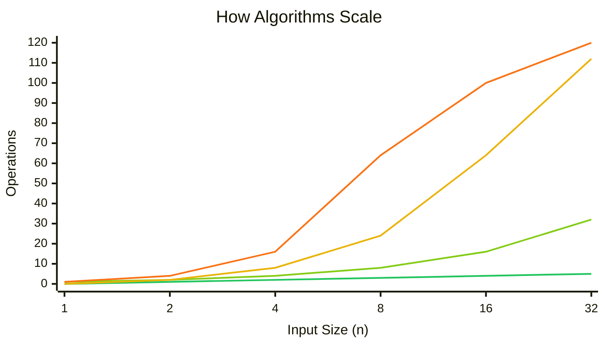
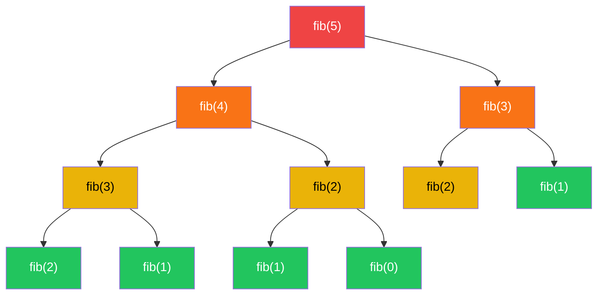
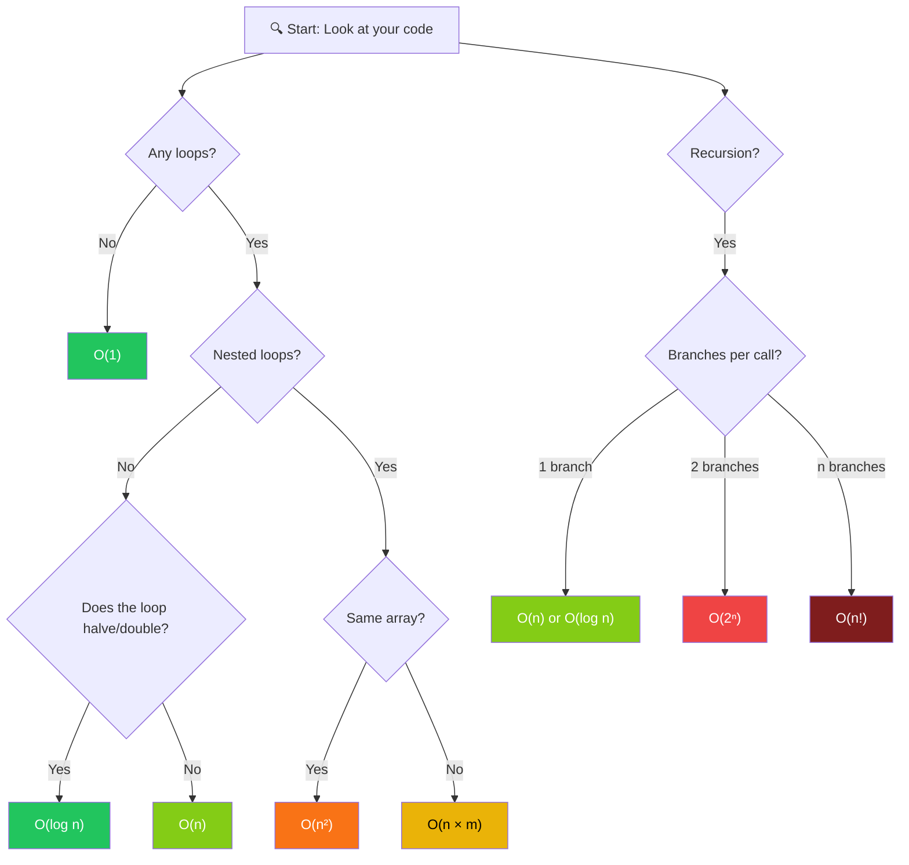
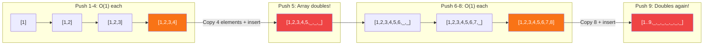
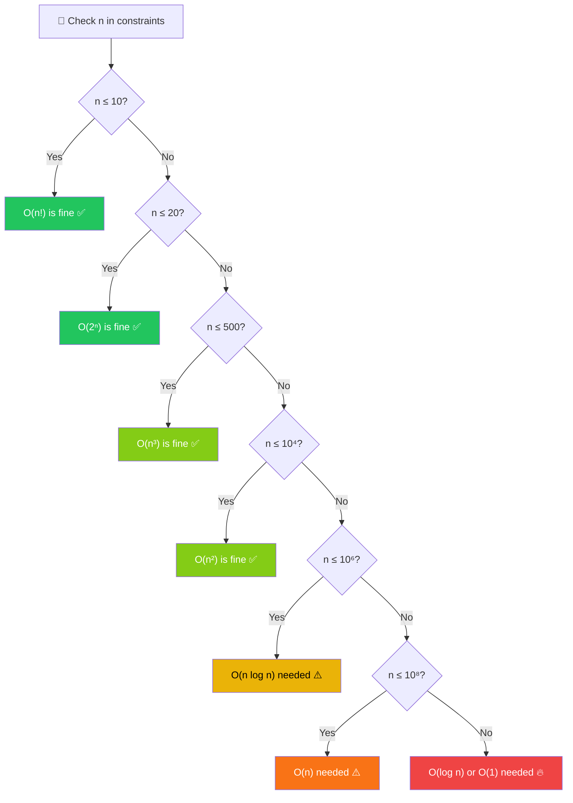

# 00 — Big O Notation & Complexity Analysis

> 🧠 The single most important concept in DSA. Every problem you solve, every solution you write — Big O tells you if it's good enough.

---

## 🌍 Real-World Analogy

Imagine you're feeding guests at a party.

| Complexity | Analogy | What Happens |
|-----------|---------|-------------|
| **O(1)** | 🧊 Grab a cold drink from the fridge | You open the fridge, grab one, done. Doesn't matter if you have 1 guest or 1,000 — same effort. |
| **O(log n)** | 📖 Look up a word in a dictionary | You don't read every page. You open the middle, decide if your word is left or right, and **halve** the remaining pages each time. 1,000 pages? Only ~10 lookups. |
| **O(n)** | 🍳 Cook one dish per guest | 5 guests = 5 dishes. 100 guests = 100 dishes. Work grows **linearly** with the guest count. |
| **O(n log n)** | 📋 Sort the guest list, then cook for each | You organize the guests efficiently first (merge sort style), then serve. A bit more than linear, but still manageable. |
| **O(n²)** | 🍽️ Cook every dish for every guest individually | Each guest wants a personalized version of every dish. 10 guests × 10 dishes = 100 cooking sessions. 100 guests? 10,000 sessions. Things escalate fast. |
| **O(2ⁿ)** | 🎁 Create every possible combination of party favors | For each item you either include it or don't. 10 items = 1,024 combinations. 20 items = 1,048,576. 30 items? Over a billion. Your party is canceled. |
| **O(n!)** | 🔀 Try every seating arrangement | 10 guests = 3,628,800 arrangements. 15 guests = 1,307,674,368,000. The universe ends before your algorithm finishes. |

> 💡 **The takeaway:** The difference between O(n) and O(n²) is the difference between "runs in 1 second" and "runs for 3 hours." At scale, complexity is everything.

---

## 📝 What & Why

### What Is Big O?

Big O notation measures **how the runtime (or space) of an algorithm grows as the input size increases**. It answers one question:

> *"If I double my input, how much slower does my code get?"*

It's not about measuring exact seconds — it's about **growth rate**.

### Why Does It Matter?

On LeetCode (and in interviews), your solution can be **correct** but still fail with **Time Limit Exceeded (TLE)**. Big O is your **speed limit check** before you submit:

- ✅ O(n) solution on n = 10⁶ → runs in ~0.01s → **PASS**
- ❌ O(n²) solution on n = 10⁶ → runs in ~16 minutes → **TLE**

### What We Ignore

Big O cares about the **shape** of growth, not exact counts:

1. **Constants are dropped:** O(3n) → O(n). Whether you loop 1x or 3x doesn't change the *shape*.
2. **Lower-order terms are dropped:** O(n² + n) → O(n²). When n is huge, n² dominates and n is irrelevant.
3. **Best case is ignored (usually):** Big O typically describes the **worst case** unless stated otherwise.

```
O(5n² + 3n + 100)  →  O(n²)
       ↑                  ↑
  exact count         what matters
```

> 🎯 **Think of Big O as the "worst-case speed limit" of your code.** You don't care how fast it *can* go — you care how slow it *might* go.

---

## ⚙️ How It Works — Complexity Classes

### Growth Rates at a Glance


### Visual Growth Comparison



> ⚠️ Note: O(n²) shoots off the chart so fast we had to cap it at 120 to keep the other lines visible. That's the point.

---

### 🟢 O(1) — Constant Time

**Work stays the same regardless of input size.**

```typescript
function getFirst(arr: number[]): number {
  return arr[0]; // Always one operation
}

const map = new Map<string, number>();
map.get("key"); // Hash map lookup — O(1) average
```

📌 **Examples:** Array access by index, hash map get/set, push/pop on a stack, math operations.

---

### 🟢 O(log n) — Logarithmic

**Work halves with each step.** Incredibly efficient.

```typescript
function binarySearch(arr: number[], target: number): number {
  let lo = 0, hi = arr.length - 1;
  while (lo <= hi) {
    const mid = Math.floor((lo + hi) / 2);
    if (arr[mid] === target) return mid;
    if (arr[mid] < target) lo = mid + 1;
    else hi = mid - 1;
  }
  return -1;
}
```

📌 **Examples:** Binary search, balanced BST lookup/insert, exponentiation by squaring.

> 💡 If you see "halving" or "doubling" — think O(log n).

---

### 🟡 O(n) — Linear

**Work grows proportionally to input.**

```typescript
function sum(arr: number[]): number {
  let total = 0;
  for (const num of arr) {
    total += num; // Visits each element once
  }
  return total;
}
```

📌 **Examples:** Linear search, finding max/min, counting elements, single traversal.

---

### 🟠 O(n log n) — Linearithmic

**Slightly worse than linear. The sweet spot for comparison-based sorting.**

```typescript
function mergeSort(arr: number[]): number[] {
  if (arr.length <= 1) return arr;
  const mid = Math.floor(arr.length / 2);
  const left = mergeSort(arr.slice(0, mid));   // log n levels
  const right = mergeSort(arr.slice(mid));      // of recursion
  return merge(left, right);                    // O(n) work per level
}
```

📌 **Examples:** Merge sort, heap sort, quick sort (average), `Array.prototype.sort()` in JS/TS.

> 💡 O(n log n) is the **fastest** a comparison-based sort can ever be. It's a proven lower bound.

---

### 🔴 O(n²) — Quadratic

**Nested loops over the input. Gets painful fast.**

```typescript
function hasDuplicateBrute(arr: number[]): boolean {
  for (let i = 0; i < arr.length; i++) {
    for (let j = i + 1; j < arr.length; j++) {
      if (arr[i] === arr[j]) return true; // Compare every pair
    }
  }
  return false;
}
```

📌 **Examples:** Bubble sort, selection sort, insertion sort, brute-force pair-finding.

> ⚠️ n = 10,000 → 100,000,000 operations. That's borderline TLE on LeetCode.

---

### 🔥 O(2ⁿ) — Exponential

**Doubles with every additional input element. Only viable for tiny inputs.**

```typescript
function fibonacci(n: number): number {
  if (n <= 1) return n;
  return fibonacci(n - 1) + fibonacci(n - 2); // Two branches per call
}
```

📌 **Examples:** Naive recursive Fibonacci, generating all subsets, brute-force password cracking.

---

### 💀 O(n!) — Factorial

**The nuclear option. Tries literally everything.**

```typescript
function permutations(arr: number[]): number[][] {
  if (arr.length <= 1) return [arr];
  const result: number[][] = [];
  for (let i = 0; i < arr.length; i++) {
    const rest = [...arr.slice(0, i), ...arr.slice(i + 1)];
    for (const perm of permutations(rest)) {
      result.push([arr[i], ...perm]);
    }
  }
  return result;
}
```

📌 **Examples:** All permutations, brute-force TSP (Traveling Salesman Problem).

---

### 📊 The Definitive Comparison Table

| Complexity | Name | Example | n=10 | n=100 | n=1,000 | n=1,000,000 | Verdict |
|-----------|------|---------|------|-------|---------|-------------|---------|
| **O(1)** | Constant | Array index access | 1 | 1 | 1 | 1 | ✅ Instant |
| **O(log n)** | Logarithmic | Binary search | 3 | 7 | 10 | 20 | ✅ Blazing |
| **O(n)** | Linear | Single loop | 10 | 100 | 1,000 | 1,000,000 | ✅ Fast |
| **O(n log n)** | Linearithmic | Merge sort | 33 | 664 | 9,966 | 19,931,568 | ✅ Good |
| **O(n²)** | Quadratic | Nested loops | 100 | 10,000 | 1,000,000 | 10¹² | ⚠️ Slow |
| **O(2ⁿ)** | Exponential | Subsets | 1,024 | 10³⁰ | 10³⁰¹ | 💀 | 🔥 TLE |
| **O(n!)** | Factorial | Permutations | 3,628,800 | 10¹⁵⁷ | 💀 | 💀 | 💀 RIP |

> 💡 LeetCode typically allows ~10⁸ operations per second. Use this to estimate if your solution will pass.

---

## 🔍 How to Analyze Code

### Rule 1: Single Loop = O(n)

```typescript
function findMax(arr: number[]): number {
  let max = -Infinity;
  for (const num of arr) {  // Runs n times
    max = Math.max(max, num);
  }
  return max;
}
// Time: O(n) — one pass through the array
```

### Rule 2: Nested Loops = O(n²) or O(n × m)

```typescript
function printPairs(arr: number[]): void {
  for (let i = 0; i < arr.length; i++) {       // n times
    for (let j = 0; j < arr.length; j++) {     //   × n times
      console.log(arr[i], arr[j]);
    }
  }
}
// Time: O(n²) — both loops iterate over the same array

function crossPairs(a: number[], b: number[]): void {
  for (let i = 0; i < a.length; i++) {          // n times
    for (let j = 0; j < b.length; j++) {        //   × m times
      console.log(a[i], b[j]);
    }
  }
}
// Time: O(n × m) — different arrays → different variables
```

### Rule 3: Loop That Halves = O(log n)

```typescript
function countHalves(n: number): number {
  let count = 0;
  while (n > 1) {
    n = Math.floor(n / 2);  // Halves each iteration
    count++;
  }
  return count;
}
// Time: O(log n) — dividing by 2 each time
// n=1024 → only 10 iterations (log₂1024 = 10)
```

### Rule 4: Recursive Calls That Branch = O(2ⁿ)

```typescript
function fib(n: number): number {
  if (n <= 1) return n;
  return fib(n - 1) + fib(n - 2);
}
// Time: O(2ⁿ) — each call spawns TWO more calls
```



> 🔥 Notice how fib(3) is calculated **twice** and fib(2) is calculated **three times**. This is why naive recursion is so expensive — and why we use **memoization** (Dynamic Programming).

### Rule 5: Sequential Steps Add, Nested Steps Multiply

```typescript
function doStuff(arr: number[]): void {
  // Step 1: O(n)
  for (const x of arr) { /* ... */ }

  // Step 2: O(n)
  for (const x of arr) { /* ... */ }

  // Total: O(n) + O(n) = O(2n) = O(n) ← ADD, then simplify
}

function doNestedStuff(arr: number[]): void {
  for (const x of arr) {           // O(n)
    for (const y of arr) {         //   × O(n)
      /* ... */
    }
  }
  // Total: O(n) × O(n) = O(n²) ← MULTIPLY
}
```

### 🧮 Analysis Decision Flowchart



---

## 📦 Space Complexity

Space complexity measures **how much extra memory** your algorithm uses (on top of the input).

### What Counts as Space?

| Counts ✅ | Doesn't Count ❌ |
|----------|-----------------|
| New arrays/objects you create | The input itself (usually) |
| Variables | Output (sometimes excluded) |
| Recursion call stack | Primitive constants |
| Hash maps, sets, queues | |

### Examples

```typescript
// Space: O(1) — only a few variables, regardless of input size
function sum(arr: number[]): number {
  let total = 0;
  for (const num of arr) total += num;
  return total;
}

// Space: O(n) — creating a new array of size n
function double(arr: number[]): number[] {
  const result: number[] = [];
  for (const num of arr) result.push(num * 2);
  return result;
}

// Space: O(n) — recursion call stack goes n levels deep
function factorial(n: number): number {
  if (n <= 1) return 1;
  return n * factorial(n - 1); // Each call adds a frame to the stack
}

// Space: O(n) — hash set stores up to n elements
function hasDuplicate(arr: number[]): boolean {
  const seen = new Set<number>();
  for (const num of arr) {
    if (seen.has(num)) return true;
    seen.add(num);
  }
  return false;
}
```

> 💡 **Trade-off alert:** Often you can trade space for time. Using a hash set makes duplicate detection O(n) time instead of O(n²), but costs O(n) space. This trade-off is almost always worth it.

---

## 📈 Amortized Analysis

Some operations are **usually** fast but **occasionally** expensive. Amortized analysis spreads the cost over many operations.

### The Classic Example: Dynamic Array `.push()`

When you `.push()` to an array that's full, it must:
1. Allocate a new array (usually 2× the size)
2. Copy all existing elements
3. Add the new element



### Cost Breakdown

| Push # | Cost | Why |
|--------|------|-----|
| 1 | 1 | Normal insert |
| 2 | 1 | Normal insert |
| 3 | 1 | Normal insert |
| 4 | 1 | Normal insert |
| 5 | **5** | Copy 4 + insert 1 (array doubles from 4→8) |
| 6 | 1 | Normal insert |
| 7 | 1 | Normal insert |
| 8 | 1 | Normal insert |
| 9 | **9** | Copy 8 + insert 1 (array doubles from 8→16) |

**Total for 9 pushes:** 1+1+1+1+5+1+1+1+9 = **21**

**Amortized cost per push:** 21/9 ≈ **2.3 → O(1) amortized**

> 💡 Even though *some* pushes cost O(n), they happen so rarely that the average cost per push is still O(1). This is why `.push()` is listed as O(1) in most references.

---

## ⏱️ Quick Reference — Common Operations

### Array Operations

| Operation | Time | Notes |
|-----------|------|-------|
| Access by index `arr[i]` | O(1) | Direct memory access |
| `.push()` / `.pop()` | O(1) amortized | End of array |
| `.unshift()` / `.shift()` | **O(n)** | Must shift all elements! ⚠️ |
| `.splice(i, 1)` | O(n) | Shifts elements after index |
| `.indexOf()` / `.includes()` | O(n) | Linear scan |
| `.sort()` | O(n log n) | TimSort in V8 |
| `.slice()` | O(n) | Creates a copy |
| `.map()` / `.filter()` / `.forEach()` | O(n) | Iterates all elements |

### Object / Map / Set Operations

| Operation | Time | Notes |
|-----------|------|-------|
| `obj[key]` / `obj.key` | O(1) avg | Hash-based |
| `Map.get()` / `.set()` / `.has()` | O(1) avg | |
| `Set.add()` / `.has()` / `.delete()` | O(1) avg | |
| `Object.keys()` | O(n) | Must enumerate all keys |

### String Operations (⚠️ Hidden Costs!)

| Operation | Time | Notes |
|-----------|------|-------|
| Access by index `str[i]` | O(1) | |
| `.length` | O(1) | Stored as property |
| Concatenation `str + str2` | **O(n)** | Creates a new string! |
| `.slice()` / `.substring()` | O(n) | Creates a new string |
| `.split()` | O(n) | |
| `.includes()` / `.indexOf()` | O(n × m) | n = haystack, m = needle |

### Sorting Algorithms

| Algorithm | Best | Average | Worst | Space | Stable? |
|-----------|------|---------|-------|-------|---------|
| Bubble Sort | O(n) | O(n²) | O(n²) | O(1) | ✅ |
| Selection Sort | O(n²) | O(n²) | O(n²) | O(1) | ❌ |
| Insertion Sort | O(n) | O(n²) | O(n²) | O(1) | ✅ |
| Merge Sort | O(n log n) | O(n log n) | O(n log n) | O(n) | ✅ |
| Quick Sort | O(n log n) | O(n log n) | O(n²) | O(log n) | ❌ |
| Heap Sort | O(n log n) | O(n log n) | O(n log n) | O(1) | ❌ |
| TimSort (JS default) | O(n) | O(n log n) | O(n log n) | O(n) | ✅ |

---

## 🎯 LeetCode Relevance — Will My Solution Pass?

Before coding, **check the constraints**. The input size tells you which complexities are acceptable:



### The Cheat Sheet

| Constraint (n ≤) | Max Acceptable Complexity | Typical Pattern |
|-------------------|--------------------------|-----------------|
| **10** | O(n!) | Permutations, brute force |
| **20** | O(2ⁿ) | Subsets, bitmask DP |
| **500** | O(n³) | Triple nested loops, Floyd-Warshall |
| **10⁴** | O(n²) | Nested loops, simple DP |
| **10⁶** | O(n log n) | Sorting + scan, binary search variations |
| **10⁸** | O(n) | Single pass, two pointers, sliding window |
| **> 10⁸** | O(log n) or O(1) | Binary search, math formula |

> 🎯 **Pro tip:** When you read a LeetCode problem, **look at the constraints FIRST**. They tell you which approach to use before you even think about the algorithm.

---

## ⚠️ Common Pitfalls

### 1. 🕵️ Hidden Loops in String Operations

```typescript
// ❌ This looks O(n) but is actually O(n²)!
function buildString(n: number): string {
  let result = "";
  for (let i = 0; i < n; i++) {
    result += "a"; // String concatenation creates a NEW string each time → O(n) per concat
  }
  return result;
}
// Actual: O(n²) because each += copies the entire string

// ✅ Fix: Use an array and join
function buildStringFast(n: number): string {
  const parts: string[] = [];
  for (let i = 0; i < n; i++) {
    parts.push("a"); // O(1) amortized
  }
  return parts.join(""); // Single O(n) join at the end
}
// Actual: O(n)
```

### 2. 🔄 Forgetting That `.sort()` Is O(n log n)

```typescript
// ❌ "I only added one sort, it should be O(n)"
function topThree(arr: number[]): number[] {
  arr.sort((a, b) => b - a); // This alone is O(n log n)!
  return arr.slice(0, 3);
}

// ✅ If you only need top-K, consider a min-heap: O(n log k)
```

### 3. 🗺️ Assuming Hash Map Is *Always* O(1)

- **Average case:** O(1) — yes
- **Worst case:** O(n) — when all keys hash to the same bucket (hash collision)
- In practice, JS `Map` is O(1) for LeetCode. But know the theory.

### 4. 📏 Ignoring `.slice()`, `.concat()`, and Spread Operator

```typescript
// ❌ Each slice creates a copy — O(n) per call
function recursive(arr: number[]): void {
  if (arr.length === 0) return;
  recursive(arr.slice(1)); // O(n) copy × O(n) calls = O(n²) total
}

// ✅ Use index tracking instead
function recursiveFast(arr: number[], i = 0): void {
  if (i === arr.length) return;
  recursiveFast(arr, i + 1); // O(1) per call × O(n) calls = O(n) total
}
```

### 5. 🔁 Nested `.includes()` or `.indexOf()`

```typescript
// ❌ O(n²) — includes() is O(n), called n times
function findCommon(a: number[], b: number[]): number[] {
  return a.filter(x => b.includes(x));
}

// ✅ O(n + m) — Set lookup is O(1)
function findCommonFast(a: number[], b: number[]): number[] {
  const setB = new Set(b);
  return a.filter(x => setB.has(x));
}
```

---

## 🔑 Key Takeaways

- 📐 **Big O measures growth rate**, not exact speed. It answers "how does it scale?"
- 🏎️ O(1) < O(log n) < O(n) < O(n log n) < O(n²) < O(2ⁿ) < O(n!) — **memorize this order**
- 🔢 **Drop constants and lower-order terms.** O(3n + 5) = O(n).
- ➕ **Sequential operations add:** O(n) + O(n) = O(n)
- ✖️ **Nested operations multiply:** O(n) × O(n) = O(n²)
- 🎯 **Read LeetCode constraints first** — they tell you which Big O you need
- 🕵️ **Watch for hidden costs** — string concatenation, `.slice()`, `.includes()` in loops
- 💾 **Space matters too** — recursion eats stack space, extra arrays eat heap space
- ⚖️ **Time-space trade-off** — often you can spend O(n) memory to save O(n) time (hash sets!)
- 📈 **Amortized O(1)** is still O(1) for practical purposes — don't fear `.push()`

---

## 📋 Practice

Big O isn't a standalone LeetCode topic — it's the **lens through which you evaluate every single solution**. 

### How to Practice

1. **Before solving any problem:** Read the constraints, determine the maximum acceptable complexity
2. **After writing your solution:** Analyze its time and space complexity before submitting
3. **When you get TLE:** Your complexity is too high. Re-analyze and find a better approach
4. **Compare approaches:** For every problem, think "Can I do this in a better complexity?"

### Where This Shows Up

Every chapter from here on will include complexity analysis. You'll use Big O to:
- Choose between brute force and optimized solutions
- Decide which data structure to use (array vs. hash map vs. heap)
- Understand why certain patterns (two pointers, sliding window) exist — they reduce O(n²) to O(n)
- Debug TLE submissions by identifying the bottleneck

> 📌 **Next up:** [01 — Arrays & Strings](../01-arrays-and-strings/) — where we put Big O to work on real problems.
