# 📦 Chapter 01 — Arrays & Strings

> The bread and butter of every coding interview. ~40% of LeetCode problems involve arrays or strings.

---

## 🌍 Real-World Analogy

### Arrays → A Row of School Lockers

Imagine a hallway with numbered lockers: **#0, #1, #2, ... #99**.

- Each locker has a **fixed number** (index)
- You can walk **directly** to locker #47 without checking lockers 1–46
- Every locker is the **same size** (fixed memory per element)
- Lockers are **right next to each other** — no gaps (contiguous memory)

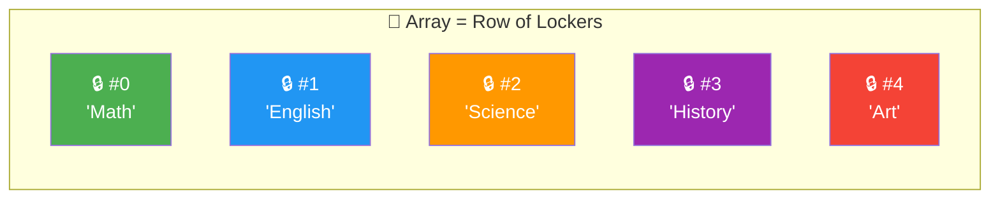

### Strings → Scrabble Letter Tiles

A string is like letter tiles placed on a Scrabble rack:

- Each tile has a **position** (index) and a **letter** (character)
- Once tiles are placed, you **can't swap a single tile** — you must rebuild the whole word (immutability)
- Want to change one letter? Pick up ALL tiles, rearrange, and place a brand-new row

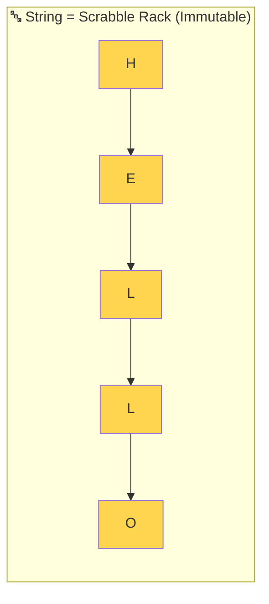

> 🧠 **Memory hook**: Lockers = instant access by number. Scrabble tiles = can't change one without rebuilding all.

---

## 📝 What & Why

### What Is an Array?

An array is a **contiguous block of memory** that stores elements of the same type sequentially. Each element is accessed by its **index** — a zero-based integer offset from the start.

### Why Arrays Matter

1. **Most fundamental data structure** — nearly everything else (stacks, queues, heaps, hash tables) is built on top of arrays
2. **Cache-friendly** — contiguous memory means the CPU cache loads nearby elements automatically (spatial locality)
3. **O(1) random access** — the killer feature no linked list can match
4. **~40% of LeetCode** — arrays and strings dominate coding interviews

### JavaScript/TypeScript Arrays: The Plot Twist

In languages like C or Java, arrays are **fixed-size** — you declare the length upfront. JavaScript arrays are **dynamic**:

```typescript
const arr: number[] = []; // starts empty
arr.push(1);              // grows to length 1
arr.push(2, 3, 4);        // grows to length 4
// no "ArrayIndexOutOfBounds" — it just grows!
```

Under the hood, the V8 engine uses multiple representations:

| Scenario | Internal Representation |
|----------|------------------------|
| Dense numeric array `[1,2,3]` | C-style contiguous memory (fast!) |
| Sparse array `arr[1000] = 1` | Hash map / dictionary (slower) |
| Mixed types `[1, "hi", {}]` | Tagged pointer array |

> ⚡ **Takeaway**: Keep your arrays dense and same-typed for maximum performance.

---

## ⚙️ How It Works

### Memory Layout — Contiguous Blocks

Every element occupies the same amount of space, laid out side-by-side in RAM:

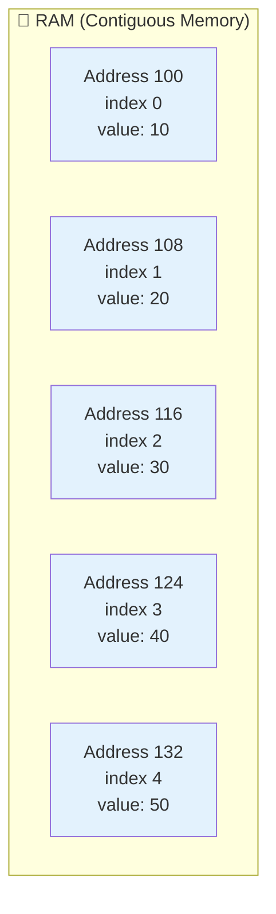

### O(1) Access — Base Address + Offset

To access `arr[i]`, the CPU computes:

```
address = baseAddress + (i × bytesPerElement)
```

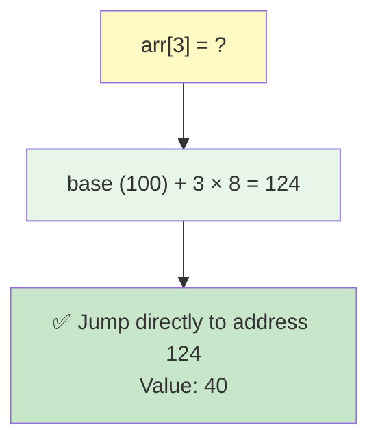

No loops, no scanning — just **one arithmetic operation**. That's why index access is O(1).

### Dynamic Array Growth — The Doubling Strategy

When you `push()` beyond the current capacity, the engine:

1. Allocates a **new array 2× the size**
2. Copies all existing elements over
3. Adds the new element
4. Frees the old array

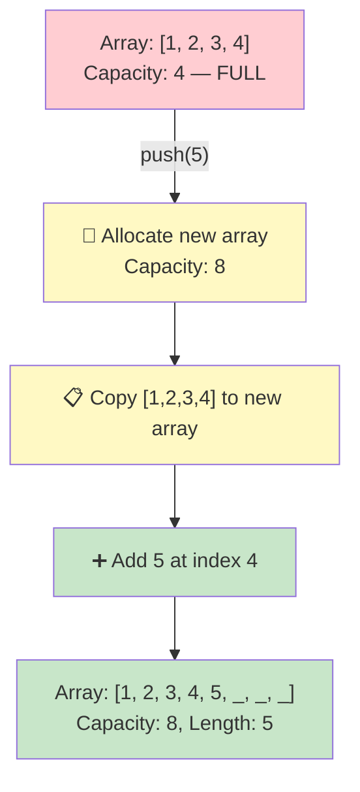

> 📊 This resize is O(n), but it happens so rarely that **amortized** cost of `push()` is **O(1)**.

### Insert/Delete — Why They're O(n)

Inserting at index `i` requires shifting every element after `i` one position to the right:

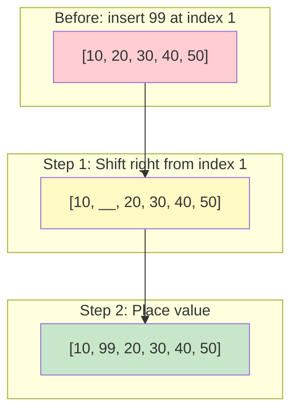

Deleting at index `i` shifts everything left — same O(n) cost.

---

## 💻 TypeScript Implementation

### Array Basics

```typescript
// ✅ Creation
const nums: number[] = [10, 20, 30, 40, 50];
const empty: string[] = new Array(5).fill("");
const generated = Array.from({ length: 5 }, (_, i) => i * 2); // [0, 2, 4, 6, 8]

// ✅ Access — O(1)
const first = nums[0];       // 10
const last = nums[nums.length - 1]; // 50

// ✅ Modification — O(1)
nums[2] = 99; // [10, 20, 99, 40, 50]
```

### Common Array Methods — TRUE Complexities

Many developers use these methods without knowing their real cost:

```typescript
const arr = [1, 2, 3, 4, 5];

// ✅ O(1) amortized — adds to END (no shifting)
arr.push(6);         // [1, 2, 3, 4, 5, 6]

// ✅ O(1) — removes from END (no shifting)
arr.pop();           // [1, 2, 3, 4, 5]

// ⚠️ O(n) — adds to START (shifts ALL elements right)
arr.unshift(0);      // [0, 1, 2, 3, 4, 5]

// ⚠️ O(n) — removes from START (shifts ALL elements left)
arr.shift();         // [1, 2, 3, 4, 5]

// ⚠️ O(n) — insert/remove at arbitrary position
arr.splice(2, 1);    // removes 1 element at index 2

// ⚠️ O(n) — creates a COPY of a portion
const sub = arr.slice(1, 3);

// ⚠️ O(n) — linear scan to find element
arr.indexOf(4);      // 3
arr.includes(4);     // true

// ⚠️ O(n log n) — sorting
arr.sort((a, b) => a - b);
```

### String Operations & Their Costs

```typescript
const str = "hello";

// ✅ O(1) — character access
str[0];          // "h"
str.charAt(3);   // "l"

// ⚠️ O(n) — creates a new string
str.substring(1, 4);  // "ell"
str.slice(1);          // "ello"

// ⚠️ O(n) — splitting into array
str.split("");    // ["h", "e", "l", "l", "o"]

// ⚠️ O(n) — joining array into string
["h", "e", "l", "l", "o"].join(""); // "hello"

// ⚠️ O(n) — string reversal (no built-in method)
str.split("").reverse().join(""); // "olleh"
```

### 🚨 String Immutability — The O(n²) Trap

Strings in JavaScript are **immutable**. Every `+=` creates an entirely new string:

```typescript
// ❌ BAD — O(n²) because each += copies the entire string so far
function buildStringBad(n: number): string {
  let result = "";
  for (let i = 0; i < n; i++) {
    result += "a"; // copies 1 char, then 2, then 3... = n(n+1)/2 = O(n²)
  }
  return result;
}

// ✅ GOOD — O(n) using array.join (StringBuilder pattern)
function buildStringGood(n: number): string {
  const parts: string[] = [];
  for (let i = 0; i < n; i++) {
    parts.push("a"); // O(1) amortized
  }
  return parts.join(""); // one O(n) concatenation at the end
}
```

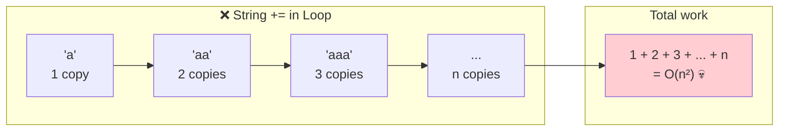

---

## 🧩 Essential Array Techniques for LeetCode

### 1️⃣ Prefix Sum

**Idea**: Pre-compute cumulative sums so any range sum becomes an O(1) lookup.

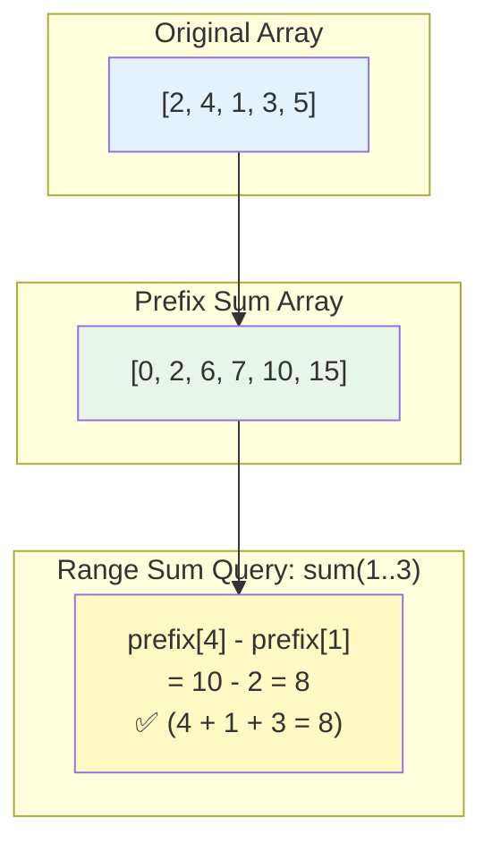

**How it works**:

| Index | 0 | 1 | 2 | 3 | 4 | 5 |
|-------|---|---|---|---|---|---|
| Array | 2 | 4 | 1 | 3 | 5 | — |
| Prefix| 0 | 2 | 6 | 7 | 10 | 15 |

`sum(i, j) = prefix[j + 1] - prefix[i]`

```typescript
function buildPrefixSum(nums: number[]): number[] {
  const prefix = new Array(nums.length + 1).fill(0);
  for (let i = 0; i < nums.length; i++) {
    prefix[i + 1] = prefix[i] + nums[i];
  }
  return prefix;
}

function rangeSum(prefix: number[], left: number, right: number): number {
  return prefix[right + 1] - prefix[left];
}

const nums = [2, 4, 1, 3, 5];
const prefix = buildPrefixSum(nums);
rangeSum(prefix, 1, 3); // 4 + 1 + 3 = 8  ✅
```

**When to use**: Any problem asking for **range sums**, **subarray sums**, or requiring multiple sum queries on the same array.

---

### 2️⃣ Kadane's Algorithm — Maximum Subarray Sum

**Problem**: Find the contiguous subarray with the largest sum.

**Key insight**: At each position, decide — is it better to **extend** the previous subarray or **start fresh** from here?

```mermaid
graph TD
    subgraph "Walk Through: [-2, 1, -3, 4, -1, 2, 1, -5, 4]"
        K0["i=0: max(-2, -2) = -2\ncurrent: -2"]
        K1["i=1: max(1, -2+1) = 1\ncurrent: 1 ← start fresh!"]
        K2["i=2: max(-3, 1-3) = -2\ncurrent: -2"]
        K3["i=3: max(4, -2+4) = 4\ncurrent: 4 ← start fresh!"]
        K4["i=4: max(-1, 4-1) = 3\ncurrent: 3"]
        K5["i=5: max(2, 3+2) = 5\ncurrent: 5"]
        K6["i=6: max(1, 5+1) = 6\ncurrent: 6 ← 🏆 max!"]
        K7["i=7: max(-5, 6-5) = 1\ncurrent: 1"]
        K8["i=8: max(4, 1+4) = 5\ncurrent: 5"]
    end
    K0 --> K1 --> K2 --> K3 --> K4 --> K5 --> K6 --> K7 --> K8
    style K6 fill:#C8E6C9,color:#333
```

```typescript
function maxSubarraySum(nums: number[]): number {
  let currentSum = nums[0];
  let maxSum = nums[0];

  for (let i = 1; i < nums.length; i++) {
    // extend previous subarray OR start fresh from nums[i]
    currentSum = Math.max(nums[i], currentSum + nums[i]);
    maxSum = Math.max(maxSum, currentSum);
  }

  return maxSum;
}

maxSubarraySum([-2, 1, -3, 4, -1, 2, 1, -5, 4]); // 6 (subarray: [4, -1, 2, 1])
```

**Time**: O(n) — single pass. **Space**: O(1) — just two variables.

---

### 3️⃣ In-Place Operations

#### Reverse an Array — O(n) time, O(1) space

```typescript
function reverseInPlace(arr: number[]): void {
  let left = 0;
  let right = arr.length - 1;
  while (left < right) {
    [arr[left], arr[right]] = [arr[right], arr[left]];
    left++;
    right--;
  }
}
```

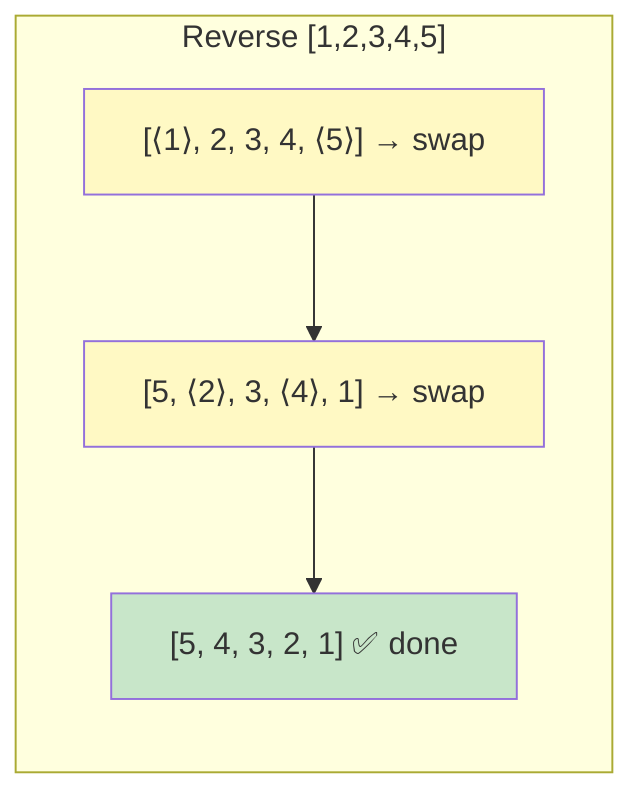

#### Rotate an Array — Three-Reverse Trick

Rotate `[1,2,3,4,5]` right by `k=2` → `[4,5,1,2,3]`

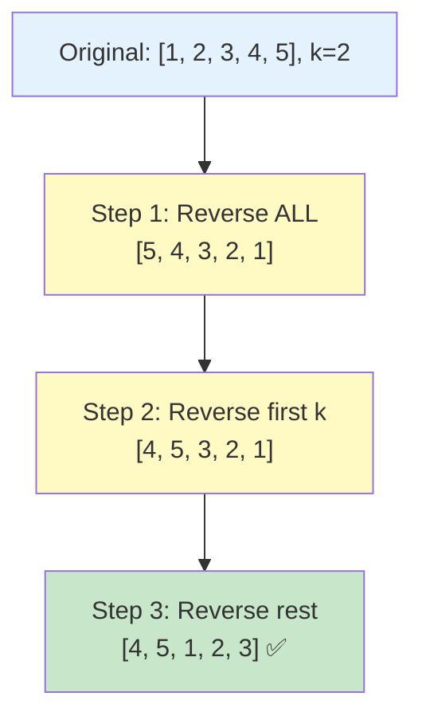

```typescript
function rotate(nums: number[], k: number): void {
  k = k % nums.length;
  if (k === 0) return;

  reverseSection(nums, 0, nums.length - 1);
  reverseSection(nums, 0, k - 1);
  reverseSection(nums, k, nums.length - 1);
}

function reverseSection(arr: number[], start: number, end: number): void {
  while (start < end) {
    [arr[start], arr[end]] = [arr[end], arr[start]];
    start++;
    end--;
  }
}
```

**Time**: O(n) — three passes. **Space**: O(1) — no extra array!

---

### 4️⃣ Two-Pass Technique

**Idea**: First pass collects information. Second pass uses it.

**Example**: Product of Array Except Self — return an array where `output[i]` is the product of all elements except `nums[i]`, without using division.

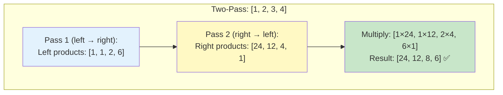

```typescript
function productExceptSelf(nums: number[]): number[] {
  const n = nums.length;
  const result = new Array(n).fill(1);

  // Pass 1: compute left products
  let leftProduct = 1;
  for (let i = 0; i < n; i++) {
    result[i] = leftProduct;
    leftProduct *= nums[i];
  }

  // Pass 2: multiply by right products
  let rightProduct = 1;
  for (let i = n - 1; i >= 0; i--) {
    result[i] *= rightProduct;
    rightProduct *= nums[i];
  }

  return result;
}
```

---

## 🔤 String-Specific Techniques

### 1️⃣ Character Frequency Counting

The workhorse of string problems. Use a `Map` to count character occurrences:

```typescript
function charFrequency(str: string): Map<string, number> {
  const freq = new Map<string, number>();
  for (const ch of str) {
    freq.set(ch, (freq.get(ch) ?? 0) + 1);
  }
  return freq;
}
// "abracadabra" → Map { a:5, b:2, r:2, c:1, d:1 }
```

### 2️⃣ Palindrome Checking

A palindrome reads the same forwards and backwards. Use two pointers:

```typescript
function isPalindrome(s: string): boolean {
  let left = 0;
  let right = s.length - 1;
  while (left < right) {
    if (s[left] !== s[right]) return false;
    left++;
    right--;
  }
  return true;
}
```

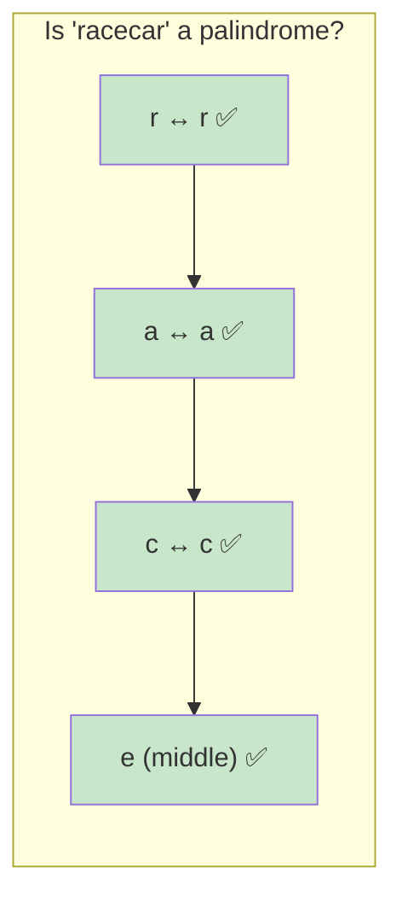

### 3️⃣ Anagram Detection

Two strings are anagrams if they have the **exact same character frequencies**:

```typescript
function isAnagram(s: string, t: string): boolean {
  if (s.length !== t.length) return false;

  const freq = new Map<string, number>();

  for (const ch of s) freq.set(ch, (freq.get(ch) ?? 0) + 1);
  for (const ch of t) {
    const count = freq.get(ch);
    if (!count) return false;
    freq.set(ch, count - 1);
  }

  return true;
}

isAnagram("listen", "silent"); // true
isAnagram("hello", "world");   // false
```

### 4️⃣ StringBuilder Pattern — Array.join vs Concatenation

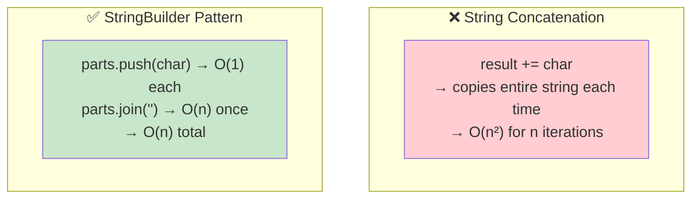

```typescript
// ✅ Always use this pattern when building strings in a loop
function buildCSV(data: string[][]): string {
  const lines: string[] = [];
  for (const row of data) {
    lines.push(row.join(","));
  }
  return lines.join("\n");
}
```

---

## ⏱️ Complexity Table

### Array Operations

| Operation | Time | Space | Notes |
|-----------|------|-------|-------|
| Access `arr[i]` | **O(1)** | O(1) | Base + offset calculation |
| `push()` | **O(1)** | O(1) | Amortized; O(n) when resizing |
| `pop()` | **O(1)** | O(1) | Removes from end |
| `unshift()` | ⚠️ O(n) | O(1) | Shifts all elements right |
| `shift()` | ⚠️ O(n) | O(1) | Shifts all elements left |
| `splice(i, k)` | ⚠️ O(n) | O(1) | Shifts elements after index i |
| `slice(i, j)` | ⚠️ O(j-i) | O(j-i) | Creates a copy |
| `indexOf()` / `includes()` | ⚠️ O(n) | O(1) | Linear scan |
| `sort()` | ⚠️ O(n log n) | O(log n) | TimSort; **mutates** original |
| `concat()` | ⚠️ O(n+m) | O(n+m) | Creates new array |
| `map/filter/reduce` | ⚠️ O(n) | O(n)* | *map/filter create new arrays |
| Insert at index i | ⚠️ O(n) | O(1) | Shift elements right |
| Delete at index i | ⚠️ O(n) | O(1) | Shift elements left |

### String Operations

| Operation | Time | Space | Notes |
|-----------|------|-------|-------|
| Access `str[i]` | **O(1)** | O(1) | Direct index |
| `str.length` | **O(1)** | O(1) | Stored property |
| `substring(i,j)` | ⚠️ O(j-i) | O(j-i) | Creates new string |
| `str + str2` | ⚠️ O(n+m) | O(n+m) | Creates new string |
| `str += char` (loop) | 💀 O(n²) | O(n) | Total cost over n iterations |
| `split("")` | ⚠️ O(n) | O(n) | Creates array of chars |
| `join("")` | ⚠️ O(n) | O(n) | Creates new string |
| `indexOf(sub)` | ⚠️ O(n×m) | O(1) | Naive search; n=str, m=sub |
| `replace()` | ⚠️ O(n) | O(n) | Creates new string |
| `toLowerCase()` | ⚠️ O(n) | O(n) | Creates new string |

---

## 🎯 LeetCode Patterns — When to Think "Array/String"

| 🔍 You See This Clue... | 💡 Think This Technique |
|--------------------------|------------------------|
| "Given an array of integers..." | Array fundamentals, hash maps |
| "Find a subarray with sum equal to..." | Prefix sum, sliding window |
| "Maximum/minimum subarray..." | Kadane's algorithm |
| "Rotate an array by k positions..." | Three-reverse trick |
| "Given a string, find..." | Character frequency, two pointers |
| "Check if two strings are anagrams..." | Frequency counting with Map |
| "Product of array except self..." | Two-pass (left/right products) |
| "In-place with O(1) extra space..." | Two pointers, swap-based |
| "Contiguous subarray of size k..." | Sliding window (Chapter 12) |
| "Sorted array, find pair with sum..." | Two pointers (Chapter 11) |

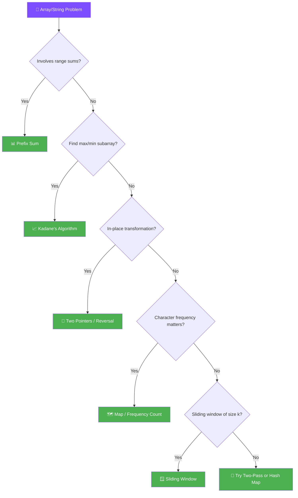

---

## ⚠️ Common Pitfalls

### 1. 🐛 Off-by-One Errors

The #1 source of bugs. Remember:

```typescript
// Array of length 5: valid indices are 0, 1, 2, 3, 4
const arr = [10, 20, 30, 40, 50];

arr[arr.length];     // ❌ undefined (index 5 doesn't exist)
arr[arr.length - 1]; // ✅ 50

// Common loop mistake
for (let i = 0; i <= arr.length; i++) {} // ❌ one iteration too many
for (let i = 0; i < arr.length; i++) {}  // ✅ correct
```

### 2. 🐛 Mutating While Iterating

```typescript
const arr = [1, 2, 3, 4, 5];

// ❌ Removing elements while iterating forward skips elements
for (let i = 0; i < arr.length; i++) {
  if (arr[i] % 2 === 0) arr.splice(i, 1); // skips element after removed one
}

// ✅ Iterate backwards when removing
for (let i = arr.length - 1; i >= 0; i--) {
  if (arr[i] % 2 === 0) arr.splice(i, 1);
}

// ✅ Or better: use filter (creates new array)
const odds = arr.filter(x => x % 2 !== 0);
```

### 3. 🐛 String Concatenation in Loops

Already covered above — use `array.push()` + `join("")` instead of `+=`.

### 4. 🐛 Forgetting `sort()` Mutates

```typescript
const original = [3, 1, 4, 1, 5];

// ❌ This mutates 'original'!
const sorted = original.sort();
console.log(original); // [1, 1, 3, 4, 5] — original is changed!

// ✅ Use spread or slice to sort a copy
const safeSorted = [...original].sort((a, b) => a - b);
```

### 5. 🐛 Default `sort()` is Lexicographic

```typescript
[10, 9, 80].sort();               // [10, 80, 9] 😱 (string comparison!)
[10, 9, 80].sort((a, b) => a - b); // [9, 10, 80] ✅ (numeric comparison)
```

---

## 🔑 Key Takeaways

1. **Arrays give O(1) access** — the single most important property. Use it.
2. **Insert/delete at arbitrary positions is O(n)** — because of element shifting. Add/remove from the **end** whenever possible.
3. **Strings are immutable** — every modification creates a new string. Use the **StringBuilder pattern** (`push` + `join`) in loops.
4. **Prefix Sum** turns O(n) range queries into O(1) after O(n) preprocessing.
5. **Kadane's Algorithm** finds maximum subarray sum in one pass — O(n).
6. **Three-reverse trick** rotates arrays in-place with O(1) extra space.
7. **Character frequency maps** are your best friend for string problems.
8. **`sort()` mutates** the original array and uses **lexicographic** ordering by default — always pass a comparator for numbers.
9. **When in doubt**, try two pointers, hash map, or prefix sum — they solve most array/string problems.

---

## 📋 Practice Problems

### 🟢 Easy

| # | Problem | Key Technique | Link |
|---|---------|---------------|------|
| 1 | Two Sum | Hash map for complement lookup | [LeetCode #1](https://leetcode.com/problems/two-sum/) |
| 121 | Best Time to Buy and Sell Stock | Track min price, compute max profit | [LeetCode #121](https://leetcode.com/problems/best-time-to-buy-and-sell-stock/) |
| 242 | Valid Anagram | Character frequency counting | [LeetCode #242](https://leetcode.com/problems/valid-anagram/) |
| 344 | Reverse String | Two pointers (in-place swap) | [LeetCode #344](https://leetcode.com/problems/reverse-string/) |

### 🟡 Medium

| # | Problem | Key Technique | Link |
|---|---------|---------------|------|
| 238 | Product of Array Except Self | Two-pass (left & right products) | [LeetCode #238](https://leetcode.com/problems/product-of-array-except-self/) |
| 49 | Group Anagrams | Sorted string as hash key | [LeetCode #49](https://leetcode.com/problems/group-anagrams/) |
| 53 | Maximum Subarray | Kadane's Algorithm | [LeetCode #53](https://leetcode.com/problems/maximum-subarray/) |
| 189 | Rotate Array | Three-reverse trick | [LeetCode #189](https://leetcode.com/problems/rotate-array/) |
| 560 | Subarray Sum Equals K | Prefix sum + hash map | [LeetCode #560](https://leetcode.com/problems/subarray-sum-equals-k/) |

### 🔴 Hard

| # | Problem | Key Technique | Link |
|---|---------|---------------|------|
| 42 | Trapping Rain Water | Two pointers / stack | [LeetCode #42](https://leetcode.com/problems/trapping-rain-water/) |

---

> **Next up**: [Chapter 02 — Linked Lists](../02-linked-lists/) — when arrays aren't flexible enough.
