# 🔗 Chapter 2: Linked Lists

> *"A chain is only as strong as its weakest link — but in computer science, the chain IS the data structure."*

---

## 🌍 Real-World Analogy

### The Scavenger Hunt 🗺️

Imagine a **scavenger hunt** across your city. You start at Clue #1, which says:

> *"The answer is BLUE. Your next clue is at the coffee shop on 5th Street."*

You go to the coffee shop, find Clue #2:

> *"The answer is 42. Your next clue is at the library."*

Each clue has **two things**: the **data** (the answer) and a **pointer** (where to find the next clue). You **can't jump** directly to Clue #5 — you must follow the chain from the beginning.

**That's a singly linked list.**

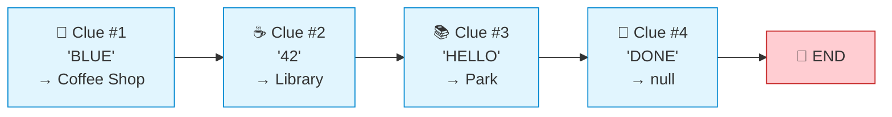

### The Train 🚂

Now imagine a **train**. Each car is connected to the one **in front** AND the one **behind**. You can walk forward OR backward through the train.

**That's a doubly linked list.**


| Analogy | Data Structure | Can go backward? | Can jump to middle? |
|---------|---------------|------------------|---------------------|
| 🗺️ Scavenger Hunt | Singly Linked List | ❌ No | ❌ No |
| 🚂 Train | Doubly Linked List | ✅ Yes | ❌ No |
| 📖 Book (pages) | Array | ✅ Yes | ✅ Yes (page number) |

---

## 📝 What & Why

### What Is a Linked List?

A linked list is a **linear data structure** where elements are stored in **nodes**. Each node contains:

1. **Data** — the value being stored
2. **Pointer(s)** — reference(s) to the next (and optionally previous) node

Unlike arrays, linked list nodes are **scattered in memory** — they're not stored contiguously. They're connected purely through pointers.

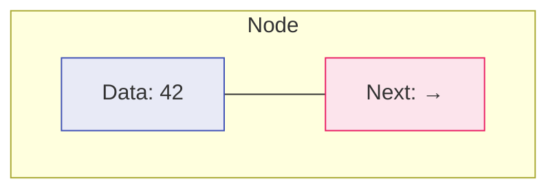

### Types of Linked Lists

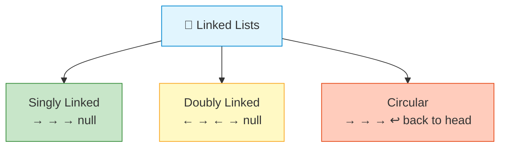

### Why Do Linked Lists Exist?

Arrays have a problem: **insertions and deletions are expensive**.

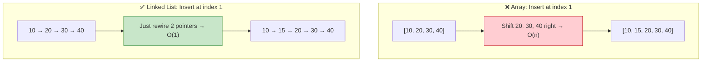

### 🥊 Linked List vs Array — When to Use Which

| Operation | Array | Linked List | Winner |
|-----------|-------|-------------|--------|
| Access by index | O(1) | O(n) | 🏆 Array |
| Insert at head | O(n) | O(1) | 🏆 Linked List |
| Insert at tail | O(1)* | O(1)** | 🤝 Tie |
| Insert at middle | O(n) | O(1)*** | 🏆 Linked List |
| Delete at head | O(n) | O(1) | 🏆 Linked List |
| Delete at tail | O(1) | O(n) / O(1)**** | Depends |
| Search | O(n) | O(n) | 🤝 Tie |
| Memory | Compact, cache-friendly | Extra pointer overhead | 🏆 Array |

> \* Amortized for dynamic arrays
> \** With tail pointer
> \*** O(1) once you have a reference to the position; O(n) to find the position
> \**** O(1) for doubly linked with tail pointer

### 🌎 Real-World Uses

| Use Case | Why Linked List? |
|----------|-----------------|
| 🌐 Browser History | Back/forward = doubly linked traversal |
| ↩️ Undo/Redo Systems | Each action points to previous/next state |
| 🎵 Music Playlists | Next/previous song, easy reordering |
| 🖥️ OS Memory Management | Free memory blocks linked together |
| 📑 Hash Table Chaining | Collision resolution via linked lists |
| 🧮 LRU Cache | Doubly linked list + hash map |

---

## ⚙️ How It Works

### Singly Linked List Structure

Each node holds data and a `next` pointer. The list maintains a `head` reference.

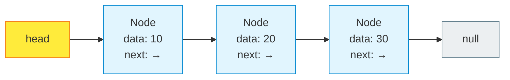

### Doubly Linked List Structure

Each node holds `prev`, `data`, and `next`. The list maintains both `head` and `tail`.

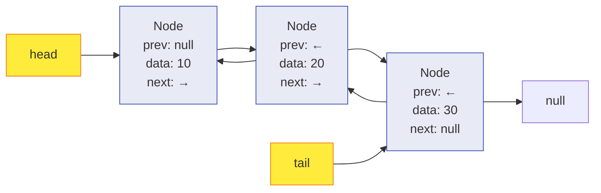

---

### 🔽 Insertion at Head

**Goal:** Insert node with value `5` at the beginning.

**Step 1:** Create new node

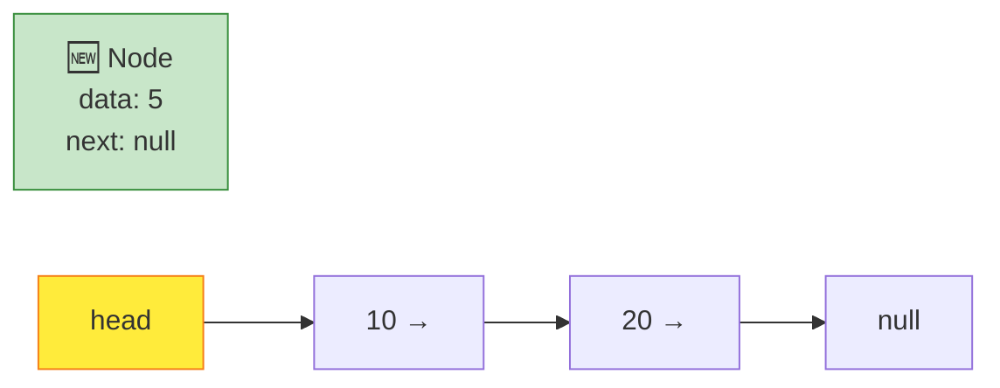

**Step 2:** Point new node's `next` to current `head`

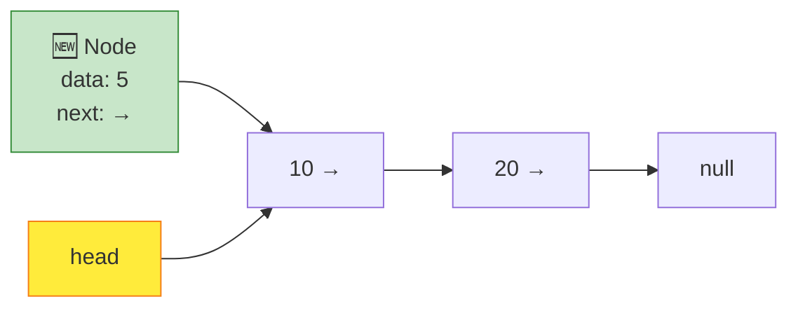

**Step 3:** Update `head` to point to new node ✅

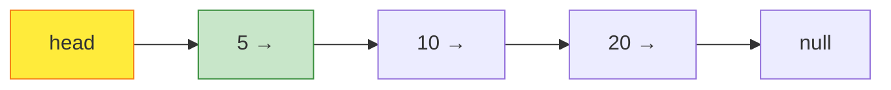

```typescript
insertHead(data: T): void {
    const newNode = new ListNode(data);
    newNode.next = this.head;  // Point to old head
    this.head = newNode;       // Update head
    this.length++;
}
```

---

### 🔼 Insertion at Tail

**Goal:** Insert node with value `40` at the end.

**Step 1:** Traverse to the last node

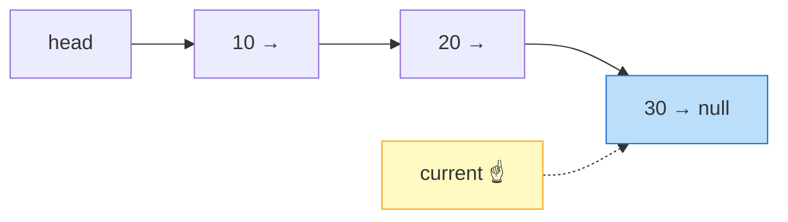

**Step 2:** Create new node and link it

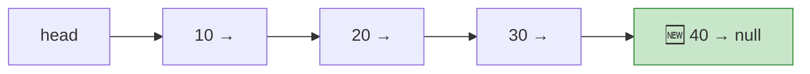

```typescript
insertTail(data: T): void {
    const newNode = new ListNode(data);
    if (!this.head) {
        this.head = newNode;
    } else {
        let current = this.head;
        while (current.next) {
            current = current.next;
        }
        current.next = newNode;
    }
    this.length++;
}
```

---

### 🔀 Insertion at Middle (Index 2)

**Goal:** Insert `25` between `20` and `30`.

**Step 1:** Traverse to node at index 1 (the node BEFORE the insertion point)

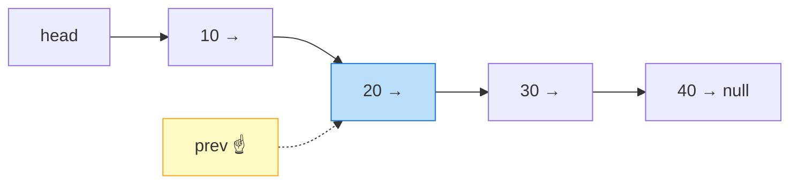

**Step 2:** Create new node, set `newNode.next = prev.next`

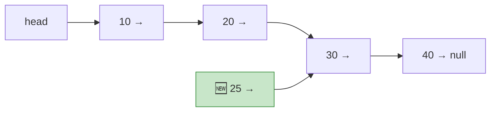

**Step 3:** Set `prev.next = newNode` ✅

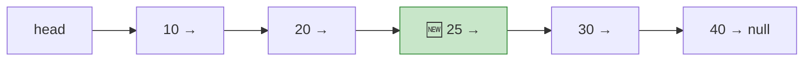

```typescript
insertAt(index: number, data: T): void {
    if (index === 0) return this.insertHead(data);

    const newNode = new ListNode(data);
    let prev = this.head;
    for (let i = 0; i < index - 1 && prev; i++) {
        prev = prev.next;
    }
    if (!prev) throw new Error("Index out of bounds");

    newNode.next = prev.next;  // Step 2: new node points to next
    prev.next = newNode;       // Step 3: prev points to new node
    this.length++;
}
```

> ⚠️ **Order matters!** If you set `prev.next = newNode` first, you lose the reference to the rest of the list!

---

### 🗑️ Deletion — Pointer Rewiring

**Goal:** Delete the node with value `20`.

**Step 1:** Find the node BEFORE the target (this is why deletion in singly linked lists requires the previous node)

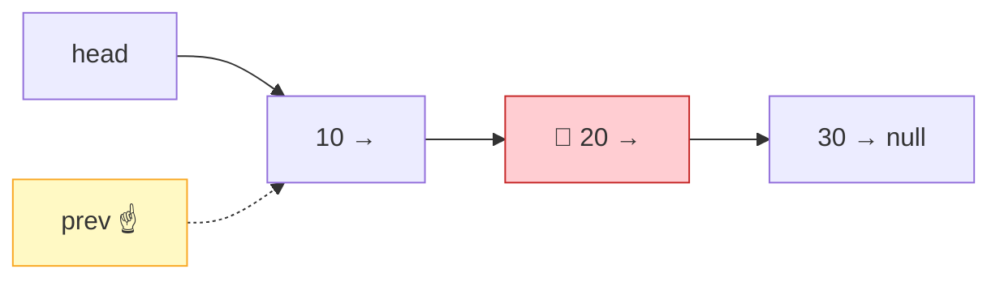

**Step 2:** Set `prev.next = target.next` (bypass the target node)

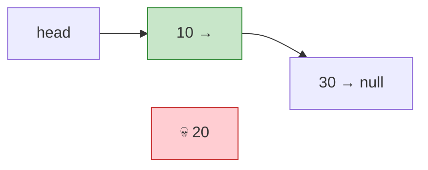

The deleted node is now unreachable and will be garbage collected. ✅

```typescript
deleteValue(data: T): boolean {
    if (!this.head) return false;

    if (this.head.data === data) {
        this.head = this.head.next;
        this.length--;
        return true;
    }

    let current = this.head;
    while (current.next) {
        if (current.next.data === data) {
            current.next = current.next.next; // Bypass the target
            this.length--;
            return true;
        }
        current = current.next;
    }
    return false;
}
```

### 🤔 Why Do You Need the "Previous" Node?

In a **singly linked list**, each node only knows about the **next** node. To remove a node, you need to update the **previous** node's `next` pointer. But you can't go backward! So you must track the previous node as you traverse.

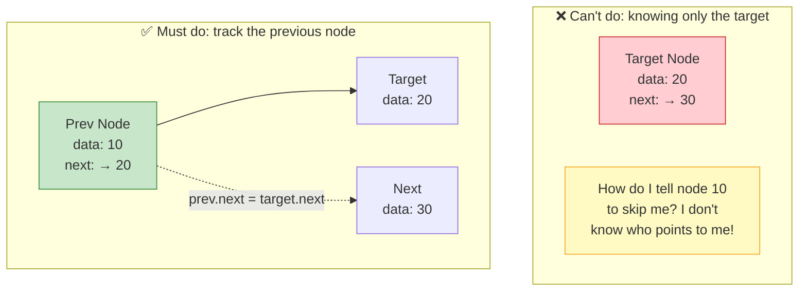

> 💡 In a **doubly linked list**, each node knows its `prev`, so you CAN delete a node given only a reference to it — O(1)!

---

## 💻 TypeScript Implementation

### 🔹 ListNode Class

```typescript
class ListNode<T> {
    data: T;
    next: ListNode<T> | null = null;

    constructor(data: T) {
        this.data = data;
    }
}
```

### 🔹 Singly Linked List — Full Implementation

```typescript
class SinglyLinkedList<T> {
    head: ListNode<T> | null = null;
    private length: number = 0;

    // ==================== INSERTION ====================

    insertHead(data: T): void {
        const newNode = new ListNode(data);
        newNode.next = this.head;
        this.head = newNode;
        this.length++;
    }

    insertTail(data: T): void {
        const newNode = new ListNode(data);
        if (!this.head) {
            this.head = newNode;
        } else {
            let current = this.head;
            while (current.next) {
                current = current.next;
            }
            current.next = newNode;
        }
        this.length++;
    }

    insertAt(index: number, data: T): void {
        if (index < 0 || index > this.length) {
            throw new Error(`Index ${index} out of bounds (size: ${this.length})`);
        }
        if (index === 0) return this.insertHead(data);

        const newNode = new ListNode(data);
        let prev = this.head;
        for (let i = 0; i < index - 1; i++) {
            prev = prev!.next;
        }
        newNode.next = prev!.next;
        prev!.next = newNode;
        this.length++;
    }

    // ==================== DELETION ====================

    deleteHead(): T | null {
        if (!this.head) return null;
        const data = this.head.data;
        this.head = this.head.next;
        this.length--;
        return data;
    }

    deleteTail(): T | null {
        if (!this.head) return null;
        if (!this.head.next) {
            const data = this.head.data;
            this.head = null;
            this.length--;
            return data;
        }

        let current = this.head;
        while (current.next!.next) {
            current = current.next!;
        }
        const data = current.next!.data;
        current.next = null;
        this.length--;
        return data;
    }

    deleteValue(data: T): boolean {
        if (!this.head) return false;

        if (this.head.data === data) {
            this.head = this.head.next;
            this.length--;
            return true;
        }

        let current = this.head;
        while (current.next) {
            if (current.next.data === data) {
                current.next = current.next.next;
                this.length--;
                return true;
            }
            current = current.next;
        }
        return false;
    }

    // ==================== SEARCH ====================

    search(data: T): number {
        let current = this.head;
        let index = 0;
        while (current) {
            if (current.data === data) return index;
            current = current.next;
            index++;
        }
        return -1; // Not found
    }

    // ==================== UTILITY ====================

    reverse(): void {
        let prev: ListNode<T> | null = null;
        let current = this.head;

        while (current) {
            const next = current.next;  // Save next
            current.next = prev;        // Reverse pointer
            prev = current;             // Move prev forward
            current = next;             // Move current forward
        }
        this.head = prev;
    }

    print(): string {
        const values: T[] = [];
        let current = this.head;
        while (current) {
            values.push(current.data);
            current = current.next;
        }
        return values.join(" → ") + " → null";
    }

    size(): number {
        return this.length;
    }
}
```

**Usage:**

```typescript
const list = new SinglyLinkedList<number>();
list.insertTail(10);
list.insertTail(20);
list.insertTail(30);
console.log(list.print());   // 10 → 20 → 30 → null

list.insertHead(5);
console.log(list.print());   // 5 → 10 → 20 → 30 → null

list.insertAt(2, 15);
console.log(list.print());   // 5 → 10 → 15 → 20 → 30 → null

list.deleteValue(15);
console.log(list.print());   // 5 → 10 → 20 → 30 → null

list.reverse();
console.log(list.print());   // 30 → 20 → 10 → 5 → null

console.log(list.search(20)); // 1
console.log(list.size());     // 4
```

---

### 🔹 DoublyLinkedList Node

```typescript
class DoublyListNode<T> {
    data: T;
    prev: DoublyListNode<T> | null = null;
    next: DoublyListNode<T> | null = null;

    constructor(data: T) {
        this.data = data;
    }
}
```

### 🔹 Doubly Linked List — Full Implementation

```typescript
class DoublyLinkedList<T> {
    head: DoublyListNode<T> | null = null;
    tail: DoublyListNode<T> | null = null;
    private length: number = 0;

    // ==================== INSERTION ====================

    insertHead(data: T): void {
        const newNode = new DoublyListNode(data);
        if (!this.head) {
            this.head = this.tail = newNode;
        } else {
            newNode.next = this.head;
            this.head.prev = newNode;
            this.head = newNode;
        }
        this.length++;
    }

    insertTail(data: T): void {
        const newNode = new DoublyListNode(data);
        if (!this.tail) {
            this.head = this.tail = newNode;
        } else {
            newNode.prev = this.tail;
            this.tail.next = newNode;
            this.tail = newNode;
        }
        this.length++;
    }

    insertAt(index: number, data: T): void {
        if (index < 0 || index > this.length) {
            throw new Error(`Index ${index} out of bounds`);
        }
        if (index === 0) return this.insertHead(data);
        if (index === this.length) return this.insertTail(data);

        const newNode = new DoublyListNode(data);
        let current = this.head;
        for (let i = 0; i < index; i++) {
            current = current!.next;
        }

        // Wire up the 4 pointers
        newNode.prev = current!.prev;
        newNode.next = current;
        current!.prev!.next = newNode;
        current!.prev = newNode;
        this.length++;
    }

    // ==================== DELETION ====================

    deleteHead(): T | null {
        if (!this.head) return null;
        const data = this.head.data;

        if (this.head === this.tail) {
            this.head = this.tail = null;
        } else {
            this.head = this.head.next;
            this.head!.prev = null;
        }
        this.length--;
        return data;
    }

    deleteTail(): T | null {
        if (!this.tail) return null;
        const data = this.tail.data;

        if (this.head === this.tail) {
            this.head = this.tail = null;
        } else {
            this.tail = this.tail.prev;
            this.tail!.next = null;
        }
        this.length--;
        return data;
    }

    deleteValue(data: T): boolean {
        let current = this.head;
        while (current) {
            if (current.data === data) {
                if (current === this.head) { this.deleteHead(); return true; }
                if (current === this.tail) { this.deleteTail(); return true; }

                // Middle node: rewire prev and next around it
                current.prev!.next = current.next;
                current.next!.prev = current.prev;
                this.length--;
                return true;
            }
            current = current.next;
        }
        return false;
    }

    // ==================== SEARCH ====================

    search(data: T): number {
        let current = this.head;
        let index = 0;
        while (current) {
            if (current.data === data) return index;
            current = current.next;
            index++;
        }
        return -1;
    }

    // ==================== UTILITY ====================

    reverse(): void {
        let current = this.head;
        while (current) {
            [current.prev, current.next] = [current.next, current.prev];
            current = current.prev; // prev is now "next" after swap
        }
        [this.head, this.tail] = [this.tail, this.head];
    }

    print(): string {
        const values: T[] = [];
        let current = this.head;
        while (current) {
            values.push(current.data);
            current = current.next;
        }
        return "null ↔ " + values.join(" ↔ ") + " ↔ null";
    }

    printReverse(): string {
        const values: T[] = [];
        let current = this.tail;
        while (current) {
            values.push(current.data);
            current = current.prev;
        }
        return "null ↔ " + values.join(" ↔ ") + " ↔ null";
    }

    size(): number {
        return this.length;
    }
}
```

**Key difference from Singly Linked List:** Every insertion/deletion must update **both** `prev` and `next` pointers. Forgetting one creates a broken list.

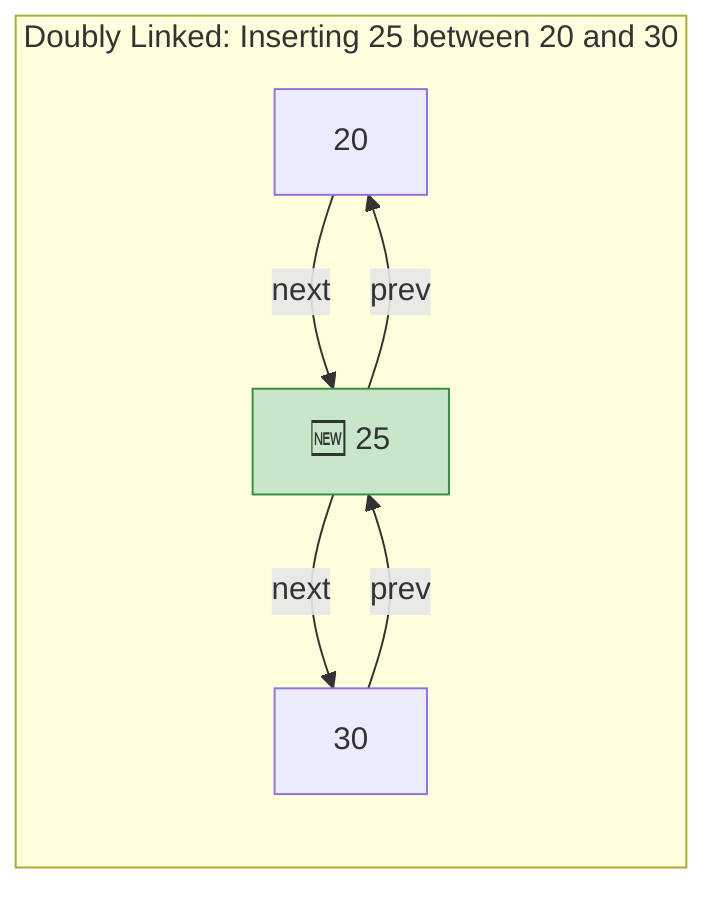

> 🔑 **4 pointers to update** when inserting in the middle of a doubly linked list:
> 1. `newNode.prev = prevNode`
> 2. `newNode.next = nextNode`
> 3. `prevNode.next = newNode`
> 4. `nextNode.prev = newNode`

---

## 🎯 Essential Linked List Techniques for LeetCode

### 1. 🛡️ Dummy / Sentinel Node

The **#1 technique** for clean linked list code. A dummy node sits before the real `head`, eliminating all edge cases around empty lists and head deletion.

#### ❌ Without Dummy Node (messy edge cases)

```typescript
function removeElements(head: ListNode | null, val: number): ListNode | null {
    // Edge case: head itself needs removal
    while (head && head.data === val) {
        head = head.next;
    }

    let current = head;
    while (current?.next) {
        if (current.next.data === val) {
            current.next = current.next.next;
        } else {
            current = current.next;
        }
    }
    return head;
}
```

#### ✅ With Dummy Node (clean and uniform)

```typescript
function removeElements(head: ListNode | null, val: number): ListNode | null {
    const dummy = new ListNode(0);
    dummy.next = head;

    let current = dummy;
    while (current.next) {
        if (current.next.data === val) {
            current.next = current.next.next;
        } else {
            current = current.next;
        }
    }
    return dummy.next;
}
```

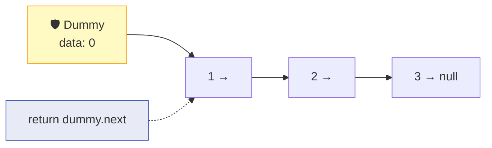

> 💡 **When to use a dummy node:** Any time you might need to delete the head, or when building a new list from scratch (merge two lists, partition list, etc.)

---

### 2. 🐢🐇 Fast & Slow Pointers (Floyd's Algorithm)

Two pointers move at different speeds. The **slow** pointer moves 1 step, the **fast** pointer moves 2 steps.

#### Use Case 1: Detect a Cycle 🔄

If there's a cycle, fast will eventually "lap" slow and they'll meet.

```mermaid
graph LR
    A["1"] --> B["2"]
    B --> C["3"]
    C --> D["4"]
    D --> E["5"]
    E --> C

    SLOW["🐢 Slow"] -.->|"step 1"| B
    FAST["🐇 Fast"] -.->|"step 1"| C

    style SLOW fill:#c8e6c9,stroke:#388e3c
    style FAST fill:#ffcdd2,stroke:#c62828
    style C fill:#fff9c4,stroke:#f9a825
    style E fill:#fff9c4,stroke:#f9a825
```

```mermaid
graph LR
    subgraph "🐢 Slow moves: 1 → 2 → 3 → 4 → 5 → 3 → 4"
        S1["Step 0: Node 1"]
        S2["Step 1: Node 2"]
        S3["Step 2: Node 3"]
        S4["Step 3: Node 4"]
    end
    subgraph "🐇 Fast moves: 1 → 3 → 5 → 4 → 3 → 5 → 4"
        F1["Step 0: Node 1"]
        F2["Step 1: Node 3"]
        F3["Step 2: Node 5"]
        F4["Step 3: Node 4 ← 🤝 MEET!"]
    end
```

```typescript
function hasCycle(head: ListNode | null): boolean {
    let slow = head;
    let fast = head;

    while (fast?.next) {
        slow = slow!.next;
        fast = fast.next.next;
        if (slow === fast) return true; // They met — cycle exists!
    }
    return false; // Fast reached null — no cycle
}
```

#### Use Case 2: Find the Middle Node 🎯

When fast reaches the end, slow is at the middle.

```mermaid
graph LR
    A["1"] --> B["2"] --> C["3"] --> D["4"] --> E["5 → null"]

    SLOW["🐢 Slow\nat: 3 ✅"] -.-> C
    FAST["🐇 Fast\nat: 5 (end)"] -.-> E

    style C fill:#c8e6c9,stroke:#388e3c
    style SLOW fill:#c8e6c9,stroke:#388e3c
    style FAST fill:#ffcdd2,stroke:#c62828
```

```typescript
function findMiddle(head: ListNode | null): ListNode | null {
    let slow = head;
    let fast = head;

    while (fast?.next) {
        slow = slow!.next;
        fast = fast.next.next;
    }
    return slow; // Slow is at the middle
}
```

#### Use Case 3: Find Nth Node From End

Use two pointers `n` steps apart. When the lead pointer hits the end, the trailing pointer is at the target.

```mermaid
graph LR
    A["1"] --> B["2"] --> C["3"] --> D["4"] --> E["5 → null"]

    LEAD["Lead pointer"] -.-> E
    TRAIL["Trail pointer\n(n=2 steps behind)"] -.-> C

    style TRAIL fill:#c8e6c9,stroke:#388e3c
    style LEAD fill:#bbdefb,stroke:#1976d2
```

```typescript
function removeNthFromEnd(head: ListNode | null, n: number): ListNode | null {
    const dummy = new ListNode(0);
    dummy.next = head;
    let lead: ListNode | null = dummy;
    let trail: ListNode | null = dummy;

    // Move lead n+1 steps ahead
    for (let i = 0; i <= n; i++) {
        lead = lead!.next;
    }

    // Move both until lead hits null
    while (lead) {
        lead = lead.next;
        trail = trail!.next;
    }

    // trail is now right before the target
    trail!.next = trail!.next!.next;
    return dummy.next;
}
```

---

### 3. 🔄 Reversing a Linked List

The **most fundamental** linked list technique. You MUST know this cold.

#### Iterative Approach (3-Pointer Technique)

Use three pointers: `prev`, `current`, `next`.

```mermaid
graph LR
    subgraph "Initial State"
        P1["prev\nnull"] ~~~ C1["current\n1 →"] --> N1["next\n2 →"] --> X1["3 → null"]
    end
```

```mermaid
graph LR
    subgraph "Step 1: Save next, reverse pointer"
        A1["null ← 1"] --- C2["current\n2 →"] --> X2["3 → null"]
        P2["prev = 1"] ~~~ C2
    end
```

```mermaid
graph LR
    subgraph "Step 2: Continue"
        A2["null ← 1 ← 2"] --- C3["current\n3 →"]
        P3["prev = 2"] ~~~ C3
    end
```

```mermaid
graph LR
    subgraph "Step 3: Done! current = null"
        A3["null ← 1 ← 2 ← 3"]
        P4["prev = 3 = new head ✅"]
    end

    style P4 fill:#c8e6c9,stroke:#388e3c
```

```typescript
function reverseIterative(head: ListNode | null): ListNode | null {
    let prev: ListNode | null = null;
    let current = head;

    while (current) {
        const next = current.next;  // 1. Save next
        current.next = prev;        // 2. Reverse pointer
        prev = current;             // 3. Move prev forward
        current = next;             // 4. Move current forward
    }
    return prev; // prev is the new head
}
```

#### Recursive Approach

```typescript
function reverseRecursive(head: ListNode | null): ListNode | null {
    // Base case: empty or single node
    if (!head?.next) return head;

    // Recurse: reverse everything after head
    const newHead = reverseRecursive(head.next);

    // head.next is now the LAST node of the reversed sublist
    // Make it point back to head
    head.next.next = head;
    head.next = null;

    return newHead;
}
```

```mermaid
graph TD
    subgraph "Recursive Reversal Unwinding"
        R1["reverse(1→2→3→null)"] --> R2["reverse(2→3→null)"]
        R2 --> R3["reverse(3→null)"]
        R3 -->|"base case: return 3"| U3["3"]
        U3 -->|"3→2, 2→null"| U2["3→2→null"]
        U2 -->|"2→1, 1→null"| U1["3→2→1→null ✅"]
    end

    style U1 fill:#c8e6c9,stroke:#388e3c
```

---

### 4. 🔀 Merge Two Sorted Lists

Classic technique: compare heads, take the smaller, advance that pointer.

```mermaid
graph LR
    subgraph "List 1"
        A1["1"] --> B1["3"] --> C1["5 → null"]
    end
    subgraph "List 2"
        A2["2"] --> B2["4"] --> C2["6 → null"]
    end
    subgraph "Merged Result"
        M1["1"] --> M2["2"] --> M3["3"] --> M4["4"] --> M5["5"] --> M6["6 → null"]
    end

    style M1 fill:#c8e6c9,stroke:#388e3c
    style M2 fill:#c8e6c9,stroke:#388e3c
    style M3 fill:#c8e6c9,stroke:#388e3c
    style M4 fill:#c8e6c9,stroke:#388e3c
    style M5 fill:#c8e6c9,stroke:#388e3c
    style M6 fill:#c8e6c9,stroke:#388e3c
```

```typescript
function mergeTwoLists(
    l1: ListNode | null,
    l2: ListNode | null
): ListNode | null {
    const dummy = new ListNode(0); // Dummy node simplifies everything
    let tail = dummy;

    while (l1 && l2) {
        if (l1.data <= l2.data) {
            tail.next = l1;
            l1 = l1.next;
        } else {
            tail.next = l2;
            l2 = l2.next;
        }
        tail = tail.next;
    }

    tail.next = l1 ?? l2; // Attach whichever list remains

    return dummy.next;
}
```

---

## ⏱️ Complexity Table

### Singly Linked List

| Operation | Time | Space | Notes |
|-----------|------|-------|-------|
| `insertHead` | O(1) | O(1) | Just update head pointer |
| `insertTail` | O(n) | O(1) | Must traverse to end (O(1) with tail pointer) |
| `insertAt(i)` | O(n) | O(1) | Traverse to position i |
| `deleteHead` | O(1) | O(1) | Just update head pointer |
| `deleteTail` | O(n) | O(1) | Must find second-to-last node |
| `deleteValue` | O(n) | O(1) | Must search for value |
| `search` | O(n) | O(1) | Linear scan |
| `reverse` | O(n) | O(1) | Single pass |
| `access(i)` | O(n) | O(1) | No random access |

### Doubly Linked List

| Operation | Time | Space | Notes |
|-----------|------|-------|-------|
| `insertHead` | O(1) | O(1) | Update head + pointers |
| `insertTail` | O(1) | O(1) | ✅ Have tail pointer! |
| `insertAt(i)` | O(n) | O(1) | Traverse to position i |
| `deleteHead` | O(1) | O(1) | Update head + pointers |
| `deleteTail` | O(1) | O(1) | ✅ Have tail pointer + prev! |
| `deleteNode(ref)` | O(1) | O(1) | ✅ Don't need to find prev! |
| `deleteValue` | O(n) | O(1) | Must search for value |
| `search` | O(n) | O(1) | Linear scan |
| `reverse` | O(n) | O(1) | Swap prev/next on all nodes |
| `access(i)` | O(n) | O(1) | Can search from head or tail |

### Space Overhead Per Node

| Type | Per-Node Overhead |
|------|-------------------|
| Array | 0 (just the data) |
| Singly Linked | 1 pointer (~8 bytes) |
| Doubly Linked | 2 pointers (~16 bytes) |

---

## 🎯 LeetCode Patterns — When to Think "Linked List"

### 🚩 Signal Phrases

| If the problem says... | Think... |
|------------------------|----------|
| "Given the head of a linked list" | Direct linked list manipulation |
| "Detect if there is a cycle" | 🐢🐇 Fast & slow pointers |
| "Find the middle node" | 🐢🐇 Fast & slow pointers |
| "Remove the nth node from the end" | Two pointers, n apart |
| "Merge two sorted lists" | Dummy node + compare heads |
| "Reverse a linked list" | 3-pointer iterative or recursive |
| "Reorder / rearrange list" | Find middle → reverse second half → merge |
| "Palindrome linked list" | Find middle → reverse second half → compare |
| "Flatten / serialize" | Usually recursive with careful pointer management |
| "LRU Cache" | Doubly linked list + hash map |

### 🧠 Pattern Decision Tree

```mermaid
graph TD
    START["🔗 Linked List Problem"] --> Q1{"Does it involve\ncycle detection?"}
    Q1 -->|Yes| A1["🐢🐇 Floyd's Algorithm"]
    Q1 -->|No| Q2{"Finding middle\nor nth from end?"}
    Q2 -->|Yes| A2["🐢🐇 Two Pointers"]
    Q2 -->|No| Q3{"Merging lists?"}
    Q3 -->|Yes| A3["🛡️ Dummy Node +\nCompare & Merge"]
    Q3 -->|No| Q4{"Reversing all\nor part?"}
    Q4 -->|Yes| A4["🔄 3-Pointer Reversal"]
    Q4 -->|No| Q5{"Edge cases\nwith head?"}
    Q5 -->|Yes| A5["🛡️ Dummy Node"]
    Q5 -->|No| A6["Direct Traversal\n& Manipulation"]

    style START fill:#e1f5fe,stroke:#0288d1
    style A1 fill:#c8e6c9,stroke:#388e3c
    style A2 fill:#c8e6c9,stroke:#388e3c
    style A3 fill:#c8e6c9,stroke:#388e3c
    style A4 fill:#c8e6c9,stroke:#388e3c
    style A5 fill:#c8e6c9,stroke:#388e3c
    style A6 fill:#c8e6c9,stroke:#388e3c
```

---

## ⚠️ Common Pitfalls

### 1. 💀 Losing Reference to Head

```typescript
// ❌ BAD: After this loop, you lost the head!
let current = head;
while (current) {
    current = current.next; // current is now null, and head is... unreachable
}

// ✅ GOOD: Use a separate variable to traverse
let runner = head;
while (runner) {
    runner = runner.next;
}
// head is still intact!
```

### 2. 💥 Null Pointer Errors

```typescript
// ❌ BAD: What if current.next is null?
while (current) {
    if (current.next.data === target) { ... } // 💥 TypeError!
    current = current.next;
}

// ✅ GOOD: Check before accessing
while (current?.next) {
    if (current.next.data === target) { ... }
    current = current.next;
}
```

### 3. 🔗 Forgetting to Update Both Pointers (Doubly Linked)

```typescript
// ❌ BAD: Only updated next, forgot prev
newNode.next = current.next;
current.next = newNode;
// current.next.prev still points to current, not newNode! 💥

// ✅ GOOD: Update all 4 pointers
newNode.next = current.next;
newNode.prev = current;
if (current.next) current.next.prev = newNode;
current.next = newNode;
```

### 4. 🔢 Off-by-One in "Nth from End"

```typescript
// ❌ BAD: If n=1 (last element), this crashes
for (let i = 0; i < n; i++) { // Moved n steps
    lead = lead.next;
}

// ✅ GOOD: Use a dummy node and move n+1 steps
const dummy = new ListNode(0);
dummy.next = head;
let lead = dummy;
for (let i = 0; i <= n; i++) { // n+1 steps
    lead = lead!.next;
}
```

### 5. 🔄 Wrong Order of Pointer Updates

```typescript
// ❌ BAD: Lost the rest of the list!
prev.next = newNode;          // prev now points to newNode
newNode.next = prev.next;     // prev.next IS newNode now — self-loop! 💥

// ✅ GOOD: Always set new node's next FIRST
newNode.next = prev.next;     // Save the rest of the list
prev.next = newNode;          // Then rewire prev
```

---

## 🔑 Key Takeaways

```mermaid
graph LR
    subgraph "🧠 Remember These"
        K1["1️⃣ Linked lists trade\nrandom access for\nO(1) insert/delete"]
        K2["2️⃣ Always use a\ndummy node for\nclean edge cases"]
        K3["3️⃣ Fast/slow pointers\nsolve cycle + middle\n+ nth-from-end"]
        K4["4️⃣ Reversal is THE\nfundamental technique\nKnow it cold!"]
        K5["5️⃣ Pointer update\norder matters\nSet next BEFORE rewiring"]
    end
```

| # | Takeaway |
|---|----------|
| 1️⃣ | Linked lists sacrifice O(1) access for O(1) insert/delete at known positions |
| 2️⃣ | Use a **dummy/sentinel node** whenever head might change — it eliminates edge cases |
| 3️⃣ | **Fast & slow pointers** solve 3+ problem types: cycle detection, find middle, nth from end |
| 4️⃣ | **Reversing a linked list** (iterative 3-pointer) is the single most important technique |
| 5️⃣ | **Pointer update order** matters — always connect the new node before disconnecting the old link |
| 6️⃣ | Doubly linked lists cost more memory but give O(1) delete-by-reference and O(1) tail operations |
| 7️⃣ | In interviews, always clarify: singly or doubly? circular? do you have a tail pointer? |

---

## 📋 Practice Problems

### 🟢 Easy — Build Foundation

| # | Problem | Key Technique | LeetCode |
|---|---------|---------------|----------|
| 1 | Reverse Linked List | 3-pointer iterative | [#206](https://leetcode.com/problems/reverse-linked-list/) |
| 2 | Merge Two Sorted Lists | Dummy node + compare | [#21](https://leetcode.com/problems/merge-two-sorted-lists/) |
| 3 | Linked List Cycle | Fast & slow pointers | [#141](https://leetcode.com/problems/linked-list-cycle/) |
| 4 | Middle of the Linked List | Fast & slow pointers | [#876](https://leetcode.com/problems/middle-of-the-linked-list/) |
| 5 | Remove Duplicates from Sorted List | Single traversal | [#83](https://leetcode.com/problems/remove-duplicates-from-sorted-list/) |
| 6 | Palindrome Linked List | Reverse second half + compare | [#234](https://leetcode.com/problems/palindrome-linked-list/) |
| 7 | Intersection of Two Linked Lists | Two pointers | [#160](https://leetcode.com/problems/intersection-of-two-linked-lists/) |

### 🟡 Medium — Core Interview Problems

| # | Problem | Key Technique | LeetCode |
|---|---------|---------------|----------|
| 1 | Remove Nth Node From End of List | Two pointers, n apart | [#19](https://leetcode.com/problems/remove-nth-node-from-end-of-list/) |
| 2 | Add Two Numbers | Carry propagation | [#2](https://leetcode.com/problems/add-two-numbers/) |
| 3 | Reorder List | Find middle + reverse + merge | [#143](https://leetcode.com/problems/reorder-list/) |
| 4 | LRU Cache | Doubly linked list + hash map | [#146](https://leetcode.com/problems/lru-cache/) |
| 5 | Copy List with Random Pointer | Interleaving or hash map | [#138](https://leetcode.com/problems/copy-list-with-random-pointer/) |
| 6 | Sort List | Merge sort on linked list | [#148](https://leetcode.com/problems/sort-list/) |
| 7 | Linked List Cycle II | Floyd's — find cycle start | [#142](https://leetcode.com/problems/linked-list-cycle-ii/) |
| 8 | Swap Nodes in Pairs | Pointer gymnastics | [#24](https://leetcode.com/problems/swap-nodes-in-pairs/) |

### 🔴 Hard — Boss Fights

| # | Problem | Key Technique | LeetCode |
|---|---------|---------------|----------|
| 1 | Merge K Sorted Lists | Min-heap / divide & conquer | [#23](https://leetcode.com/problems/merge-k-sorted-lists/) |
| 2 | Reverse Nodes in K-Group | Reverse sublists of size k | [#25](https://leetcode.com/problems/reverse-nodes-in-k-group/) |
| 3 | Design Skiplist | Multi-level linked list | [#1206](https://leetcode.com/problems/design-skiplist/) |

---

### 🗺️ Suggested Study Order

```mermaid
graph LR
    A["Week 1\n🟢 Easy\nBuild intuition"] --> B["Week 2\n🟡 Medium\nCore patterns"]
    B --> C["Week 3\n🔴 Hard\nAdvanced techniques"]

    A1["#206 Reverse"] --> A2["#21 Merge Two"]
    A2 --> A3["#141 Cycle"]
    A3 --> A4["#876 Middle"]

    B1["#19 Nth from End"] --> B2["#2 Add Two Numbers"]
    B2 --> B3["#143 Reorder"]
    B3 --> B4["#146 LRU Cache"]

    C1["#23 Merge K"] --> C2["#25 Reverse K-Group"]

    style A fill:#c8e6c9,stroke:#388e3c
    style B fill:#fff9c4,stroke:#f9a825
    style C fill:#ffcdd2,stroke:#c62828
```

---

> 🚀 **Next Chapter:** [Stacks & Queues →](../03-stacks-and-queues/README.md)
>
> ⬅️ **Previous Chapter:** [Arrays & Strings](../01-arrays-and-strings/README.md)
