# Chapter 3: Stacks & Queues 📚

> **Restricted access = Superpowers.** By limiting *how* you interact with data, stacks and queues eliminate ambiguity, guarantee ordering, and make complex problems surprisingly simple.

---

## 1. 🌍 Real-World Analogies

### Stack — A Stack of Plates in a Cafeteria 🍽️

Walk into any cafeteria and look at the plate dispenser. Plates are spring-loaded: the last plate placed on top is the first one you grab. You never reach to the bottom — you always interact with the **top**.

```
    ┌─────────┐
    │ Plate 5 │  ← You grab this one (LAST in, FIRST out)
    ├─────────┤
    │ Plate 4 │
    ├─────────┤
    │ Plate 3 │
    ├─────────┤
    │ Plate 2 │
    ├─────────┤
    │ Plate 1 │  ← This was placed first, removed last
    └─────────┘
```

**LIFO — Last In, First Out.**

### Queue — A Line at a Coffee Shop ☕

You walk into a coffee shop. There's a line. You join at the **back**. The person at the **front** gets served first. No cutting. Fair and ordered.

```
  FRONT                              BACK
  ┌───────┐  ┌───────┐  ┌───────┐  ┌───────┐
  │ Alice │→ │  Bob  │→ │ Carol │→ │  You  │
  └───────┘  └───────┘  └───────┘  └───────┘
     ↑                                 ↑
  Served next                    Just arrived
```

**FIFO — First In, First Out.**

### Deque — A Deck of Cards 🃏

You hold a deck of cards. You can draw from the **top** or the **bottom**. You can also add cards to either end. Maximum flexibility, but still restricted to the two ends — no reaching into the middle.

**Double-Ended Queue** — insert and remove from both ends.

---

## 2. 📝 What & Why

### What Are They?

Stacks and queues are **restricted-access data structures**. Unlike an array where you can read/write any index, these structures only let you interact at specific positions:

| Structure | Access Points | Order |
|-----------|--------------|-------|
| **Stack** | Top only | LIFO |
| **Queue** | Front (remove) + Back (add) | FIFO |
| **Deque** | Front + Back (both add/remove) | Both |

### Why Restricting Access Is POWERFUL 💪

This seems like a limitation, but it's actually a **superpower**:

1. **Simplifies logic** — You don't have to decide *where* to put things. Push? It goes on top. Enqueue? It goes to the back. No index management.

2. **Guarantees order** — A stack guarantees you process the most recent item first. A queue guarantees you process the oldest item first. These guarantees make algorithms correct by construction.

3. **O(1) operations** — By restricting access to the ends, every core operation is constant time.

4. **Enables pattern matching** — Many LeetCode problems become trivial once you recognize "this needs a stack" or "this needs a queue."

### Real-World Uses

**Stack** 📚:
- **Undo/Redo** — Each action is pushed onto a stack. Undo = pop the last action.
- **Browser Back Button** — Each page visit is pushed. Back = pop.
- **Function Call Stack** — Every function call pushes a frame. Return = pop.
- **Expression Evaluation** — Parsing `((3 + 4) * 2)` requires matching nested brackets.
- **DFS** — Depth-First Search uses a stack (explicitly or via recursion).

**Queue** 📬:
- **Printer Queue** — Print jobs processed in order.
- **BFS** — Breadth-First Search processes nodes level by level.
- **Task Scheduling** — OS schedules processes in a queue.
- **Message Queues** — Kafka, RabbitMQ, SQS — all queue-based.
- **JavaScript Event Loop** — Callbacks are queued in the task queue.

---

## 3. ⚙️ How It Works

### Stack: Push & Pop Operations

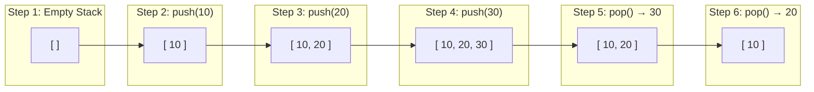

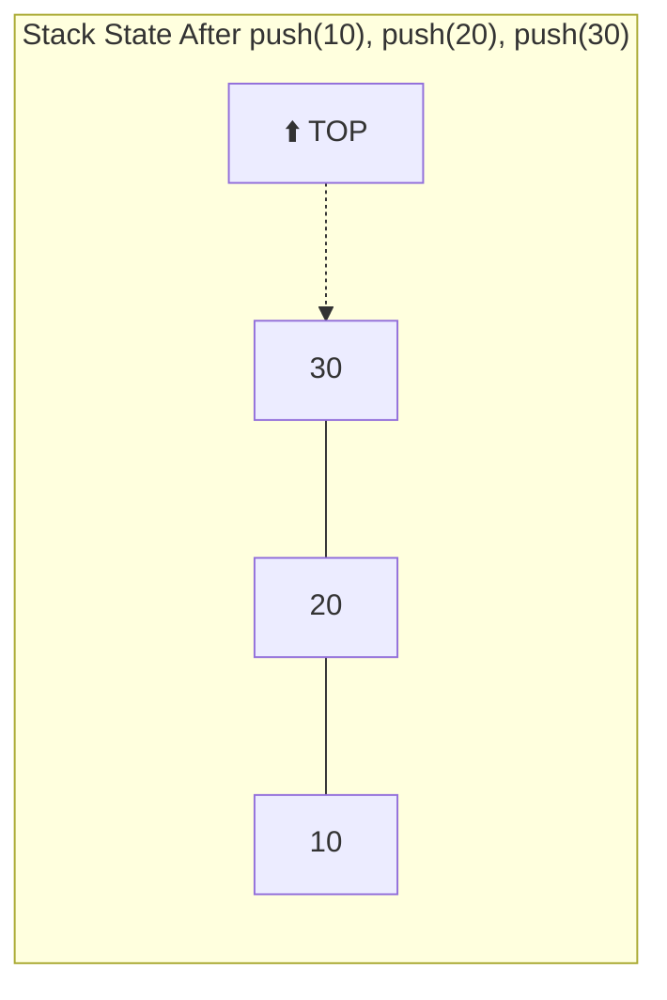

> 🎯 **Key insight:** `push` adds to the top, `pop` removes from the top. You never touch anything below the top element.

### Queue: Enqueue & Dequeue Operations

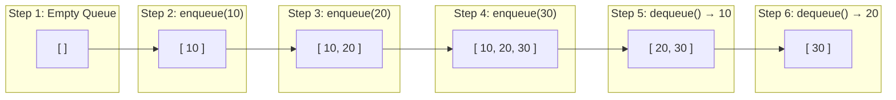

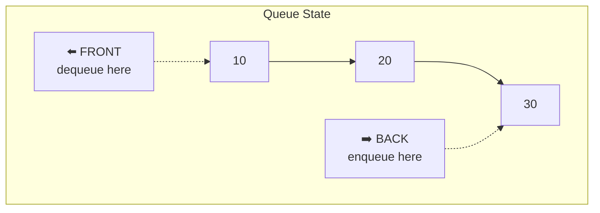

### 🧠 The Call Stack — Why Recursion Works

Every time you call a function, the runtime **pushes** a stack frame. When the function returns, it **pops** the frame. This is literally a stack.

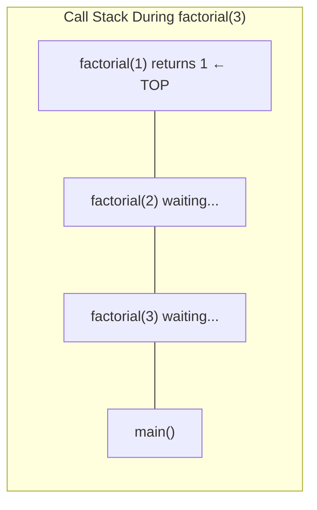

```
factorial(3)                    // push frame for factorial(3)
  → factorial(2)               // push frame for factorial(2)
    → factorial(1)             // push frame for factorial(1)
      → returns 1              // pop factorial(1)
    → returns 2 * 1 = 2        // pop factorial(2)
  → returns 3 * 2 = 6          // pop factorial(3)
```

> 💡 **This is why stack overflow happens.** Too many recursive calls = too many frames pushed = stack runs out of memory.

### 🔄 JavaScript Event Loop — Queue in Action

JavaScript is single-threaded but handles async via a **task queue** (callback queue):

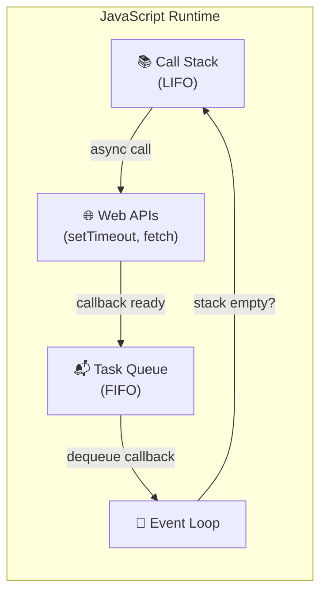

```typescript
console.log("1");            // → Call stack (runs immediately)
setTimeout(() => {
  console.log("2");          // → Web API → Task Queue → Call Stack (runs later)
}, 0);
console.log("3");            // → Call stack (runs immediately)

// Output: "1", "3", "2"
// Even with 0ms delay, setTimeout callback is queued!
```

The event loop continuously checks: "Is the call stack empty? If yes, dequeue the next callback from the task queue and push it onto the call stack."

---

## 4. 💻 TypeScript Implementations

### Stack Using Array

The simplest implementation — JavaScript arrays already have `push()` and `pop()` which operate on the end:

```typescript
class ArrayStack<T> {
  private items: T[] = [];

  push(value: T): void {
    this.items.push(value);
  }

  pop(): T | undefined {
    if (this.isEmpty()) return undefined;
    return this.items.pop();
  }

  peek(): T | undefined {
    return this.items[this.items.length - 1];
  }

  isEmpty(): boolean {
    return this.items.length === 0;
  }

  size(): number {
    return this.items.length;
  }
}
```

> ✅ **All operations O(1).** Array `push`/`pop` operate at the end — no shifting needed.

### Stack Using Linked List

When you want guaranteed O(1) without amortized resizing:

```typescript
class ListNode<T> {
  constructor(public val: T, public next: ListNode<T> | null = null) {}
}

class LinkedListStack<T> {
  private head: ListNode<T> | null = null;
  private count = 0;

  push(value: T): void {
    const node = new ListNode(value, this.head);
    this.head = node;
    this.count++;
  }

  pop(): T | undefined {
    if (!this.head) return undefined;
    const val = this.head.val;
    this.head = this.head.next;
    this.count--;
    return val;
  }

  peek(): T | undefined {
    return this.head?.val;
  }

  isEmpty(): boolean {
    return this.head === null;
  }

  size(): number {
    return this.count;
  }
}
```

> 🔗 We push/pop at the **head** of the linked list — both O(1) since no traversal needed.

### Queue Using Array — ⚠️ The Trap

```typescript
class NaiveArrayQueue<T> {
  private items: T[] = [];

  enqueue(value: T): void {
    this.items.push(value);      // O(1) — add to end
  }

  dequeue(): T | undefined {
    return this.items.shift();   // ⚠️ O(n)! — shifts ALL remaining elements left
  }
}
```

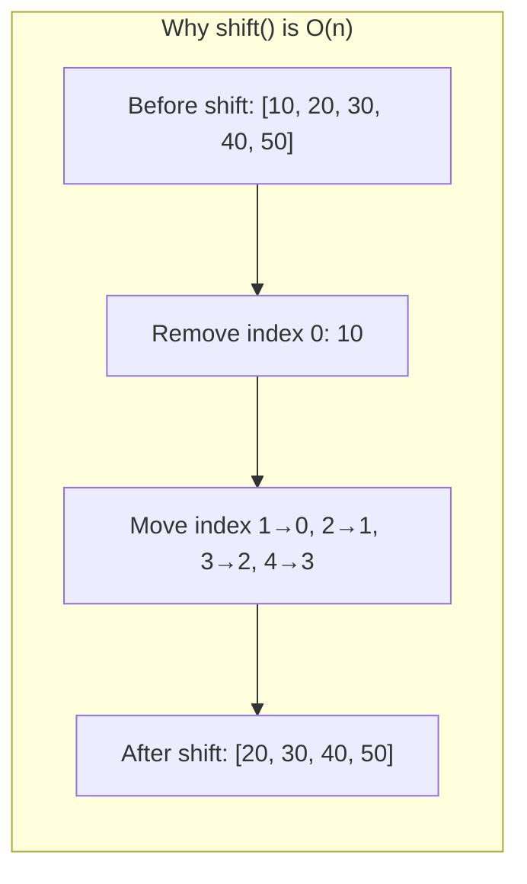

> ⚠️ **Never use `Array.shift()` in performance-critical code.** Every `shift()` copies all remaining elements one position left. For a queue with 1 million items, every dequeue moves 999,999 elements.

### Queue Using Linked List — Proper O(1)

```typescript
class QueueNode<T> {
  constructor(public val: T, public next: QueueNode<T> | null = null) {}
}

class LinkedListQueue<T> {
  private head: QueueNode<T> | null = null;
  private tail: QueueNode<T> | null = null;
  private count = 0;

  enqueue(value: T): void {
    const node = new QueueNode(value);
    if (this.tail) {
      this.tail.next = node;
    } else {
      this.head = node;
    }
    this.tail = node;
    this.count++;
  }

  dequeue(): T | undefined {
    if (!this.head) return undefined;
    const val = this.head.val;
    this.head = this.head.next;
    if (!this.head) this.tail = null;
    this.count--;
    return val;
  }

  peek(): T | undefined {
    return this.head?.val;
  }

  isEmpty(): boolean {
    return this.head === null;
  }

  size(): number {
    return this.count;
  }
}
```

> ✅ **Both enqueue and dequeue are O(1).** We maintain both `head` and `tail` pointers — enqueue at tail, dequeue at head.

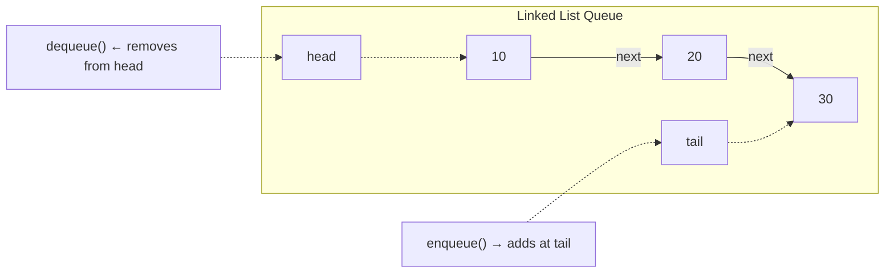

### Deque (Double-Ended Queue)

```typescript
class DequeNode<T> {
  constructor(
    public val: T,
    public prev: DequeNode<T> | null = null,
    public next: DequeNode<T> | null = null,
  ) {}
}

class Deque<T> {
  private head: DequeNode<T> | null = null;
  private tail: DequeNode<T> | null = null;
  private count = 0;

  pushFront(value: T): void {
    const node = new DequeNode(value, null, this.head);
    if (this.head) this.head.prev = node;
    this.head = node;
    if (!this.tail) this.tail = node;
    this.count++;
  }

  pushBack(value: T): void {
    const node = new DequeNode(value, this.tail, null);
    if (this.tail) this.tail.next = node;
    this.tail = node;
    if (!this.head) this.head = node;
    this.count++;
  }

  popFront(): T | undefined {
    if (!this.head) return undefined;
    const val = this.head.val;
    this.head = this.head.next;
    if (this.head) this.head.prev = null;
    else this.tail = null;
    this.count--;
    return val;
  }

  popBack(): T | undefined {
    if (!this.tail) return undefined;
    const val = this.tail.val;
    this.tail = this.tail.prev;
    if (this.tail) this.tail.next = null;
    else this.head = null;
    this.count--;
    return val;
  }

  peekFront(): T | undefined { return this.head?.val; }
  peekBack(): T | undefined { return this.tail?.val; }
  isEmpty(): boolean { return this.count === 0; }
  size(): number { return this.count; }
}
```

> 🃏 Uses a **doubly linked list** — `prev` and `next` pointers allow O(1) operations at both ends.

---

## 5. 🧩 Essential Stack/Queue Techniques for LeetCode

### Pattern 1: Valid Parentheses 🔐

> **LeetCode 20 — Valid Parentheses**
> Given a string containing `(`, `)`, `{`, `}`, `[`, `]`, determine if the input is valid.

**The Insight:** Every closing bracket must match the **most recent** unmatched opening bracket. "Most recent" = LIFO = Stack.

#### Step-by-Step Walkthrough

Input: `"{[()]}"`

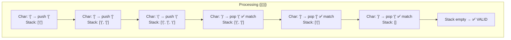

```typescript
function isValid(s: string): boolean {
  const stack: string[] = [];
  const pairs: Record<string, string> = {
    ")": "(",
    "]": "[",
    "}": "{",
  };

  for (const char of s) {
    if (char === "(" || char === "[" || char === "{") {
      stack.push(char);
    } else {
      if (stack.pop() !== pairs[char]) return false;
    }
  }

  return stack.length === 0;
}
```

**Why it works:** The stack naturally maintains the nesting order. When we see a closing bracket, we check if it matches the top of the stack (the most recent opening bracket). If they all match and the stack is empty at the end, the string is valid.

---

### Pattern 2: Monotonic Stack 📈

> **The most important stack pattern for competitive programming.**

A **monotonic stack** maintains elements in strictly increasing or decreasing order. When a new element violates the order, we pop elements until the order is restored.

#### Next Greater Element (LeetCode 496 / 503)

> For each element in an array, find the **next element that is greater** than it.

Input: `[2, 1, 2, 4, 3]`
Output: `[4, 2, 4, -1, -1]`

**The Insight:** Iterate from right to left. Maintain a stack of "candidates" for the next greater element. If the top of the stack is ≤ current element, it can never be the answer for any element to the left — pop it.

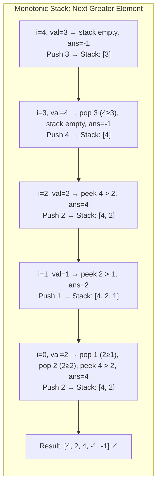

```typescript
function nextGreaterElement(nums: number[]): number[] {
  const n = nums.length;
  const result = new Array(n).fill(-1);
  const stack: number[] = []; // stores values (or indices)

  for (let i = n - 1; i >= 0; i--) {
    // Pop elements that are not greater than current
    while (stack.length > 0 && stack[stack.length - 1] <= nums[i]) {
      stack.pop();
    }
    // Top of stack is the next greater element (if exists)
    if (stack.length > 0) {
      result[i] = stack[stack.length - 1];
    }
    stack.push(nums[i]);
  }

  return result;
}
```

#### Why Does This Work?

Think of the stack as a "line of taller people behind you." You're looking for the next person taller than you. Anyone shorter than you between you and that taller person is irrelevant — they can never be the answer for *anyone* to your left either. So we pop them.

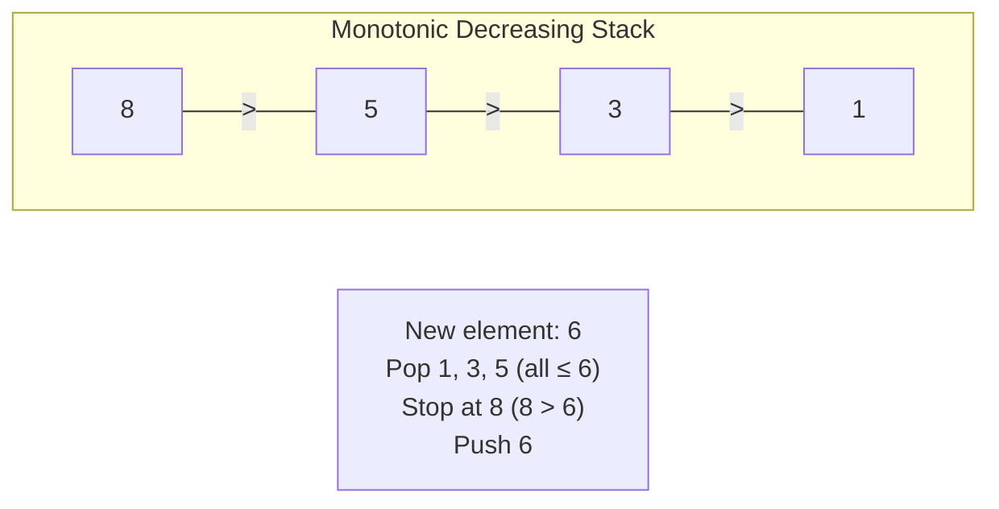

> 🧠 **Amortized O(n):** Each element is pushed once and popped at most once. Even though there's a while loop inside the for loop, total operations across all iterations = 2n.

---

### Pattern 3: Stack for Expression Evaluation 🧮

> **LeetCode 150 — Evaluate Reverse Polish Notation**

RPN (postfix notation): `["2", "1", "+", "3", "*"]` → `(2 + 1) * 3 = 9`

**The Insight:** Numbers go on the stack. When you see an operator, pop two numbers, apply the operator, push the result back.

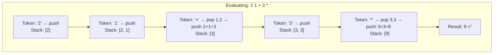

```typescript
function evalRPN(tokens: string[]): number {
  const stack: number[] = [];
  const ops: Record<string, (a: number, b: number) => number> = {
    "+": (a, b) => a + b,
    "-": (a, b) => a - b,
    "*": (a, b) => a * b,
    "/": (a, b) => Math.trunc(a / b),
  };

  for (const token of tokens) {
    if (token in ops) {
      const b = stack.pop()!;
      const a = stack.pop()!;
      stack.push(ops[token](a, b));
    } else {
      stack.push(Number(token));
    }
  }

  return stack[0];
}
```

> ⚠️ **Watch the order:** When you pop `b` then `a`, the operation is `a op b`, not `b op a`. This matters for subtraction and division.

---

### Pattern 4: Queue for BFS 🌊

BFS explores a graph **level by level** — exactly what a queue guarantees.

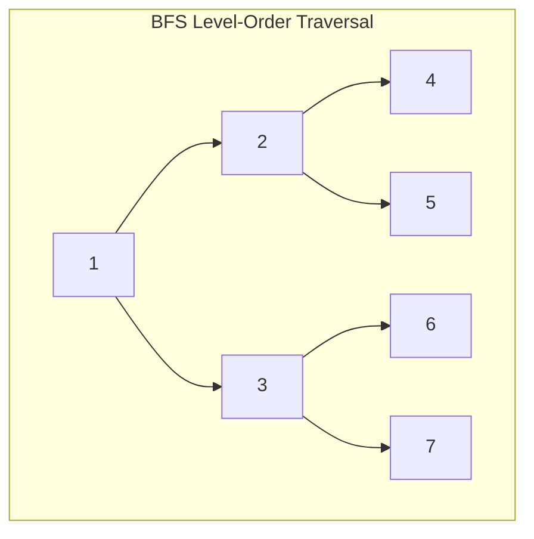

```
Queue processing order:
Level 0: [1]         → dequeue 1, enqueue children 2,3
Level 1: [2, 3]      → dequeue 2 (enqueue 4,5), dequeue 3 (enqueue 6,7)
Level 2: [4, 5, 6, 7] → dequeue all, no children

Result: [[1], [2,3], [4,5,6,7]]
```

```typescript
function levelOrder(root: TreeNode | null): number[][] {
  if (!root) return [];
  const result: number[][] = [];
  const queue: TreeNode[] = [root];

  while (queue.length > 0) {
    const levelSize = queue.length;
    const level: number[] = [];

    for (let i = 0; i < levelSize; i++) {
      const node = queue.shift()!;
      level.push(node.val);
      if (node.left) queue.push(node.left);
      if (node.right) queue.push(node.right);
    }

    result.push(level);
  }

  return result;
}
```

> 📖 Full BFS deep-dive in **Chapter 14: BFS / DFS**.

---

### Pattern 5: Min Stack 🏷️

> **LeetCode 155 — Min Stack**: Design a stack that supports push, pop, top, and retrieving the minimum element — all in O(1).

**The Insight:** Maintain a **parallel stack** that tracks the minimum at every level. When you push a new value, also push `min(value, currentMin)` onto the min stack.

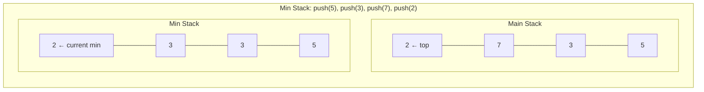

When we pop `2` from the main stack, we also pop `2` from the min stack. The new minimum is `3` — instantly available at the top of the min stack.

```typescript
class MinStack {
  private stack: number[] = [];
  private mins: number[] = [];

  push(val: number): void {
    this.stack.push(val);
    const currentMin = this.mins.length === 0
      ? val
      : Math.min(val, this.mins[this.mins.length - 1]);
    this.mins.push(currentMin);
  }

  pop(): void {
    this.stack.pop();
    this.mins.pop();
  }

  top(): number {
    return this.stack[this.stack.length - 1];
  }

  getMin(): number {
    return this.mins[this.mins.length - 1];
  }
}
```

> 🎯 **The trick:** The min stack at position `i` stores the minimum of all elements from position `0` to `i`. Since both stacks grow and shrink together, the current min is always at the top of the min stack.

---

## 6. ⏱️ Complexity Table

### Stack Operations

| Operation | Array-Based | Linked List |
|-----------|:-----------:|:-----------:|
| `push`    | **O(1)** amortized | **O(1)** |
| `pop`     | **O(1)** | **O(1)** |
| `peek`    | **O(1)** | **O(1)** |
| `isEmpty` | **O(1)** | **O(1)** |
| `search`  | O(n) | O(n) |
| **Space** | O(n) | O(n) |

### Queue Operations

| Operation | Array (shift) | Linked List | Circular Buffer |
|-----------|:------------:|:-----------:|:---------------:|
| `enqueue` | **O(1)** | **O(1)** | **O(1)** amortized |
| `dequeue` | ⚠️ **O(n)** | **O(1)** | **O(1)** |
| `peek`    | **O(1)** | **O(1)** | **O(1)** |
| `isEmpty` | **O(1)** | **O(1)** | **O(1)** |
| **Space** | O(n) | O(n) | O(n) |

### Deque Operations (Doubly Linked List)

| Operation   | Time |
|-------------|:----:|
| `pushFront` | **O(1)** |
| `pushBack`  | **O(1)** |
| `popFront`  | **O(1)** |
| `popBack`   | **O(1)** |
| `peekFront` | **O(1)** |
| `peekBack`  | **O(1)** |
| **Space**   | O(n) |

---

## 7. 🎯 LeetCode Pattern Recognition

When you see these **signal words** in a problem, reach for the corresponding data structure:

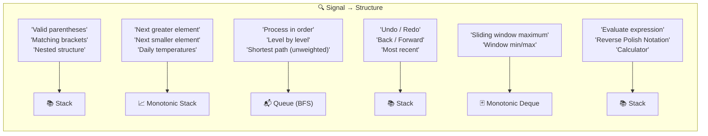

### Pattern Quick Reference

| Signal Words | Pattern | Example Problem |
|-------------|---------|----------------|
| "valid", "balanced", "brackets", "parentheses" | **Stack — bracket matching** | LC 20, 32, 921 |
| "next greater", "next smaller", "temperatures" | **Monotonic Stack** | LC 496, 503, 739 |
| "level order", "shortest path", "BFS" | **Queue** | LC 102, 207, 994 |
| "evaluate", "RPN", "calculator" | **Stack — expression eval** | LC 150, 224, 227 |
| "undo", "backspace", "decode" | **Stack — simulation** | LC 844, 394 |
| "sliding window max/min" | **Monotonic Deque** | LC 239 |
| "implement queue using stacks" | **Two-stack trick** | LC 232 |
| "min/max in O(1)" | **Auxiliary stack** | LC 155 |

---

## 8. ⚠️ Common Pitfalls

### ❌ Pitfall 1: Using `Array.shift()` for Queue Dequeue

```typescript
// ❌ BAD — O(n) per dequeue
const queue: number[] = [];
queue.push(1);           // enqueue
const val = queue.shift(); // dequeue — shifts ALL elements!

// ✅ GOOD — O(1) with linked list or use an index pointer
class ProperQueue<T> {
  private items: T[] = [];
  private front = 0;

  enqueue(val: T) { this.items.push(val); }
  dequeue(): T | undefined { return this.items[this.front++]; }
  get size() { return this.items.length - this.front; }
}
```

> For LeetCode, `shift()` usually passes within time limits for small inputs, but use a proper queue for large inputs or interviews where you'll be asked about complexity.

### ❌ Pitfall 2: Popping from an Empty Stack

```typescript
// ❌ BAD — will return undefined, might cause subtle bugs
const stack: number[] = [];
const top = stack.pop(); // undefined — no error thrown!
console.log(top + 1);    // NaN — silent failure

// ✅ GOOD — always check before popping
if (stack.length > 0) {
  const top = stack.pop()!;
}
```

### ❌ Pitfall 3: Monotonic Stack vs Regular Stack

**Regular stack:** Use when you need to match pairs (brackets) or track state history (undo/redo).

**Monotonic stack:** Use when you need to find the **next/previous greater/smaller element**. The key insight is that we maintain sorted order in the stack, popping elements that violate it.

```
Regular Stack:   push anything, pop when matched
Monotonic Stack: push only if maintaining order, pop violators
```

> 🎯 **Rule of thumb:** If the problem asks about relationships between elements and their **nearest** neighbors in some direction, think monotonic stack.

### ❌ Pitfall 4: Forgetting the Stack Is Empty After Processing

```typescript
// Valid Parentheses — common bug
function isValid(s: string): boolean {
  const stack: string[] = [];
  for (const char of s) {
    if (char === "(") stack.push(char);
    else stack.pop();
  }
  // ❌ Forgetting this check!
  // Input "((" would pass without this
  return stack.length === 0; // ✅ Must verify stack is empty
}
```

### ❌ Pitfall 5: Wrong Pop Order in Expression Evaluation

```typescript
// For "6 2 /" we expect 6 / 2 = 3, NOT 2 / 6
const b = stack.pop()!; // b = 2 (popped first = second operand)
const a = stack.pop()!; // a = 6 (popped second = first operand)
return a / b;           // 6 / 2 = 3 ✅
```

---

## 9. 🔑 Key Takeaways

1. **Stack = LIFO, Queue = FIFO.** These aren't just abstract concepts — they're the reason recursion, BFS, undo systems, and expression parsers work.

2. **Restricting access is the point.** Don't think of stacks/queues as "limited arrays." The restriction *is* the feature — it guarantees order and simplifies logic.

3. **Array-based stack is perfect.** JavaScript's `push`/`pop` at the end are both O(1). No need to overcomplicate.

4. **Array-based queue is broken.** `shift()` is O(n). Use a linked list or index-based approach for proper O(1) dequeue.

5. **Monotonic stack is your secret weapon.** It solves "next greater/smaller" problems in O(n) that would otherwise be O(n²). Learn this pattern — it appears in many medium/hard problems.

6. **Min Stack pattern = parallel tracking.** Whenever you need O(1) access to an aggregate (min, max), maintain a secondary structure that updates in sync.

7. **Pattern recognition is everything.** See "brackets" → stack. See "next greater" → monotonic stack. See "level-by-level" → queue. Drilling this instinct is half the battle.

---

## 10. 📋 Practice Problems

### 🟢 Easy

| # | Problem | Key Technique |
|---|---------|--------------|
| 20 | [Valid Parentheses](https://leetcode.com/problems/valid-parentheses/) | Stack — bracket matching |
| 232 | [Implement Queue using Stacks](https://leetcode.com/problems/implement-queue-using-stacks/) | Two-stack trick |
| 155 | [Min Stack](https://leetcode.com/problems/min-stack/) | Auxiliary min stack |
| 225 | [Implement Stack using Queues](https://leetcode.com/problems/implement-stack-using-queues/) | Queue rotation |
| 844 | [Backspace String Compare](https://leetcode.com/problems/backspace-string-compare/) | Stack simulation |

### 🟡 Medium

| # | Problem | Key Technique |
|---|---------|--------------|
| 739 | [Daily Temperatures](https://leetcode.com/problems/daily-temperatures/) | Monotonic stack |
| 150 | [Evaluate Reverse Polish Notation](https://leetcode.com/problems/evaluate-reverse-polish-notation/) | Stack expression eval |
| 394 | [Decode String](https://leetcode.com/problems/decode-string/) | Nested stack |
| 503 | [Next Greater Element II](https://leetcode.com/problems/next-greater-element-ii/) | Monotonic stack + circular |
| 71 | [Simplify Path](https://leetcode.com/problems/simplify-path/) | Stack for path components |
| 735 | [Asteroid Collision](https://leetcode.com/problems/asteroid-collision/) | Stack simulation |
| 227 | [Basic Calculator II](https://leetcode.com/problems/basic-calculator-ii/) | Stack + operator precedence |

### 🔴 Hard

| # | Problem | Key Technique |
|---|---------|--------------|
| 84 | [Largest Rectangle in Histogram](https://leetcode.com/problems/largest-rectangle-in-histogram/) | Monotonic stack (classic!) |
| 239 | [Sliding Window Maximum](https://leetcode.com/problems/sliding-window-maximum/) | Monotonic deque |
| 224 | [Basic Calculator](https://leetcode.com/problems/basic-calculator/) | Stack + recursion |
| 42 | [Trapping Rain Water](https://leetcode.com/problems/trapping-rain-water/) | Monotonic stack (or two pointers) |
| 316 | [Remove Duplicate Letters](https://leetcode.com/problems/remove-duplicate-letters/) | Monotonic stack + greedy |

### Suggested Order 📖

```
Start here:          20 → 155 → 232
Monotonic stack:     739 → 496 → 503 → 84
Expression eval:     150 → 227 → 224
Stack simulation:    394 → 844 → 735
Deque:               239
```

---

> **Next Chapter →** [Chapter 4: Hash Maps & Sets](../04-hash-maps-and-sets/README.md) — O(1) lookups that make brute-force solutions elegant.
