# 🗺️ Chapter 4: Hash Maps & Hash Sets

> _"Hash maps are the duct tape of programming — they fix almost everything."_

---

## 🌍 Real-World Analogy

### Hash Map → Library Index Card Catalog

Imagine a **massive library** with thousands of books scattered across hundreds of shelves.

**Without a catalog (no hash map):**
You walk in, start at shelf 1, and scan every single book until you find "The Great Gatsby." That's **O(n)** — painful.

**With a card catalog (hash map):**
You flip to the card labeled **"The Great Gatsby"** → it says **"Shelf 14, Position 7"** → you walk straight there. **O(1)** — instant.


| Real World | Hash Map |
|---|---|
| Book title | Key |
| Card catalog lookup | Hash function |
| Shelf + position | Value |
| The entire library | The hash table (array) |

### Hash Set → Club Guest List 🎫

A **Hash Set** is like a **bouncer with a guest list** at a nightclub:

- Someone walks up: _"Is **Alex** on the list?"_
- Bouncer checks instantly: ✅ **Yes** → come in, or ❌ **No** → go away
- No shelf number, no extra info — just **"are you in or not?"**

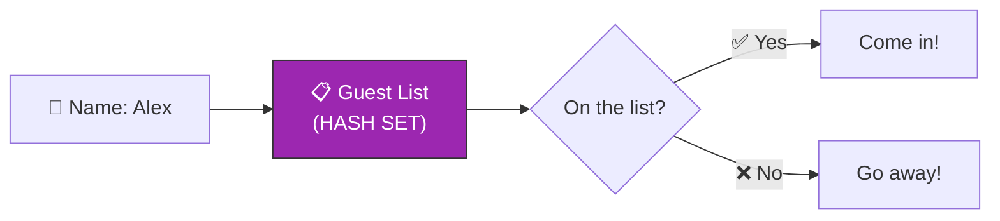

> **Hash Map** = key → value (dictionary)  
> **Hash Set** = just keys, no values (membership check)

---

## 📝 What & Why

### What Is Hashing?

**Hashing** is the process of converting **any key** (string, number, object) into a **fixed-size integer** (an array index) using a **hash function**.

```
"hello" → hash("hello") → 4923871 → 4923871 % 16 → index 7
```

The key insight: instead of *searching* for where to store data, we **compute** exactly where it goes.

### Why Hash Maps Are the #1 Interview Data Structure

| Without Hash Map | With Hash Map |
|---|---|
| "Does this element exist?" → scan everything → **O(n)** | "Does this element exist?" → one lookup → **O(1)** |
| "Find the pair that sums to target" → nested loops → **O(n²)** | "Find the pair that sums to target" → single pass → **O(n)** |
| "Count occurrences" → sort + scan → **O(n log n)** | "Count occurrences" → single pass → **O(n)** |

### 💡 The "Two Sum Revelation"

This is the moment every beginner becomes intermediate:

> **Brute force brain:** "For each number, check every other number."  
> **Hash map brain:** "For each number, check if the complement already exists in my map."

That single shift — **from searching to looking up** — solves hundreds of LeetCode problems.

### Real-World Uses

| Application | How Hash Maps Help |
|---|---|
| 🗄️ **Databases** | Index lookups, JOIN operations |
| ⚡ **Caches** | Redis, Memcached — store computed results by key |
| 🌐 **Routers** | Map URL paths to handler functions |
| 📝 **Spell Checkers** | "Is this word in the dictionary?" — Set lookup |
| 🔐 **Password Storage** | Hash password → store hash (one-way) |
| 🧬 **DNA Analysis** | Count nucleotide frequencies |

---

## ⚙️ How It Works — Under the Hood

### Step 1: The Hash Function

A hash function takes a key and returns an integer index:

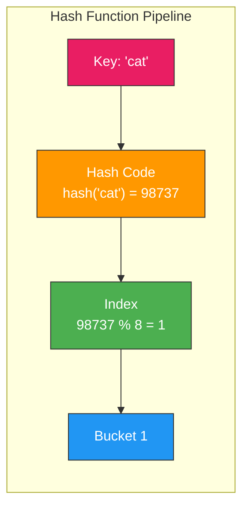

**Properties of a good hash function:**
- ⚡ **Fast** to compute
- 🎯 **Uniform distribution** — spreads keys evenly across buckets
- 🔀 **Deterministic** — same key always produces same hash
- 📊 **Minimizes collisions** — different keys rarely map to same index

### Step 2: Collision Handling

**Collision** = two different keys hash to the **same index**. This is inevitable — you're mapping infinite possible keys to a finite array.

#### Strategy 1: Chaining (Linked Lists at Each Bucket)

Each bucket holds a **linked list** of all entries that hash to that index:

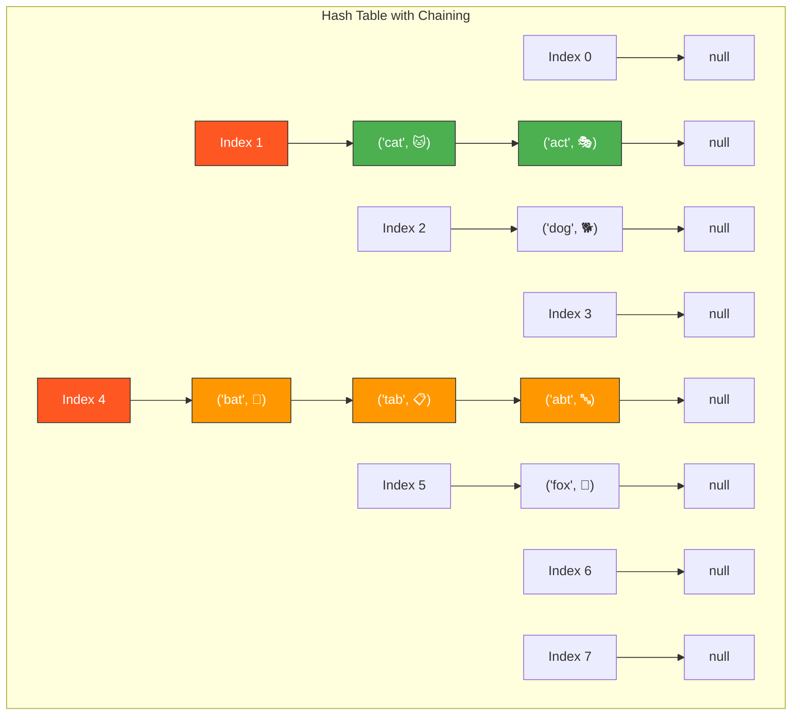

> `'cat'` and `'act'` both hash to index 1 — they form a chain.  
> `'bat'`, `'tab'`, and `'abt'` all hash to index 4 — longer chain.

**Lookup process:**
1. Hash the key → get index
2. Go to that bucket
3. Walk the linked list, comparing keys, until you find a match

#### Strategy 2: Open Addressing (Linear Probing)

If a bucket is occupied, **slide to the next empty slot**:

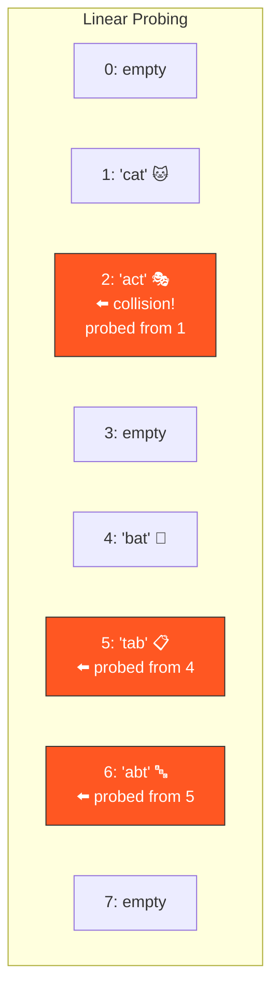

> `'act'` hashes to 1, but `'cat'` is already there → probe to 2 (empty!) → store at 2.

| | Chaining | Open Addressing |
|---|---|---|
| **Memory** | Extra pointers (linked list nodes) | No extra pointers |
| **Cache** | Poor (nodes scattered in memory) | Great (contiguous array) |
| **Load Factor** | Can exceed 1.0 | Must stay below ~0.7 |
| **Implementation** | Simpler | Trickier (deletion is hard) |
| **Used by** | Java HashMap | Python dict |

### Step 3: Load Factor & Rehashing

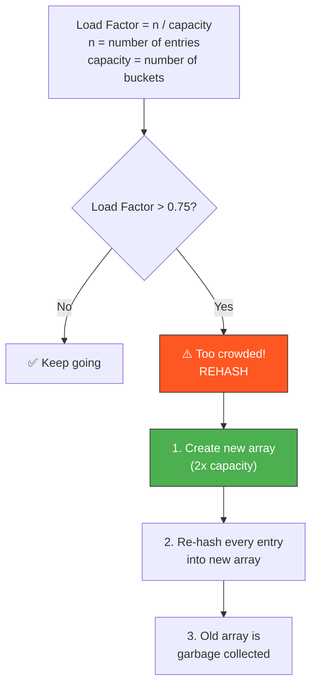

**Example:**
- Capacity = 8, entries = 6 → load factor = 6/8 = **0.75** → ⚠️ rehash!
- New capacity = 16, re-insert all 6 entries
- This is why insert is **amortized O(1)** — most inserts are O(1), but occasionally one triggers O(n) rehashing

### Why O(1) Is "Amortized"

| Scenario | Time |
|---|---|
| **Best/Average case** | O(1) — hash, go to index, done |
| **Worst case (bad hash function)** | O(n) — everything hashes to same bucket, becomes a linked list |
| **Worst case (rehashing)** | O(n) — must re-insert everything into bigger array |

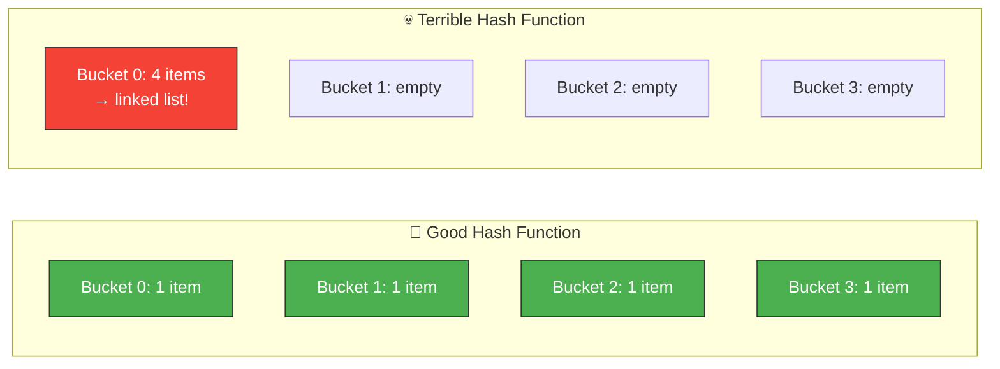

> With a **good hash function** and proper load factor, collisions are rare and O(1) holds in practice.

---

## 💻 TypeScript Implementation

### Building a Hash Map from Scratch (Chaining)

```typescript
class SimpleHashMap<K, V> {
  private buckets: Array<Array<[K, V]>>;
  private _size: number = 0;
  private capacity: number;
  private readonly LOAD_FACTOR_THRESHOLD = 0.75;

  constructor(capacity: number = 16) {
    this.capacity = capacity;
    this.buckets = new Array(capacity).fill(null).map(() => []);
  }

  private hash(key: K): number {
    const str = String(key);
    let hash = 0;
    for (let i = 0; i < str.length; i++) {
      hash = (hash * 31 + str.charCodeAt(i)) | 0; // |0 keeps it 32-bit integer
    }
    return Math.abs(hash) % this.capacity;
  }

  set(key: K, value: V): void {
    const index = this.hash(key);
    const bucket = this.buckets[index];

    for (let i = 0; i < bucket.length; i++) {
      if (bucket[i][0] === key) {
        bucket[i][1] = value; // update existing
        return;
      }
    }

    bucket.push([key, value]); // insert new
    this._size++;

    if (this._size / this.capacity > this.LOAD_FACTOR_THRESHOLD) {
      this.rehash();
    }
  }

  get(key: K): V | undefined {
    const index = this.hash(key);
    const bucket = this.buckets[index];

    for (const [k, v] of bucket) {
      if (k === key) return v;
    }
    return undefined;
  }

  has(key: K): boolean {
    return this.get(key) !== undefined;
  }

  delete(key: K): boolean {
    const index = this.hash(key);
    const bucket = this.buckets[index];

    for (let i = 0; i < bucket.length; i++) {
      if (bucket[i][0] === key) {
        bucket.splice(i, 1);
        this._size--;
        return true;
      }
    }
    return false;
  }

  get size(): number {
    return this._size;
  }

  private rehash(): void {
    const oldBuckets = this.buckets;
    this.capacity *= 2;
    this.buckets = new Array(this.capacity).fill(null).map(() => []);
    this._size = 0;

    for (const bucket of oldBuckets) {
      for (const [key, value] of bucket) {
        this.set(key, value);
      }
    }
  }
}
```

### Built-in: `Map` vs `Object` vs `Set`

#### When to Use Which?

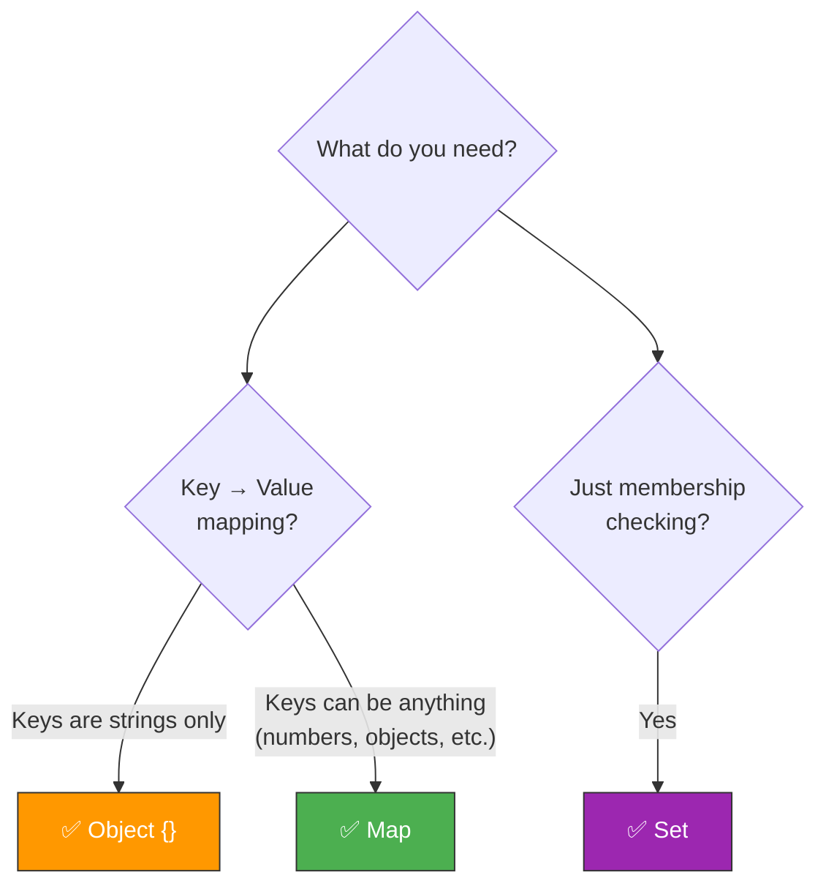

#### Comparison Table

| Feature | `Object {}` | `Map` | `Set` |
|---|---|---|---|
| **Key types** | Strings & Symbols only | Any type (objects, numbers, etc.) | N/A (stores values) |
| **Order** | Not guaranteed (mostly insertion) | ✅ Insertion order guaranteed | ✅ Insertion order guaranteed |
| **Size** | `Object.keys(obj).length` | `.size` property | `.size` property |
| **Iteration** | `for...in` or `Object.entries()` | `for...of`, `.forEach()` | `for...of`, `.forEach()` |
| **Performance** | Slower for frequent add/delete | ✅ Optimized for frequent add/delete | ✅ Optimized |
| **Default keys** | Has prototype keys (toString, etc.) | ❌ No default keys | N/A |
| **JSON** | ✅ `JSON.stringify()` works | ❌ Doesn't serialize to JSON | ❌ Doesn't serialize to JSON |
| **Best for** | Config objects, simple records | Dynamic key-value stores, LeetCode | Unique collections, dedup |

### 🗺️ Map — Full API

```typescript
// ── Creating ──
const map = new Map<string, number>();
const fromEntries = new Map([["a", 1], ["b", 2], ["c", 3]]);

// ── Setting & Getting ──
map.set("apple", 5);          // set key-value pair
map.set("banana", 3);
map.get("apple");              // 5
map.get("missing");            // undefined

// ── Checking ──
map.has("apple");              // true
map.size;                      // 2

// ── Deleting ──
map.delete("apple");           // true (returns whether key existed)
map.clear();                   // removes all entries

// ── Iterating ──
map.forEach((value, key) => console.log(`${key}: ${value}`));
for (const [key, value] of map) { /* ... */ }
for (const key of map.keys()) { /* ... */ }
for (const value of map.values()) { /* ... */ }
for (const [key, value] of map.entries()) { /* ... */ }

// ── Chaining ──
map.set("a", 1).set("b", 2).set("c", 3); // .set() returns the map
```

### 🎯 Set — Full API

```typescript
// ── Creating ──
const set = new Set<number>();
const fromArray = new Set([1, 2, 3, 3, 3]); // {1, 2, 3} — duplicates removed!

// ── Adding & Checking ──
set.add(42);                   // add value
set.add(42);                   // no-op, already exists
set.has(42);                   // true
set.size;                      // 1

// ── Deleting ──
set.delete(42);                // true
set.clear();                   // removes all

// ── Iterating ──
set.forEach(value => console.log(value));
for (const value of set) { /* ... */ }

// ── Common Patterns ──
const unique = [...new Set([1, 2, 2, 3, 3])];    // [1, 2, 3] — dedup an array
const intersection = [...setA].filter(x => setB.has(x));
const union = new Set([...setA, ...setB]);
const difference = [...setA].filter(x => !setB.has(x));
```

### 🔒 WeakMap & WeakSet (Brief Mention)

| | `Map` / `Set` | `WeakMap` / `WeakSet` |
|---|---|---|
| **Keys** | Any type | Objects only |
| **Garbage collection** | Keys kept alive | Keys can be garbage collected |
| **Iterable** | ✅ Yes | ❌ No |
| **Use case** | General purpose | Caching metadata on objects without memory leaks |

---

## 🧩 Essential Hash Map Techniques for LeetCode

### 1️⃣ Two Sum Pattern — The Classic

> **"For each element, ask: does my complement already exist in the map?"**

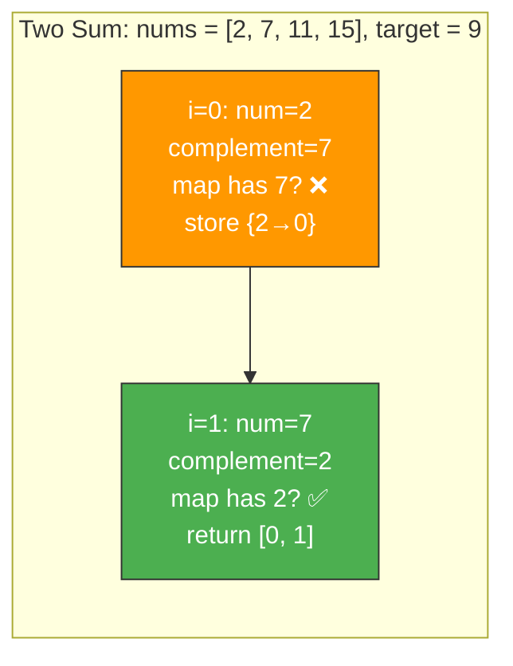

**Brute Force O(n²) vs Hash Map O(n):**

```typescript
// ❌ Brute Force — O(n²) time, O(1) space
function twoSumBrute(nums: number[], target: number): number[] {
  for (let i = 0; i < nums.length; i++) {
    for (let j = i + 1; j < nums.length; j++) {
      if (nums[i] + nums[j] === target) return [i, j];
    }
  }
  return [];
}

// ✅ Hash Map — O(n) time, O(n) space
function twoSum(nums: number[], target: number): number[] {
  const map = new Map<number, number>(); // value → index

  for (let i = 0; i < nums.length; i++) {
    const complement = target - nums[i];
    if (map.has(complement)) {
      return [map.get(complement)!, i];
    }
    map.set(nums[i], i);
  }
  return [];
}
```

### 2️⃣ Frequency Counter Pattern

> **"Count how many times each element appears."**

Used in: anagrams, majority element, top K frequent, character counts.

```typescript
function frequencyCounter(arr: number[]): Map<number, number> {
  const freq = new Map<number, number>();
  for (const num of arr) {
    freq.set(num, (freq.get(num) ?? 0) + 1);
  }
  return freq;
}

// Example: Is Valid Anagram
function isAnagram(s: string, t: string): boolean {
  if (s.length !== t.length) return false;
  
  const freq = new Map<string, number>();
  for (const char of s) freq.set(char, (freq.get(char) ?? 0) + 1);
  for (const char of t) {
    const count = freq.get(char);
    if (!count) return false;
    freq.set(char, count - 1);
  }
  return true;
}
```

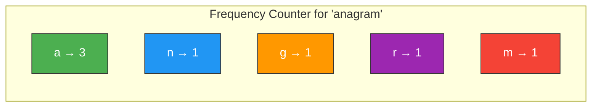

### 3️⃣ Grouping Pattern

> **"Group elements that share a common property."**

```typescript
// Group Anagrams — group words by their sorted characters
function groupAnagrams(strs: string[]): string[][] {
  const groups = new Map<string, string[]>();
  
  for (const str of strs) {
    const key = str.split("").sort().join(""); // "eat" → "aet"
    if (!groups.has(key)) groups.set(key, []);
    groups.get(key)!.push(str);
  }
  
  return [...groups.values()];
}
// groupAnagrams(["eat","tea","tan","ate","nat","bat"])
// → [["eat","tea","ate"], ["tan","nat"], ["bat"]]
```

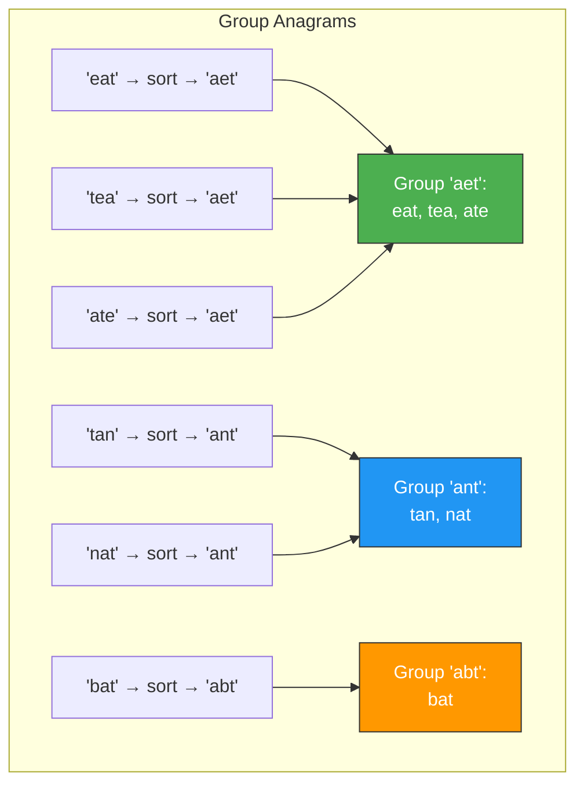

### 4️⃣ Seen Set Pattern

> **"Have I encountered this element before?"**

```typescript
// Contains Duplicate
function containsDuplicate(nums: number[]): boolean {
  const seen = new Set<number>();
  for (const num of nums) {
    if (seen.has(num)) return true;
    seen.add(num);
  }
  return false;
}

// Longest Consecutive Sequence — O(n)
function longestConsecutive(nums: number[]): number {
  const numSet = new Set(nums);
  let longest = 0;

  for (const num of numSet) {
    if (!numSet.has(num - 1)) {  // only start from sequence beginning
      let current = num;
      let streak = 1;
      while (numSet.has(current + 1)) {
        current++;
        streak++;
      }
      longest = Math.max(longest, streak);
    }
  }
  return longest;
}
```

### 5️⃣ Hash Map + Linked List Combo — LRU Cache

> **O(1) get and O(1) put — combine a Map (for fast lookup) with a doubly linked list (for fast eviction).**

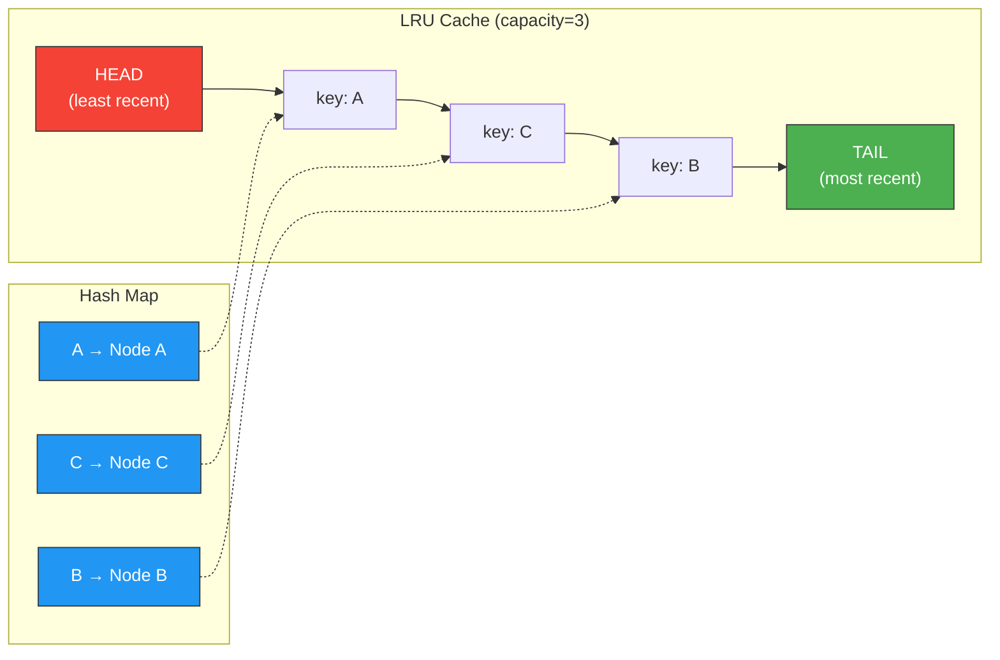

```typescript
class LRUNode {
  constructor(
    public key: number,
    public value: number,
    public prev: LRUNode | null = null,
    public next: LRUNode | null = null
  ) {}
}

class LRUCache {
  private capacity: number;
  private map = new Map<number, LRUNode>();
  private head = new LRUNode(0, 0); // dummy head
  private tail = new LRUNode(0, 0); // dummy tail

  constructor(capacity: number) {
    this.capacity = capacity;
    this.head.next = this.tail;
    this.tail.prev = this.head;
  }

  private remove(node: LRUNode): void {
    node.prev!.next = node.next;
    node.next!.prev = node.prev;
  }

  private insertAtEnd(node: LRUNode): void {
    node.prev = this.tail.prev;
    node.next = this.tail;
    this.tail.prev!.next = node;
    this.tail.prev = node;
  }

  get(key: number): number {
    if (!this.map.has(key)) return -1;
    const node = this.map.get(key)!;
    this.remove(node);
    this.insertAtEnd(node); // mark as recently used
    return node.value;
  }

  put(key: number, value: number): void {
    if (this.map.has(key)) {
      this.remove(this.map.get(key)!);
    }
    const node = new LRUNode(key, value);
    this.insertAtEnd(node);
    this.map.set(key, node);

    if (this.map.size > this.capacity) {
      const lru = this.head.next!;
      this.remove(lru);
      this.map.delete(lru.key);
    }
  }
}
```

### 6️⃣ Sliding Window + Hash Map

> **"Track character frequencies within a moving window."**

```typescript
// Minimum Window Substring (Hard)
function minWindow(s: string, t: string): string {
  const need = new Map<string, number>();
  for (const char of t) need.set(char, (need.get(char) ?? 0) + 1);

  let have = 0;
  const required = need.size;
  const window = new Map<string, number>();
  let result = "";
  let resultLen = Infinity;
  let left = 0;

  for (let right = 0; right < s.length; right++) {
    const char = s[right];
    window.set(char, (window.get(char) ?? 0) + 1);

    if (need.has(char) && window.get(char) === need.get(char)) {
      have++;
    }

    while (have === required) {
      if (right - left + 1 < resultLen) {
        result = s.slice(left, right + 1);
        resultLen = right - left + 1;
      }
      const leftChar = s[left];
      window.set(leftChar, window.get(leftChar)! - 1);
      if (need.has(leftChar) && window.get(leftChar)! < need.get(leftChar)!) {
        have--;
      }
      left++;
    }
  }

  return result;
}
```

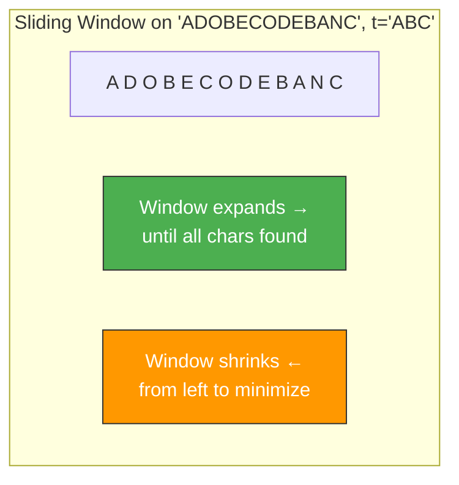

---

## ⏱️ Complexity Table

### Map Operations

| Operation | Average | Worst Case |
|---|---|---|
| `map.set(key, value)` | **O(1)** | O(n) — rehashing |
| `map.get(key)` | **O(1)** | O(n) — all keys collide |
| `map.has(key)` | **O(1)** | O(n) |
| `map.delete(key)` | **O(1)** | O(n) |
| Iteration | **O(n)** | O(n) |
| **Space** | **O(n)** | O(n) |

### Set Operations

| Operation | Average | Worst Case |
|---|---|---|
| `set.add(value)` | **O(1)** | O(n) |
| `set.has(value)` | **O(1)** | O(n) |
| `set.delete(value)` | **O(1)** | O(n) |
| Iteration | **O(n)** | O(n) |
| **Space** | **O(n)** | O(n) |

### Object (as Hash Map)

| Operation | Average | Worst Case |
|---|---|---|
| `obj[key] = value` | **O(1)** | O(n) |
| `obj[key]` | **O(1)** | O(n) |
| `key in obj` | **O(1)** | O(n) |
| `delete obj[key]` | **O(1)** | O(n) |
| `Object.keys(obj)` | **O(n)** | O(n) |

---

## 🎯 LeetCode Pattern Recognition — Signal Words

Use this cheat sheet when reading a problem:

| 🔍 Signal in Problem Statement | 🗺️ Data Structure | 🧩 Pattern |
|---|---|---|
| "Find if two elements sum to..." | Hash Map | Two Sum (complement lookup) |
| "Count frequency / occurrences of..." | Hash Map | Frequency Counter |
| "Find duplicates" or "contains duplicate" | Hash Set | Seen Set |
| "Group elements by property" | Hash Map (key → array) | Grouping |
| "O(1) lookup needed" | Hash Map / Set | Direct lookup |
| "Design a cache" | Hash Map + Doubly Linked List | LRU Cache |
| "Find longest substring without repeating" | Hash Map/Set + Sliding Window | Window tracking |
| "Subarray sum equals K" | Hash Map (prefix sum → count) | Prefix Sum + Map |
| "Check if anagram / permutation" | Hash Map | Frequency Counter |
| "Intersection / union of arrays" | Hash Set | Set Operations |

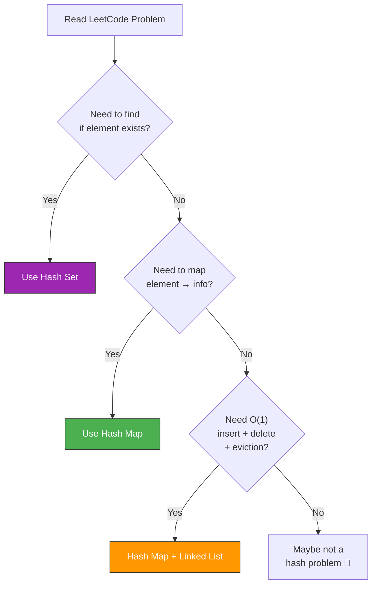

---

## ⚠️ Common Pitfalls

### 1. 🚫 Using Object Instead of Map for Non-String Keys

```typescript
// ❌ WRONG — Object converts keys to strings
const obj: any = {};
obj[1] = "one";
obj["1"] = "string one";
console.log(obj[1]); // "string one" — keys collided!

// ✅ RIGHT — Map preserves key types
const map = new Map<number | string, string>();
map.set(1, "one");
map.set("1", "string one");
console.log(map.get(1));   // "one"    — separate entries!
console.log(map.get("1")); // "string one"
```

### 2. 🚫 Forgetting Map Preserves Insertion Order

```typescript
const map = new Map();
map.set("c", 3);
map.set("a", 1);
map.set("b", 2);

// Iteration order is c → a → b (insertion order), NOT sorted!
for (const [key] of map) console.log(key); // "c", "a", "b"
```

### 3. 🚫 Not Handling Missing Keys

```typescript
// ❌ DANGEROUS — .get() returns undefined for missing keys
const map = new Map<string, number[]>();
map.get("missing")!.push(1); // 💥 TypeError: Cannot read property 'push' of undefined

// ✅ SAFE — check first, or use a default
if (!map.has("key")) map.set("key", []);
map.get("key")!.push(1);

// ✅ EVEN BETTER — one-liner pattern
const arr = map.get("key") ?? [];
arr.push(1);
map.set("key", arr);
```

### 4. 🚫 Assuming Hash Map is Always O(1)

```typescript
// In theory, all keys could hash to the same bucket
// This turns the hash map into a linked list → O(n) lookup
// In practice, JavaScript's Map uses a well-designed hash function
// so this almost never happens — but mention it in interviews!
```

### 5. 🚫 Using Objects as Map Keys Without Understanding Reference Equality

```typescript
const map = new Map();
map.set({ id: 1 }, "first");
map.set({ id: 1 }, "second");
console.log(map.size); // 2! — different object references = different keys

const obj = { id: 1 };
map.set(obj, "actual");
console.log(map.get(obj)); // "actual" — same reference works
console.log(map.get({ id: 1 })); // undefined! — different reference
```

---

## 🔑 Key Takeaways

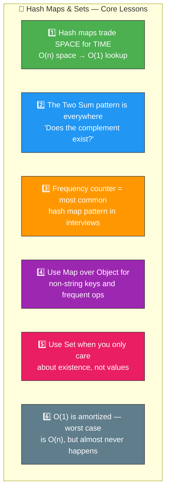

1. **Hash maps are the #1 tool for turning O(n) or O(n²) solutions into O(n) or O(1)**
2. **When stuck on a LeetCode problem, ask:** _"What if I stored what I've seen in a hash map?"_
3. **Frequency counting** solves anagrams, top K, majority element, and dozens more
4. **Set for uniqueness**, **Map for associations** — pick the right one
5. **Always use `Map` over `Object`** in interviews (cleaner API, any key type, `.size`)
6. **Understand collisions and load factor** — interviewers love asking "what happens under the hood?"

---

## 📋 Practice Problems

### 🟢 Easy

| # | Problem | Key Pattern |
|---|---|---|
| 1 | [Two Sum](https://leetcode.com/problems/two-sum/) | Hash Map — complement lookup |
| 242 | [Valid Anagram](https://leetcode.com/problems/valid-anagram/) | Frequency Counter |
| 217 | [Contains Duplicate](https://leetcode.com/problems/contains-duplicate/) | Hash Set — seen set |
| 383 | [Ransom Note](https://leetcode.com/problems/ransom-note/) | Frequency Counter |
| 349 | [Intersection of Two Arrays](https://leetcode.com/problems/intersection-of-two-arrays/) | Hash Set — set intersection |

### 🟡 Medium

| # | Problem | Key Pattern |
|---|---|---|
| 49 | [Group Anagrams](https://leetcode.com/problems/group-anagrams/) | Grouping by sorted key |
| 347 | [Top K Frequent Elements](https://leetcode.com/problems/top-k-frequent-elements/) | Frequency Counter + Bucket Sort |
| 128 | [Longest Consecutive Sequence](https://leetcode.com/problems/longest-consecutive-sequence/) | Hash Set — sequence start detection |
| 560 | [Subarray Sum Equals K](https://leetcode.com/problems/subarray-sum-equals-k/) | Prefix Sum + Hash Map |

### 🔴 Hard

| # | Problem | Key Pattern |
|---|---|---|
| 146 | [LRU Cache](https://leetcode.com/problems/lru-cache/) | Hash Map + Doubly Linked List |
| 76 | [Minimum Window Substring](https://leetcode.com/problems/minimum-window-substring/) | Sliding Window + Hash Map |

---

> **Next Chapter:** [Trees →](../05-trees/README.md)
