# 🌲 Chapter 5: Trees

> *"Trees are the backbone of computer science — master them, and half of LeetCode falls into place."*

---

## 🌍 Real-World Analogy

**Company Org Chart** — The CEO sits at the top (root). Below them, VPs branch out (children). Each VP manages directors, who manage teams. Individual contributors at the bottom have no one reporting to them — they're **leaves**.

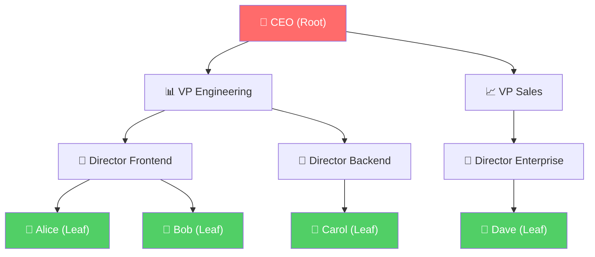

**Family Tree** — Grandparents at the top, parents in the middle, children at the bottom. Each person can have multiple children but only one parent — exactly how a tree works.

**File System** — Your computer's folder structure is a tree. `C:\` is the root, folders are internal nodes, and files are leaves.

```
C:\
├── Users\
│   ├── Documents\
│   │   ├── resume.pdf     ← leaf
│   │   └── notes.txt      ← leaf
│   └── Pictures\
│       └── photo.jpg      ← leaf
└── Program Files\
    └── VSCode\
        └── code.exe       ← leaf
```

**The pattern**: one starting point (root), branching hierarchy, no cycles, every node reachable by exactly one path from the root.

---

## 📝 What & Why

### What Is a Tree?

A **tree** is a **hierarchical, non-linear data structure** consisting of **nodes** connected by **edges**. Unlike arrays or linked lists (linear), trees branch out — one node can connect to multiple nodes below it.

### Key Terminology

| Term | Definition |
|------|-----------|
| **Node** | A single element in the tree containing data |
| **Edge** | Connection between two nodes (parent → child) |
| **Root** | The topmost node — has no parent |
| **Parent** | A node that has children below it |
| **Child** | A node connected below a parent |
| **Leaf** | A node with **no children** (bottom of the tree) |
| **Sibling** | Nodes sharing the same parent |
| **Subtree** | Any node and all its descendants form a subtree |
| **Height** | Longest path from a node **down** to a leaf (root's height = tree height) |
| **Depth** | Distance from the **root down** to a node (root depth = 0) |
| **Level** | Same as depth (level 0 = root) |
| **Degree** | Number of children a node has |

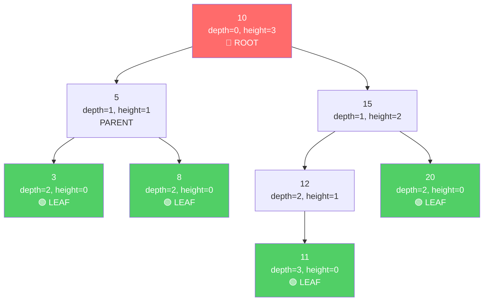

### Why Do Trees Exist?

| Problem | Why Trees Help |
|---------|---------------|
| Hierarchical data | Trees naturally represent parent-child relationships |
| Fast search | Balanced BSTs give **O(log n)** search — way faster than O(n) in a list |
| Ordered data | BST inorder traversal gives sorted output for free |
| Fast insert/delete | O(log n) when balanced, vs O(n) for sorted arrays |
| Decision making | Decision trees branch on conditions |
| Parsing | HTML/XML DOM, JSON, abstract syntax trees |

### Real-World Uses

- 🌐 **DOM** — Every webpage is a tree of HTML elements
- 📁 **File Systems** — Folders and files form a tree
- 🗄️ **Databases** — B-trees and B+ trees power indexes for fast lookups
- 🤖 **AI/ML** — Decision trees, random forests
- 🗜️ **Compression** — Huffman coding uses binary trees
- 📦 **JSON/XML** — Parsed into tree structures

---

## ⚙️ How It Works

### Binary Tree vs Binary Search Tree (BST)

A **Binary Tree** is any tree where each node has **at most 2 children** (left and right). No ordering rules.

A **Binary Search Tree (BST)** adds the **ordering property**:
> For every node: **all values in left subtree < node < all values in right subtree**

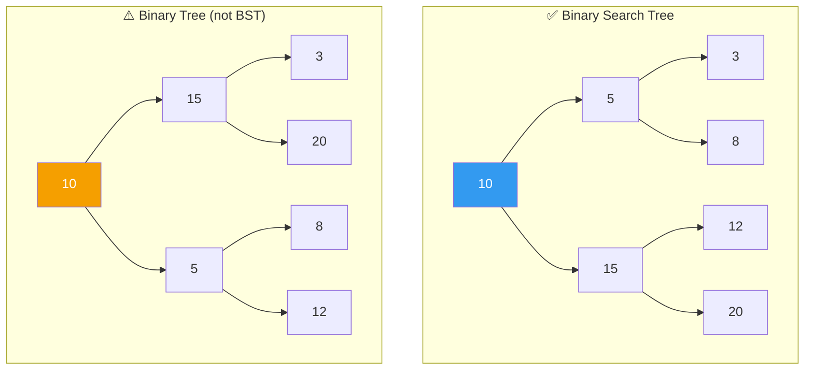

The BST on the left follows the rule: `3 < 5 < 8 < 10 < 12 < 15 < 20`. The binary tree on the right has no ordering — 15 is left of 10, 3 is under 15. Still a valid binary tree, just not a BST.

---

### 🔽 BST Insertion: Where Does 7 Go?

Starting BST: `[10, 5, 15, 3, 8]` — now inserting **7**.

**Algorithm**: Start at root. If value < node, go left. If value > node, go right. When you hit `null`, insert there.

```
Insert 7:
  10 → 7 < 10, go LEFT
   5 → 7 > 5, go RIGHT  
   8 → 7 < 8, go LEFT
   null → INSERT 7 here!
```

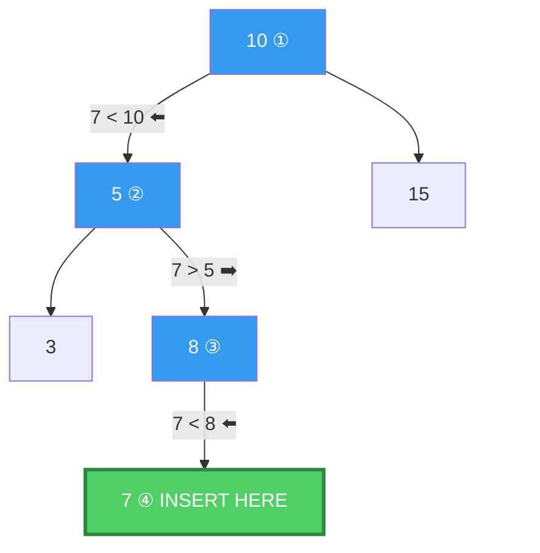

---

### 🔍 BST Search: Finding 8

**Algorithm**: Same as insertion — compare and go left/right until found or `null`.

```
Search for 8:
  10 → 8 < 10, go LEFT     ✓ still searching
   5 → 8 > 5, go RIGHT     ✓ still searching
   8 → 8 === 8, FOUND!     🎯
```

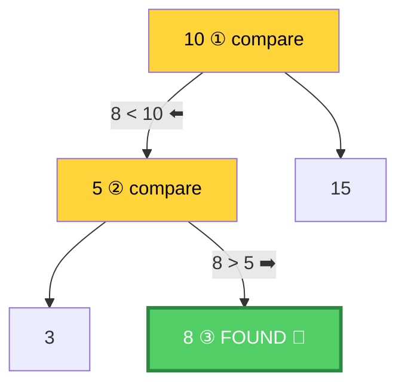

**If the value doesn't exist**, we'd eventually hit `null` → return `null`/`false`.

---

### 🗑️ BST Deletion: 3 Cases

Deleting from a BST has three cases, each progressively more complex:

#### Case 1: Deleting a Leaf Node (no children)

Delete **3** — it has no children. Simply remove it.

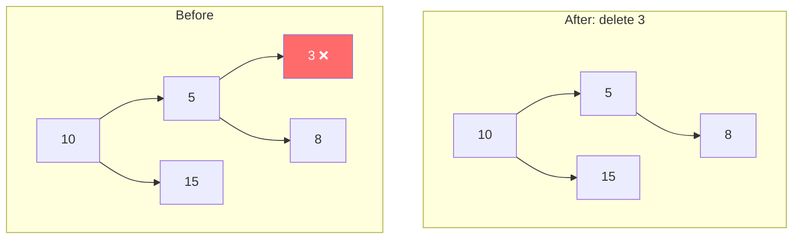

#### Case 2: Deleting a Node with One Child

Delete **5** — it has one child (8). Replace 5 with its child.

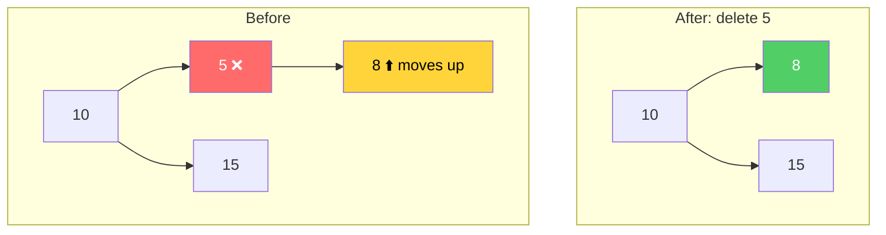

#### Case 3: Deleting a Node with Two Children

Delete **10** (the root!) — it has two children. Find the **inorder successor** (smallest value in right subtree = 12), replace 10 with 12, then delete the original 12.

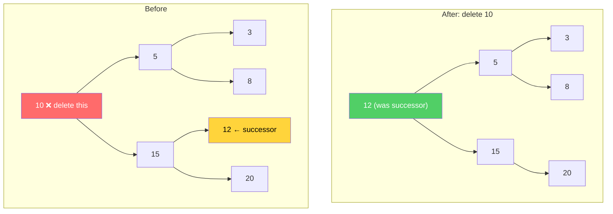

> 💡 **Why inorder successor?** It's the smallest value larger than the deleted node — replacing with it preserves the BST property.

---

### ⚖️ Balanced vs Unbalanced

A tree is **balanced** when left and right subtrees of every node differ in height by at most 1.

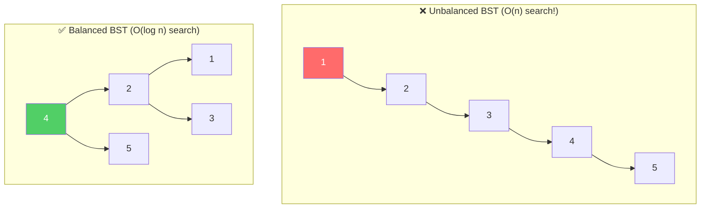

| | Balanced | Unbalanced (degenerate) |
|---|---------|------------------------|
| Shape | Bushy, spread out | Looks like a linked list |
| Height | O(log n) | O(n) |
| Search | O(log n) | O(n) |
| When it happens | Deliberate balancing (AVL, Red-Black) | Inserting sorted data into plain BST |

> ⚠️ **This is why** inserting `[1, 2, 3, 4, 5]` into a plain BST gives you a linked list, not a tree. You need self-balancing trees (AVL, Red-Black) for guaranteed O(log n).

---

## 🌿 Tree Traversals — The Most Important Section for Interviews

There are **4 traversals** you must know cold. The first three are **DFS** (depth-first), the last is **BFS** (breadth-first).

**Reference tree for all examples:**

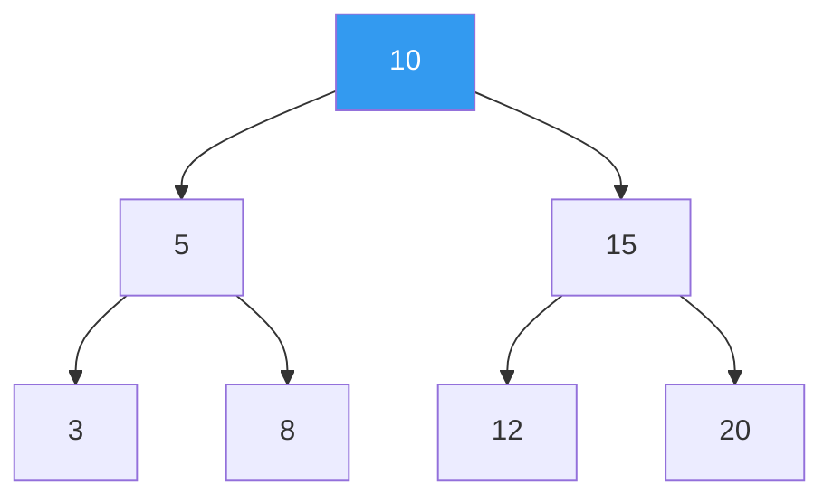

> 🧠 **Mnemonic**: The name tells you where the **root** is processed:
> - **In**order → root is **in** the middle (Left → **Root** → Right)
> - **Pre**order → root is **first** / before (***Root** → Left → Right)
> - **Post**order → root is **last** / after (Left → Right → **Root**)

---

### 1️⃣ Inorder Traversal (Left → Root → Right)

**Result**: `3, 5, 8, 10, 12, 15, 20` — **sorted order for BST!** 🎯

**Use case**: Get sorted elements from BST, validate BST, find kth smallest.

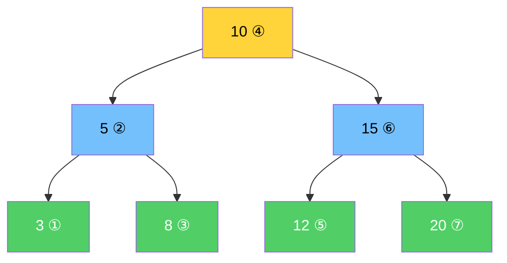

**Recursive:**

```typescript
function inorderRecursive(node: TreeNode | null, result: number[] = []): number[] {
  if (!node) return result;
  inorderRecursive(node.left, result);
  result.push(node.val);
  inorderRecursive(node.right, result);
  return result;
}
```

**Iterative (using stack):**

```typescript
function inorderIterative(root: TreeNode | null): number[] {
  const result: number[] = [];
  const stack: TreeNode[] = [];
  let current = root;

  while (current || stack.length > 0) {
    while (current) {
      stack.push(current);
      current = current.left;
    }
    current = stack.pop()!;
    result.push(current.val);
    current = current.right;
  }

  return result;
}
```

> 💡 **Iterative inorder pattern**: Push all lefts onto stack → pop & process → go right → repeat. This is asked in interviews!

---

### 2️⃣ Preorder Traversal (Root → Left → Right)

**Result**: `10, 5, 3, 8, 15, 12, 20`

**Use case**: Copy/clone a tree, serialize a tree, create prefix expression.

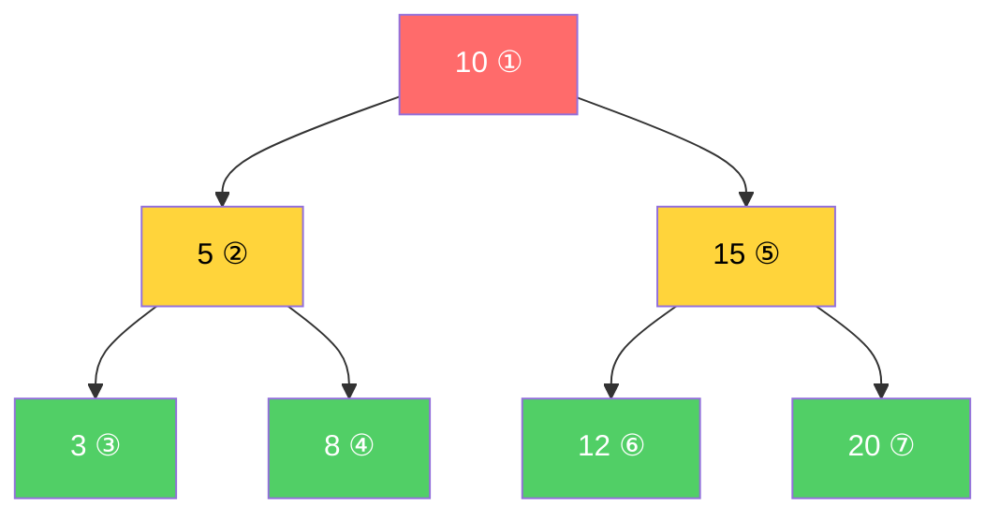

**Recursive:**

```typescript
function preorderRecursive(node: TreeNode | null, result: number[] = []): number[] {
  if (!node) return result;
  result.push(node.val);
  preorderRecursive(node.left, result);
  preorderRecursive(node.right, result);
  return result;
}
```

**Iterative (using stack):**

```typescript
function preorderIterative(root: TreeNode | null): number[] {
  if (!root) return [];
  const result: number[] = [];
  const stack: TreeNode[] = [root];

  while (stack.length > 0) {
    const node = stack.pop()!;
    result.push(node.val);
    if (node.right) stack.push(node.right); // right first so left is processed first
    if (node.left) stack.push(node.left);
  }

  return result;
}
```

---

### 3️⃣ Postorder Traversal (Left → Right → Root)

**Result**: `3, 8, 5, 12, 20, 15, 10`

**Use case**: Delete a tree (children before parent), evaluate expression tree, calculate directory sizes.

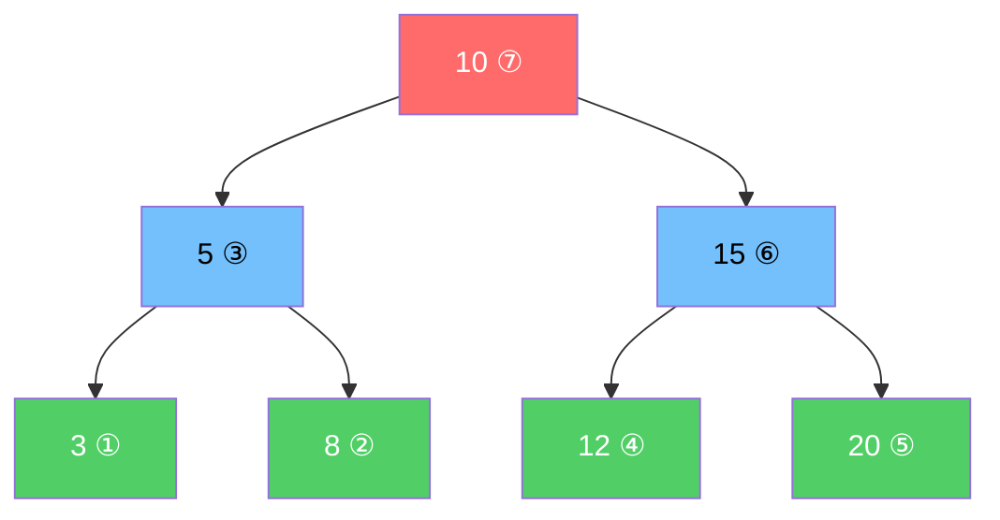

**Recursive:**

```typescript
function postorderRecursive(node: TreeNode | null, result: number[] = []): number[] {
  if (!node) return result;
  postorderRecursive(node.left, result);
  postorderRecursive(node.right, result);
  result.push(node.val);
  return result;
}
```

**Iterative (using two stacks):**

```typescript
function postorderIterative(root: TreeNode | null): number[] {
  if (!root) return [];
  const result: number[] = [];
  const stack: TreeNode[] = [root];

  while (stack.length > 0) {
    const node = stack.pop()!;
    result.unshift(node.val); // prepend instead of append
    if (node.left) stack.push(node.left);
    if (node.right) stack.push(node.right);
  }

  return result;
}
```

> 💡 **Trick**: Postorder iterative = modified preorder (Root→Right→Left) with results reversed. Instead of reversing at the end, we use `unshift` to prepend.

---

### 4️⃣ Level-Order Traversal / BFS (Layer by Layer)

**Result**: `[10], [5, 15], [3, 8, 12, 20]`

**Use case**: Print tree level by level, find minimum depth, right side view, zigzag traversal.

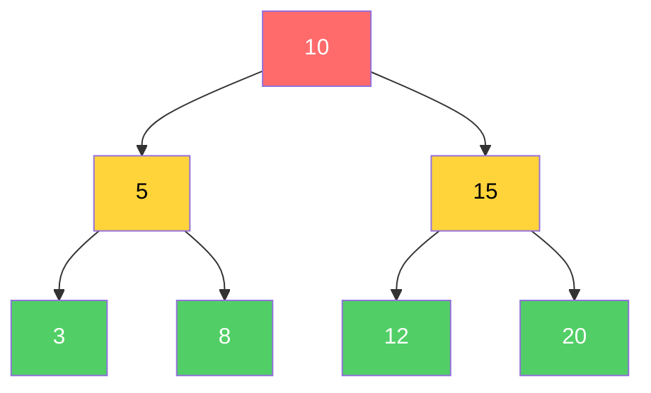

```
Level 0: 🔴 [10]
Level 1: 🟡 [5, 15]
Level 2: 🟢 [3, 8, 12, 20]
```

**Implementation (queue-based):**

```typescript
function levelOrder(root: TreeNode | null): number[][] {
  if (!root) return [];
  const result: number[][] = [];
  const queue: TreeNode[] = [root];

  while (queue.length > 0) {
    const levelSize = queue.length;
    const currentLevel: number[] = [];

    for (let i = 0; i < levelSize; i++) {
      const node = queue.shift()!;
      currentLevel.push(node.val);
      if (node.left) queue.push(node.left);
      if (node.right) queue.push(node.right);
    }

    result.push(currentLevel);
  }

  return result;
}
```

> 🎯 **Key insight**: We snapshot `queue.length` at the start of each level — that tells us exactly how many nodes belong to this level before we start adding the next level's children.

---

### 📊 Traversal Summary

| Traversal | Order | Result (example) | Key Use Case |
|-----------|-------|-------------------|-------------|
| **Inorder** | L → Root → R | 3, 5, 8, 10, 12, 15, 20 | Sorted order from BST |
| **Preorder** | Root → L → R | 10, 5, 3, 8, 15, 12, 20 | Serialize / copy tree |
| **Postorder** | L → R → Root | 3, 8, 5, 12, 20, 15, 10 | Delete tree / evaluate |
| **Level-order** | Level by level | [10], [5,15], [3,8,12,20] | BFS problems |

---

## 💻 TypeScript Implementation

### TreeNode Class

```typescript
class TreeNode {
  val: number;
  left: TreeNode | null;
  right: TreeNode | null;

  constructor(val: number, left: TreeNode | null = null, right: TreeNode | null = null) {
    this.val = val;
    this.left = left;
    this.right = right;
  }
}
```

### BST Class

```typescript
class BST {
  root: TreeNode | null = null;

  insert(val: number): void {
    this.root = this._insert(this.root, val);
  }

  private _insert(node: TreeNode | null, val: number): TreeNode {
    if (!node) return new TreeNode(val);
    if (val < node.val) node.left = this._insert(node.left, val);
    else if (val > node.val) node.right = this._insert(node.right, val);
    return node;
  }

  search(val: number): TreeNode | null {
    let current = this.root;
    while (current) {
      if (val === current.val) return current;
      current = val < current.val ? current.left : current.right;
    }
    return null;
  }

  delete(val: number): void {
    this.root = this._delete(this.root, val);
  }

  private _delete(node: TreeNode | null, val: number): TreeNode | null {
    if (!node) return null;

    if (val < node.val) {
      node.left = this._delete(node.left, val);
    } else if (val > node.val) {
      node.right = this._delete(node.right, val);
    } else {
      // Case 1 & 2: no child or one child
      if (!node.left) return node.right;
      if (!node.right) return node.left;
      // Case 3: two children — replace with inorder successor
      const successor = this._findMin(node.right);
      node.val = successor.val;
      node.right = this._delete(node.right, successor.val);
    }
    return node;
  }

  private _findMin(node: TreeNode): TreeNode {
    while (node.left) node = node.left;
    return node;
  }

  min(): number | null {
    if (!this.root) return null;
    return this._findMin(this.root).val;
  }

  max(): number | null {
    if (!this.root) return null;
    let current = this.root;
    while (current.right) current = current.right;
    return current.val;
  }

  height(node: TreeNode | null = this.root): number {
    if (!node) return -1;
    return 1 + Math.max(this.height(node.left), this.height(node.right));
  }

  countNodes(node: TreeNode | null = this.root): number {
    if (!node) return 0;
    return 1 + this.countNodes(node.left) + this.countNodes(node.right);
  }

  isValidBST(): boolean {
    return this._validate(this.root, -Infinity, Infinity);
  }

  private _validate(node: TreeNode | null, min: number, max: number): boolean {
    if (!node) return true;
    if (node.val <= min || node.val >= max) return false;
    return (
      this._validate(node.left, min, node.val) &&
      this._validate(node.right, node.val, max)
    );
  }
}
```

### All Four Traversals (Recursive + Iterative)

See the [Traversals section above](#-tree-traversals--the-most-important-section-for-interviews) for all implementations.

---

## 🧩 Essential Tree Techniques for LeetCode

### 1. DFS on Trees — The Recursive Pattern

Almost every tree DFS problem follows this template:

```typescript
function dfs(node: TreeNode | null): ReturnType {
  // 1. Base case
  if (!node) return baseValue;

  // 2. Process current node (sometimes)

  // 3. Recurse left and right
  const leftResult = dfs(node.left);
  const rightResult = dfs(node.right);

  // 4. Combine and return
  return combine(leftResult, rightResult, node.val);
}
```

**Example — Maximum Depth:**

```typescript
function maxDepth(root: TreeNode | null): number {
  if (!root) return 0;
  return 1 + Math.max(maxDepth(root.left), maxDepth(root.right));
}
```

**Example — Diameter of Binary Tree:**

```typescript
function diameterOfBinaryTree(root: TreeNode | null): number {
  let diameter = 0;

  function height(node: TreeNode | null): number {
    if (!node) return 0;
    const left = height(node.left);
    const right = height(node.right);
    diameter = Math.max(diameter, left + right); // update diameter at each node
    return 1 + Math.max(left, right);
  }

  height(root);
  return diameter;
}
```

---

### 2. BFS on Trees — Queue-Based Level Traversal

```typescript
function bfs(root: TreeNode | null): void {
  if (!root) return;
  const queue: TreeNode[] = [root];

  while (queue.length > 0) {
    const levelSize = queue.length; // snapshot current level size

    for (let i = 0; i < levelSize; i++) {
      const node = queue.shift()!;
      // process node

      if (node.left) queue.push(node.left);
      if (node.right) queue.push(node.right);
    }
    // after inner loop: one complete level has been processed
  }
}
```

**Example — Right Side View:**

```typescript
function rightSideView(root: TreeNode | null): number[] {
  if (!root) return [];
  const result: number[] = [];
  const queue: TreeNode[] = [root];

  while (queue.length > 0) {
    const levelSize = queue.length;
    for (let i = 0; i < levelSize; i++) {
      const node = queue.shift()!;
      if (i === levelSize - 1) result.push(node.val); // last node of each level
      if (node.left) queue.push(node.left);
      if (node.right) queue.push(node.right);
    }
  }

  return result;
}
```

---

### 3. Lowest Common Ancestor (LCA) — The Classic

**For a Binary Tree (not BST):**

```typescript
function lowestCommonAncestor(
  root: TreeNode | null,
  p: TreeNode,
  q: TreeNode
): TreeNode | null {
  if (!root || root === p || root === q) return root;

  const left = lowestCommonAncestor(root.left, p, q);
  const right = lowestCommonAncestor(root.right, p, q);

  if (left && right) return root; // p and q are on different sides
  return left ?? right;           // both on the same side
}
```

**For a BST** (we can use the ordering property):

```typescript
function lcaBST(root: TreeNode | null, p: TreeNode, q: TreeNode): TreeNode | null {
  if (!root) return null;
  if (p.val < root.val && q.val < root.val) return lcaBST(root.left, p, q);
  if (p.val > root.val && q.val > root.val) return lcaBST(root.right, p, q);
  return root; // split point = LCA
}
```

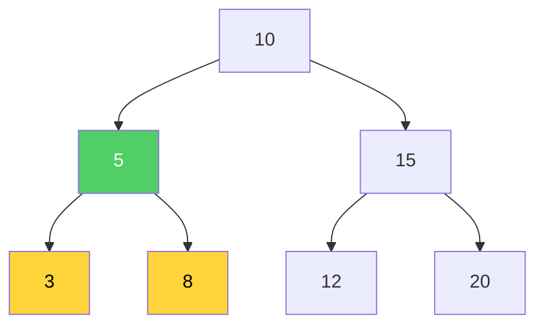

> LCA of **3** and **8** is **5** — both are in 5's subtree.

---

### 4. Path Sum Problems

**Has Path Sum (root to leaf):**

```typescript
function hasPathSum(root: TreeNode | null, targetSum: number): boolean {
  if (!root) return false;
  if (!root.left && !root.right) return root.val === targetSum;
  return (
    hasPathSum(root.left, targetSum - root.val) ||
    hasPathSum(root.right, targetSum - root.val)
  );
}
```

**Accumulating all paths:**

```typescript
function pathSum(root: TreeNode | null, targetSum: number): number[][] {
  const result: number[][] = [];

  function dfs(node: TreeNode | null, remaining: number, path: number[]): void {
    if (!node) return;
    path.push(node.val);

    if (!node.left && !node.right && remaining === node.val) {
      result.push([...path]);
    }

    dfs(node.left, remaining - node.val, path);
    dfs(node.right, remaining - node.val, path);
    path.pop(); // backtrack
  }

  dfs(root, targetSum, []);
  return result;
}
```

---

### 5. Tree Construction from Traversals

**Build tree from Preorder + Inorder:**

```typescript
function buildTree(preorder: number[], inorder: number[]): TreeNode | null {
  if (!preorder.length || !inorder.length) return null;

  const rootVal = preorder[0];
  const root = new TreeNode(rootVal);
  const mid = inorder.indexOf(rootVal);

  root.left = buildTree(preorder.slice(1, mid + 1), inorder.slice(0, mid));
  root.right = buildTree(preorder.slice(mid + 1), inorder.slice(mid + 1));

  return root;
}
```

> 💡 **How it works**: Preorder's first element is always the root. Find that root in inorder — everything left of it is the left subtree, everything right is the right subtree. Recurse.

---

### 6. Validate BST — Using Min/Max Bounds

```typescript
function isValidBST(root: TreeNode | null): boolean {
  function validate(node: TreeNode | null, min: number, max: number): boolean {
    if (!node) return true;
    if (node.val <= min || node.val >= max) return false;
    return validate(node.left, min, node.val) && validate(node.right, node.val, max);
  }
  return validate(root, -Infinity, Infinity);
}
```

> ⚠️ **Common mistake**: Only checking `node.left.val < node.val` isn't enough. A node in the left subtree must be less than ALL ancestors above it, not just its parent. The min/max bounds track this.

---

## ⏱️ Complexity Table

### BST Operations

| Operation | Balanced (avg) | Unbalanced (worst) | Notes |
|-----------|---------------|-------------------|-------|
| Search | **O(log n)** | O(n) | Degrades when unbalanced |
| Insert | **O(log n)** | O(n) | Same path as search |
| Delete | **O(log n)** | O(n) | Finding successor is O(log n) |
| Min/Max | **O(log n)** | O(n) | Follow leftmost/rightmost path |
| Space | **O(n)** | O(n) | Storing n nodes |

### Traversals

| Traversal | Time | Space | Space Notes |
|-----------|------|-------|-------------|
| Inorder | O(n) | O(h) | h = height; O(log n) balanced, O(n) worst |
| Preorder | O(n) | O(h) | Same as inorder |
| Postorder | O(n) | O(h) | Same as inorder |
| Level-order | O(n) | **O(w)** | w = max width; up to O(n/2) = O(n) for last level |

> `h` = height of tree. For balanced: h = log n. For skewed: h = n.

---

## 🎯 LeetCode Patterns — What to Reach For

| When You See... | Reach For... |
|-----------------|-------------|
| "Given the root of a binary tree..." | DFS recursion (think: base case, recurse left/right, combine) |
| "Level order traversal" / "zigzag" | BFS with queue, snapshot `queue.length` per level |
| "Validate BST" | Inorder traversal (check sorted) **or** min/max bounds recursion |
| "Lowest common ancestor" | Recursive LCA — if found on both sides, current node is LCA |
| "Maximum depth" / "diameter" / "balanced" | DFS returning values **upward** (bottom-up recursion) |
| "Path sum" / "root to leaf" | DFS passing accumulated value **downward** (top-down recursion) |
| "Serialize / deserialize tree" | Preorder traversal + null markers + queue for deserialization |
| "Kth smallest in BST" | Inorder traversal, count to k |
| "Invert binary tree" | Swap left and right at every node (DFS or BFS) |
| "Construct tree from arrays" | Preorder[0] = root, find in inorder, split, recurse |
| "Right side view" / "left side view" | BFS — take last (or first) element of each level |

### 🔀 Top-Down vs Bottom-Up DFS

```
Top-Down (passing info DOWN):         Bottom-Up (returning info UP):
┌──────────────────────┐              ┌──────────────────────┐
│ dfs(node, accum)     │              │ dfs(node): value     │
│   pass value to      │              │   get value from     │
│   children           │              │   children, combine  │
│                      │              │   and return up      │
│ Use: path sum,       │              │ Use: max depth,      │
│      depth tracking  │              │      diameter,       │
│                      │              │      height, balance │
└──────────────────────┘              └──────────────────────┘
```

---

## ⚠️ Common Pitfalls

### 1. Confusing Binary Tree with BST
A binary tree has no ordering. A BST has `left < node < right`. Many problems say "binary tree" (no ordering) — don't assume BST properties.

### 2. Forgetting Null Checks
```typescript
// ❌ Will crash on empty tree
function bad(root: TreeNode): number {
  return root.val; // root might be null!
}

// ✅ Always handle null
function good(root: TreeNode | null): number {
  if (!root) return 0;
  return root.val;
}
```

### 3. Unbalanced BST = O(n)
Inserting `[1, 2, 3, 4, 5]` into a BST creates a linked list. All operations become O(n). This is why self-balancing trees (AVL, Red-Black) exist.

### 4. Mixing Up Traversal Orders
- **In**order: Left → Root → Right (root in the **middle**)
- **Pre**order: Root → Left → Right (root **first**)
- **Post**order: Left → Right → Root (root **last**)

Remember: the prefix tells you where the ROOT goes.

### 5. Validating BST Incorrectly
```typescript
// ❌ WRONG: only checks immediate children
function wrongValidate(node: TreeNode | null): boolean {
  if (!node) return true;
  if (node.left && node.left.val >= node.val) return false;
  if (node.right && node.right.val <= node.val) return false;
  return wrongValidate(node.left) && wrongValidate(node.right);
}

// ✅ RIGHT: uses min/max bounds
function correctValidate(node: TreeNode | null, min = -Infinity, max = Infinity): boolean {
  if (!node) return true;
  if (node.val <= min || node.val >= max) return false;
  return correctValidate(node.left, min, node.val) && correctValidate(node.right, node.val, max);
}
```

### 6. Not Understanding Recursive Call Stack
Each recursive call uses stack space. A tree with height `h` uses O(h) stack frames. For a skewed tree with n nodes, that's O(n) — can cause stack overflow on very deep trees.

---

## 🔑 Key Takeaways

1. **Trees are hierarchical** — unlike arrays and linked lists, they branch. One root, no cycles, every node reachable by exactly one path.

2. **BST = Binary Tree + Ordering** — left < node < right. This gives O(log n) search, insert, and delete when balanced.

3. **Traversals are everything** — Inorder gives sorted order. Preorder serializes. Postorder deletes. Level-order goes layer by layer. Know all four cold.

4. **DFS recursion template** — Base case → recurse left → recurse right → combine. This solves 80% of tree problems.

5. **BFS uses a queue** — Snapshot `queue.length` to process one level at a time. Essential for level-order variants.

6. **Balance matters** — Unbalanced BST degrades to O(n). This is why we have AVL trees, Red-Black trees, etc.

7. **Validate BST with bounds** — Don't just check parent-child. Pass min/max bounds through the recursion.

8. **LCA pattern** — If target found on both sides, current node is the answer. One of the most common interview questions.

9. **Trees combine everything** — Recursion, stacks, queues, DFS, BFS. If you're comfortable with trees, you're comfortable with most data structures.

---

## 📋 Practice Problems

### 🟢 Easy

| # | Problem | Key Technique |
|---|---------|--------------|
| 104 | [Maximum Depth of Binary Tree](https://leetcode.com/problems/maximum-depth-of-binary-tree/) | DFS bottom-up recursion |
| 226 | [Invert Binary Tree](https://leetcode.com/problems/invert-binary-tree/) | DFS swap left/right |
| 100 | [Same Tree](https://leetcode.com/problems/same-tree/) | DFS compare both trees simultaneously |
| 101 | [Symmetric Tree](https://leetcode.com/problems/symmetric-tree/) | DFS mirror comparison |
| 112 | [Path Sum](https://leetcode.com/problems/path-sum/) | DFS top-down, subtract as you go |
| 572 | [Subtree of Another Tree](https://leetcode.com/problems/subtree-of-another-tree/) | DFS + same tree check |

### 🟡 Medium

| # | Problem | Key Technique |
|---|---------|--------------|
| 102 | [Binary Tree Level Order Traversal](https://leetcode.com/problems/binary-tree-level-order-traversal/) | BFS with queue |
| 98 | [Validate Binary Search Tree](https://leetcode.com/problems/validate-binary-search-tree/) | DFS min/max bounds |
| 235 | [LCA of a Binary Search Tree](https://leetcode.com/problems/lowest-common-ancestor-of-a-binary-search-tree/) | BST split point |
| 236 | [LCA of a Binary Tree](https://leetcode.com/problems/lowest-common-ancestor-of-a-binary-tree/) | Recursive LCA |
| 230 | [Kth Smallest Element in a BST](https://leetcode.com/problems/kth-smallest-element-in-a-bst/) | Inorder traversal, count to k |
| 199 | [Binary Tree Right Side View](https://leetcode.com/problems/binary-tree-right-side-view/) | BFS, last element per level |
| 105 | [Construct Binary Tree from Preorder and Inorder](https://leetcode.com/problems/construct-binary-tree-from-preorder-and-inorder-traversal/) | Preorder root + inorder split |
| 543 | [Diameter of Binary Tree](https://leetcode.com/problems/diameter-of-binary-tree/) | DFS bottom-up, track max |
| 208 | [Implement Trie (Prefix Tree)](https://leetcode.com/problems/implement-trie-prefix-tree/) | Tree with 26 children per node |

### 🔴 Hard

| # | Problem | Key Technique |
|---|---------|--------------|
| 124 | [Binary Tree Maximum Path Sum](https://leetcode.com/problems/binary-tree-maximum-path-sum/) | DFS bottom-up, track global max |
| 297 | [Serialize and Deserialize Binary Tree](https://leetcode.com/problems/serialize-and-deserialize-binary-tree/) | Preorder + null markers |

---

> 🚀 **Up Next**: Chapter 6 — Heaps & Priority Queues (trees in disguise!)
