# 🏔️ Chapter 6: Heaps & Priority Queues

> *"In an emergency room, the patient who arrived first doesn't get treated first — the most critical patient does. A heap is the data structure that makes this efficient."*

---

## 🌍 Real-World Analogy

### 🏥 The Emergency Room

Imagine you walk into a hospital emergency room. There's a queue of people — but this isn't a normal queue. A person with a paper cut who's been waiting for 3 hours **still** waits when someone with a heart attack walks in. The triage nurse constantly evaluates: *"Who is the most critical patient right now?"*

That's a **priority queue** — and a **heap** is the engine that powers it.

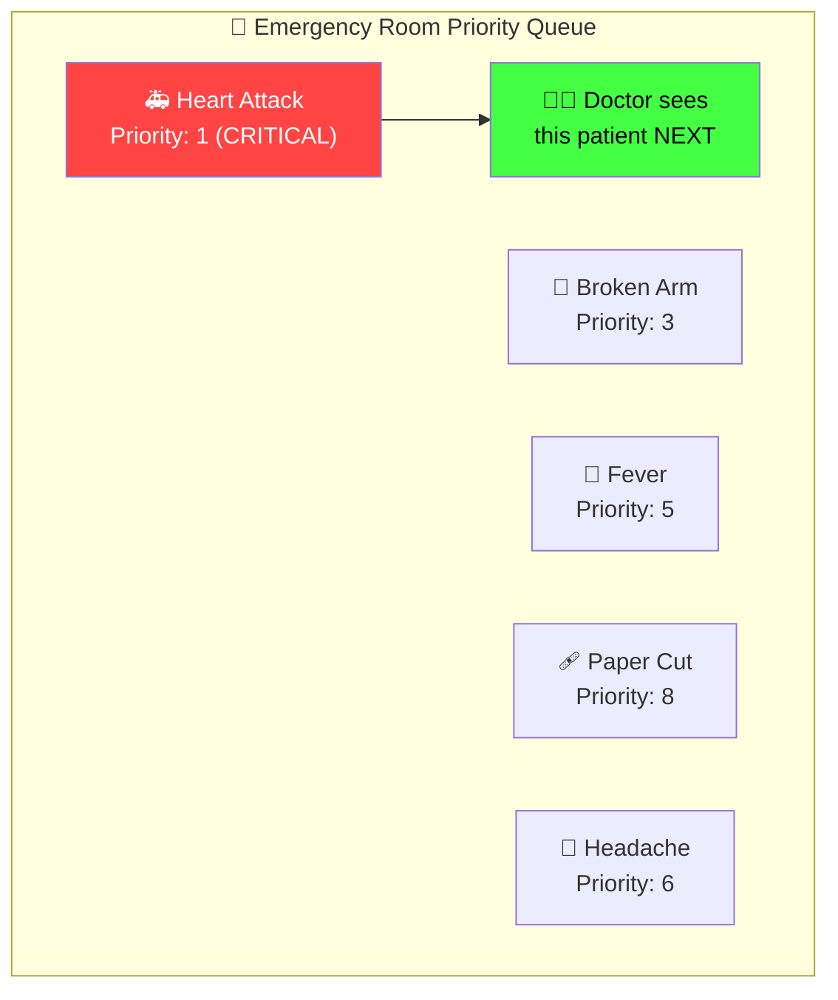
```mermaid
graph TD
    subgraph "🏥 Emergency Room Priority Queue"
        A["🚑 Heart Attack<br/>Priority: 1 (CRITICAL)"] --> OUT["👨‍⚕️ Doctor sees<br/>this patient NEXT"]
        B["🦴 Broken Arm<br/>Priority: 3"]
        C["🤒 Fever<br/>Priority: 5"]
        D["🩹 Paper Cut<br/>Priority: 8"]
        E["🤕 Headache<br/>Priority: 6"]
    end

    style A fill:#ff4444,color:#fff
    style OUT fill:#44ff44,color:#000
```

### 🎪 The VIP Nightclub Line

Picture a nightclub with a bouncer. People are lined up, but the bouncer doesn't care about arrival order. Every time the door opens, the bouncer scans the crowd and picks the **most important person** — the celebrity, the VIP, the big spender. Everyone else waits.

A **heap** lets the bouncer do this in **O(1)** time — instantly knowing who's next — while keeping the line organized so new arrivals slot in efficiently at **O(log n)**.

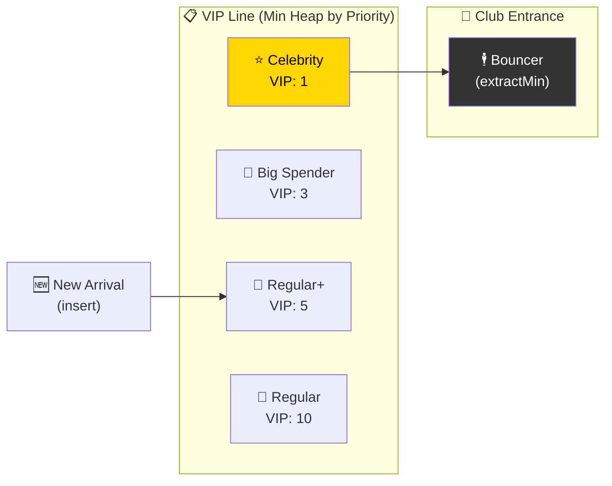
```mermaid
graph LR
    subgraph "🚪 Club Entrance"
        BOUNCER["🕴️ Bouncer<br/>(extractMin)"]
    end

    subgraph "📋 VIP Line (Min Heap by Priority)"
        V1["⭐ Celebrity<br/>VIP: 1"] --> BOUNCER
        V2["💎 Big Spender<br/>VIP: 3"]
        V3["🎫 Regular+<br/>VIP: 5"]
        V4["🙂 Regular<br/>VIP: 10"]
    end

    NEW["🆕 New Arrival<br/>(insert)"] --> V3

    style V1 fill:#ffd700,color:#000
    style BOUNCER fill:#333,color:#fff
```

**Key insight**: You don't need the *entire* line sorted. You just need to efficiently answer: **"Who's next?"** — and that's exactly what a heap does.

---

## 📝 What & Why

### What Is a Heap?

A heap is a **complete binary tree** that satisfies the **heap property**:

| Type | Property | Root Contains |
|------|----------|---------------|
| **Min Heap** | Every parent ≤ its children | The **smallest** element |
| **Max Heap** | Every parent ≥ its children | The **largest** element |

**Complete binary tree** means every level is fully filled except possibly the last, which is filled left to right. This is crucial — it's what allows the array representation trick.

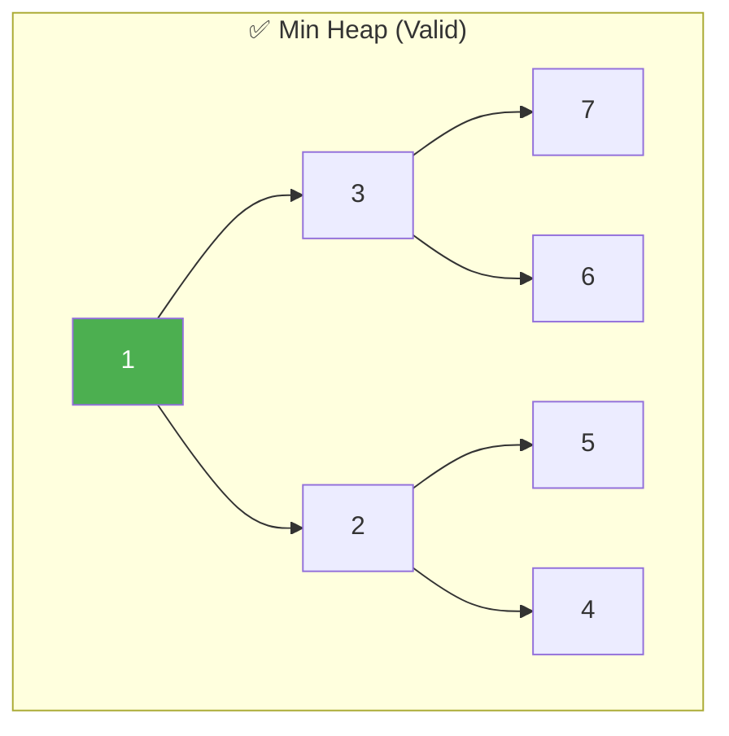
```mermaid
graph TD
    subgraph "✅ Min Heap (Valid)"
        A1["1"] --> B1["3"]
        A1 --> C1["2"]
        B1 --> D1["7"]
        B1 --> E1["6"]
        C1 --> F1["5"]
        C1 --> G1["4"]
    end

    style A1 fill:#4CAF50,color:#fff
```

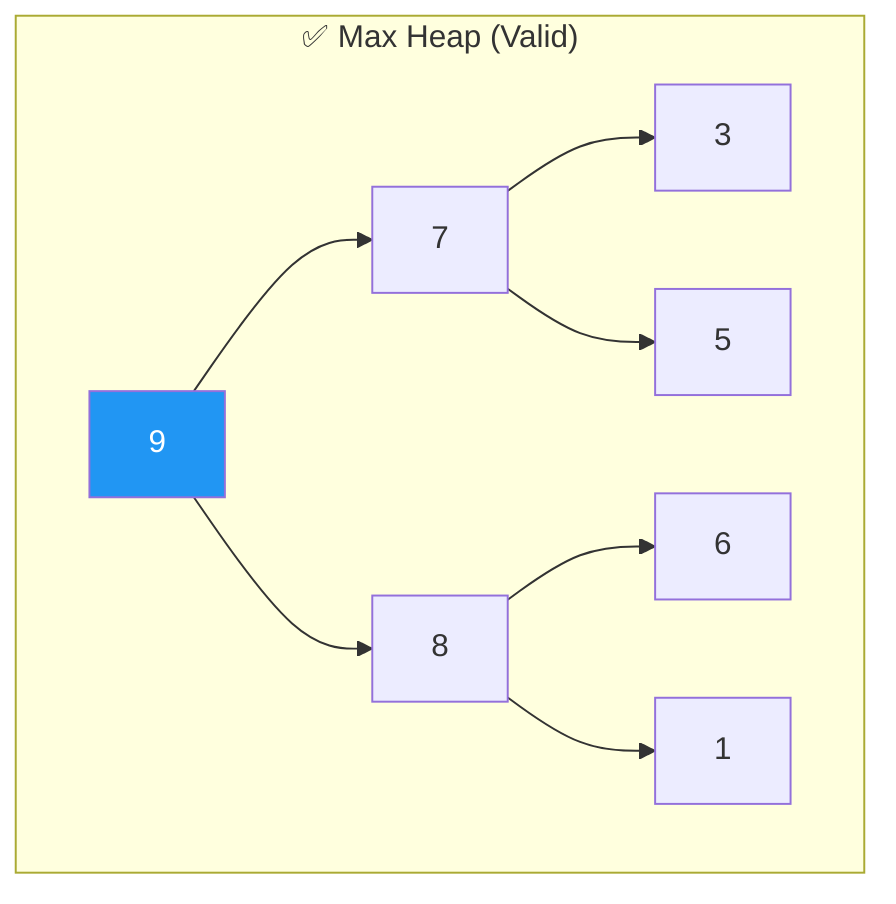
```mermaid
graph TD
    subgraph "✅ Max Heap (Valid)"
        A2["9"] --> B2["7"]
        A2 --> C2["8"]
        B2 --> D2["3"]
        B2 --> E2["5"]
        C2 --> F2["6"]
        C2 --> G2["1"]
    end

    style A2 fill:#2196F3,color:#fff
```

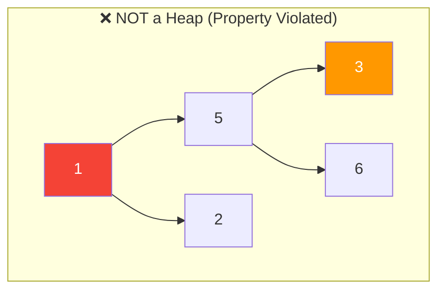
```mermaid
graph TD
    subgraph "❌ NOT a Heap (Property Violated)"
        A3["1"] --> B3["5"]
        A3 --> C3["2"]
        B3 --> D3["3"]
        B3 --> E3["6"]
    end

    style A3 fill:#f44336,color:#fff
    style D3 fill:#ff9800,color:#fff
```

> ❌ **3 < 5** — the child (3) is smaller than its parent (5), violating min-heap property.

### Why Not Just Sort?

| Approach | Get Min/Max | Insert New Element | Remove Min/Max |
|----------|------------|-------------------|----------------|
| **Sorted Array** | O(1) | O(n) — shift elements | O(n) — shift elements |
| **Unsorted Array** | O(n) — scan all | O(1) — append | O(n) — find + shift |
| **Heap** ✅ | **O(1)** | **O(log n)** | **O(log n)** |
| **Re-sort every time** | O(1) after sort | O(n log n) — resort | O(n log n) — resort |

The heap gives you the **best balance**: instant access to the extreme value, with cheap modifications.

### Priority Queue vs Heap

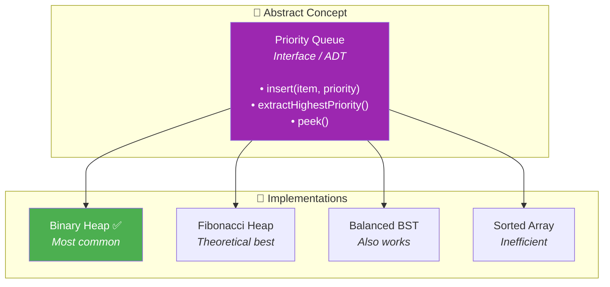
```mermaid
graph TD
    subgraph "🧠 Abstract Concept"
        PQ["Priority Queue<br/><i>Interface / ADT</i><br/><br/>• insert(item, priority)<br/>• extractHighestPriority()<br/>• peek()"]
    end

    subgraph "🔧 Implementations"
        HEAP["Binary Heap ✅<br/><i>Most common</i>"]
        FIB["Fibonacci Heap<br/><i>Theoretical best</i>"]
        BST["Balanced BST<br/><i>Also works</i>"]
        SORTED["Sorted Array<br/><i>Inefficient</i>"]
    end

    PQ --> HEAP
    PQ --> FIB
    PQ --> BST
    PQ --> SORTED

    style PQ fill:#9C27B0,color:#fff
    style HEAP fill:#4CAF50,color:#fff
```

**Priority Queue** = *what* you want (give me the highest priority item).
**Heap** = *how* you do it (a specific tree/array structure).

### Where Heaps Are Used in the Real World

| Application | Why Heaps? |
|-------------|-----------|
| **Dijkstra's Algorithm** | Always process the closest unvisited node |
| **Task Schedulers (OS)** | Run highest-priority process next |
| **Median Finding** | Two heaps maintain running median in O(log n) |
| **Merge K Sorted Lists** | Efficiently pick the smallest among K candidates |
| **Huffman Encoding** | Build optimal prefix codes by merging smallest frequencies |
| **Event-Driven Simulation** | Process earliest event first |

---

## ⚙️ How It Works — The Mechanics

### 🧱 The Array Representation Trick

A heap is a tree, but we **store it as a flat array**. Because the tree is *complete*, we can calculate parent/child positions with simple math — no pointers needed!

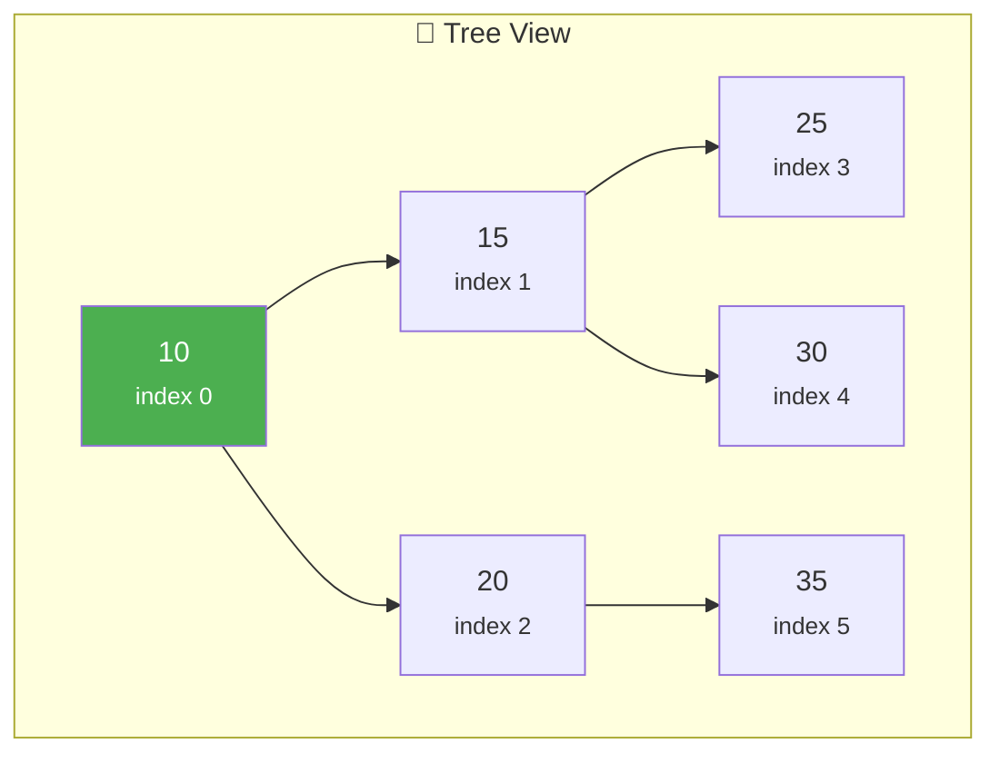
```mermaid
graph TD
    subgraph "🌳 Tree View"
        T0["10<br/><small>index 0</small>"] --> T1["15<br/><small>index 1</small>"]
        T0 --> T2["20<br/><small>index 2</small>"]
        T1 --> T3["25<br/><small>index 3</small>"]
        T1 --> T4["30<br/><small>index 4</small>"]
        T2 --> T5["35<br/><small>index 5</small>"]
    end

    style T0 fill:#4CAF50,color:#fff
```

```
📦 Array View:

Index:  [  0  |  1  |  2  |  3  |  4  |  5  ]
Value:  [ 10  | 15  | 20  | 25  | 30  | 35  ]
         root   L     R    LL    LR    RL
```

### 🔢 The Magic Formulas (0-indexed)

For a node at index `i`:

| Relationship | Formula | Example (i=1) |
|-------------|---------|----------------|
| **Parent** | `Math.floor((i - 1) / 2)` | Parent of 1 → `0` |
| **Left Child** | `2 * i + 1` | Left of 1 → `3` |
| **Right Child** | `2 * i + 2` | Right of 1 → `4` |

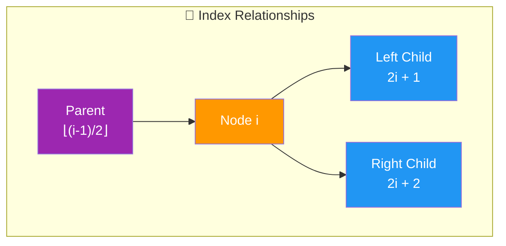
```mermaid
graph TD
    subgraph "🔢 Index Relationships"
        P["Parent<br/>⌊(i-1)/2⌋"] --> I["Node i"]
        I --> L["Left Child<br/>2i + 1"]
        I --> R["Right Child<br/>2i + 2"]
    end

    style I fill:#FF9800,color:#fff
    style P fill:#9C27B0,color:#fff
    style L fill:#2196F3,color:#fff
    style R fill:#2196F3,color:#fff
```

**Why does this work?** Because the tree is *complete*, there are no gaps. Level `k` of the tree maps to array indices `2^k - 1` through `2^(k+1) - 2`.

---

### ⬆️ Bubble Up (Heapify Up) — Insertion

When we **insert** a new element, we place it at the end of the array (bottom-right of the tree), then "bubble it up" by swapping it with its parent until the heap property is restored.

**Example: Insert `5` into this min heap:**

**Step 0 — Initial heap:**

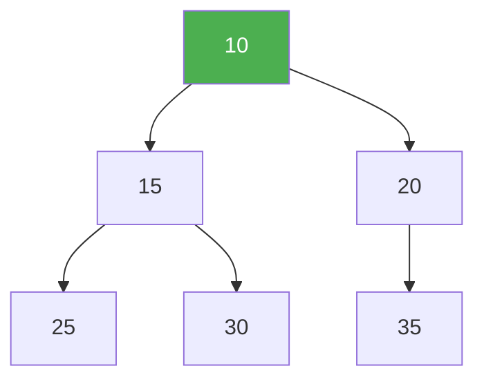
```mermaid
graph TD
    A["10"] --> B["15"]
    A --> C["20"]
    B --> D["25"]
    B --> E["30"]
    C --> F["35"]

    style A fill:#4CAF50,color:#fff
```

**Step 1 — Place `5` at the end (index 6):**

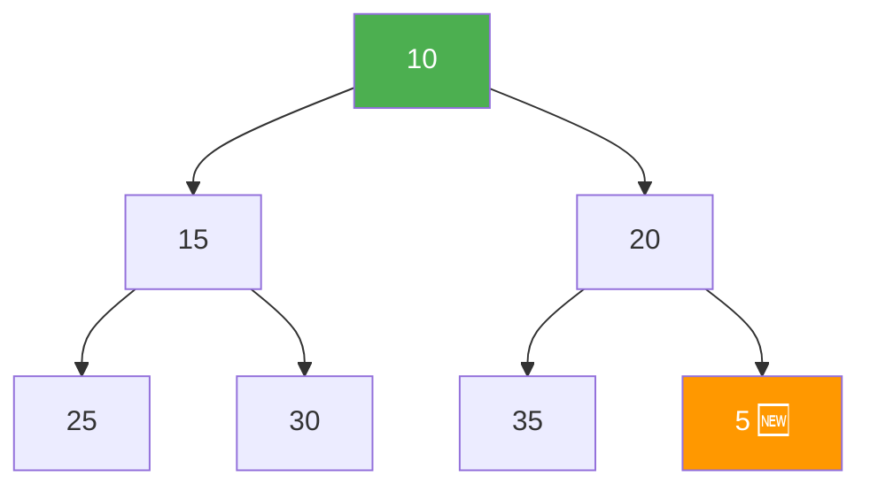
```mermaid
graph TD
    A["10"] --> B["15"]
    A --> C["20"]
    B --> D["25"]
    B --> E["30"]
    C --> F["35"]
    C --> NEW["5 🆕"]

    style NEW fill:#FF9800,color:#fff
    style A fill:#4CAF50,color:#fff
```

**Step 2 — Compare `5` with parent `20`. 5 < 20, so swap:**

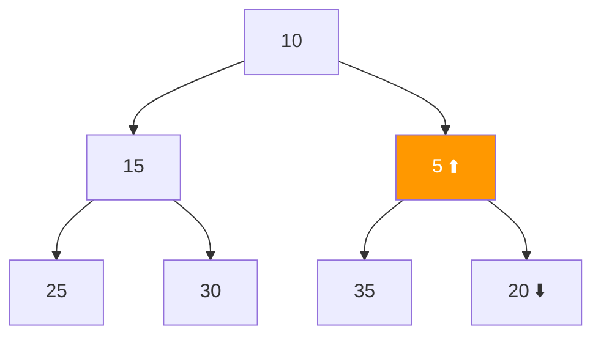
```mermaid
graph TD
    A["10"] --> B["15"]
    A --> C["5 ⬆️"]
    B --> D["25"]
    B --> E["30"]
    C --> F["35"]
    C --> G["20 ⬇️"]

    style C fill:#FF9800,color:#fff
```

**Step 3 — Compare `5` with parent `10`. 5 < 10, so swap:**

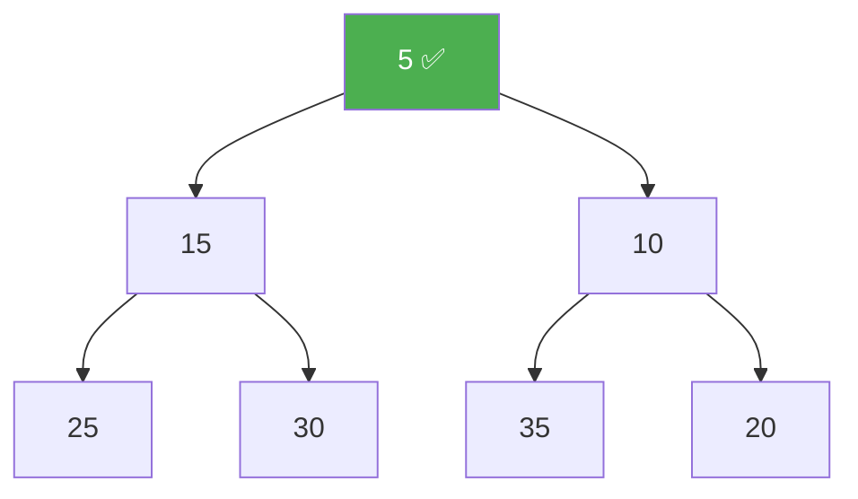
```mermaid
graph TD
    A["5 ✅"] --> B["15"]
    A --> C["10"]
    B --> D["25"]
    B --> E["30"]
    C --> F["35"]
    C --> G["20"]

    style A fill:#4CAF50,color:#fff
```

**Done!** `5` bubbled all the way to the root.

```
Array transformation:
[10, 15, 20, 25, 30, 35]       ← initial
[10, 15, 20, 25, 30, 35, 5]    ← append 5
[10, 15, 5, 25, 30, 35, 20]    ← swap indices 6 and 2
[5, 15, 10, 25, 30, 35, 20]    ← swap indices 2 and 0  ✅
```

---

### ⬇️ Bubble Down (Heapify Down) — Extraction

When we **extract the min/max** (remove the root), we swap the root with the last element, remove the last element, then "bubble down" the new root.

**Example: Extract min from this min heap:**

**Step 0 — Initial heap:**

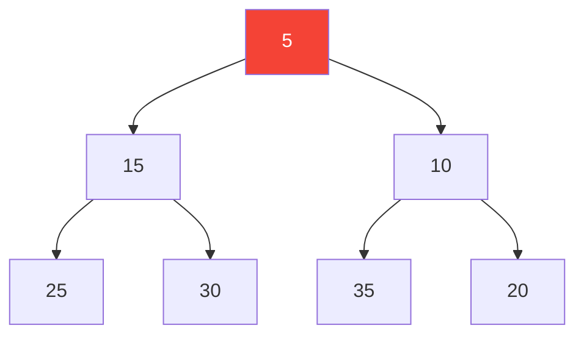
```mermaid
graph TD
    A["5"] --> B["15"]
    A --> C["10"]
    B --> D["25"]
    B --> E["30"]
    C --> F["35"]
    C --> G["20"]

    style A fill:#f44336,color:#fff
```

**Step 1 — Swap root `5` with last element `20`, then remove `5`:**

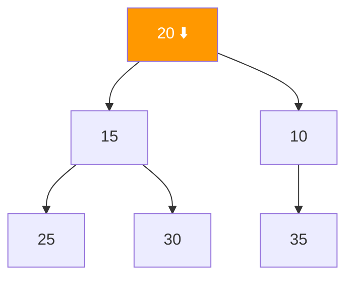
```mermaid
graph TD
    A["20 ⬇️"] --> B["15"]
    A --> C["10"]
    B --> D["25"]
    B --> E["30"]
    C --> F["35"]

    style A fill:#FF9800,color:#fff
```

> Returned value: `5` ✅

**Step 2 — Compare `20` with its children (`15`, `10`). Smallest child is `10`. 20 > 10, so swap:**

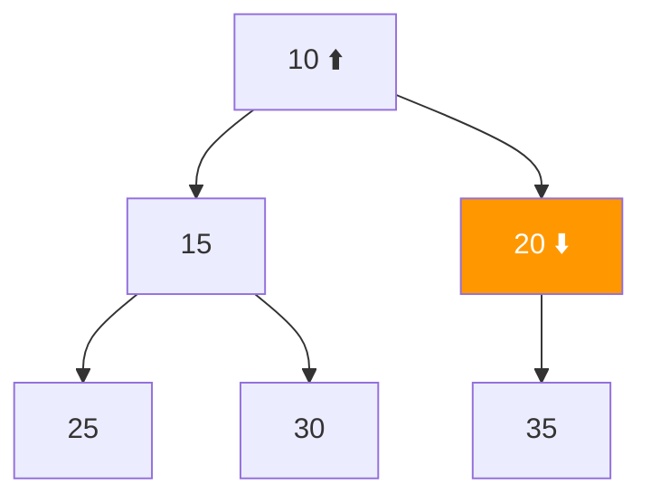
```mermaid
graph TD
    A["10 ⬆️"] --> B["15"]
    A --> C["20 ⬇️"]
    B --> D["25"]
    B --> E["30"]
    C --> F["35"]

    style C fill:#FF9800,color:#fff
```

**Step 3 — Compare `20` with its children (`35`). 20 < 35, so stop:**

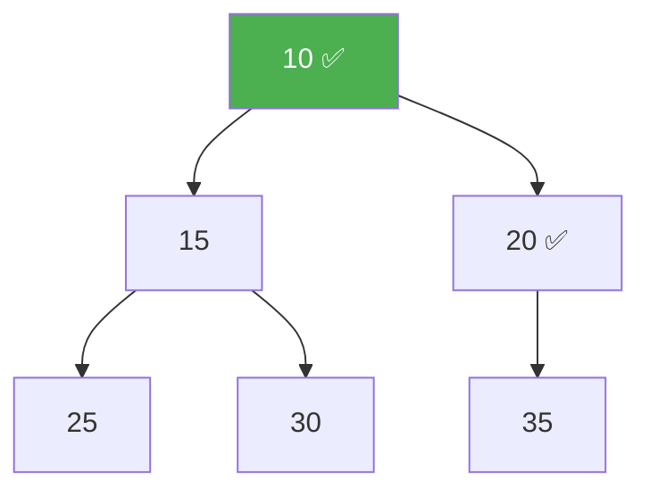
```mermaid
graph TD
    A["10 ✅"] --> B["15"]
    A --> C["20 ✅"]
    B --> D["25"]
    B --> E["30"]
    C --> F["35"]

    style A fill:#4CAF50,color:#fff
```

**Done!** Heap property restored.

> 🔑 **Key**: When bubbling down, always swap with the **smaller child** (min heap) or **larger child** (max heap). This preserves the heap property for the other subtree.

---

### 🏗️ Building a Heap from an Array — The O(n) Trick

**Naive approach**: Insert elements one by one → O(n log n).

**Smart approach**: Start from the last non-leaf node and bubble down each one → **O(n)**.

Why is this O(n) and not O(n log n)? Because most nodes are near the bottom of the tree and have very short bubble-down distances:

```
Level 0 (root):      1 node   × log n swaps = log n work
Level 1:             2 nodes  × (log n - 1) swaps
Level 2:             4 nodes  × (log n - 2) swaps
...
Level log n - 1:     n/2 nodes × 1 swap = n/2 work  ← MOST nodes, LEAST work
                                                  Total: O(n)
```

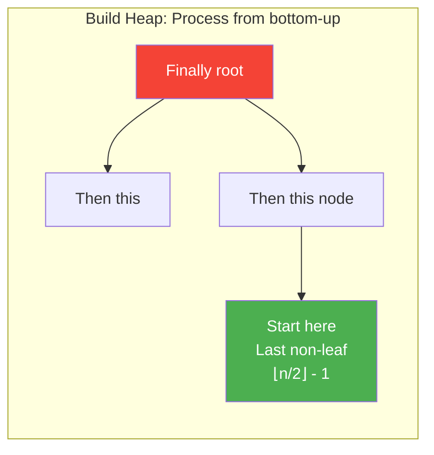
```mermaid
graph TD
    subgraph "Build Heap: Process from bottom-up"
        direction TB
        N0["Start here<br/>Last non-leaf<br/>⌊n/2⌋ - 1"]
        N1["Then this node"]
        N2["Then this"]
        N3["Finally root"]

        N3 --> N2
        N3 --> N1
        N1 --> N0
    end

    style N0 fill:#4CAF50,color:#fff
    style N3 fill:#f44336,color:#fff
```

**Example: Build min heap from `[4, 1, 3, 2, 5]`:**

```
Initial:    [4, 1, 3, 2, 5]    (just an array, not a heap)

Last non-leaf index = ⌊5/2⌋ - 1 = 1

Process index 1 (value 1): children are 2, 5 → 1 is already smallest → no swap
Process index 0 (value 4): children are 1, 3 → swap with 1 (smallest child)
           → [1, 4, 3, 2, 5]
           Now process swapped position: 4's children are 2, 5 → swap with 2
           → [1, 2, 3, 4, 5]    ✅ Valid min heap!
```

---

## 💻 TypeScript Implementation

### MinHeap — From Scratch

```typescript
class MinHeap {
  private heap: number[] = [];

  get size(): number {
    return this.heap.length;
  }

  peek(): number | undefined {
    return this.heap[0];
  }

  insert(val: number): void {
    this.heap.push(val);
    this.bubbleUp(this.heap.length - 1);
  }

  extractMin(): number | undefined {
    if (this.heap.length === 0) return undefined;
    if (this.heap.length === 1) return this.heap.pop();

    const min = this.heap[0];
    this.heap[0] = this.heap.pop()!;
    this.bubbleDown(0);
    return min;
  }

  private bubbleUp(i: number): void {
    while (i > 0) {
      const parent = Math.floor((i - 1) / 2);
      if (this.heap[i] >= this.heap[parent]) break;
      [this.heap[i], this.heap[parent]] = [this.heap[parent], this.heap[i]];
      i = parent;
    }
  }

  private bubbleDown(i: number): void {
    const n = this.heap.length;
    while (true) {
      let smallest = i;
      const left = 2 * i + 1;
      const right = 2 * i + 2;

      if (left < n && this.heap[left] < this.heap[smallest]) {
        smallest = left;
      }
      if (right < n && this.heap[right] < this.heap[smallest]) {
        smallest = right;
      }
      if (smallest === i) break;

      [this.heap[i], this.heap[smallest]] = [this.heap[smallest], this.heap[i]];
      i = smallest;
    }
  }

  static buildHeap(arr: number[]): MinHeap {
    const heap = new MinHeap();
    heap.heap = [...arr];
    for (let i = Math.floor(arr.length / 2) - 1; i >= 0; i--) {
      heap.bubbleDown(i);
    }
    return heap;
  }
}
```

### MaxHeap — The Negation Trick

Instead of writing a separate class, negate values on the way in and out:

```typescript
class MaxHeap {
  private minHeap = new MinHeap();

  get size(): number {
    return this.minHeap.size;
  }

  peek(): number | undefined {
    const val = this.minHeap.peek();
    return val !== undefined ? -val : undefined;
  }

  insert(val: number): void {
    this.minHeap.insert(-val);
  }

  extractMax(): number | undefined {
    const val = this.minHeap.extractMin();
    return val !== undefined ? -val : undefined;
  }
}
```

### Generic PriorityQueue with Custom Comparator

```typescript
class PriorityQueue<T> {
  private heap: T[] = [];

  // compareFn(a, b) should return true if a has HIGHER priority than b
  constructor(private compareFn: (a: T, b: T) => boolean) {}

  get size(): number {
    return this.heap.length;
  }

  peek(): T | undefined {
    return this.heap[0];
  }

  push(val: T): void {
    this.heap.push(val);
    this.bubbleUp(this.heap.length - 1);
  }

  pop(): T | undefined {
    if (this.heap.length === 0) return undefined;
    if (this.heap.length === 1) return this.heap.pop();

    const top = this.heap[0];
    this.heap[0] = this.heap.pop()!;
    this.bubbleDown(0);
    return top;
  }

  private bubbleUp(i: number): void {
    while (i > 0) {
      const parent = Math.floor((i - 1) / 2);
      if (!this.compareFn(this.heap[i], this.heap[parent])) break;
      [this.heap[i], this.heap[parent]] = [this.heap[parent], this.heap[i]];
      i = parent;
    }
  }

  private bubbleDown(i: number): void {
    const n = this.heap.length;
    while (true) {
      let best = i;
      const left = 2 * i + 1;
      const right = 2 * i + 2;

      if (left < n && this.compareFn(this.heap[left], this.heap[best])) {
        best = left;
      }
      if (right < n && this.compareFn(this.heap[right], this.heap[best])) {
        best = right;
      }
      if (best === i) break;

      [this.heap[i], this.heap[best]] = [this.heap[best], this.heap[i]];
      i = best;
    }
  }
}

// Usage examples:
// Min Priority Queue (smallest first):
// const minPQ = new PriorityQueue<number>((a, b) => a < b);

// Max Priority Queue (largest first):
// const maxPQ = new PriorityQueue<number>((a, b) => a > b);

// Custom object priority:
// const taskPQ = new PriorityQueue<Task>((a, b) => a.priority < b.priority);
```

---

## 🧩 Essential Heap Techniques for LeetCode

### 1️⃣ Top K Pattern

**Problem**: Find the K largest elements in an array.

**Counterintuitive insight**: Use a **MIN heap** of size K to find K **LARGEST** elements.

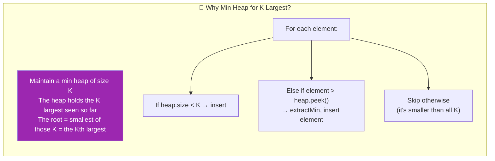
```mermaid
graph TD
    subgraph "🤔 Why Min Heap for K Largest?"
        direction TB
        IDEA["Maintain a min heap of size K<br/>The heap holds the K largest seen so far<br/>The root = smallest of those K = the Kth largest"]
        
        STEP1["For each element:"]
        STEP2["If heap.size < K → insert"]
        STEP3["Else if element > heap.peek()<br/>→ extractMin, insert element"]
        STEP4["Skip otherwise<br/>(it's smaller than all K)"]
        
        STEP1 --> STEP2
        STEP1 --> STEP3
        STEP1 --> STEP4
    end

    style IDEA fill:#9C27B0,color:#fff
```

**Why min heap?** Because the root of the min heap is the *gatekeeper*. It's the smallest of the K largest elements. Any new element must be bigger than this gatekeeper to earn a spot.

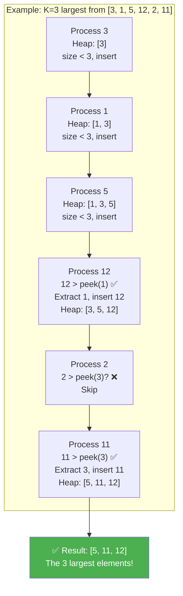
```mermaid
graph TD
    subgraph "Example: K=3 largest from [3, 1, 5, 12, 2, 11]"
        S1["Process 3<br/>Heap: [3]<br/>size < 3, insert"]
        S2["Process 1<br/>Heap: [1, 3]<br/>size < 3, insert"]
        S3["Process 5<br/>Heap: [1, 3, 5]<br/>size < 3, insert"]
        S4["Process 12<br/>12 > peek(1) ✅<br/>Extract 1, insert 12<br/>Heap: [3, 5, 12]"]
        S5["Process 2<br/>2 > peek(3)? ❌<br/>Skip"]
        S6["Process 11<br/>11 > peek(3) ✅<br/>Extract 3, insert 11<br/>Heap: [5, 11, 12]"]

        S1 --> S2 --> S3 --> S4 --> S5 --> S6
    end

    S7["✅ Result: [5, 11, 12]<br/>The 3 largest elements!"]
    S6 --> S7

    style S7 fill:#4CAF50,color:#fff
```

```typescript
function findKLargest(nums: number[], k: number): number[] {
  const minHeap = new MinHeap();
  
  for (const num of nums) {
    minHeap.insert(num);
    if (minHeap.size > k) {
      minHeap.extractMin(); // evict the smallest
    }
  }
  
  const result: number[] = [];
  while (minHeap.size > 0) {
    result.push(minHeap.extractMin()!);
  }
  return result;
}
```

**Complexity**: O(n log k) — much better than O(n log n) sorting when k << n.

---

### 2️⃣ Merge K Sorted Lists/Arrays

**Problem**: Given K sorted arrays, merge them into one sorted array.

**Approach**: Use a min heap to always pick the smallest available element across all K arrays.

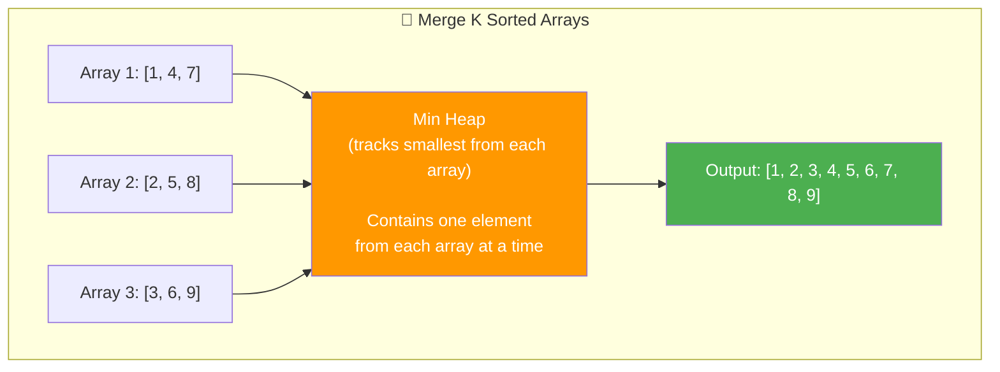
```mermaid
graph TD
    subgraph "🔀 Merge K Sorted Arrays"
        A["Array 1: [1, 4, 7]"]
        B["Array 2: [2, 5, 8]"]
        C["Array 3: [3, 6, 9]"]

        HEAP["Min Heap<br/>(tracks smallest from each array)<br/><br/>Contains one element<br/>from each array at a time"]

        A --> HEAP
        B --> HEAP
        C --> HEAP

        HEAP --> OUT["Output: [1, 2, 3, 4, 5, 6, 7, 8, 9]"]
    end

    style HEAP fill:#FF9800,color:#fff
    style OUT fill:#4CAF50,color:#fff
```

**Step by step:**

```
Heap: [(1,arr0,idx0), (2,arr1,idx0), (3,arr2,idx0)]

Extract min → 1 (from arr0). Push arr0[1]=4. Output: [1]
Heap: [(2,arr1,idx0), (3,arr2,idx0), (4,arr0,idx1)]

Extract min → 2 (from arr1). Push arr1[1]=5. Output: [1, 2]
Heap: [(3,arr2,idx0), (4,arr0,idx1), (5,arr1,idx1)]

Extract min → 3 (from arr2). Push arr2[1]=6. Output: [1, 2, 3]
... continues until all arrays exhausted
```

```typescript
function mergeKSorted(arrays: number[][]): number[] {
  const pq = new PriorityQueue<[number, number, number]>(
    (a, b) => a[0] < b[0] // compare by value
  );

  for (let i = 0; i < arrays.length; i++) {
    if (arrays[i].length > 0) {
      pq.push([arrays[i][0], i, 0]); // [value, arrayIndex, elementIndex]
    }
  }

  const result: number[] = [];
  while (pq.size > 0) {
    const [val, arrIdx, elIdx] = pq.pop()!;
    result.push(val);

    if (elIdx + 1 < arrays[arrIdx].length) {
      pq.push([arrays[arrIdx][elIdx + 1], arrIdx, elIdx + 1]);
    }
  }
  return result;
}
```

**Complexity**: O(N log K) where N = total elements, K = number of arrays.

---

### 3️⃣ Running Median — Two Heaps Technique

**Problem**: Given a stream of numbers, find the median at any point.

**Approach**: Maintain two heaps that split the data in half:

```mermaid
graph LR
    subgraph "📊 Two Heaps for Running Median"
        subgraph "Left Half (Max Heap)"
            LH["Max Heap<br/>Stores SMALLER half<br/>Root = largest of small half"]
        end

        subgraph "📍 Median"
            MED["If equal sizes:<br/>avg(maxHeap.peek, minHeap.peek)<br/><br/>If unequal:<br/>larger heap's root"]
        end

        subgraph "Right Half (Min Heap)"
            RH["Min Heap<br/>Stores LARGER half<br/>Root = smallest of large half"]
        end

        LH --> MED
        MED --> RH
    end

    style LH fill:#2196F3,color:#fff
    style RH fill:#FF9800,color:#fff
    style MED fill:#4CAF50,color:#fff
```

**Invariants:**
1. Max heap size = Min heap size, OR Max heap size = Min heap size + 1
2. Every element in max heap ≤ every element in min heap

**Example: Stream = [5, 15, 1, 3, 8]:**

```
Add 5:   maxHeap=[5]         minHeap=[]          median = 5
Add 15:  maxHeap=[5]         minHeap=[15]        median = (5+15)/2 = 10
Add 1:   maxHeap=[5, 1]      minHeap=[15]        
         Rebalance not needed (sizes: 2 vs 1, ok)
         maxHeap=[5, 1]      minHeap=[15]        median = 5
Add 3:   maxHeap=[5, 1, 3]   minHeap=[15]        
         sizes 3 vs 1 → move max to min heap
         maxHeap=[3, 1]      minHeap=[5, 15]     median = (3+5)/2 = 4
Add 8:   Where does 8 go? 8 > maxHeap.peek(3) → min heap
         maxHeap=[3, 1]      minHeap=[5, 8, 15]  
         sizes 2 vs 3 → move min to max heap
         maxHeap=[5, 3, 1]   minHeap=[8, 15]     median = 5
```

```typescript
class MedianFinder {
  private maxHeap = new MaxHeap(); // lower half
  private minHeap = new MinHeap(); // upper half

  addNum(num: number): void {
    if (this.maxHeap.size === 0 || num <= this.maxHeap.peek()!) {
      this.maxHeap.insert(num);
    } else {
      this.minHeap.insert(num);
    }

    // Rebalance: maxHeap can have at most 1 more element than minHeap
    if (this.maxHeap.size > this.minHeap.size + 1) {
      this.minHeap.insert(this.maxHeap.extractMax()!);
    } else if (this.minHeap.size > this.maxHeap.size) {
      this.maxHeap.insert(this.minHeap.extractMin()!);
    }
  }

  findMedian(): number {
    if (this.maxHeap.size > this.minHeap.size) {
      return this.maxHeap.peek()!;
    }
    return (this.maxHeap.peek()! + this.minHeap.peek()!) / 2;
  }
}
```

---

### 4️⃣ K Closest Points to Origin

```typescript
function kClosest(points: number[][], k: number): number[][] {
  // Max heap of size K — evict the farthest among our K candidates
  const pq = new PriorityQueue<number[]>(
    (a, b) => dist(a) > dist(b) // max heap by distance
  );

  for (const point of points) {
    pq.push(point);
    if (pq.size > k) pq.pop(); // evict farthest
  }

  const result: number[][] = [];
  while (pq.size > 0) result.push(pq.pop()!);
  return result;
}

function dist(p: number[]): number {
  return p[0] * p[0] + p[1] * p[1]; // no need for sqrt
}
```

---

### 5️⃣ Task Scheduler

**Problem**: Given tasks with frequencies and a cooldown period `n`, find minimum intervals needed.

**Approach**: Always execute the most frequent task first (max heap). After executing, put it in a cooldown queue.

```mermaid
graph TD
    subgraph "📋 Task Scheduler Flow"
        MAXHEAP["Max Heap<br/>(by frequency)<br/>Pick most frequent task"]
        EXEC["Execute Task<br/>Decrease frequency"]
        COOLDOWN["Cooldown Queue<br/>(task, available_time)<br/>Wait n intervals"]
        CHECK["Is task available?<br/>time >= available_time"]

        MAXHEAP -->|"pop most frequent"| EXEC
        EXEC -->|"if freq > 0"| COOLDOWN
        COOLDOWN -->|"when cooldown expires"| CHECK
        CHECK -->|"yes"| MAXHEAP
    end

    style MAXHEAP fill:#f44336,color:#fff
    style COOLDOWN fill:#2196F3,color:#fff
```

---

## ⏱️ Complexity Table

| Operation | Time Complexity | Space |
|-----------|:--------------:|:-----:|
| `peek` (get min/max) | **O(1)** | — |
| `insert` | **O(log n)** | — |
| `extractMin` / `extractMax` | **O(log n)** | — |
| `buildHeap` (from array) | **O(n)** | O(1) extra |
| Find arbitrary element | **O(n)** | — |
| Delete arbitrary element | **O(n)** | — |
| **Heap Sort** | **O(n log n)** | O(1) |
| Top K elements | **O(n log k)** | O(k) |
| Merge K sorted lists (N total) | **O(N log K)** | O(K) |

---

## 🎯 LeetCode Pattern Recognition

When you see these phrases in a problem, think **HEAP**:

```mermaid
graph LR
    subgraph "🔍 Pattern → Data Structure"
        P1["'Kth largest/smallest'"] --> H1["Heap of size K"]
        P2["'Top K / Most frequent K'"] --> H2["Heap"]
        P3["'Merge K sorted...'"] --> H3["Min Heap"]
        P4["'Median from stream'"] --> H4["Two Heaps"]
        P5["'Closest/Farthest K'"] --> H5["Heap + custom comparator"]
        P6["'Schedule tasks optimally'"] --> H6["Max Heap + queue"]
        P7["'Continuously get min/max<br/>while adding elements'"] --> H7["Heap"]
    end

    style P1 fill:#E8EAF6
    style P2 fill:#E8EAF6
    style P3 fill:#E8EAF6
    style P4 fill:#E8EAF6
    style P5 fill:#E8EAF6
    style P6 fill:#E8EAF6
    style P7 fill:#E8EAF6
    style H1 fill:#4CAF50,color:#fff
    style H2 fill:#4CAF50,color:#fff
    style H3 fill:#4CAF50,color:#fff
    style H4 fill:#4CAF50,color:#fff
    style H5 fill:#4CAF50,color:#fff
    style H6 fill:#4CAF50,color:#fff
    style H7 fill:#4CAF50,color:#fff
```

### Quick Decision Framework

```
Is the problem asking for K extremes (largest/smallest/closest)?
  └── YES → Use a heap of size K
        └── K largest? → MIN heap (evict smallest, keep K largest)
        └── K smallest? → MAX heap (evict largest, keep K smallest)

Is it "merge K sorted things"?
  └── YES → Min heap holding one element from each list

Is it "running/streaming median"?
  └── YES → Two heaps (max heap left, min heap right)

Do you need repeated access to the min OR max while the set changes?
  └── YES → Heap

Do you need repeated access to BOTH min AND max?
  └── YES → Consider two heaps or a balanced BST
```

---

## ⚠️ Common Pitfalls

### 1. 🔄 Min vs Max Heap Confusion

```typescript
// ❌ WRONG: Using max heap to find K largest
// This gives you the single largest, not K largest efficiently

// ✅ RIGHT: Use MIN heap of size K for K LARGEST
// The min heap's root = Kth largest (the gatekeeper)
```

**Memory trick**: The heap type is the **opposite** of what you're looking for. K largest → min heap. K smallest → max heap. Think of it as: the heap root is the *weakest* element you're keeping — anything weaker gets evicted.

### 2. 🚫 JavaScript Has No Built-In Heap

```typescript
// ❌ This doesn't exist in JavaScript/TypeScript:
// import { PriorityQueue } from 'collections';  // Not built-in!

// ✅ You must implement your own, or use a library in production
// In LeetCode, you implement it from scratch
```

Unlike Python (`heapq`), Java (`PriorityQueue`), or C++ (`priority_queue`), JavaScript has **no built-in heap**. You must implement one. This is actually a *good thing* for interviews — it shows you understand the internals.

### 3. 🎯 Forgetting Edge Cases

```typescript
// ❌ Crashes on empty heap
const min = heap.extractMin(); // undefined if empty!
doSomething(min * 2); // 💥 NaN

// ✅ Always check
const min = heap.extractMin();
if (min !== undefined) {
  doSomething(min * 2);
}
```

### 4. 🔢 Off-by-One in K Problems

```typescript
// ❌ WRONG: Heap of size K-1 or K+1
if (heap.size >= k) heap.extractMin(); // too early!

// ✅ RIGHT: Maintain exactly K elements
if (heap.size > k) heap.extractMin(); // extract when size EXCEEDS K
```

### 5. 🌳 Confusing Heap with BST

| Feature | Heap | BST |
|---------|------|-----|
| Find min | O(1) — always root | O(log n) — go left |
| Find max | O(n) — must scan | O(log n) — go right |
| Find both min AND max | ❌ Need 2 heaps | ✅ O(log n) each |
| Find arbitrary | O(n) | O(log n) |
| Insert | O(log n) | O(log n) |
| Sorted traversal | ❌ Not efficient | ✅ In-order traversal |

---

## 🔑 Key Takeaways

1. **Heap = best way to repeatedly get min/max** from a changing dataset. O(1) peek, O(log n) insert/extract.

2. **Array representation** eliminates pointer overhead. Parent/child relationships are pure math: `parent = ⌊(i-1)/2⌋`, `left = 2i+1`, `right = 2i+2`.

3. **Build heap is O(n)**, not O(n log n). Use bottom-up sift-down.

4. **K largest → min heap of size K**. The root is the gatekeeper — only elements larger than it get in. (K smallest → max heap of size K, same logic.)

5. **Two heaps** = running median. Max heap for lower half, min heap for upper half. Keep them balanced.

6. **Merge K sorted** = min heap holding one element per list. Always extract the global minimum.

7. **JavaScript has no built-in heap**. You must implement it. Know the ~30 lines of code by heart.

8. **PriorityQueue with a comparator** handles any custom ordering — objects, tuples, multi-criteria sorting.

---

## 📋 Practice Problems

### 🟢 Easy

| # | Problem | Key Technique |
|---|---------|---------------|
| 1046 | [Last Stone Weight](https://leetcode.com/problems/last-stone-weight/) | Max heap, repeated extraction |
| 703 | [Kth Largest Element in a Stream](https://leetcode.com/problems/kth-largest-element-in-a-stream/) | Min heap of size K |

### 🟡 Medium

| # | Problem | Key Technique |
|---|---------|---------------|
| 215 | [Kth Largest Element in an Array](https://leetcode.com/problems/kth-largest-element-in-an-array/) | Min heap of size K (or quickselect) |
| 347 | [Top K Frequent Elements](https://leetcode.com/problems/top-k-frequent-elements/) | Heap with frequency map |
| 973 | [K Closest Points to Origin](https://leetcode.com/problems/k-closest-points-to-origin/) | Max heap of size K with distance comparator |
| 621 | [Task Scheduler](https://leetcode.com/problems/task-scheduler/) | Max heap + cooldown queue |
| 767 | [Reorganize String](https://leetcode.com/problems/reorganize-string/) | Max heap, alternate most frequent chars |

### 🔴 Hard

| # | Problem | Key Technique |
|---|---------|---------------|
| 295 | [Find Median from Data Stream](https://leetcode.com/problems/find-median-from-data-stream/) | Two heaps (max + min) |
| 23 | [Merge K Sorted Lists](https://leetcode.com/problems/merge-k-sorted-lists/) | Min heap of K list heads |
| 480 | [Sliding Window Median](https://leetcode.com/problems/sliding-window-median/) | Two heaps + lazy deletion |

---

> 💡 **Study order**: Implement MinHeap from scratch → solve Last Stone Weight → solve Kth Largest → solve Top K Frequent → solve Find Median from Data Stream → solve Merge K Sorted Lists. By then, heaps will feel natural.
