# 📊 Chapter 7: Graphs

> _"Graphs are the Swiss Army knife of data structures — almost every complex real-world problem can be modeled as a graph."_

---

## 🌍 Real-World Analogy

Imagine you're looking at a **road map of India**.

- **Cities** (Delhi, Mumbai, Chennai…) are **nodes (vertices)**
- **Roads** connecting them are **edges**
- A **one-way street** → **directed edge** (you can only go one direction)
- A **two-way street** → **undirected edge** (travel both ways)
- The **distance** between two cities → **edge weight**
- "Can I drive from Delhi to Chennai?" → **path finding**
- "What's the shortest route?" → **shortest path algorithm**

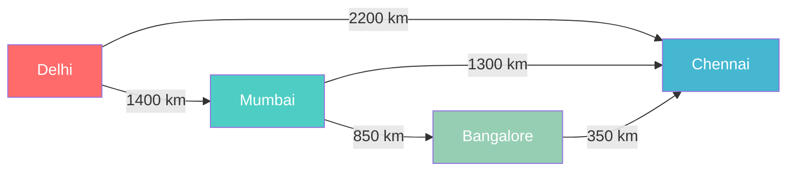

**Social networks** work the same way:
- **People** are nodes
- **Friendships** are undirected edges (mutual)
- **Followers** are directed edges (I follow you ≠ you follow me)
- "People you may know" → nodes 2 hops away from you

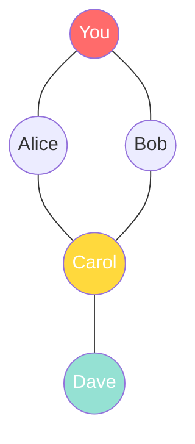

> 💡 Carol is a "friend of a friend" — this is how recommendation systems work!

---

## 📝 What & Why

### What is a Graph?

A **graph** `G = (V, E)` consists of:
- **V** — a set of **vertices** (nodes)
- **E** — a set of **edges** (connections between nodes)

Unlike trees, graphs can have **cycles**, **multiple paths** between nodes, and nodes with **no connections at all**.

> 🌳 A tree is actually a special type of graph — a connected, acyclic, undirected graph.

### Types of Graphs

| Type | Description | Example |
|------|-------------|---------|
| **Undirected** | Edges go both ways | Facebook friendships |
| **Directed** | Edges have direction | Twitter follows, dependencies |
| **Weighted** | Edges have values/costs | Road distances, network latency |
| **Unweighted** | All edges equal | "Can I reach B from A?" |
| **Cyclic** | Contains at least one cycle | Road networks |
| **Acyclic** | No cycles | DAG — task scheduling |
| **Connected** | Path exists between all pairs | Single network |
| **Disconnected** | Some nodes unreachable | Multiple isolated networks |

### Why Graphs Matter

Graphs are **everywhere** in real software engineering:

| Application | Nodes | Edges |
|-------------|-------|-------|
| 🗺️ Google Maps | Locations | Roads |
| 👥 Social Networks | Users | Relationships |
| 🌐 Internet Routing | Routers | Connections |
| 📦 npm install | Packages | Dependencies |
| 🎬 Netflix Recommendations | Movies/Users | Preferences |
| ✈️ Flight Routes | Airports | Flights |
| 🧬 Biology | Proteins | Interactions |
| 🔗 Web Crawling | Web pages | Hyperlinks |

---

## ⚙️ How It Works

### Graph Types Visualized

**Undirected Graph** — edges have no direction:

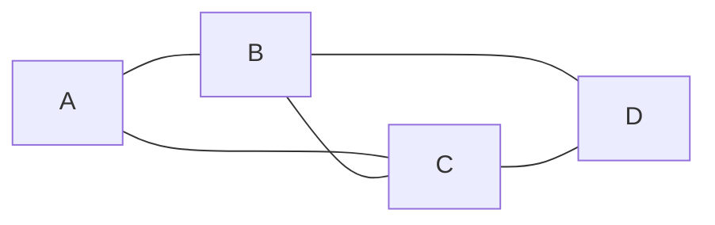

**Directed Graph (Digraph)** — edges point one way:

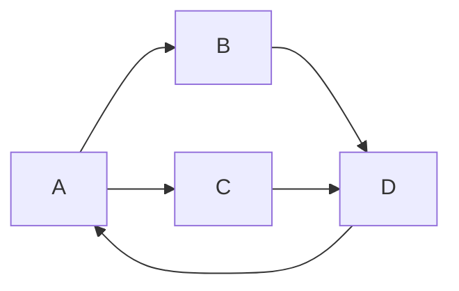

**Weighted Graph** — edges carry values:

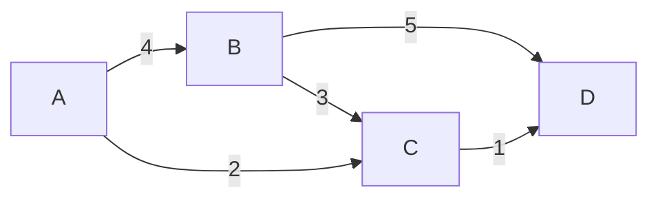

**DAG (Directed Acyclic Graph)** — directed, no cycles. Used for task scheduling, build systems:

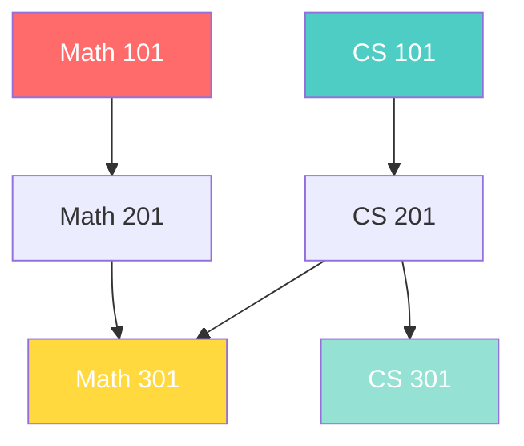

---

### Graph Representations

#### 1️⃣ Adjacency List — `Map<node, neighbors[]>`

The **most common** representation for LeetCode and real-world graphs.

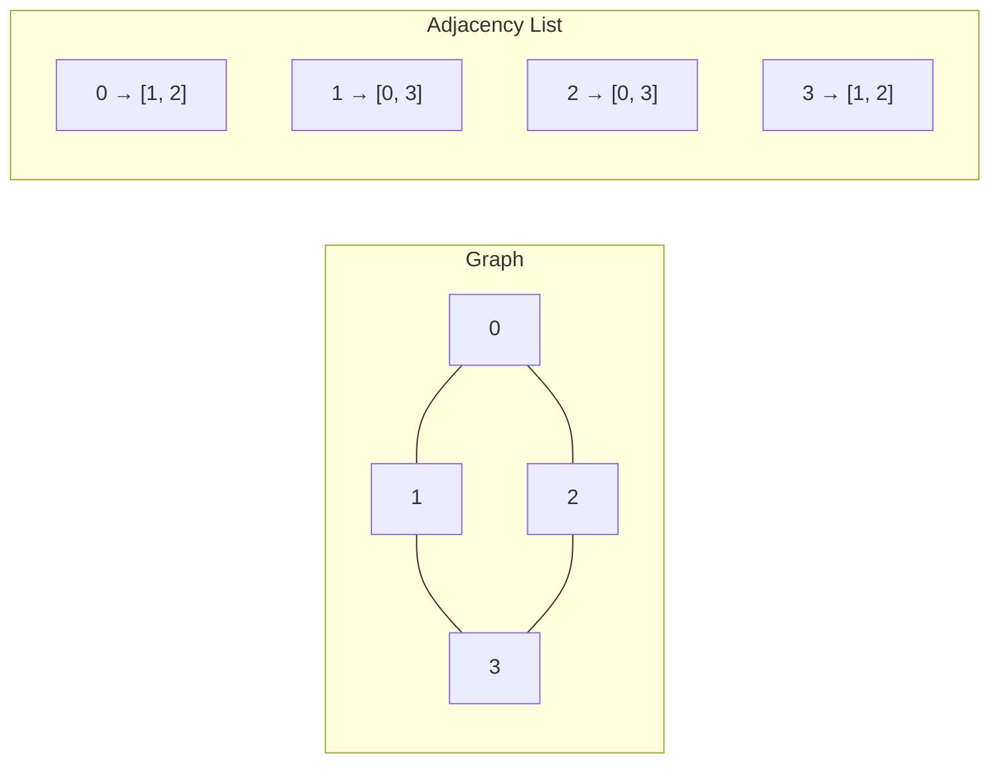

```typescript
// Adjacency List using Map
const adjList = new Map<number, number[]>();
adjList.set(0, [1, 2]);
adjList.set(1, [0, 3]);
adjList.set(2, [0, 3]);
adjList.set(3, [1, 2]);
```

✅ **Use when:** Sparse graphs, most LeetCode problems, when you iterate over neighbors often.

| Operation | Time |
|-----------|------|
| Add vertex | O(1) |
| Add edge | O(1) |
| Remove edge | O(E) |
| Check if edge exists | O(degree) |
| Space | O(V + E) |

#### 2️⃣ Adjacency Matrix — `2D boolean/number array`

```
     0  1  2  3
  0 [0, 1, 1, 0]
  1 [1, 0, 0, 1]
  2 [1, 0, 0, 1]
  3 [0, 1, 1, 0]
```

```typescript
// Adjacency Matrix
const matrix: number[][] = [
  [0, 1, 1, 0],
  [1, 0, 0, 1],
  [1, 0, 0, 1],
  [0, 1, 1, 0],
];

// Check if edge exists: O(1)
const hasEdge = matrix[0][1] === 1; // true
```

✅ **Use when:** Dense graphs, need O(1) edge lookup, graph is small (matrix is V² space).

| Operation | Time |
|-----------|------|
| Check if edge exists | O(1) ⚡ |
| Add/remove edge | O(1) |
| Get all neighbors | O(V) |
| Space | O(V²) |

#### 3️⃣ Edge List — `[from, to, weight?][]`

```typescript
// Edge List — common LeetCode input format
const edges: [number, number][] = [
  [0, 1],
  [0, 2],
  [1, 3],
  [2, 3],
];

// Weighted edge list
const weightedEdges: [number, number, number][] = [
  [0, 1, 4],
  [0, 2, 2],
  [1, 3, 5],
  [2, 3, 1],
];
```

✅ **Use when:** Input is given as edge list (very common on LeetCode), Kruskal's MST, Union-Find problems.

---

### 🔨 Building a Graph from Edge List (The LeetCode Pattern)

This is the **#1 pattern** you'll use. LeetCode gives you edges — you build the adjacency list:

```typescript
function buildGraph(n: number, edges: number[][]): Map<number, number[]> {
  const graph = new Map<number, number[]>();

  for (let i = 0; i < n; i++) {
    graph.set(i, []);
  }

  for (const [u, v] of edges) {
    graph.get(u)!.push(v);  // directed
    graph.get(v)!.push(u);  // add this for undirected
  }

  return graph;
}
```

> ⚠️ One of the most common mistakes: adding edges **both ways** for directed graphs, or **one way** for undirected graphs. Always read the problem carefully!

---

### Connected Components Visualization

A disconnected graph has **multiple connected components**:

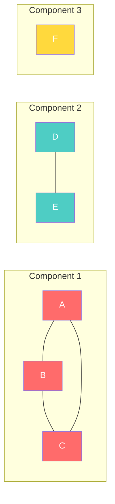

> This graph has **3 connected components**. Many LeetCode problems ask you to count or process these.

---

## 💻 TypeScript Implementation

### Graph Class (Adjacency List)

```typescript
class Graph {
  private adjacencyList: Map<string, string[]>;
  private directed: boolean;

  constructor(directed = false) {
    this.adjacencyList = new Map();
    this.directed = directed;
  }

  addVertex(vertex: string): void {
    if (!this.adjacencyList.has(vertex)) {
      this.adjacencyList.set(vertex, []);
    }
  }

  addEdge(v1: string, v2: string): void {
    this.addVertex(v1);
    this.addVertex(v2);
    this.adjacencyList.get(v1)!.push(v2);
    if (!this.directed) {
      this.adjacencyList.get(v2)!.push(v1);
    }
  }

  removeEdge(v1: string, v2: string): void {
    this.adjacencyList.set(
      v1,
      (this.adjacencyList.get(v1) || []).filter((v) => v !== v2)
    );
    if (!this.directed) {
      this.adjacencyList.set(
        v2,
        (this.adjacencyList.get(v2) || []).filter((v) => v !== v1)
      );
    }
  }

  removeVertex(vertex: string): void {
    for (const neighbor of this.adjacencyList.get(vertex) || []) {
      this.removeEdge(neighbor, vertex);
    }
    this.adjacencyList.delete(vertex);
  }

  getNeighbors(vertex: string): string[] {
    return this.adjacencyList.get(vertex) || [];
  }

  getVertices(): string[] {
    return [...this.adjacencyList.keys()];
  }
}
```

### BFS Traversal

BFS explores **level by level** — like ripples in a pond. Uses a **queue**.

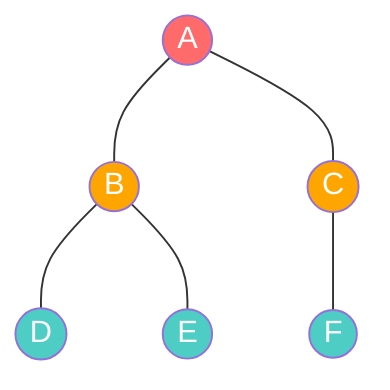

> Visit order from A: **A → B, C → D, E, F** (level by level)

```typescript
function bfs(graph: Map<string, string[]>, start: string): string[] {
  const visited = new Set<string>();
  const result: string[] = [];
  const queue: string[] = [start];
  visited.add(start);

  while (queue.length > 0) {
    const vertex = queue.shift()!;
    result.push(vertex);

    for (const neighbor of graph.get(vertex) || []) {
      if (!visited.has(neighbor)) {
        visited.add(neighbor);
        queue.push(neighbor);
      }
    }
  }

  return result;
}
```

### DFS Traversal

DFS goes **as deep as possible** before backtracking. Uses a **stack** (or recursion).

> Visit order from A: **A → B → D → E → C → F** (deep first)

**Recursive DFS:**

```typescript
function dfsRecursive(graph: Map<string, string[]>, start: string): string[] {
  const visited = new Set<string>();
  const result: string[] = [];

  function dfs(vertex: string): void {
    visited.add(vertex);
    result.push(vertex);

    for (const neighbor of graph.get(vertex) || []) {
      if (!visited.has(neighbor)) {
        dfs(neighbor);
      }
    }
  }

  dfs(start);
  return result;
}
```

**Iterative DFS:**

```typescript
function dfsIterative(graph: Map<string, string[]>, start: string): string[] {
  const visited = new Set<string>();
  const result: string[] = [];
  const stack: string[] = [start];

  while (stack.length > 0) {
    const vertex = stack.pop()!;

    if (visited.has(vertex)) continue;
    visited.add(vertex);
    result.push(vertex);

    for (const neighbor of graph.get(vertex) || []) {
      if (!visited.has(neighbor)) {
        stack.push(neighbor);
      }
    }
  }

  return result;
}
```

### BFS vs DFS — When to Use Which?

| | BFS | DFS |
|---|---|---|
| **Data structure** | Queue | Stack / Recursion |
| **Explores** | Level by level | Deep first |
| **Shortest path** | ✅ Yes (unweighted) | ❌ No |
| **Space** | O(width of graph) | O(depth of graph) |
| **Use for** | Shortest path, level-order | Connectivity, cycle detection, topological sort |
| **Grid problems** | "Rotting Oranges" style | "Number of Islands" style |

---

## 🧠 Essential Graph Algorithms for LeetCode

### 1. BFS for Shortest Path (Unweighted)

**Why BFS guarantees shortest path**: BFS explores nodes in order of their distance from the source. When it first reaches a node, that's the shortest possible distance (every edge = 1 step).

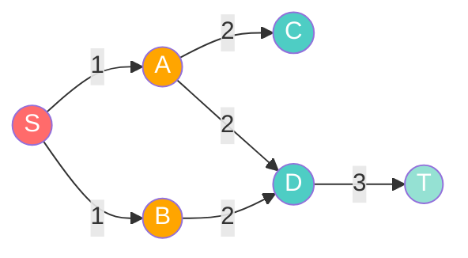

> Numbers on edges show the **distance from S** when BFS discovers each node. S→B→D→T = distance 3 (shortest!).

```typescript
function bfsShortestPath(
  graph: Map<number, number[]>,
  start: number,
  end: number
): number {
  const visited = new Set<number>();
  const queue: [number, number][] = [[start, 0]]; // [node, distance]
  visited.add(start);

  while (queue.length > 0) {
    const [node, dist] = queue.shift()!;

    if (node === end) return dist;

    for (const neighbor of graph.get(node) || []) {
      if (!visited.has(neighbor)) {
        visited.add(neighbor);
        queue.push([neighbor, dist + 1]);
      }
    }
  }

  return -1; // no path exists
}
```

---

### 2. DFS for Connectivity

**Find all connected components** — classic "Number of Provinces" pattern:

```typescript
function countConnectedComponents(
  n: number,
  edges: number[][]
): number {
  const graph = new Map<number, number[]>();
  for (let i = 0; i < n; i++) graph.set(i, []);
  for (const [u, v] of edges) {
    graph.get(u)!.push(v);
    graph.get(v)!.push(u);
  }

  const visited = new Set<number>();
  let components = 0;

  for (let i = 0; i < n; i++) {
    if (!visited.has(i)) {
      components++;
      // DFS to mark all nodes in this component
      const stack = [i];
      while (stack.length > 0) {
        const node = stack.pop()!;
        if (visited.has(node)) continue;
        visited.add(node);
        for (const neighbor of graph.get(node)!) {
          if (!visited.has(neighbor)) stack.push(neighbor);
        }
      }
    }
  }

  return components;
}
```

---

### 3. 🔄 Cycle Detection

#### Undirected Graph — DFS with Parent Tracking

If we visit a node that's already visited **and it's not the parent** who sent us there → **cycle found**.

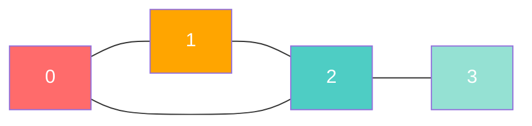

> 0→1→2→0 is a cycle!

```typescript
function hasCycleUndirected(
  n: number,
  edges: number[][]
): boolean {
  const graph = new Map<number, number[]>();
  for (let i = 0; i < n; i++) graph.set(i, []);
  for (const [u, v] of edges) {
    graph.get(u)!.push(v);
    graph.get(v)!.push(u);
  }

  const visited = new Set<number>();

  function dfs(node: number, parent: number): boolean {
    visited.add(node);
    for (const neighbor of graph.get(node)!) {
      if (!visited.has(neighbor)) {
        if (dfs(neighbor, node)) return true;
      } else if (neighbor !== parent) {
        return true; // cycle detected!
      }
    }
    return false;
  }

  for (let i = 0; i < n; i++) {
    if (!visited.has(i)) {
      if (dfs(i, -1)) return true;
    }
  }

  return false;
}
```

#### Directed Graph — DFS with Three Colors (States)

Use three states: **WHITE** (unvisited), **GRAY** (in current path), **BLACK** (fully processed).

If we hit a GRAY node → **back edge → cycle!**

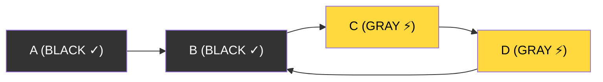

> D→B is a back edge (B is GRAY) → Cycle detected!

```typescript
function hasCycleDirected(
  n: number,
  edges: number[][]
): boolean {
  const graph = new Map<number, number[]>();
  for (let i = 0; i < n; i++) graph.set(i, []);
  for (const [u, v] of edges) {
    graph.get(u)!.push(v);
  }

  const WHITE = 0, GRAY = 1, BLACK = 2;
  const color = new Array(n).fill(WHITE);

  function dfs(node: number): boolean {
    color[node] = GRAY;
    for (const neighbor of graph.get(node)!) {
      if (color[neighbor] === GRAY) return true;    // back edge = cycle
      if (color[neighbor] === WHITE && dfs(neighbor)) return true;
    }
    color[node] = BLACK;
    return false;
  }

  for (let i = 0; i < n; i++) {
    if (color[i] === WHITE && dfs(i)) return true;
  }

  return false;
}
```

---

### 4. 📋 Topological Sort

A **topological ordering** of a DAG arranges nodes so every edge goes from earlier to later. Think: **course prerequisites** — you must take Math 101 before Math 201.

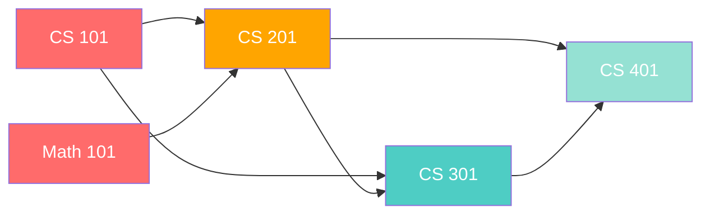

> Valid topological order: `CS101 → MATH101 → CS201 → CS301 → CS401`

#### Kahn's Algorithm (BFS with In-Degree) — Preferred for LeetCode

1. Calculate in-degree for every node
2. Add all nodes with in-degree 0 to queue
3. Process queue: for each node, reduce in-degree of neighbors
4. If a neighbor's in-degree becomes 0, add to queue
5. If result contains all nodes → valid order. Otherwise → cycle exists!

```typescript
function topologicalSort(
  n: number,
  edges: number[][]
): number[] {
  const graph = new Map<number, number[]>();
  const inDegree = new Array(n).fill(0);

  for (let i = 0; i < n; i++) graph.set(i, []);
  for (const [u, v] of edges) {
    graph.get(u)!.push(v);
    inDegree[v]++;
  }

  const queue: number[] = [];
  for (let i = 0; i < n; i++) {
    if (inDegree[i] === 0) queue.push(i);
  }

  const result: number[] = [];
  while (queue.length > 0) {
    const node = queue.shift()!;
    result.push(node);

    for (const neighbor of graph.get(node)!) {
      inDegree[neighbor]--;
      if (inDegree[neighbor] === 0) {
        queue.push(neighbor);
      }
    }
  }

  // If result doesn't contain all nodes, there's a cycle
  return result.length === n ? result : [];
}
```

#### DFS-Based Topological Sort

```typescript
function topologicalSortDFS(
  n: number,
  edges: number[][]
): number[] {
  const graph = new Map<number, number[]>();
  for (let i = 0; i < n; i++) graph.set(i, []);
  for (const [u, v] of edges) {
    graph.get(u)!.push(v);
  }

  const visited = new Set<number>();
  const stack: number[] = [];

  function dfs(node: number): void {
    visited.add(node);
    for (const neighbor of graph.get(node)!) {
      if (!visited.has(neighbor)) dfs(neighbor);
    }
    stack.push(node); // add AFTER processing all descendants
  }

  for (let i = 0; i < n; i++) {
    if (!visited.has(i)) dfs(i);
  }

  return stack.reverse();
}
```

---

### 5. 🌲 Union-Find (Disjoint Set Union)

Union-Find tracks which elements belong to the same group. Two key operations:
- **find(x)** — which group does x belong to?
- **union(x, y)** — merge groups containing x and y

Two critical optimizations:
- **Path Compression** — during `find`, point every node directly to root
- **Union by Rank** — attach smaller tree under root of larger tree

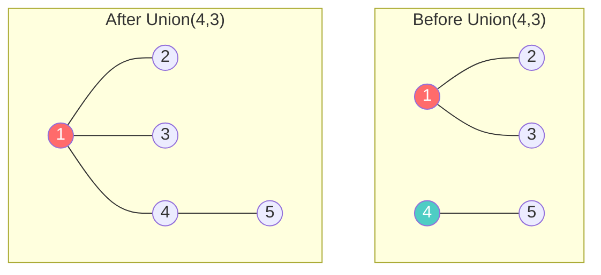

```typescript
class UnionFind {
  private parent: number[];
  private rank: number[];
  public components: number;

  constructor(n: number) {
    this.parent = Array.from({ length: n }, (_, i) => i);
    this.rank = new Array(n).fill(0);
    this.components = n;
  }

  find(x: number): number {
    if (this.parent[x] !== x) {
      this.parent[x] = this.find(this.parent[x]); // path compression
    }
    return this.parent[x];
  }

  union(x: number, y: number): boolean {
    const rootX = this.find(x);
    const rootY = this.find(y);

    if (rootX === rootY) return false; // already connected

    // union by rank
    if (this.rank[rootX] < this.rank[rootY]) {
      this.parent[rootX] = rootY;
    } else if (this.rank[rootX] > this.rank[rootY]) {
      this.parent[rootY] = rootX;
    } else {
      this.parent[rootY] = rootX;
      this.rank[rootX]++;
    }

    this.components--;
    return true;
  }

  connected(x: number, y: number): boolean {
    return this.find(x) === this.find(y);
  }
}
```

**When to use Union-Find:**
- Count connected components
- Check if two nodes are connected
- Detect cycles in undirected graphs (if `union` returns `false`, the edge creates a cycle)
- "Redundant Connection" type problems

---

### 6. 🚀 Dijkstra's Algorithm

**Shortest path in a weighted graph** with non-negative weights. Uses a **min-heap (priority queue)**.

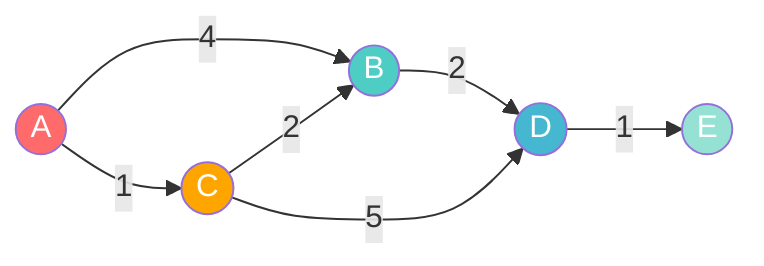

> Shortest path A→E: A→C(1)→B(3)→D(5)→E(6) = cost 6

**Step by step:**

| Step | Process | Distances | Priority Queue |
|------|---------|-----------|----------------|
| 0 | Start at A | A=0, B=∞, C=∞, D=∞, E=∞ | [(A,0)] |
| 1 | Process A | A=0, B=4, C=1, D=∞, E=∞ | [(C,1), (B,4)] |
| 2 | Process C | A=0, B=3, C=1, D=6, E=∞ | [(B,3), (B,4), (D,6)] |
| 3 | Process B | A=0, B=3, C=1, D=5, E=∞ | [(B,4), (D,5), (D,6)] |
| 4 | Process D | A=0, B=3, C=1, D=5, E=6 | [(D,6), (E,6)] |
| 5 | Process E | Done! | [] |

```typescript
function dijkstra(
  graph: Map<number, [number, number][]>, // node -> [neighbor, weight][]
  start: number
): Map<number, number> {
  const dist = new Map<number, number>();
  for (const node of graph.keys()) {
    dist.set(node, Infinity);
  }
  dist.set(start, 0);

  // Simple priority queue using array (use a real min-heap for production)
  const pq: [number, number][] = [[0, start]]; // [distance, node]

  while (pq.length > 0) {
    pq.sort((a, b) => a[0] - b[0]);
    const [d, u] = pq.shift()!;

    if (d > dist.get(u)!) continue; // skip outdated entries

    for (const [v, weight] of graph.get(u) || []) {
      const newDist = d + weight;
      if (newDist < dist.get(v)!) {
        dist.set(v, newDist);
        pq.push([newDist, v]);
      }
    }
  }

  return dist;
}
```

> 💡 For LeetCode, sorting the array each iteration works fine. For production code, use a proper min-heap.

---

### 7. 🏝️ Grid as Graph — The "Number of Islands" Pattern

Many LeetCode problems give you a **2D grid** that's actually an implicit graph:
- Each **cell** is a node
- Each cell connects to its **4 neighbors** (up, down, left, right)
- No need to build an adjacency list — just use the grid directly!

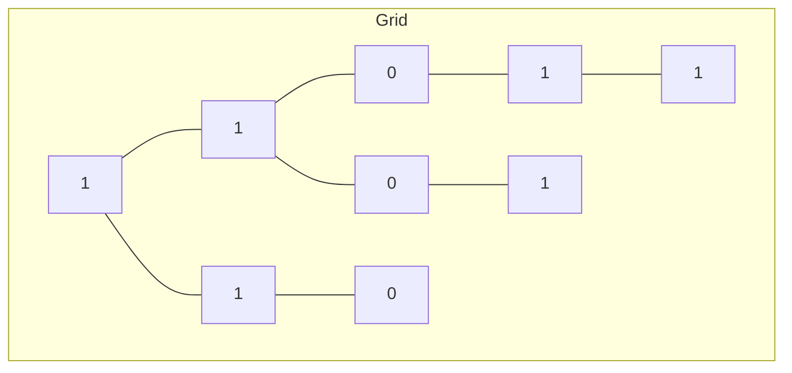

The 4-directional neighbor pattern:

```typescript
const DIRECTIONS = [
  [0, 1],   // right
  [0, -1],  // left
  [1, 0],   // down
  [-1, 0],  // up
];

function getNeighbors(
  row: number,
  col: number,
  rows: number,
  cols: number
): [number, number][] {
  const neighbors: [number, number][] = [];
  for (const [dr, dc] of DIRECTIONS) {
    const r = row + dr;
    const c = col + dc;
    if (r >= 0 && r < rows && c >= 0 && c < cols) {
      neighbors.push([r, c]);
    }
  }
  return neighbors;
}
```

**Number of Islands:**

```typescript
function numIslands(grid: string[][]): number {
  if (grid.length === 0) return 0;

  const rows = grid.length;
  const cols = grid[0].length;
  let islands = 0;

  function dfs(r: number, c: number): void {
    if (r < 0 || r >= rows || c < 0 || c >= cols) return;
    if (grid[r][c] !== "1") return;

    grid[r][c] = "0"; // mark visited by sinking the island
    dfs(r + 1, c);
    dfs(r - 1, c);
    dfs(r, c + 1);
    dfs(r, c - 1);
  }

  for (let r = 0; r < rows; r++) {
    for (let c = 0; c < cols; c++) {
      if (grid[r][c] === "1") {
        islands++;
        dfs(r, c);
      }
    }
  }

  return islands;
}
```

---

## ⏱️ Complexity Table

| Algorithm | Time Complexity | Space Complexity | Notes |
|-----------|----------------|------------------|-------|
| **BFS** | O(V + E) | O(V) | Queue + visited set |
| **DFS** | O(V + E) | O(V) | Stack/recursion + visited set |
| **Dijkstra** (min-heap) | O((V + E) log V) | O(V) | With binary heap |
| **Topological Sort** (Kahn's) | O(V + E) | O(V) | BFS-based, needs in-degree array |
| **Topological Sort** (DFS) | O(V + E) | O(V) | Recursive |
| **Union-Find** (optimized) | O(α(n)) per op | O(V) | α(n) ≈ constant (inverse Ackermann) |
| **Cycle Detection** | O(V + E) | O(V) | DFS-based |
| **Number of Islands** (grid) | O(R × C) | O(R × C) | R = rows, C = cols |

> 💡 V = vertices, E = edges. For grids: V = R×C, E = 4×R×C

---

## 🎯 LeetCode Patterns Cheat Sheet

| When you see... | Think... | Algorithm |
|----------------|----------|-----------|
| "Number of islands" / "connected components" | Flood fill each component | BFS/DFS or Union-Find |
| "Course schedule" / "prerequisites" / "task ordering" | Dependencies → DAG → ordering | Topological Sort |
| "Shortest path" (unweighted) | Every edge = 1 step | BFS |
| "Shortest path" (weighted, non-negative) | Weighted edges | Dijkstra |
| "Is there a path from A to B?" | Reachability | BFS or DFS |
| "Network delay" / "cheapest flight" | Weighted shortest path | Dijkstra / Modified BFS |
| "Redundant connection" / "is graph a tree?" | Cycle detection in undirected | Union-Find |
| "Rotting oranges" / "walls and gates" | Multi-source BFS (level by level) | BFS from all sources |
| "Clone graph" / "deep copy" | Traverse + map old→new | BFS/DFS with HashMap |
| "Word ladder" / "gene mutation" | Transform one string to another | BFS (each state = node) |
| "Alien dictionary" / "order of characters" | Derive ordering from constraints | Topological Sort |
| 2D grid with 1s and 0s | Grid = implicit graph | BFS/DFS with 4-dir neighbors |

### 🧩 Decision Flowchart

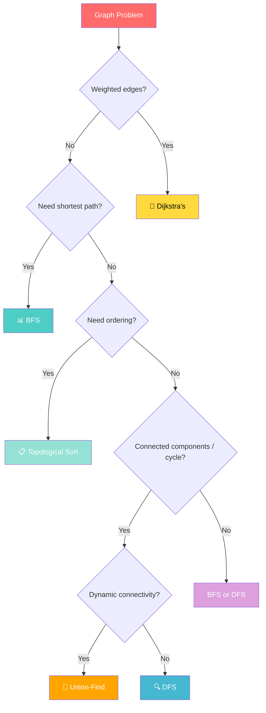

---

## ⚠️ Common Pitfalls

### 1. 😱 Forgetting the Visited Set → Infinite Loop!

```typescript
// ❌ BAD — will loop forever on cyclic graphs
function bfsBad(graph: Map<number, number[]>, start: number): void {
  const queue = [start];
  while (queue.length > 0) {
    const node = queue.shift()!;
    for (const neighbor of graph.get(node) || []) {
      queue.push(neighbor); // re-visits nodes endlessly!
    }
  }
}

// ✅ GOOD — always use a visited set
function bfsGood(graph: Map<number, number[]>, start: number): void {
  const visited = new Set<number>();
  const queue = [start];
  visited.add(start);
  while (queue.length > 0) {
    const node = queue.shift()!;
    for (const neighbor of graph.get(node) || []) {
      if (!visited.has(neighbor)) {
        visited.add(neighbor);
        queue.push(neighbor);
      }
    }
  }
}
```

### 2. 🔀 Not Handling Disconnected Graphs

```typescript
// ❌ BAD — only processes one component
function countComponentsBad(n: number, graph: Map<number, number[]>): number {
  const visited = new Set<number>();
  dfs(0, graph, visited);
  return 1; // assumes everything is connected
}

// ✅ GOOD — loop through ALL nodes
function countComponentsGood(n: number, graph: Map<number, number[]>): number {
  const visited = new Set<number>();
  let count = 0;
  for (let i = 0; i < n; i++) {
    if (!visited.has(i)) {
      count++;
      dfs(i, graph, visited);
    }
  }
  return count;
}
```

### 3. 🔄 Directed vs Undirected Edge Building

```typescript
// For UNDIRECTED graphs — add BOTH directions
for (const [u, v] of edges) {
  graph.get(u)!.push(v);
  graph.get(v)!.push(u); // ← don't forget this!
}

// For DIRECTED graphs — add only ONE direction
for (const [u, v] of edges) {
  graph.get(u)!.push(v);
  // NO reverse edge
}
```

### 4. 🔢 0-Indexed vs 1-Indexed Nodes

Some LeetCode problems use nodes numbered 1 to n (not 0 to n-1). Always check!

```typescript
// If nodes are 1-indexed, allocate n+1 space
const inDegree = new Array(n + 1).fill(0);

// Or convert to 0-indexed
for (const [u, v] of edges) {
  graph.get(u - 1)!.push(v - 1);
}
```

### 5. 🏝️ Grid Problems — Out of Bounds

Always check bounds before accessing grid cells:

```typescript
// ❌ BAD — will crash
grid[r + 1][c]; // r+1 might be out of bounds

// ✅ GOOD — bounds check first
if (r + 1 < rows && grid[r + 1][c] === "1") { ... }
```

---

## 🔑 Key Takeaways

1. **Graphs model relationships** — whenever a problem involves connections between things, think graph.

2. **Adjacency list** is your go-to representation for LeetCode (sparse, efficient, easy to build from edge list).

3. **BFS = shortest path** (unweighted). BFS explores level-by-level, guaranteeing shortest distance first.

4. **DFS = exploration/connectivity**. Great for connected components, cycle detection, topological sort.

5. **Topological Sort** = ordering with dependencies (course schedule, build systems). Use Kahn's algorithm with in-degree for LeetCode.

6. **Union-Find** = dynamic connectivity. O(α(n)) per operation. Perfect for "are these connected?" and cycle detection in undirected graphs.

7. **Dijkstra** = shortest path in weighted graphs. Uses priority queue. O((V+E) log V).

8. **Grid = implicit graph**. Don't build an adjacency list — use 4-directional neighbors directly.

9. **Always use a visited set** to prevent infinite loops in cyclic graphs.

10. **Read the problem carefully**: directed vs undirected, 0-indexed vs 1-indexed, weighted vs unweighted.

---

## 📋 Practice Problems

### 🟢 Easy
| # | Problem | Pattern |
|---|---------|---------|
| 1971 | [Find if Path Exists in Graph](https://leetcode.com/problems/find-if-path-exists-in-graph/) | BFS/DFS or Union-Find |

### 🟡 Medium
| # | Problem | Pattern |
|---|---------|---------|
| 200 | [Number of Islands](https://leetcode.com/problems/number-of-islands/) | Grid DFS/BFS |
| 133 | [Clone Graph](https://leetcode.com/problems/clone-graph/) | BFS/DFS + HashMap |
| 207 | [Course Schedule](https://leetcode.com/problems/course-schedule/) | Topological Sort (cycle detection) |
| 210 | [Course Schedule II](https://leetcode.com/problems/course-schedule-ii/) | Topological Sort (Kahn's) |
| 417 | [Pacific Atlantic Water Flow](https://leetcode.com/problems/pacific-atlantic-water-flow/) | Multi-source DFS/BFS |
| 547 | [Number of Provinces](https://leetcode.com/problems/number-of-provinces/) | Connected Components / Union-Find |
| 994 | [Rotting Oranges](https://leetcode.com/problems/rotting-oranges/) | Multi-source BFS |
| 743 | [Network Delay Time](https://leetcode.com/problems/network-delay-time/) | Dijkstra's Algorithm |

### 🔴 Hard
| # | Problem | Pattern |
|---|---------|---------|
| 127 | [Word Ladder](https://leetcode.com/problems/word-ladder/) | BFS (word transformation) |
| 269 | [Alien Dictionary](https://leetcode.com/problems/alien-dictionary/) | Topological Sort |
| 787 | [Cheapest Flights Within K Stops](https://leetcode.com/problems/cheapest-flights-within-k-stops/) | Modified Dijkstra / BFS |

---

> 🧠 **Pro tip:** When stuck on a graph problem, ask yourself:
> 1. What are my **nodes**?
> 2. What are my **edges**?
> 3. Is it **directed** or **undirected**?
> 4. Is it **weighted** or **unweighted**?
> 5. Do I need **shortest path**, **connectivity**, or **ordering**?
>
> Answer these five questions, and the algorithm choice becomes obvious.
