# 🌳 Chapter 8: Tries (Prefix Trees)

> *"The data structure that reads your mind — one letter at a time."*

---

## 🌍 Real-World Analogy

### Your Phone's Autocomplete

Every time you type on your phone, a trie is working behind the scenes.

Type **"h"** → suggestions: *"hello", "help", "hey", "home"*
Type **"he"** → narrows to: *"hello", "help", "hey", "helmet"*
Type **"hel"** → narrows to: *"hello", "help", "helmet"*
Type **"hell"** → narrows to: *"hello"*

Each keystroke moves you **one level deeper** in the trie. The suggestions are all the words reachable from your current node. The deeper you go, the fewer branches remain — the predictions get sharper.

### A Letter-by-Letter Dictionary

Imagine a dictionary organized not by full words alphabetically, but **letter by letter**:

- All words starting with **"a"** are in one massive branch
- Within that, all words starting with **"ap"** share a sub-branch
- Within *that*, **"app"** narrows further: *apple, application, apply, append*

```
Traditional Dictionary:     Trie Dictionary:
┌─────────────┐             a → p → p → l → e ✓
│ apple       │                           → i → c → a → t → i → o → n ✓
│ application │                           → l → y ✓
│ apply       │                       → e → n → d ✓
│ append      │
└─────────────┘
```

Every word sharing a prefix **shares the same path** in the trie. This is the fundamental insight — and it's why tries are unbeatable for prefix-based operations.

---

## 📝 What & Why

### What Is a Trie?

A **trie** (pronounced "try", from re**trie**val) is a tree-shaped data structure where:

- Each **node** represents a single character
- Each **path** from root to a marked node spells out a word
- The **root** is empty (represents the empty string)
- Nodes have an **isEndOfWord** flag to distinguish complete words from mere prefixes

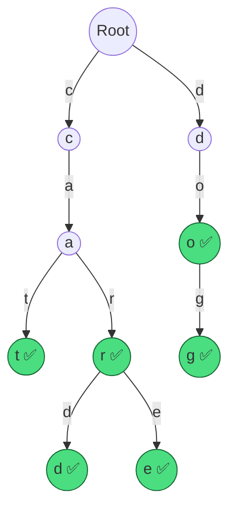

> ✅ = `isEndOfWord` is true — this node completes a valid word.

The trie above stores: **cat, car, card, care, do, dog**

### Why Does It Exist?

| Aspect | Hash Map | Trie |
|--------|----------|------|
| Single word lookup | ✅ O(L) average | ✅ O(L) guaranteed |
| "Find all words starting with X" | ❌ Must scan everything | ✅ O(P + K) where P=prefix, K=matches |
| Ordered iteration | ❌ No ordering | ✅ Lexicographic order for free |
| Memory per word | ✅ Compact | ⚠️ Node overhead per character |
| Autocomplete | ❌ Not feasible | ✅ Built for this |
| Spell checking | ❌ Awkward | ✅ Natural fit |

**The killer feature**: Hash maps can tell you "does this exact word exist?" but they **cannot** efficiently answer "what words start with this prefix?" A trie answers both.

### Where Tries Are Used in the Real World

| Application | How the Trie Helps |
|-------------|-------------------|
| 📱 **Autocomplete** | Traverse to prefix node, DFS to find all completions |
| 📖 **Spell Checkers** | Check if word exists; suggest similar words |
| 🌐 **IP Routing** | Longest prefix matching for routing tables |
| 📞 **T9 Predictive Text** | Map number sequences to words |
| 🔍 **Search Engines** | Suggest queries as user types |
| 🧬 **Bioinformatics** | Store and search DNA sequences |

---

## ⚙️ How It Works

### Building the Trie: Inserting Words

Let's insert the words **"cat"**, **"car"**, **"card"**, **"care"**, **"do"**, **"dog"** one by one.

#### Step 1: Insert "cat"

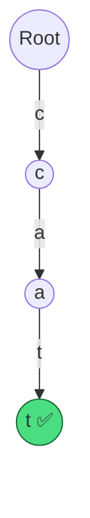

Create nodes `c → a → t`, mark `t` as end-of-word.

#### Step 2: Insert "car"

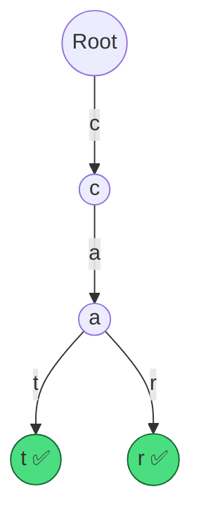

`c` and `a` already exist — reuse them! Only create `r` and mark as end-of-word.

#### Step 3: Insert "card"

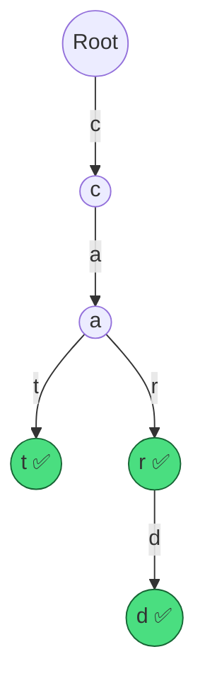

`c → a → r` already exist. Add `d` after `r`, mark as end-of-word.

#### Step 4: Insert "care"

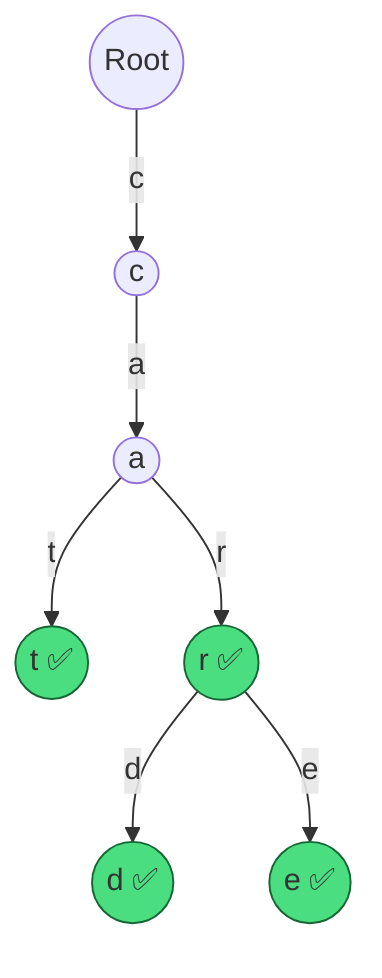

`c → a → r` already exist. Add `e` after `r`, mark as end-of-word.

#### Final Trie (all 6 words)


### Searching the Trie

#### Search "car" → ✅ Found

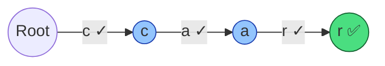

Traverse `c → a → r`. Node `r` has `isEndOfWord = true`. **Word found!**

#### Search "ca" → ❌ Not Found (but prefix exists!)

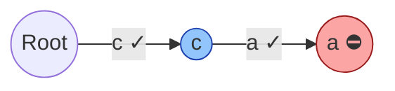

Traverse `c → a`. Node `a` has `isEndOfWord = false`. The prefix "ca" exists, but **"ca" is not a stored word**. This is the critical distinction!

#### startsWith "ca" → ✅ Prefix Exists

Same traversal as above, but we **don't** check `isEndOfWord`. We only care: *did we reach the end of the prefix without falling off the trie?* Yes → prefix exists.

### Deleting from the Trie

Deletion is the trickiest operation because of **shared prefixes**.

#### Delete "car" from the trie containing {car, card, care}

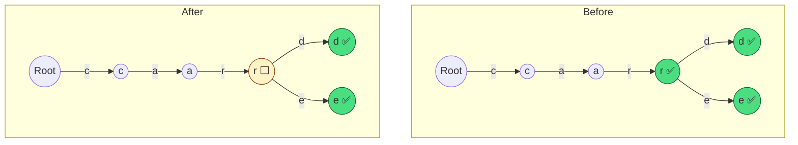

We **cannot** delete nodes `c → a → r` because "card" and "care" need them. We only flip `isEndOfWord = false` on the `r` node.

#### Deletion Rules:

| Scenario | Action |
|----------|--------|
| Word's last node has children | Just set `isEndOfWord = false` |
| Word's last node has no children | Delete nodes back up the chain until you hit a node that is end-of-word or has other children |
| Word doesn't exist in trie | Do nothing |

---

## 💻 TypeScript Implementation

### TrieNode Class

```typescript
class TrieNode {
  children: Map<string, TrieNode>;
  isEndOfWord: boolean;

  constructor() {
    this.children = new Map();
    this.isEndOfWord = false;
  }
}
```

### Full Trie Class

```typescript
class Trie {
  root: TrieNode;

  constructor() {
    this.root = new TrieNode();
  }

  // ── Insert a word into the trie ──
  insert(word: string): void {
    let node = this.root;
    for (const char of word) {
      if (!node.children.has(char)) {
        node.children.set(char, new TrieNode());
      }
      node = node.children.get(char)!;
    }
    node.isEndOfWord = true;
  }

  // ── Search for an exact word ──
  search(word: string): boolean {
    const node = this.findNode(word);
    return node !== null && node.isEndOfWord;
  }

  // ── Check if any word starts with the given prefix ──
  startsWith(prefix: string): boolean {
    return this.findNode(prefix) !== null;
  }

  // ── Delete a word from the trie ──
  delete(word: string): boolean {
    return this.deleteHelper(this.root, word, 0);
  }

  private deleteHelper(node: TrieNode, word: string, depth: number): boolean {
    if (depth === word.length) {
      if (!node.isEndOfWord) return false; // word doesn't exist
      node.isEndOfWord = false;
      return node.children.size === 0; // signal parent to delete this node
    }

    const char = word[depth];
    const child = node.children.get(char);
    if (!child) return false;

    const shouldDeleteChild = this.deleteHelper(child, word, depth + 1);

    if (shouldDeleteChild) {
      node.children.delete(char);
      return !node.isEndOfWord && node.children.size === 0;
    }

    return false;
  }

  // ── Count words that start with a given prefix ──
  countWordsWithPrefix(prefix: string): number {
    const node = this.findNode(prefix);
    if (!node) return 0;
    return this.countWords(node);
  }

  private countWords(node: TrieNode): number {
    let count = node.isEndOfWord ? 1 : 0;
    for (const child of node.children.values()) {
      count += this.countWords(child);
    }
    return count;
  }

  // ── Autocomplete: get all words with a given prefix ──
  getAllWordsWithPrefix(prefix: string): string[] {
    const node = this.findNode(prefix);
    if (!node) return [];
    const results: string[] = [];
    this.collectWords(node, prefix, results);
    return results;
  }

  private collectWords(node: TrieNode, currentWord: string, results: string[]): void {
    if (node.isEndOfWord) {
      results.push(currentWord);
    }
    for (const [char, child] of node.children) {
      this.collectWords(child, currentWord + char, results);
    }
  }

  // ── Helper: traverse to the node at end of prefix ──
  private findNode(prefix: string): TrieNode | null {
    let node = this.root;
    for (const char of prefix) {
      if (!node.children.has(char)) return null;
      node = node.children.get(char)!;
    }
    return node;
  }
}
```

### 🗂️ Map vs. Fixed Array — Tradeoffs

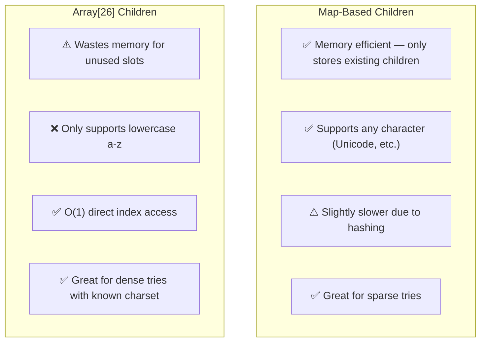

| Feature | `Map<string, TrieNode>` | `TrieNode[26]` (fixed array) |
|---------|------------------------|------------------------------|
| Memory | Only allocates for existing chars | Always allocates 26 slots |
| Character set | Any Unicode character | Only `a-z` (or whatever size) |
| Access speed | O(1) amortized (hash) | O(1) direct index |
| Checking "has children" | `map.size === 0` | Must scan all 26 slots |
| Best for | LeetCode, general use | Performance-critical, known charset |

**For LeetCode**: Use `Map`. It's cleaner, more flexible, and interviewers appreciate readable code.

**Array-based access pattern** (if you need it):

```typescript
// Array-based TrieNode for lowercase a-z only
class TrieNodeArray {
  children: (TrieNodeArray | null)[];
  isEndOfWord: boolean;

  constructor() {
    this.children = new Array(26).fill(null);
    this.isEndOfWord = false;
  }

  // Convert character to index: 'a' → 0, 'b' → 1, ..., 'z' → 25
  static charIndex(c: string): number {
    return c.charCodeAt(0) - 'a'.charCodeAt(0);
  }
}
```

---

## 🧩 Essential Trie Techniques for LeetCode

### 1️⃣ Basic Trie Operations (Implement Trie)

The foundational problem. Implement `insert`, `search`, `startsWith`.

```typescript
// This is the Trie class shown above — that's literally the answer.
// Key insight: search checks isEndOfWord, startsWith does not.
```

### 2️⃣ Autocomplete / Prefix Search

**Pattern**: Navigate to the prefix node, then DFS to collect all completions.

```typescript
function autocomplete(trie: Trie, prefix: string): string[] {
  return trie.getAllWordsWithPrefix(prefix);
}

// Example:
// Trie contains: ["hello", "help", "helmet", "hero", "her"]
// autocomplete(trie, "hel") → ["hello", "help", "helmet"]
// autocomplete(trie, "her") → ["hero", "her"]
```

### 3️⃣ Word Search in Grid (Trie + Backtracking)

**Problem**: Given a 2D board of characters and a list of words, find all words that can be formed by sequentially adjacent cells.

**Why Trie?** Instead of searching the grid for each word separately (brute force), insert all words into a trie. Then do ONE DFS traversal of the grid, using the trie to prune branches early.

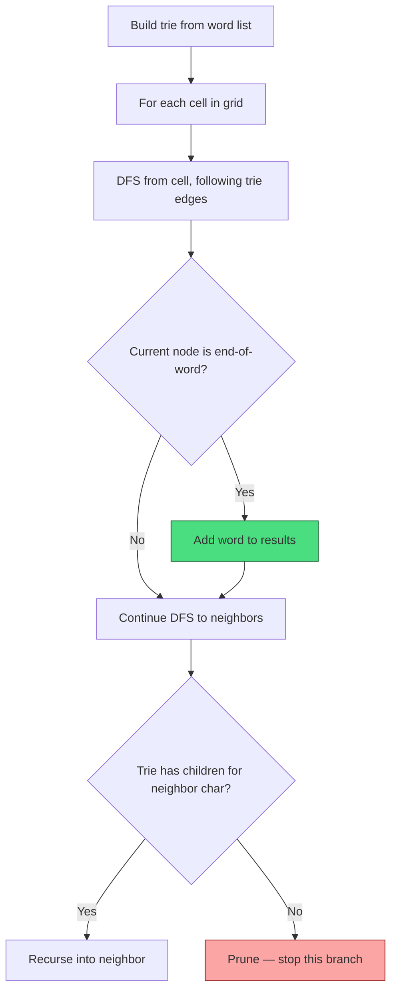

```typescript
function findWords(board: string[][], words: string[]): string[] {
  const trie = new Trie();
  for (const word of words) trie.insert(word);

  const result: Set<string> = new Set();
  const rows = board.length, cols = board[0].length;

  function dfs(r: number, c: number, node: TrieNode, path: string): void {
    if (r < 0 || r >= rows || c < 0 || c >= cols) return;
    if (board[r][c] === '#') return; // visited

    const char = board[r][c];
    const nextNode = node.children.get(char);
    if (!nextNode) return; // prune: no words down this path

    const newPath = path + char;
    if (nextNode.isEndOfWord) {
      result.add(newPath);
    }

    board[r][c] = '#'; // mark visited
    const dirs = [[0, 1], [0, -1], [1, 0], [-1, 0]];
    for (const [dr, dc] of dirs) {
      dfs(r + dr, c + dc, nextNode, newPath);
    }
    board[r][c] = char; // unmark
  }

  for (let r = 0; r < rows; r++) {
    for (let c = 0; c < cols; c++) {
      dfs(r, c, trie.root, '');
    }
  }

  return [...result];
}
```

### 4️⃣ Word Dictionary with Wildcards

**Problem**: Support adding words and searching with `.` as wildcard (matches any single character).

```typescript
class WordDictionary {
  root: TrieNode;

  constructor() {
    this.root = new TrieNode();
  }

  addWord(word: string): void {
    let node = this.root;
    for (const char of word) {
      if (!node.children.has(char)) {
        node.children.set(char, new TrieNode());
      }
      node = node.children.get(char)!;
    }
    node.isEndOfWord = true;
  }

  search(word: string): boolean {
    return this.dfs(this.root, word, 0);
  }

  private dfs(node: TrieNode, word: string, index: number): boolean {
    if (index === word.length) {
      return node.isEndOfWord;
    }

    const char = word[index];

    if (char === '.') {
      // Wildcard: try ALL children
      for (const child of node.children.values()) {
        if (this.dfs(child, word, index + 1)) return true;
      }
      return false;
    }

    // Normal character
    const child = node.children.get(char);
    if (!child) return false;
    return this.dfs(child, word, index + 1);
  }
}

// search("h.llo") → tries all children of 'h' node for second char
// If one path leads to 'e', continues: e → l → l → o → isEndOfWord? ✅
```

---

## ⏱️ Complexity Analysis

### Time Complexity

| Operation | Time | Explanation |
|-----------|------|-------------|
| `insert(word)` | **O(L)** | Traverse/create L nodes, where L = word length |
| `search(word)` | **O(L)** | Traverse L nodes |
| `startsWith(prefix)` | **O(P)** | Traverse P nodes, where P = prefix length |
| `delete(word)` | **O(L)** | Traverse L nodes + potential cleanup |
| `getAllWordsWithPrefix` | **O(P + K)** | P to reach prefix node, K = total chars in all matching words |
| `search with wildcard '.'` | **O(26^W · L)** | Worst case: W wildcards each branch 26 ways |

### Space Complexity

| Aspect | Space | Notes |
|--------|-------|-------|
| Trie with N words, avg length L | **O(N · L)** | Worst case: no shared prefixes |
| Trie with heavy prefix sharing | **Much less** | Shared prefixes = shared nodes |
| Single TrieNode (Map) | **O(K)** | K = number of distinct child characters |
| Single TrieNode (Array[26]) | **O(26) = O(1)** | Fixed regardless of children count |

### Comparison with Other Approaches

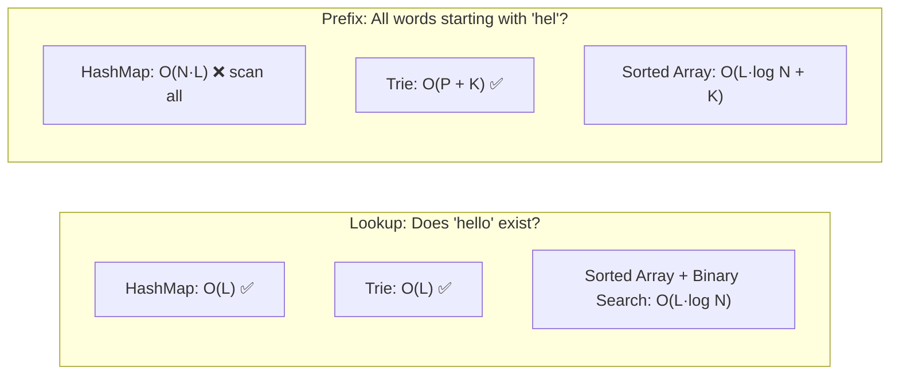

---

## 🎯 LeetCode Pattern Recognition

### When You See These Clues → Think Trie

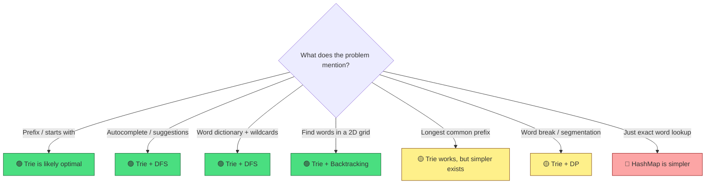

### Pattern Cheat Sheet

| Pattern | Problem Type | Approach |
|---------|-------------|----------|
| **"Implement Trie / prefix tree"** | Direct implementation | Build Trie with insert/search/startsWith |
| **"Search suggestions / autocomplete"** | Prefix collection | Trie + DFS from prefix node |
| **"Word search in 2D grid"** | Multi-word grid search | Trie + Backtracking (prune with trie) |
| **"Add and search word with wildcards"** | Flexible matching | Trie + DFS (branch on `.` wildcard) |
| **"Longest common prefix"** | Shared prefix | Trie (or horizontal scanning — often simpler) |
| **"Word break"** | String segmentation | Trie to check prefixes + DP for segmentation |
| **"Replace words"** | Root/prefix replacement | Trie to find shortest matching prefix |
| **"Map sum pairs"** | Prefix-keyed aggregation | Trie with values at nodes |

---

## ⚠️ Common Pitfalls

### 1. Confusing "Word Exists" with "Prefix Exists"

```typescript
// ❌ WRONG: This checks if the PREFIX exists, not the WORD
search(word: string): boolean {
  let node = this.root;
  for (const char of word) {
    if (!node.children.has(char)) return false;
    node = node.children.get(char)!;
  }
  return true; // 🐛 BUG! "ca" would return true even if only "cat" was inserted
}

// ✅ CORRECT: Must check isEndOfWord
search(word: string): boolean {
  let node = this.root;
  for (const char of word) {
    if (!node.children.has(char)) return false;
    node = node.children.get(char)!;
  }
  return node.isEndOfWord; // ✅ Only true if this is a complete word
}
```

> 🔥 **This is the #1 trie bug.** The `isEndOfWord` flag is the entire difference between `search` and `startsWith`.

### 2. Memory Overhead

Each TrieNode with an array-based approach allocates 26 pointers — even if most are null. For a trie with 10,000 words averaging 8 characters, that's potentially **80,000 nodes × 26 pointers = 2,080,000 pointers**. Use `Map` to avoid this waste.

### 3. Forgetting Edge Cases

| Edge Case | What Happens | Fix |
|-----------|-------------|-----|
| Empty string `""` | Root itself should be marked | Check at root level |
| Deleting a word that's a prefix of another | Must NOT delete shared nodes | Only flip `isEndOfWord` |
| Deleting a word that doesn't exist | Should be a no-op | Check existence first |
| Duplicate insertions | `isEndOfWord` set twice | Harmless, but be aware |

### 4. Deletion with Shared Prefixes

```
Trie contains: "car", "card", "care"

Delete "car":
  ❌ WRONG: Delete nodes c → a → r (destroys "card" and "care"!)
  ✅ RIGHT: Just set isEndOfWord = false on the 'r' node

Delete "card":
  ✅ RIGHT: Remove the 'd' node (no other word uses it),
            but keep c → a → r (still needed for "car" and "care")
```

### 5. Not Pruning in Word Search II

When using a trie for grid word search, **prune aggressively**:

```typescript
// After finding a word, remove its end-of-word marker to avoid duplicates
if (nextNode.isEndOfWord) {
  result.add(newPath);
  nextNode.isEndOfWord = false; // prune: don't find this word again
}

// If a trie branch has no more words, remove it entirely
if (nextNode.children.size === 0) {
  node.children.delete(char); // prune empty branches
}
```

---

## 🔑 Key Takeaways

1. **A trie trades space for prefix power.** Every prefix operation is O(L) regardless of dictionary size.

2. **`isEndOfWord` is everything.** Without it, you can't distinguish "car" (a word) from "car" (just a prefix of "card").

3. **Tries shine when the problem involves prefixes**: autocomplete, suggestions, prefix matching, wildcard search. If the problem only needs exact lookup, a HashMap is simpler.

4. **Use `Map`-based children for LeetCode.** It's cleaner, handles any character set, and uses memory proportional to actual content.

5. **Trie + DFS** is the go-to combo for collecting all words matching a pattern (autocomplete, wildcards).

6. **Trie + Backtracking** is the pattern for Word Search II — insert all target words into a trie, then traverse the grid once.

7. **Deletion is the hardest operation** because of shared prefixes. Always check if a node has children or is end-of-word before removing it.

8. **Pattern recognition**: "prefix", "starts with", "autocomplete", "word dictionary", "wildcard search", "word search in grid" → reach for a trie.

---

## 📋 Practice Problems

### 🟡 Medium

| # | Problem | Key Technique | Notes |
|---|---------|--------------|-------|
| 208 | **Implement Trie (Prefix Tree)** | Core trie ops | THE foundational trie problem — master this first |
| 211 | **Design Add and Search Words** | Trie + DFS wildcards | Handle `.` by branching through all children |
| 648 | **Replace Words** | Trie prefix matching | Find shortest prefix in trie for each word |
| 677 | **Map Sum Pairs** | Trie with values | Store values at nodes, sum all in subtree |
| 1268 | **Search Suggestions System** | Trie + DFS | Return top 3 lexicographic matches per prefix |
| 720 | **Longest Word in Dictionary** | Trie + BFS/DFS | Every prefix of the answer must also be a word |

### 🔴 Hard

| # | Problem | Key Technique | Notes |
|---|---------|--------------|-------|
| 212 | **Word Search II** | Trie + Backtracking | Multi-word grid search; prune with trie branches |
| 336 | **Palindrome Pairs** | Trie (reversed) | Insert reversed words; check for palindrome suffixes |
| 1032 | **Stream of Characters** | Trie (reversed) | Insert words reversed; match against recent stream |
| 472 | **Concatenated Words** | Trie + DP | Check if word is formed by concatenating others |

### 📈 Suggested Order

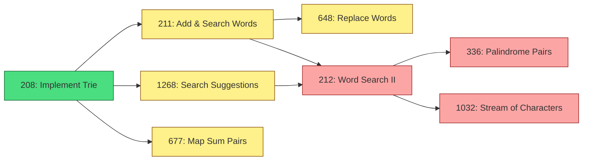

Start with **208** — it's the foundation. Everything else builds on it.

---

> *"A trie is just a tree that took a speed-reading course — it processes one letter at a time, but it never forgets a word."* 🌳
