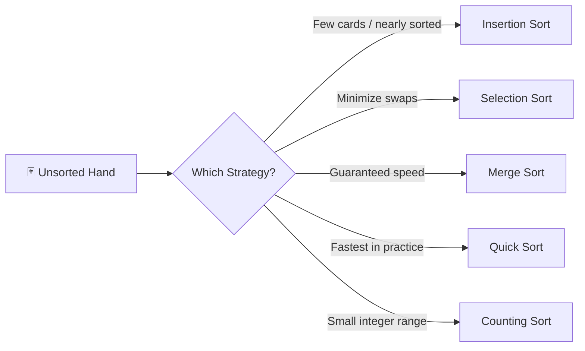
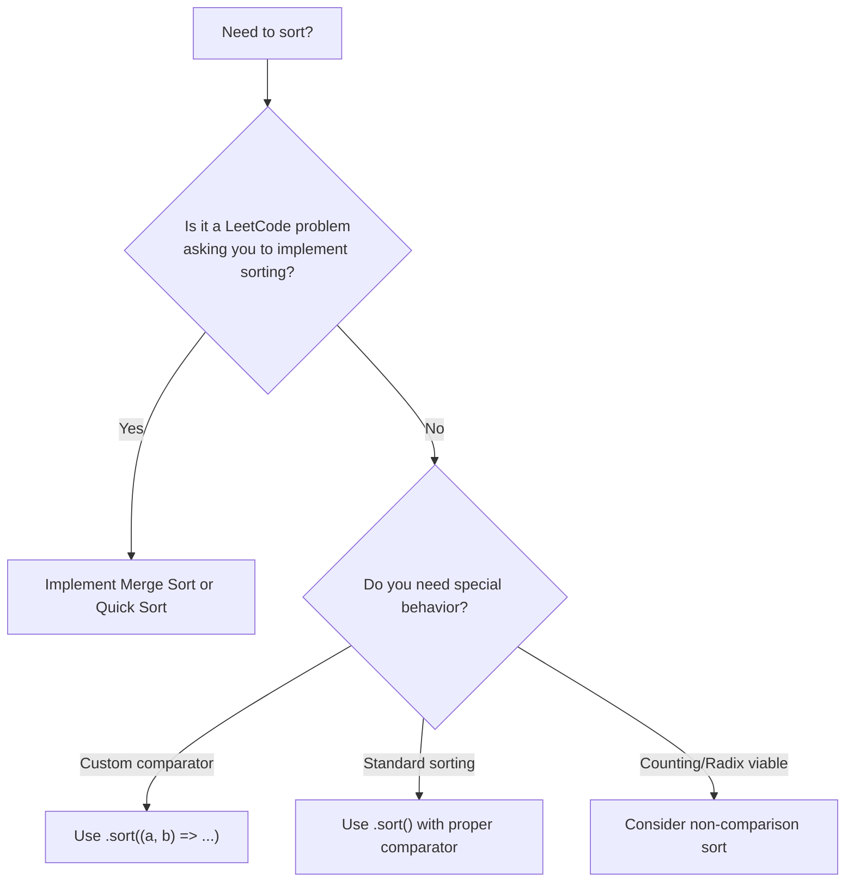
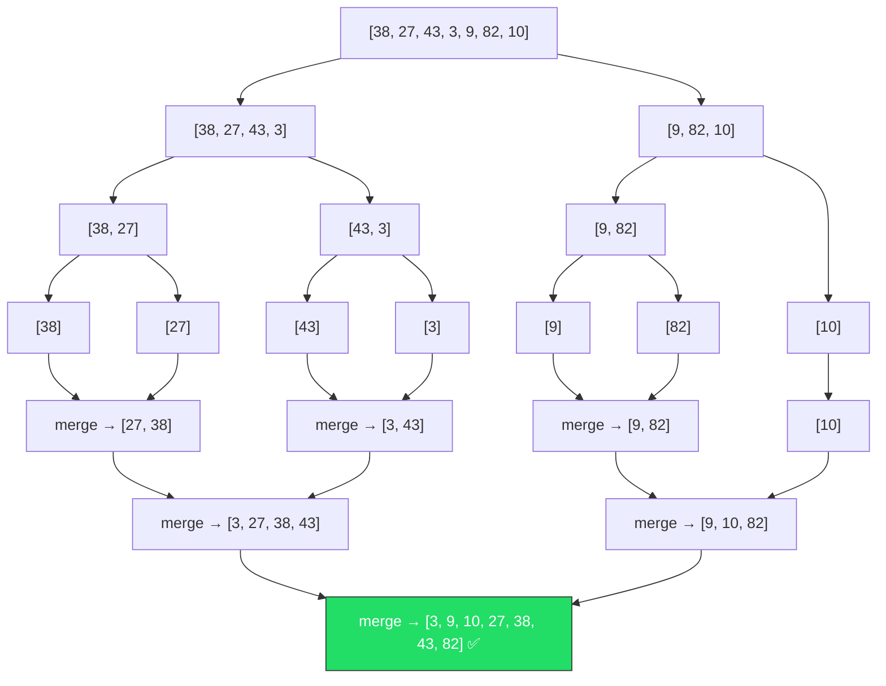
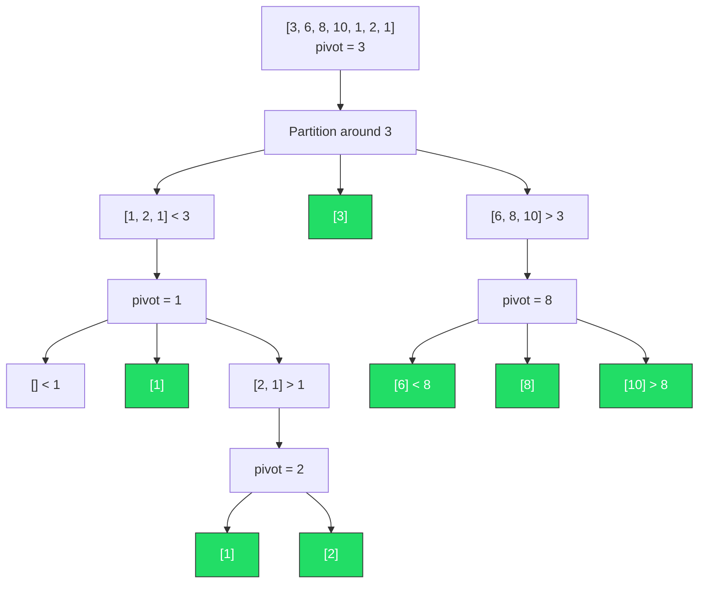
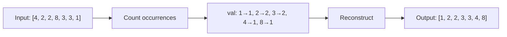
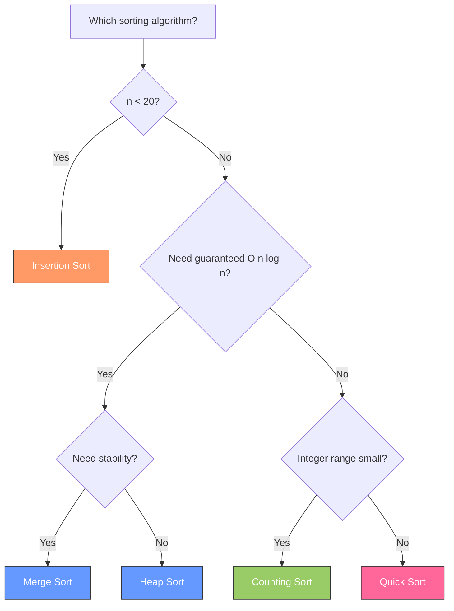
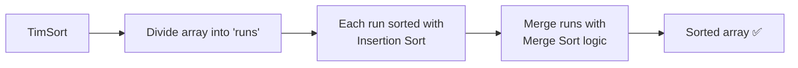
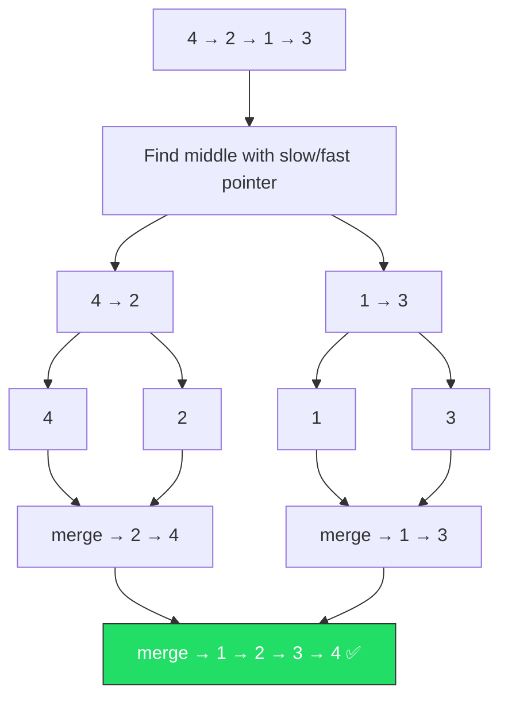
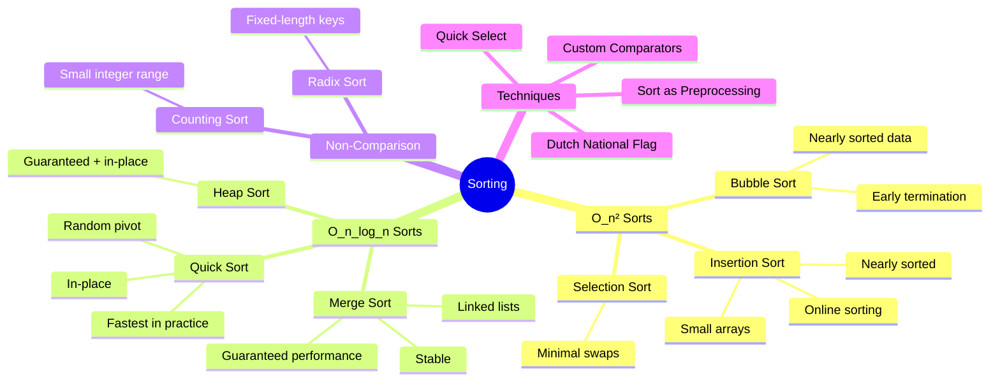

# Chapter 9: Sorting Algorithms 🔄

> _"Sorting is the most fundamental algorithmic problem in computer science."_ — Donald Knuth

---

## 🌍 Real-World Analogy — Sorting Playing Cards

Imagine you're dealt a hand of cards and need to arrange them in order.

**🃏 Insertion Sort** — How most people actually sort cards. You pick up one card at a time from the unsorted pile, scan through the cards already in your hand, find where the new card belongs, and slide the others over to make room. Simple, intuitive, and works great when you only have a few cards or they're already mostly in order.

**🃏 Selection Sort** — You spread all the cards face-up on the table. Scan through every card to find the absolute smallest one. Put it in position 1. Now scan the remaining cards for the next smallest. Put it in position 2. Repeat. You always know exactly how many swaps you'll make, but you have to scan everything each time.

**🃏 Merge Sort** — Split your deck in half. Give one half to a friend. You each sort your half (by splitting again and again until you have single cards). Then you both merge your sorted halves together by comparing top cards one at a time. Reliable and predictable — always takes the same amount of effort regardless of how shuffled the deck is.

**🃏 Quick Sort** — Pick a random card from the deck (the "pivot"). Toss every card smaller than the pivot to the left pile and every card bigger to the right pile. Now repeat for each pile. If you pick good pivots, this is blazingly fast. If you're unlucky with pivots, it's slow — but that rarely happens in practice.



---

## 📝 What & Why — Why Sorting Matters

### Why Do We Sort?

| Reason | Example |
|--------|---------|
| **Binary search requires sorted data** | Can't binary search an unsorted array |
| **Makes problems easier** | Finding duplicates in a sorted array is trivial |
| **Grouping** | Sorted data naturally groups equal elements |
| **Deduplication** | Adjacent duplicates are easy to remove |
| **Preprocessing step** | Many algorithms sort first, then operate |
| **Merge operations** | Merging two sorted arrays is O(n) |

### 🧠 The Theoretical Lower Bound

> Any **comparison-based** sorting algorithm must make at least **O(n log n)** comparisons in the worst case.

This means: Merge Sort, Quick Sort (average), and Heap Sort are **optimal** for comparison-based sorting. You cannot do better with comparisons alone.

However, **non-comparison sorts** (Counting Sort, Radix Sort, Bucket Sort) can beat this by exploiting properties of the data — they achieve O(n) but with constraints.

### When to Use Built-in `.sort()` vs Your Own



**Rule of thumb**: In interviews, use built-in sort unless the problem IS about sorting. Know how to implement Merge Sort and Quick Sort — interviewers love asking about them.

---

## ⚙️ How It Works — Algorithm by Algorithm

---

### 1. Bubble Sort — O(n²) 🫧

**Idea**: Repeatedly walk through the array, compare adjacent elements, and swap them if they're in the wrong order. The largest unsorted element "bubbles up" to its correct position each pass.

#### Step-by-Step Visualization

```
Array: [5, 3, 8, 1, 2]

Pass 1: Compare adjacent pairs, swap if needed
  [5, 3, 8, 1, 2]  →  5 > 3? Yes, swap  →  [3, 5, 8, 1, 2]
  [3, 5, 8, 1, 2]  →  5 > 8? No          →  [3, 5, 8, 1, 2]
  [3, 5, 8, 1, 2]  →  8 > 1? Yes, swap  →  [3, 5, 1, 8, 2]
  [3, 5, 1, 8, 2]  →  8 > 2? Yes, swap  →  [3, 5, 1, 2, 8] ← 8 bubbled to end ✅

Pass 2:
  [3, 5, 1, 2, 8]  →  3 > 5? No          →  [3, 5, 1, 2, 8]
  [3, 5, 1, 2, 8]  →  5 > 1? Yes, swap  →  [3, 1, 5, 2, 8]
  [3, 1, 5, 2, 8]  →  5 > 2? Yes, swap  →  [3, 1, 2, 5, 8] ← 5 in place ✅

Pass 3:
  [3, 1, 2, 5, 8]  →  3 > 1? Yes, swap  →  [1, 3, 2, 5, 8]
  [1, 3, 2, 5, 8]  →  3 > 2? Yes, swap  →  [1, 2, 3, 5, 8] ← 3 in place ✅

Pass 4:
  [1, 2, 3, 5, 8]  →  1 > 2? No          →  No swaps! ✅ DONE (early termination)
```

**🔑 Key insight**: If no swaps happen in a pass, the array is sorted → **early termination**. This makes Bubble Sort O(n) for nearly sorted arrays.

**When it's useful**: Almost never in practice. But understanding it helps grasp swap-based sorting. Good for nearly sorted data with the optimization flag.

---

### 2. Selection Sort — O(n²) 🔍

**Idea**: Find the minimum element in the unsorted portion, swap it with the first unsorted element. Repeat.

#### Step-by-Step Visualization

```
Array: [64, 25, 12, 22, 11]

Step 1: Find min in [64, 25, 12, 22, 11] → 11 at index 4
        Swap arr[0] and arr[4]
        [11, 25, 12, 22, 64]  ← 11 is sorted ✅
         ──

Step 2: Find min in [25, 12, 22, 64] → 12 at index 2
        Swap arr[1] and arr[2]
        [11, 12, 25, 22, 64]  ← 12 is sorted ✅
         ──  ──

Step 3: Find min in [25, 22, 64] → 22 at index 3
        Swap arr[2] and arr[3]
        [11, 12, 22, 25, 64]  ← 22 is sorted ✅
         ──  ──  ──

Step 4: Find min in [25, 64] → 25 at index 3
        Already in place
        [11, 12, 22, 25, 64]  ← All sorted ✅
         ──  ──  ──  ──  ──
```

**🔑 Key insight**: Selection Sort makes exactly **n-1 swaps** regardless of input. If swapping is expensive (large objects), Selection Sort minimizes that cost.

**When it's useful**: When memory writes are costly (e.g., flash memory). Otherwise, Insertion Sort is usually better.

---

### 3. Insertion Sort — O(n²) 🎴

**Idea**: Build the sorted portion one element at a time. Take the next unsorted element, find where it belongs in the sorted portion, and insert it there by shifting elements.

#### Step-by-Step Visualization

```
Array: [5, 2, 4, 6, 1, 3]

Step 1: key = 2, sorted portion = [5]
        2 < 5? Yes, shift 5 right → insert 2
        [2, 5, 4, 6, 1, 3]
         ────

Step 2: key = 4, sorted portion = [2, 5]
        4 < 5? Yes, shift 5 right
        4 < 2? No, insert 4 here
        [2, 4, 5, 6, 1, 3]
         ───────

Step 3: key = 6, sorted portion = [2, 4, 5]
        6 < 5? No, already in place
        [2, 4, 5, 6, 1, 3]
         ──────────

Step 4: key = 1, sorted portion = [2, 4, 5, 6]
        1 < 6? Yes, shift. 1 < 5? Yes, shift. 1 < 4? Yes, shift. 1 < 2? Yes, shift.
        Insert 1 at beginning
        [1, 2, 4, 5, 6, 3]
         ─────────────

Step 5: key = 3, sorted portion = [1, 2, 4, 5, 6]
        3 < 6? Yes. 3 < 5? Yes. 3 < 4? Yes. 3 < 2? No, insert here.
        [1, 2, 3, 4, 5, 6]  ✅
         ────────────────
```

**🔑 Key insight**: Insertion Sort is **O(n) for nearly sorted data** and has very low overhead. This is why TimSort (used in JavaScript's `.sort()`) uses Insertion Sort for small subarrays.

**When it's useful**: Small arrays (n < ~20), nearly sorted data, online sorting (elements arrive one at a time).

---

### 4. Merge Sort — O(n log n) 🔀

**Idea**: Divide the array in half recursively until you have single elements (which are trivially sorted). Then merge sorted halves back together.



#### The Merge Operation (The Heart of Merge Sort)

```
Merging [3, 27, 38] and [9, 10, 43]:

Left:  [3, 27, 38]    Right: [9, 10, 43]    Result: []
        ^                      ^
        3 < 9 → take 3                        Result: [3]

Left:  [3, 27, 38]    Right: [9, 10, 43]     Result: [3]
           ^                   ^
           27 > 9 → take 9                    Result: [3, 9]

Left:  [3, 27, 38]    Right: [9, 10, 43]     Result: [3, 9]
           ^                      ^
           27 > 10 → take 10                  Result: [3, 9, 10]

Left:  [3, 27, 38]    Right: [9, 10, 43]     Result: [3, 9, 10]
           ^                          ^
           27 < 43 → take 27                  Result: [3, 9, 10, 27]

Left:  [3, 27, 38]    Right: [9, 10, 43]     Result: [3, 9, 10, 27]
               ^                      ^
               38 < 43 → take 38              Result: [3, 9, 10, 27, 38]

Left exhausted → append remaining right       Result: [3, 9, 10, 27, 38, 43] ✅
```

**Properties**:
- ✅ **Stable** — equal elements maintain their relative order
- ✅ **Guaranteed O(n log n)** — no worst case degradation
- ❌ **O(n) extra space** — needs auxiliary array for merging
- ✅ **Ideal for linked lists** — merging linked lists needs O(1) extra space

---

### 5. Quick Sort — O(n log n) average ⚡

**Idea**: Choose a "pivot" element. Partition the array so everything less than the pivot is on the left, everything greater is on the right. Recursively sort each side.



#### The Partition Operation

```
Array: [8, 3, 1, 7, 0, 10, 2]   pivot = arr[end] = 2

i = -1 (boundary of "less than pivot" section)

j=0: arr[0]=8 > 2? Skip
j=1: arr[1]=3 > 2? Skip
j=2: arr[2]=1 ≤ 2? Yes → i=0, swap arr[0] and arr[2]  →  [1, 3, 8, 7, 0, 10, 2]
j=3: arr[3]=7 > 2? Skip
j=4: arr[4]=0 ≤ 2? Yes → i=1, swap arr[1] and arr[4]  →  [1, 0, 8, 7, 3, 10, 2]
j=5: arr[5]=10 > 2? Skip

Final: swap arr[i+1]=arr[2] with pivot arr[6]           →  [1, 0, 2, 7, 3, 10, 8]
                                                                    ^
                                                              pivot in final position
       [< pivot] [pivot] [> pivot]
       [1, 0]      [2]    [7, 3, 10, 8]
```

**Properties**:
- ❌ **Unstable** — equal elements may be reordered
- ⚠️ **O(n²) worst case** — when pivot is always min or max (sorted array + bad pivot choice)
- ✅ **In-place** — O(log n) stack space
- ✅ **Cache-friendly** — sequential memory access makes it faster in practice than merge sort
- ✅ **Average O(n log n)** — with random pivot, worst case is astronomically unlikely

**Why Quick Sort is faster in practice than Merge Sort**:
1. Better cache locality (in-place, sequential access patterns)
2. No extra memory allocation overhead
3. Smaller constant factors
4. Tail-call optimization possible

---

### 6. Counting Sort — O(n + k) 🔢

**Idea**: Count the occurrences of each value, then reconstruct the sorted array. **Not comparison-based!**



```
Input:  [4, 2, 2, 8, 3, 3, 1]

Step 1: Find range → min=1, max=8

Step 2: Count array (index = value)
  Index:  0  1  2  3  4  5  6  7  8
  Count: [0, 1, 2, 2, 1, 0, 0, 0, 1]

Step 3: Reconstruct from counts
  1 appears 1 time  → [1]
  2 appears 2 times → [1, 2, 2]
  3 appears 2 times → [1, 2, 2, 3, 3]
  4 appears 1 time  → [1, 2, 2, 3, 3, 4]
  8 appears 1 time  → [1, 2, 2, 3, 3, 4, 8] ✅
```

**When it's useful**: Integers within a small, known range (e.g., ages 0-150, ASCII characters, grades 0-100).

**Limitation**: If `k` (range of values) is much larger than `n`, it wastes space and time. Sorting `[1, 1000000]` creates a count array of size 1,000,001.

---

### 7. Radix Sort — O(d × (n + k)) 📊

**Idea**: Sort numbers digit by digit, starting from the least significant digit (LSD) to the most significant digit (MSD). Each digit sort uses a stable sort like Counting Sort.

```
Input: [170, 45, 75, 90, 802, 24, 2, 66]

Sort by 1s digit:   [170, 90, 802, 2, 24, 45, 75, 66]
Sort by 10s digit:  [802, 2, 24, 45, 66, 170, 75, 90]
Sort by 100s digit: [2, 24, 45, 66, 75, 90, 170, 802] ✅
```

**When it's useful**: Fixed-length integers, strings of equal length, phone numbers, ZIP codes.

**🔑 Key insight**: Each digit sort MUST be stable, otherwise previous digit ordering gets destroyed.

---

## 📊 Comparison Table

| Algorithm | Best | Average | Worst | Space | Stable? | In-Place? | When to Use |
|-----------|------|---------|-------|-------|---------|-----------|-------------|
| **Bubble Sort** | O(n) | O(n²) | O(n²) | O(1) | ✅ | ✅ | Nearly sorted, educational |
| **Selection Sort** | O(n²) | O(n²) | O(n²) | O(1) | ❌ | ✅ | Minimize swaps |
| **Insertion Sort** | O(n) | O(n²) | O(n²) | O(1) | ✅ | ✅ | Small n, nearly sorted, online |
| **Merge Sort** | O(n log n) | O(n log n) | O(n log n) | O(n) | ✅ | ❌ | Guaranteed perf, linked lists, stability needed |
| **Quick Sort** | O(n log n) | O(n log n) | O(n²) | O(log n) | ❌ | ✅ | General purpose, fastest in practice |
| **Heap Sort** | O(n log n) | O(n log n) | O(n log n) | O(1) | ❌ | ✅ | Guaranteed perf + in-place |
| **Counting Sort** | O(n + k) | O(n + k) | O(n + k) | O(k) | ✅ | ❌ | Small integer range |
| **Radix Sort** | O(d(n+k)) | O(d(n+k)) | O(d(n+k)) | O(n + k) | ✅ | ❌ | Fixed-length integers/strings |
| **Tim Sort** | O(n) | O(n log n) | O(n log n) | O(n) | ✅ | ❌ | Built-in .sort() in JS/Python |



---

## 💻 TypeScript Implementations

### Merge Sort — Full Implementation

```typescript
function mergeSort(arr: number[]): number[] {
  if (arr.length <= 1) return arr;

  const mid = Math.floor(arr.length / 2);
  const left = mergeSort(arr.slice(0, mid));
  const right = mergeSort(arr.slice(mid));

  return merge(left, right);
}

function merge(left: number[], right: number[]): number[] {
  const result: number[] = [];
  let i = 0, j = 0;

  while (i < left.length && j < right.length) {
    if (left[i] <= right[j]) {  // <= preserves stability
      result.push(left[i++]);
    } else {
      result.push(right[j++]);
    }
  }

  // Append whatever remains
  while (i < left.length) result.push(left[i++]);
  while (j < right.length) result.push(right[j++]);

  return result;
}
```

**Why `<=` instead of `<` in the merge?** Using `<=` makes the sort **stable** — when two elements are equal, the one from the left half (which appeared first in the original array) goes first.

**Time**: O(n log n) always. **Space**: O(n) for the auxiliary arrays.

---

### Quick Sort — Full Implementation

```typescript
function quickSort(arr: number[], low = 0, high = arr.length - 1): number[] {
  if (low < high) {
    const pivotIndex = partition(arr, low, high);
    quickSort(arr, low, pivotIndex - 1);
    quickSort(arr, pivotIndex + 1, high);
  }
  return arr;
}

function partition(arr: number[], low: number, high: number): number {
  const pivot = arr[high]; // last element as pivot
  let i = low - 1;        // boundary of elements smaller than pivot

  for (let j = low; j < high; j++) {
    if (arr[j] <= pivot) {
      i++;
      [arr[i], arr[j]] = [arr[j], arr[i]];
    }
  }

  // Place pivot in its correct position
  [arr[i + 1], arr[high]] = [arr[high], arr[i + 1]];
  return i + 1;
}
```

**Pivot selection matters**:
- **Last element**: Simple, but O(n²) on sorted input
- **Random**: `swap(arr, high, randomInt(low, high))` before partitioning — avoids worst case
- **Median of three**: Pick median of first, middle, last — good practical choice

---

### Bubble Sort — Brief

```typescript
function bubbleSort(arr: number[]): number[] {
  const n = arr.length;
  for (let i = 0; i < n - 1; i++) {
    let swapped = false;
    for (let j = 0; j < n - 1 - i; j++) {
      if (arr[j] > arr[j + 1]) {
        [arr[j], arr[j + 1]] = [arr[j + 1], arr[j]];
        swapped = true;
      }
    }
    if (!swapped) break; // early termination — O(n) for sorted input
  }
  return arr;
}
```

### Insertion Sort — Brief

```typescript
function insertionSort(arr: number[]): number[] {
  for (let i = 1; i < arr.length; i++) {
    const key = arr[i];
    let j = i - 1;
    while (j >= 0 && arr[j] > key) {
      arr[j + 1] = arr[j];
      j--;
    }
    arr[j + 1] = key;
  }
  return arr;
}
```

### Selection Sort — Brief

```typescript
function selectionSort(arr: number[]): number[] {
  for (let i = 0; i < arr.length - 1; i++) {
    let minIdx = i;
    for (let j = i + 1; j < arr.length; j++) {
      if (arr[j] < arr[minIdx]) minIdx = j;
    }
    if (minIdx !== i) {
      [arr[i], arr[minIdx]] = [arr[minIdx], arr[i]];
    }
  }
  return arr;
}
```

### Counting Sort

```typescript
function countingSort(arr: number[]): number[] {
  if (arr.length === 0) return arr;

  const max = Math.max(...arr);
  const min = Math.min(...arr);
  const range = max - min + 1;
  const count = new Array(range).fill(0);
  const output = new Array(arr.length);

  // Count occurrences
  for (const num of arr) {
    count[num - min]++;
  }

  // Cumulative count (for stability)
  for (let i = 1; i < range; i++) {
    count[i] += count[i - 1];
  }

  // Build output array (iterate backwards for stability)
  for (let i = arr.length - 1; i >= 0; i--) {
    output[count[arr[i] - min] - 1] = arr[i];
    count[arr[i] - min]--;
  }

  return output;
}
```

---

## 🔧 JavaScript/TypeScript `.sort()` Deep Dive

### ⚠️ Gotcha #1: Default Sort is LEXICOGRAPHIC

```typescript
const nums = [10, 2, 1, 20, 3];
console.log(nums.sort());
// Output: [1, 10, 2, 20, 3]  ← WRONG for numeric sort!
// It converts to strings: "1" < "10" < "2" < "20" < "3"
```

**Fix**: Always provide a comparator for numbers:

```typescript
nums.sort((a, b) => a - b);  // ascending: [1, 2, 3, 10, 20]
nums.sort((a, b) => b - a);  // descending: [20, 10, 3, 2, 1]
```

### ⚠️ Gotcha #2: `.sort()` MUTATES the Original Array

```typescript
const original = [3, 1, 2];
const sorted = original.sort((a, b) => a - b);

console.log(original); // [1, 2, 3] ← MUTATED!
console.log(sorted);   // [1, 2, 3]
console.log(original === sorted); // true ← same reference!
```

**Fix**: Copy first:

```typescript
const sorted = [...original].sort((a, b) => a - b);
// or: const sorted = original.slice().sort((a, b) => a - b);
// or (ES2023+): const sorted = original.toSorted((a, b) => a - b);
```

### Sorting Objects by Property

```typescript
interface Student { name: string; grade: number; }

const students: Student[] = [
  { name: "Alice", grade: 90 },
  { name: "Bob", grade: 85 },
  { name: "Charlie", grade: 92 },
];

// Sort by grade ascending
students.sort((a, b) => a.grade - b.grade);

// Sort by name alphabetically
students.sort((a, b) => a.name.localeCompare(b.name));

// Sort by grade descending, then name ascending (multi-criteria)
students.sort((a, b) => {
  if (a.grade !== b.grade) return b.grade - a.grade;
  return a.name.localeCompare(b.name);
});
```

### Under the Hood: V8 Uses TimSort

JavaScript engines (V8/Chrome/Node) use **TimSort** — a hybrid of Merge Sort + Insertion Sort:



- **Best case O(n)**: Already sorted data → single run
- **Worst case O(n log n)**: Fully random data
- **Stable**: Equal elements keep original order
- **Space O(n)**: Needs auxiliary space for merging

---

## 🎯 Essential Sorting Techniques for LeetCode

### 1. Sort as Preprocessing

Many problems become trivial after sorting:

```typescript
// Two Sum (sorted version) — sort + two pointers
function twoSum(nums: number[], target: number): number[] {
  const sorted = nums.map((val, idx) => ({ val, idx }));
  sorted.sort((a, b) => a.val - b.val);

  let left = 0, right = sorted.length - 1;
  while (left < right) {
    const sum = sorted[left].val + sorted[right].val;
    if (sum === target) return [sorted[left].idx, sorted[right].idx];
    if (sum < target) left++;
    else right--;
  }
  return [-1, -1];
}
```

### 2. Custom Comparator Sorting

```typescript
// Largest Number (LeetCode 179)
// Given [3, 30, 34, 5, 9], form the largest number: "9534330"
function largestNumber(nums: number[]): string {
  const strs = nums.map(String);
  strs.sort((a, b) => {
    const ab = a + b;
    const ba = b + a;
    return ba.localeCompare(ab); // compare concatenations
  });
  if (strs[0] === "0") return "0";
  return strs.join("");
}
```

### 3. Merge Sort for Linked Lists

Why Merge Sort is ideal for linked lists:
- No random access needed (merge only needs sequential access)
- Finding the middle: slow/fast pointer → O(n)
- Merging two sorted lists: O(1) extra space (just rearrange pointers)
- Quick Sort is bad for linked lists (no random access for pivot)



### 4. Quick Select — Kth Element in O(n) Average

Quick Select uses the partition logic from Quick Sort but only recurses into ONE side:

```typescript
function quickSelect(arr: number[], k: number): number {
  // Find kth smallest element (0-indexed)
  return quickSelectHelper(arr, 0, arr.length - 1, k);
}

function quickSelectHelper(
  arr: number[], low: number, high: number, k: number
): number {
  if (low === high) return arr[low];

  const pivotIndex = partition(arr, low, high);

  if (k === pivotIndex) return arr[k];
  if (k < pivotIndex) return quickSelectHelper(arr, low, pivotIndex - 1, k);
  return quickSelectHelper(arr, pivotIndex + 1, high, k);
}

// Same partition function as Quick Sort
```

**Time**: O(n) average, O(n²) worst → use random pivot to avoid.

**Use case**: "Find the Kth largest element" without fully sorting → O(n) instead of O(n log n).

---

## 🎯 LeetCode Patterns

### Pattern 1: "Sort an Array" → Implement Merge Sort or Quick Sort

```
LeetCode 912: Sort an Array
→ Implement mergeSort() or quickSort()
→ Built-in sort won't teach you anything here
```

### Pattern 2: "Kth Largest Without Full Sort" → Quick Select or Heap

```
LeetCode 215: Kth Largest Element in an Array
→ Quick Select: O(n) average
→ Min-Heap of size k: O(n log k)
→ Full sort: O(n log n) — works but suboptimal
```

### Pattern 3: "Sort Colors / 3-Way Partition" → Dutch National Flag

```
LeetCode 75: Sort Colors [0, 1, 2]
→ Three pointers: low, mid, high
→ 0s go to front (low), 2s go to back (high), 1s stay in middle
→ One pass, O(n) time, O(1) space
```

```typescript
function sortColors(nums: number[]): void {
  let low = 0, mid = 0, high = nums.length - 1;

  while (mid <= high) {
    if (nums[mid] === 0) {
      [nums[low], nums[mid]] = [nums[mid], nums[low]];
      low++;
      mid++;
    } else if (nums[mid] === 1) {
      mid++;
    } else {
      [nums[mid], nums[high]] = [nums[high], nums[mid]];
      high--;
    }
  }
}
```

### Pattern 4: "Merge Intervals" → Sort by Start Time

```
LeetCode 56: Merge Intervals
→ Sort intervals by start time
→ Iterate and merge overlapping intervals
```

```typescript
function mergeIntervals(intervals: number[][]): number[][] {
  intervals.sort((a, b) => a[0] - b[0]);
  const merged: number[][] = [intervals[0]];

  for (let i = 1; i < intervals.length; i++) {
    const last = merged[merged.length - 1];
    if (intervals[i][0] <= last[1]) {
      last[1] = Math.max(last[1], intervals[i][1]);
    } else {
      merged.push(intervals[i]);
    }
  }

  return merged;
}
```

### Pattern 5: "Meeting Rooms" → Sort by Start Time

```
LeetCode 252/253: Meeting Rooms I & II
→ Sort meetings by start time
→ I: Check if any meetings overlap (can one person attend all?)
→ II: Use min-heap for end times (minimum rooms needed)
```

---

## ⚠️ Common Pitfalls

### 1. 🚫 Forgetting `.sort()` is Lexicographic

```typescript
// WRONG
[10, 2, 1].sort()  // → [1, 10, 2]

// RIGHT
[10, 2, 1].sort((a, b) => a - b)  // → [1, 2, 10]
```

### 2. 🚫 Forgetting `.sort()` Mutates

```typescript
const arr = [3, 1, 2];
doSomething(arr.sort());  // arr is now [1, 2, 3] — probably not what you wanted

// Use [...arr].sort() or arr.toSorted() (ES2023+)
```

### 3. 🚫 Using O(n²) Sort for Large n

```
n = 100,000
O(n²) = 10,000,000,000 operations  → TLE ⏰
O(n log n) ≈ 1,700,000 operations  → ✅
```

**Rule**: If n > 10,000, you need O(n log n) or better.

### 4. 🚫 Not Considering Stability

```typescript
// Sorting students by grade, then by name
// If the sort is UNSTABLE, the name ordering may break when sorting by grade

// Merge Sort and TimSort are stable ✅
// Quick Sort and Heap Sort are NOT stable ❌
```

### 5. 🚫 Quick Sort on Already Sorted Data (Without Random Pivot)

```
Sorted array + last element as pivot = every partition is maximally unbalanced
→ O(n²) instead of O(n log n)
→ Fix: random pivot selection
```

### 6. 🚫 Integer Overflow in Comparators

```typescript
// DANGEROUS with very large numbers:
sort((a, b) => a - b)  // a - b can overflow in some languages

// TypeScript/JavaScript uses floating point, so no overflow
// But in Java/C++, use Integer.compare(a, b) instead
```

---

## 🔑 Key Takeaways

1. **Know Merge Sort and Quick Sort cold** — implement them from memory. These are the two algorithms interviewers expect you to know.

2. **Merge Sort** = guaranteed O(n log n), stable, O(n) space. Use for linked lists and when stability matters.

3. **Quick Sort** = O(n log n) average, in-place, faster in practice. Always use random pivot to avoid O(n²) worst case.

4. **Insertion Sort** isn't useless — it's O(n) for nearly sorted data and is used as a subroutine in TimSort.

5. **Counting Sort** breaks the O(n log n) barrier — but only for small integer ranges.

6. **Quick Select** gives you the Kth element in O(n) average — don't fully sort when you don't need to.

7. **Always use a comparator** with `.sort()` for numbers: `(a, b) => a - b`.

8. **`.sort()` mutates** — use `[...arr].sort()` or `.toSorted()` to avoid.

9. **Sort as preprocessing** — many LeetCode problems become simple after sorting (intervals, two pointers, binary search).

10. **The Dutch National Flag algorithm** (3-way partition) is a classic pattern — sorts 3 values in one pass with O(1) space.



---

## 📋 Practice Problems

### Easy 🟢

| # | Problem | Key Concept |
|---|---------|-------------|
| 88 | [Merge Sorted Array](https://leetcode.com/problems/merge-sorted-array/) | Merge two sorted arrays in-place (start from end) |
| 242 | [Valid Anagram](https://leetcode.com/problems/valid-anagram/) | Sort both strings and compare, or use counting |

### Medium 🟡

| # | Problem | Key Concept |
|---|---------|-------------|
| 75 | [Sort Colors](https://leetcode.com/problems/sort-colors/) | Dutch National Flag / 3-way partition |
| 56 | [Merge Intervals](https://leetcode.com/problems/merge-intervals/) | Sort by start, merge overlapping |
| 1636 | [Sort Array by Increasing Frequency](https://leetcode.com/problems/sort-array-by-increasing-frequency/) | Custom multi-criteria comparator |
| 215 | [Kth Largest Element in an Array](https://leetcode.com/problems/kth-largest-element-in-an-array/) | Quick Select / Min-Heap |
| 148 | [Sort List](https://leetcode.com/problems/sort-list/) | Merge Sort on linked list |
| 179 | [Largest Number](https://leetcode.com/problems/largest-number/) | Custom string comparator |
| 912 | [Sort an Array](https://leetcode.com/problems/sort-an-array/) | Implement Merge Sort or Quick Sort |
| 253 | [Meeting Rooms II](https://leetcode.com/problems/meeting-rooms-ii/) | Sort + min-heap for end times |

### Hard 🔴

| # | Problem | Key Concept |
|---|---------|-------------|
| 315 | [Count of Smaller Numbers After Self](https://leetcode.com/problems/count-of-smaller-numbers-after-self/) | Modified Merge Sort (count inversions during merge) |
| 327 | [Count of Range Sum](https://leetcode.com/problems/count-of-range-sum/) | Merge Sort on prefix sums |

---

> **Next Chapter**: [10 - Binary Search →](../10-binary-search/README.md)
