# 🔍 Chapter 10: Binary Search

> *"The art of eliminating half the possibilities with a single question."*

---

## 🌍 Real-World Analogy

### The Number Guessing Game

Imagine your friend picks a number between **1 and 100**. After each guess, they say **"higher"** or **"lower"**.

**Naive approach**: Guess 1, 2, 3, 4... → Up to **100 guesses** 😩

**Smart approach**: Always guess the **middle**:

```
Round 1: Guess 50 → "Higher"    (eliminate 1-50)
Round 2: Guess 75 → "Lower"     (eliminate 75-100)
Round 3: Guess 62 → "Higher"    (eliminate 50-62)
Round 4: Guess 68 → "Lower"     (eliminate 68-75)
Round 5: Guess 65 → "Higher"    (eliminate 62-65)
Round 6: Guess 66 → "Lower"     (eliminate 67-68)
Round 7: Guess 67 → ✅ Found!
```

At most **7 guesses** for 1-100 because **log₂(100) ≈ 7**. That's binary search.

### The Dictionary Analogy 📖

Looking up "Mango" in a physical dictionary:

1. Open to the **middle** → you're at "L" → "Mango" is after "L", go right
2. Open to the **middle of the right half** → you're at "P" → "Mango" is before "P", go left
3. Open to the **middle** again → you're at "M" → scan nearby pages → ✅ Found!

You **never** read the dictionary page by page. You **halve** the search space each time.

---

## 📝 What & Why

### What Is Binary Search?

Binary search is a **divide-and-conquer** algorithm that repeatedly **splits the search space in half**, eliminating the half that cannot contain the answer.

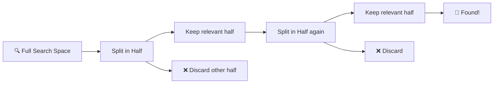

### The One Prerequisite: MONOTONICITY

Binary search requires a **monotonic** property — the search space must have a **clear boundary** where a condition flips from `false` to `true` (or vice versa).

```
Index:     0   1   2   3   4   5   6   7   8   9
Sorted:   [1,  3,  5,  7,  9, 11, 13, 15, 17, 19]
≥ 9?:      F   F   F   F   T   T   T   T   T   T
                          ↑ boundary
```

This monotonicity isn't limited to sorted arrays! It applies to any search space where a condition transitions cleanly.

### Why It Matters: O(log n) vs O(n)

| Items (n)       | Linear Search O(n) | Binary Search O(log n) |
|-----------------|--------------------|-----------------------|
| 100             | 100 steps          | 7 steps               |
| 10,000          | 10,000 steps       | 14 steps              |
| 1,000,000       | 1,000,000 steps    | 20 steps              |
| 1,000,000,000   | 1 BILLION steps    | **30 steps** 🤯       |

### When to Use Binary Search

✅ Sorted arrays — find a value, insertion point, first/last occurrence  
✅ Search space problems — "find the minimum X such that..."  
✅ Optimization problems — minimize/maximize with a feasibility check  
✅ Rotated sorted arrays — modified binary search  
✅ Any monotonic condition — true/false boundary  

---

## ⚙️ How It Works

### Step-by-Step: Finding 7 in a Sorted Array

```
Array: [1, 3, 5, 7, 9, 11, 13]
Target: 7
```

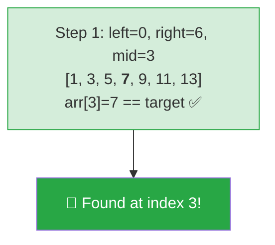

Let's try finding **11** instead:

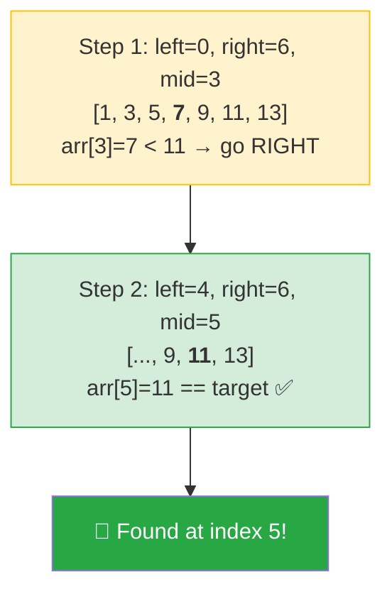

### Search Space Halving Visualized

Starting with 1024 elements:

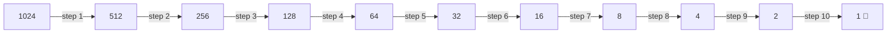

> **1024 elements → 10 steps.** That's the power of halving. `log₂(1024) = 10`.

### Left-Biased vs Right-Biased Binary Search

When duplicates exist, we often need the **first** or **last** occurrence:

```
Array: [1, 2, 2, 2, 2, 3, 4]
Index:  0  1  2  3  4  5  6
Target: 2

First occurrence (leftmost): index 1
Last occurrence (rightmost):  index 4
```

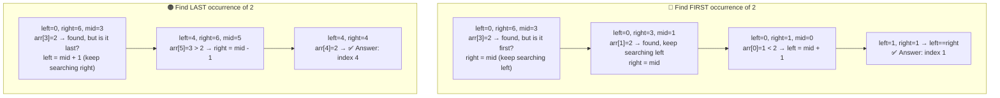

### The Two Templates: `while (left <= right)` vs `while (left < right)`

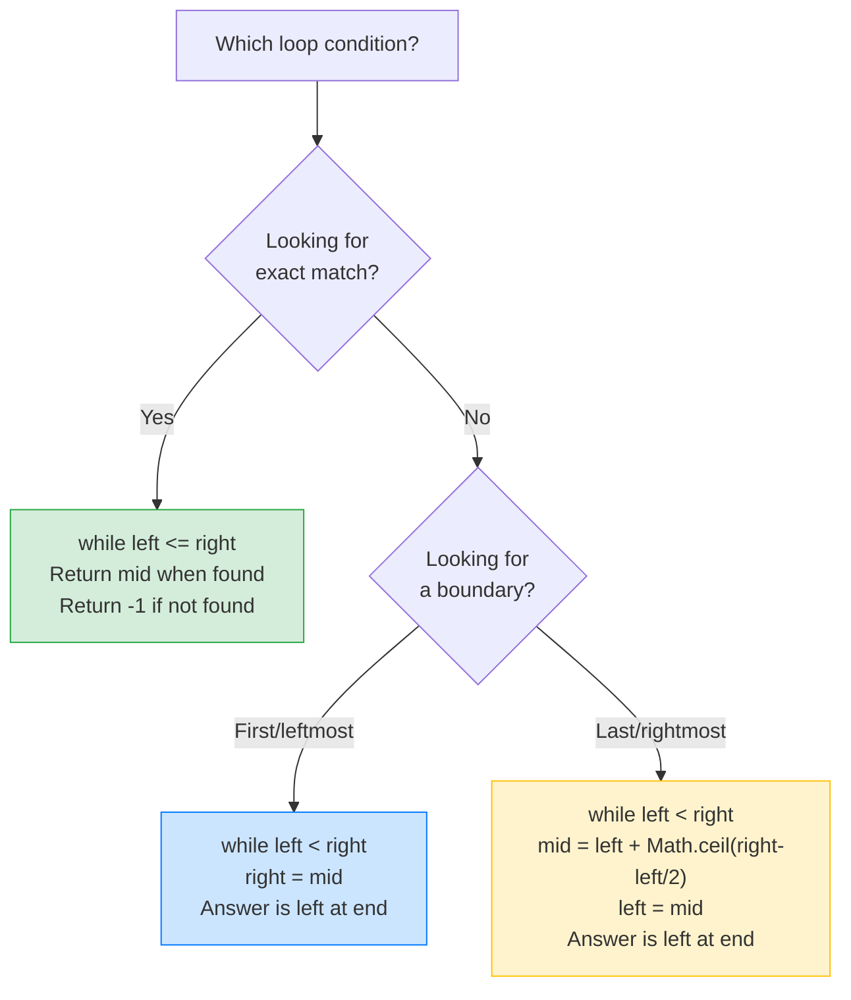

---

## 💻 TypeScript Implementation

### Template 1: Classic Binary Search (Find Exact Value)

> **Use when**: You need to find a specific value and return its index. Return -1 if not found.

```typescript
function binarySearch(nums: number[], target: number): number {
  let left = 0;
  let right = nums.length - 1;

  while (left <= right) {
    const mid = left + Math.floor((right - left) / 2); // avoid overflow

    if (nums[mid] === target) {
      return mid;          // 🎯 found it
    } else if (nums[mid] < target) {
      left = mid + 1;      // target is in right half
    } else {
      right = mid - 1;     // target is in left half
    }
  }

  return -1; // not found
}
```

**Why `left <= right`?** The search space is `[left, right]` (both inclusive). When `left > right`, the search space is empty — we've checked everything.

**Why `mid + 1` and `mid - 1`?** We've already checked `mid`, so exclude it from the next search space. This guarantees the search space shrinks every iteration → **no infinite loops**.

---

### Template 2: Find Leftmost / First Occurrence (Lower Bound)

> **Use when**: You need the **first** index where a condition is true, or the leftmost occurrence of a value.

```typescript
function findLeftmost(nums: number[], target: number): number {
  let left = 0;
  let right = nums.length - 1;

  while (left < right) {
    const mid = left + Math.floor((right - left) / 2);

    if (nums[mid] < target) {
      left = mid + 1;     // mid is too small, exclude it
    } else {
      right = mid;        // mid could be the answer, keep it
    }
  }

  // left === right, check if it's the target
  return nums[left] === target ? left : -1;
}
```

**Why `right = mid` (not `mid - 1`)?** Because `mid` might be the first occurrence! We can't exclude it.

**Why `left < right` (not `<=`)?** Because `right = mid` doesn't shrink the space when `left === right === mid`, which would cause an **infinite loop** with `<=`.

**Why floor for mid?** When `left` and `right` are adjacent, `floor` biases toward `left`. Since we set `right = mid`, this ensures the search space always shrinks (mid lands on left, then left = mid + 1 or right = mid which is already left).

---

### Template 3: Find Rightmost / Last Occurrence (Upper Bound)

> **Use when**: You need the **last** index where a condition is true, or the rightmost occurrence of a value.

```typescript
function findRightmost(nums: number[], target: number): number {
  let left = 0;
  let right = nums.length - 1;

  while (left < right) {
    const mid = left + Math.ceil((right - left) / 2); // ⚠️ ceil, not floor!

    if (nums[mid] > target) {
      right = mid - 1;    // mid is too big, exclude it
    } else {
      left = mid;         // mid could be the answer, keep it
    }
  }

  return nums[left] === target ? left : -1;
}
```

**Why `Math.ceil` instead of `Math.floor`?** This is the **critical** difference. When `left` and `right` are adjacent:
- `floor` gives `mid = left` → `left = mid = left` → **infinite loop!** 💀
- `ceil` gives `mid = right` → `left = mid` moves past left → **space shrinks** ✅

---

### Template Comparison At a Glance

| Aspect | Template 1 (Classic) | Template 2 (Leftmost) | Template 3 (Rightmost) |
|---|---|---|---|
| **Loop** | `while (left <= right)` | `while (left < right)` | `while (left < right)` |
| **Mid** | `floor` | `floor` | **`ceil`** ⚠️ |
| **Match found** | Return immediately | `right = mid` | `left = mid` |
| **Too small** | `left = mid + 1` | `left = mid + 1` | — |
| **Too big** | `right = mid - 1` | — | `right = mid - 1` |
| **After loop** | Return -1 | Check `nums[left]` | Check `nums[left]` |
| **Use case** | Exact match | First true / lower bound | Last true / upper bound |

---

## 🧩 Essential Binary Search Techniques for LeetCode

### 1. 🔄 Search in Rotated Sorted Array

A sorted array rotated at some pivot: `[4, 5, 6, 7, 0, 1, 2]`

**Key insight**: At least one half is **always sorted**. Determine which half is sorted, then check if the target falls in that sorted half.

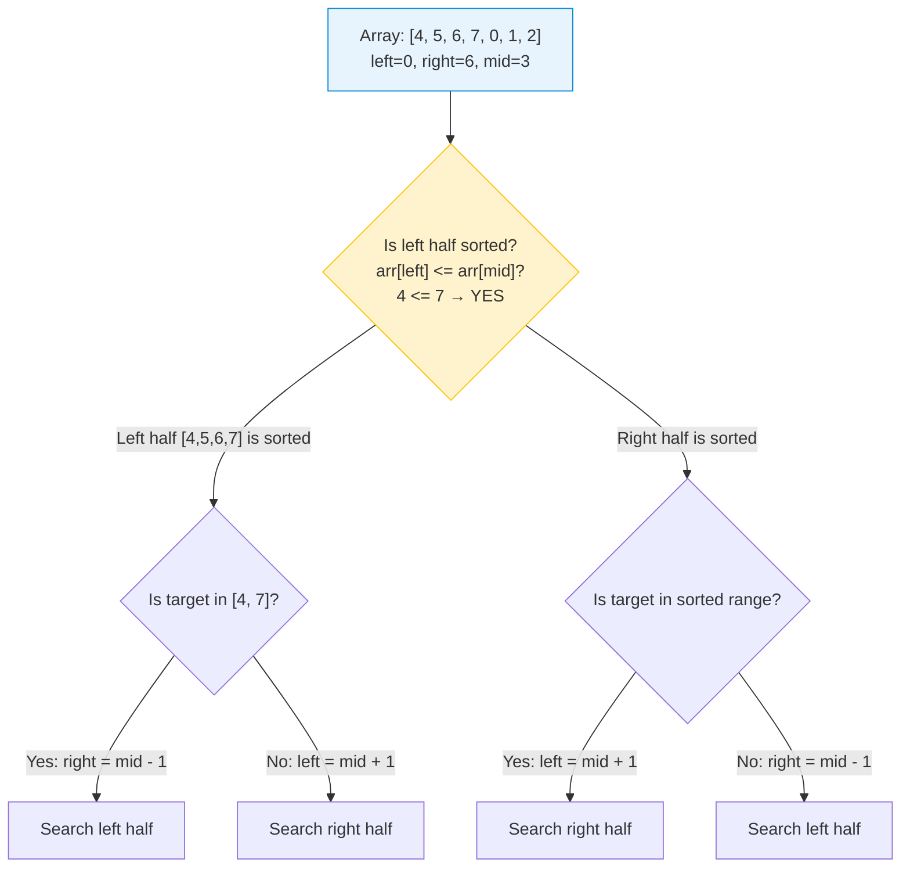

```typescript
function searchRotated(nums: number[], target: number): number {
  let left = 0;
  let right = nums.length - 1;

  while (left <= right) {
    const mid = left + Math.floor((right - left) / 2);

    if (nums[mid] === target) return mid;

    // Determine which half is sorted
    if (nums[left] <= nums[mid]) {
      // Left half is sorted
      if (nums[left] <= target && target < nums[mid]) {
        right = mid - 1; // target in sorted left half
      } else {
        left = mid + 1;  // target in right half
      }
    } else {
      // Right half is sorted
      if (nums[mid] < target && target <= nums[right]) {
        left = mid + 1;  // target in sorted right half
      } else {
        right = mid - 1; // target in left half
      }
    }
  }

  return -1;
}
```

---

### 2. ⛰️ Find Peak Element

An element is a **peak** if it's greater than its neighbors. The array may be unsorted, but binary search still works!

**Key insight**: If `arr[mid] < arr[mid + 1]`, there MUST be a peak to the right (the sequence is going up). Otherwise, a peak exists to the left (or at mid).

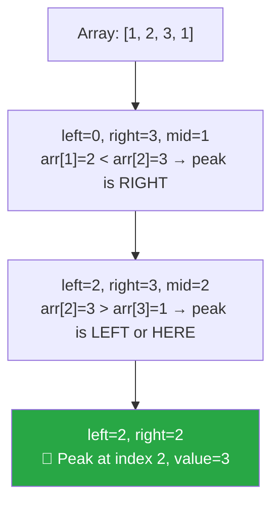

```typescript
function findPeakElement(nums: number[]): number {
  let left = 0;
  let right = nums.length - 1;

  while (left < right) {
    const mid = left + Math.floor((right - left) / 2);

    if (nums[mid] < nums[mid + 1]) {
      left = mid + 1;  // peak is to the right
    } else {
      right = mid;     // peak is at mid or to the left
    }
  }

  return left; // left === right === peak index
}
```

---

### 3. 🎯 Search on Answer (Parametric Search) — THE Most Powerful Technique

This is the **most important** binary search pattern for LeetCode medium/hard problems.

**The idea**: Instead of searching through data, search through **possible answers**. For each candidate answer, check if it's **feasible**.

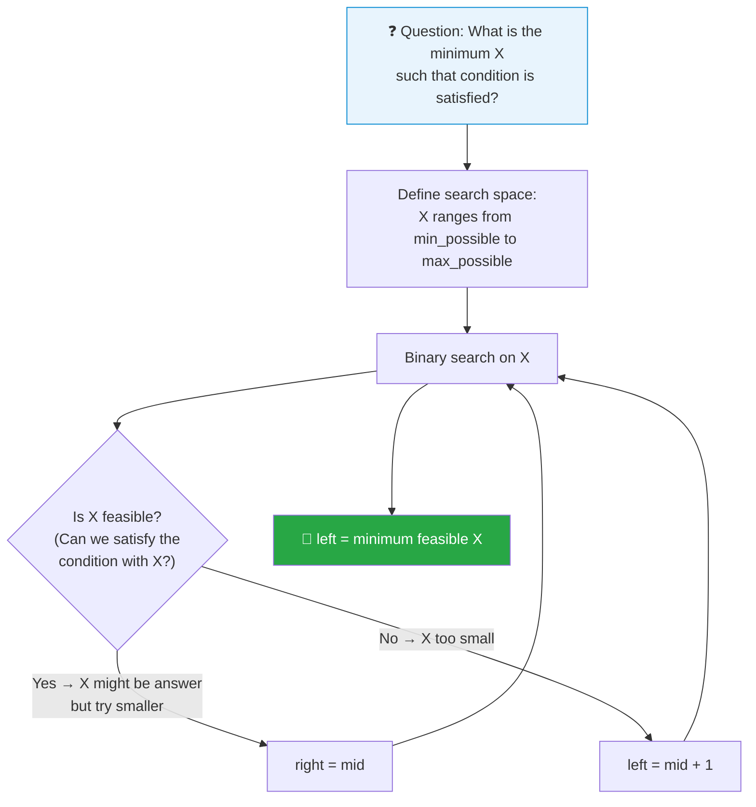

#### Example: 🍌 Koko Eating Bananas

> Koko has `piles` of bananas and `h` hours. She eats at speed `k` bananas/hour. What's the **minimum k** to finish all bananas in `h` hours?

The **answer space** is `[1, max(piles)]`. Binary search on `k`:

```
piles = [3, 6, 7, 11], h = 8

Speed k=1:  3+6+7+11 = 27 hours → too slow ❌
Speed k=11: 1+1+1+1  = 4 hours  → fast enough ✅ (but can we go slower?)
Speed k=6:  1+1+2+2  = 6 hours  → fast enough ✅
Speed k=3:  1+2+3+4  = 10 hours → too slow ❌
Speed k=4:  1+2+2+3  = 8 hours  → fast enough ✅
Speed k=4 is the minimum! 🎯
```

```typescript
function minEatingSpeed(piles: number[], h: number): number {
  let left = 1;
  let right = Math.max(...piles);

  while (left < right) {
    const mid = left + Math.floor((right - left) / 2);

    if (canFinish(piles, mid, h)) {
      right = mid;       // feasible, try slower speed
    } else {
      left = mid + 1;    // too slow, speed up
    }
  }

  return left;
}

function canFinish(piles: number[], speed: number, h: number): boolean {
  let hours = 0;
  for (const pile of piles) {
    hours += Math.ceil(pile / speed);
  }
  return hours <= h;
}
```

#### The Parametric Search Pattern

Every "search on answer" problem follows the same skeleton:

```typescript
function searchOnAnswer(): number {
  let left = MIN_POSSIBLE_ANSWER;
  let right = MAX_POSSIBLE_ANSWER;

  while (left < right) {
    const mid = left + Math.floor((right - left) / 2);

    if (isFeasible(mid)) {
      right = mid;       // for minimum answer (use left = mid for maximum)
    } else {
      left = mid + 1;    // for minimum answer (use right = mid - 1 for maximum)
    }
  }

  return left;
}
```

**Other "search on answer" problems**:
- 🚢 **Capacity to Ship Packages Within D Days** — binary search on capacity
- 💐 **Minimum Number of Days to Make m Bouquets** — binary search on days
- ✂️ **Split Array Largest Sum** — binary search on the maximum subarray sum

---

### 4. 🔢 Binary Search on Matrix

A sorted m×n matrix can be treated as a sorted 1D array of length `m * n`:

```
Matrix:           As 1D array:
[1,  3,  5]      [1, 3, 5, 10, 11, 16, 20, 23, 30]
[10, 11, 16]      index: 0  1  2   3   4   5   6   7   8
[20, 23, 30]

Index 5 → row = 5/3 = 1, col = 5%3 = 2 → matrix[1][2] = 16
```

```typescript
function searchMatrix(matrix: number[][], target: number): boolean {
  const m = matrix.length;
  const n = matrix[0].length;
  let left = 0;
  let right = m * n - 1;

  while (left <= right) {
    const mid = left + Math.floor((right - left) / 2);
    const val = matrix[Math.floor(mid / n)][mid % n]; // convert 1D index to 2D

    if (val === target) return true;
    else if (val < target) left = mid + 1;
    else right = mid - 1;
  }

  return false;
}
```

---

### 5. 📍 Find First and Last Position

Using Template 2 and Template 3 together:

```typescript
function searchRange(nums: number[], target: number): [number, number] {
  return [findFirst(nums, target), findLast(nums, target)];
}

function findFirst(nums: number[], target: number): number {
  let left = 0, right = nums.length - 1;
  while (left < right) {
    const mid = left + Math.floor((right - left) / 2);
    if (nums[mid] < target) left = mid + 1;
    else right = mid;
  }
  return nums[left] === target ? left : -1;
}

function findLast(nums: number[], target: number): number {
  let left = 0, right = nums.length - 1;
  while (left < right) {
    const mid = left + Math.ceil((right - left) / 2);
    if (nums[mid] > target) right = mid - 1;
    else left = mid;
  }
  return nums[left] === target ? left : -1;
}
```

---

### 6. √ Square Root via Binary Search

Find `floor(√x)` — binary search on the answer space `[0, x]`:

```typescript
function mySqrt(x: number): number {
  if (x < 2) return x;
  let left = 1;
  let right = Math.floor(x / 2);

  while (left <= right) {
    const mid = left + Math.floor((right - left) / 2);
    if (mid * mid === x) return mid;
    else if (mid * mid < x) left = mid + 1;
    else right = mid - 1;
  }

  return right; // right < left, right is floor(√x)
}
```

---

## ⏱️ Complexity Analysis

| Variant | Time | Space |
|---|---|---|
| Iterative binary search | **O(log n)** | **O(1)** |
| Recursive binary search | **O(log n)** | **O(log n)** call stack |
| Search on answer | **O(log(range) × check)** | depends on check function |
| Search in m×n matrix | **O(log(m × n))** | **O(1)** |

**Why O(log n)?**

```
n elements → n/2 → n/4 → n/8 → ... → 1

How many times can you halve n before reaching 1?
n / 2^k = 1  →  k = log₂(n)
```

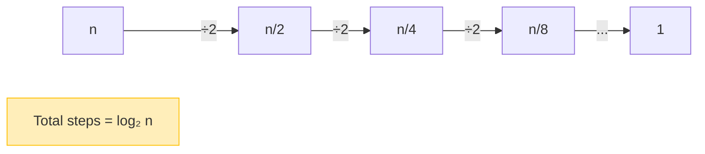

---

## 🎯 LeetCode Patterns — Decision Flowchart

Use this flowchart to pick the right approach:

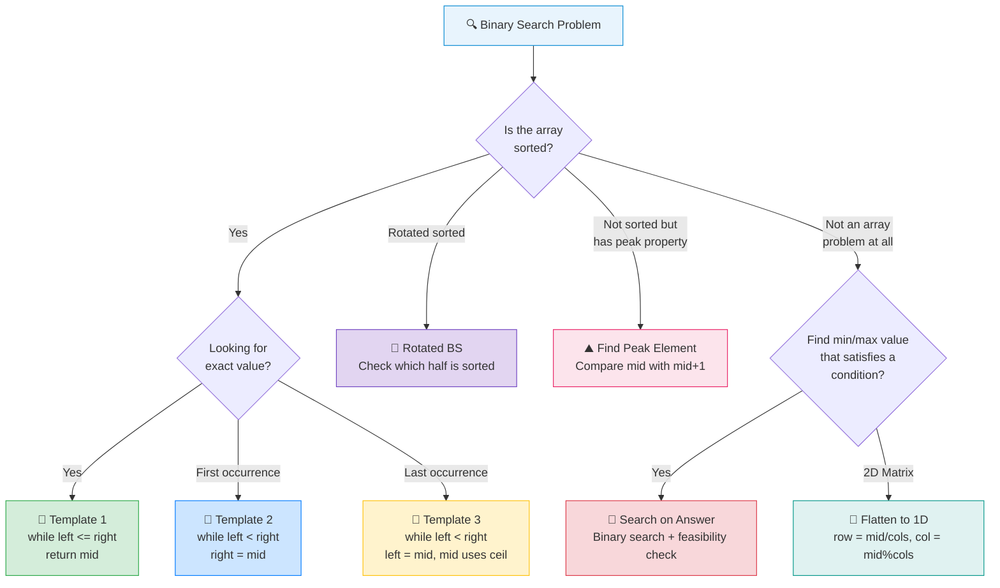

### Pattern Recognition Cheat Sheet

| You see... | Technique | Template |
|---|---|---|
| "Given a **sorted** array, find X" | Classic binary search | Template 1 |
| "Find the **first/last** position of X" | Leftmost / Rightmost | Template 2 / 3 |
| "**Rotated** sorted array" | Check which half is sorted | Template 1 (modified) |
| "Find **peak** element" | Compare with neighbor | Template 2 |
| "**Minimum** speed / capacity / days to..." | Search on answer | Template 2 (on answer space) |
| "**Koko**, **shipping**, **bouquets**, **split array**" | Parametric search | Template 2 (on answer space) |
| "Search a **2D matrix**" | Flatten to 1D | Template 1 |
| "Find **sqrt(x)**" | Search on answer | Template 1 |

---

## ⚠️ Common Pitfalls

### 1. 💥 Integer Overflow in Mid Calculation

```typescript
// ❌ WRONG — can overflow for large left + right
const mid = Math.floor((left + right) / 2);

// ✅ CORRECT — safe from overflow
const mid = left + Math.floor((right - left) / 2);
```

> In TypeScript/JavaScript, numbers are floating point so overflow isn't a crash risk, but this is a **must-know** for interviews in Java/C++ and shows good habits.

### 2. 🔁 Infinite Loops from Wrong Mid Calculation

```typescript
// Finding rightmost — ❌ WRONG (infinite loop when left + 1 === right)
while (left < right) {
  const mid = left + Math.floor((right - left) / 2); // mid = left
  left = mid; // left = left → STUCK FOREVER
}

// ✅ CORRECT — use ceil for rightmost search
while (left < right) {
  const mid = left + Math.ceil((right - left) / 2); // mid = right when adjacent
  left = mid; // moves forward
}
```

### 3. 🎯 Off-by-One Errors

The most common source of bugs. Remember:
- `while (left <= right)` → search space is `[left, right]`, shrink with `mid ± 1`
- `while (left < right)` → loop ends when `left === right`, that's your answer
- After `while (left <= right)`, if not found, `left` = insertion point

### 4. 🚫 Forgetting the "Not Found" Case

```typescript
// Template 2 returns left, but we must verify:
return nums[left] === target ? left : -1; // Don't forget this check!
```

### 5. 📏 Using Binary Search on Unsorted Data

Binary search **requires monotonicity**. If the data isn't sorted and doesn't have a monotonic property, binary search will give wrong results silently.

---

## 🔑 Key Takeaways

1. **Binary search = halving the search space** each step → O(log n)

2. **Three templates** cover virtually every binary search problem:
   - Template 1: exact match → `while (left <= right)`
   - Template 2: leftmost/first → `while (left < right)`, `right = mid`
   - Template 3: rightmost/last → `while (left < right)`, `left = mid`, **use ceil**

3. **Search on answer is the most powerful pattern** — transform "find minimum X satisfying condition" into binary search on X with a feasibility check

4. **Rotated sorted array**: one half is ALWAYS sorted — use that to decide direction

5. **Always use `left + Math.floor((right - left) / 2)`** for mid to avoid overflow

6. **The #1 bug**: infinite loops from wrong mid calculation in rightmost search (need `ceil`)

7. **Monotonicity is the prerequisite** — not just "sorted". Any boolean condition with a clean boundary works

---

## 📋 Practice Problems

### 🟢 Easy

| # | Problem | Key Technique |
|---|---------|--------------|
| 704 | [Binary Search](https://leetcode.com/problems/binary-search/) | Template 1 — classic |
| 35 | [Search Insert Position](https://leetcode.com/problems/search-insert-position/) | Template 2 — find boundary |
| 278 | [First Bad Version](https://leetcode.com/problems/first-bad-version/) | Template 2 — first true |
| 69 | [Sqrt(x)](https://leetcode.com/problems/sqrtx/) | Search on answer |

### 🟡 Medium

| # | Problem | Key Technique |
|---|---------|--------------|
| 33 | [Search in Rotated Sorted Array](https://leetcode.com/problems/search-in-rotated-sorted-array/) | Check which half is sorted |
| 162 | [Find Peak Element](https://leetcode.com/problems/find-peak-element/) | Compare with neighbor |
| 34 | [Find First and Last Position](https://leetcode.com/problems/find-first-and-last-position-of-element-in-sorted-array/) | Template 2 + Template 3 |
| 875 | [Koko Eating Bananas](https://leetcode.com/problems/koko-eating-bananas/) | Parametric search |
| 74 | [Search a 2D Matrix](https://leetcode.com/problems/search-a-2d-matrix/) | Flatten to 1D |
| 153 | [Find Minimum in Rotated Sorted Array](https://leetcode.com/problems/find-minimum-in-rotated-sorted-array/) | Template 2 on rotated |
| 1011 | [Capacity to Ship Packages](https://leetcode.com/problems/capacity-to-ship-packages-within-d-days/) | Parametric search |

### 🔴 Hard

| # | Problem | Key Technique |
|---|---------|--------------|
| 4 | [Median of Two Sorted Arrays](https://leetcode.com/problems/median-of-two-sorted-arrays/) | Binary search on partition |
| 410 | [Split Array Largest Sum](https://leetcode.com/problems/split-array-largest-sum/) | Parametric search |

---

> 💡 **Pro tip**: When stuck on a binary search problem, ask yourself: *"What am I binary searching ON?"* — is it an index, a value, or an answer? Once you identify the search space, the solution structure falls into place.
