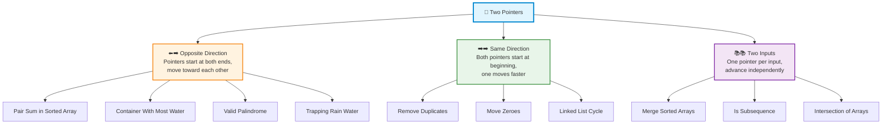
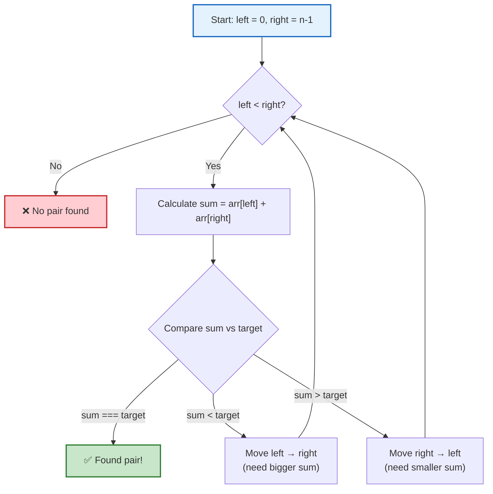
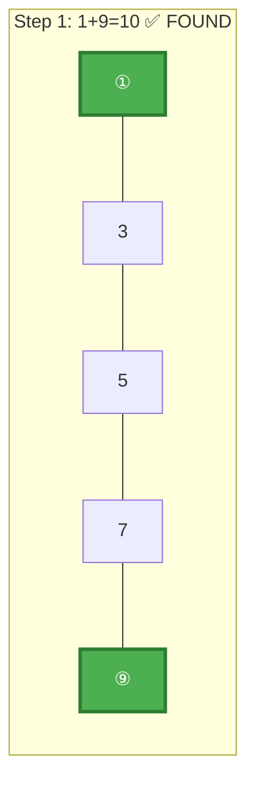
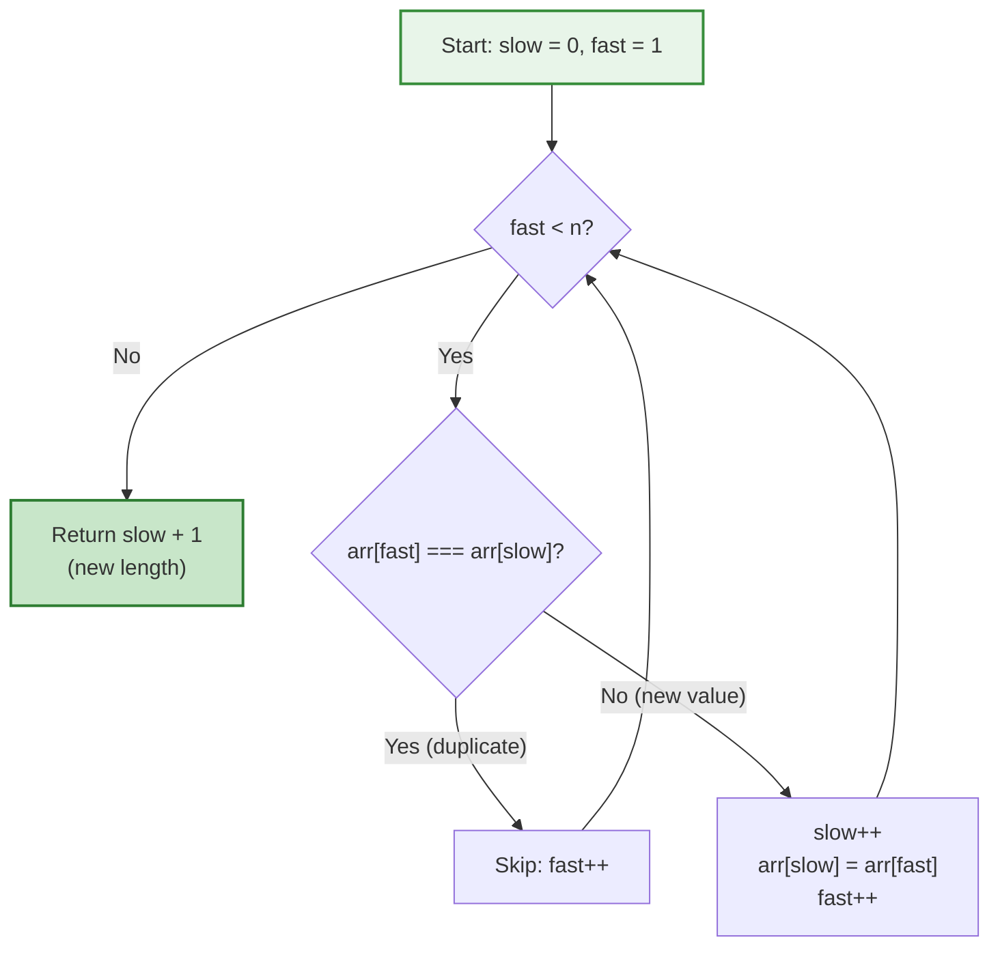
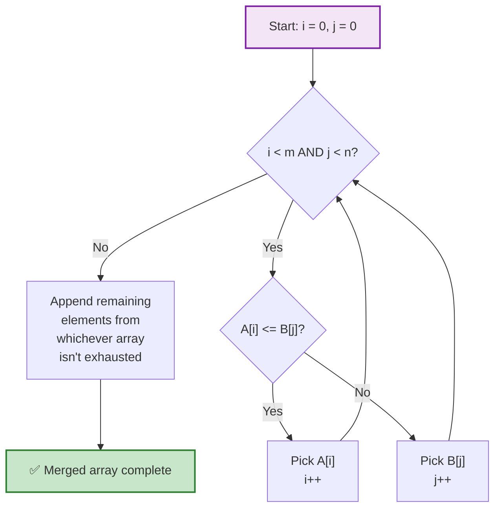
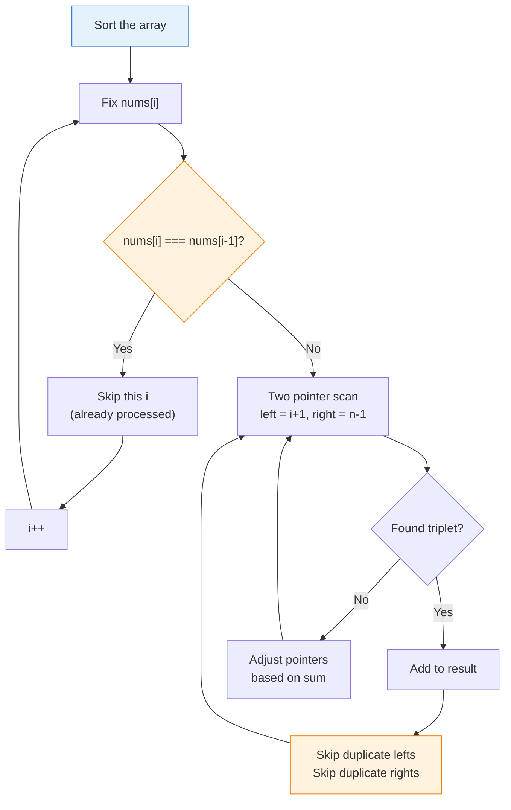
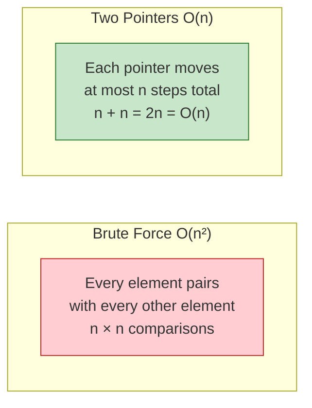
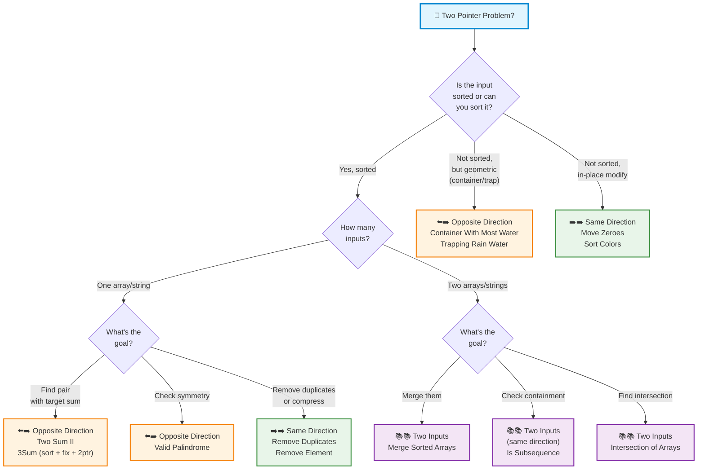

# 🔀 Chapter 11: Two Pointers

> **The Art of Walking Two Paths at Once**
> Two indices, one pass, zero wasted work.

---

## 🌍 Real-World Analogy

### 🚶‍♂️🚶 Opposite Direction — Two People in a Hallway

Imagine a long hallway with numbered doors on one side: `[1, 3, 5, 7, 9, 12, 15]`.

You need to find two doors whose numbers add up to **14**.

You place **Alice** at the left end (door 1) and **Bob** at the right end (door 15).

```
Alice                                          Bob
  ↓                                             ↓
[ 1,   3,   5,   7,   9,   12,   15 ]

Alice + Bob = 1 + 15 = 16   → Too big!  Bob steps left.

  ↓                                       ↓
[ 1,   3,   5,   7,   9,   12,   15 ]

Alice + Bob = 1 + 12 = 13   → Too small! Alice steps right.

        ↓                          ↓
[ 1,   3,   5,   7,   9,   12,   15 ]

Alice + Bob = 3 + 12 = 15   → Too big!  Bob steps left.

        ↓                    ↓
[ 1,   3,   5,   7,   9,   12,   15 ]

Alice + Bob = 3 + 9 = 12    → Too small! Alice steps right.

              ↓              ↓
[ 1,   3,   5,   7,   9,   12,   15 ]

Alice + Bob = 5 + 9 = 14    → ✅ FOUND IT!
```

They walked **toward each other** and met in the middle. No need to check every pair.

---

### 🏃‍♂️🏃 Same Direction — Two Runners on a Track

Two runners on a circular track. The **slow runner** takes 1 step at a time. The **fast runner** takes 2 steps.

If there's a **loop** (cycle), the fast runner will eventually **lap** the slow runner — they'll meet.

If there's **no loop** (the track ends), the fast runner hits the finish line first.

This is exactly how we detect cycles in linked lists and how we remove duplicates from sorted arrays — one pointer scouts ahead, the other stays behind to mark progress.

```
Removing duplicates from [1, 1, 2, 2, 3]:

slow
  ↓
[ 1,  1,  2,  2,  3 ]
      ↑
     fast

fast sees 1 — same as slow. Skip it. fast moves →

slow
  ↓
[ 1,  1,  2,  2,  3 ]
          ↑
         fast

fast sees 2 — NEW! slow moves →, copy 2 there.

     slow
      ↓
[ 1,  2,  2,  2,  3 ]
          ↑
         fast

fast moves →, sees 2 — same as slow. Skip. fast moves →

     slow
      ↓
[ 1,  2,  2,  2,  3 ]
                  ↑
                 fast

fast sees 3 — NEW! slow moves →, copy 3 there.

         slow
          ↓
[ 1,  2,  3,  2,  3 ]
                  ↑
                 fast

Done! First 3 elements [1, 2, 3] are the unique values.
```

---

### 📚📚 Two Arrays — Two Librarians Merging Bookshelves

Two librarians each have a **sorted** stack of books (by page count). They want to merge them into one sorted stack.

Each librarian points at the top of their stack. They compare — whoever has the smaller book puts it on the merged pile and moves to their next book. Repeat until both stacks are empty.

```
Librarian A: [1, 4, 7]     Librarian B: [2, 3, 8]
              ↑                           ↑

Compare 1 vs 2 → pick 1.  Merged: [1]

Librarian A: [1, 4, 7]     Librarian B: [2, 3, 8]
                 ↑                        ↑

Compare 4 vs 2 → pick 2.  Merged: [1, 2]

Compare 4 vs 3 → pick 3.  Merged: [1, 2, 3]

Compare 4 vs 8 → pick 4.  Merged: [1, 2, 3, 4]

Compare 7 vs 8 → pick 7.  Merged: [1, 2, 3, 4, 7]

B exhausted? No. Pick 8.   Merged: [1, 2, 3, 4, 7, 8] ✅
```

---

## 📝 What & Why

### What Is It?

The **Two Pointers** technique uses **two indices** (pointers) to traverse data structures — typically arrays or strings. Instead of checking every possible pair with nested loops, we move two pointers strategically based on conditions.

### Why Is It Powerful?

| Approach | Time | Space | Strategy |
|----------|------|-------|----------|
| Brute Force (nested loops) | O(n²) | O(1) | Check every pair |
| Hash Map | O(n) | O(n) | Trade space for time |
| **Two Pointers** | **O(n)** | **O(1)** | **Smart traversal** |

Two pointers gives you the **speed of hashing** with the **space efficiency of brute force**. The best of both worlds.

### 🔑 The Key Insight

> **Sorted data lets you make decisions about WHICH pointer to move.**

- Sum too small? Move the left pointer right (increase the sum).
- Sum too big? Move the right pointer left (decrease the sum).
- Each step **eliminates an entire row or column** of possibilities. You never go backwards.

### Three Flavors



---

## ⚙️ How It Works

### Pattern 1: ⬅️➡️ Opposite Direction — Pair Sum in Sorted Array

**Problem**: Find two numbers in a sorted array that add up to a target.



**Step-by-step** with `[1, 3, 5, 7, 9]`, target = `10`:



Quick find! But let's see a harder case — `[1, 3, 5, 7, 9]`, target = `12`:

```
Step 1:  L=1, R=9  → sum=10  < 12  → move L right
Step 2:  L=3, R=9  → sum=12  = 12  → ✅ Found [3, 9]
```

**Why does this work?** When `sum < target`, moving `left` right increases the sum. When `sum > target`, moving `right` left decreases it. Since the array is sorted, every move eliminates an entire row of impossible pairs. We never need to go back.

---

### Pattern 2: ➡️➡️ Same Direction — Remove Duplicates

**Problem**: Remove duplicates from a sorted array in-place, return new length.



**Walkthrough** with `[1, 1, 2, 3, 3, 3, 4]`:

```
Array:  [1, 1, 2, 3, 3, 3, 4]
         S  F
         
fast=1: arr[1]=1 === arr[0]=1 → duplicate, skip
         S     F
         
fast=2: arr[2]=2 !== arr[0]=1 → NEW! slow++, copy
        [1, 2, 2, 3, 3, 3, 4]
            S     F

fast=3: arr[3]=3 !== arr[1]=2 → NEW! slow++, copy
        [1, 2, 3, 3, 3, 3, 4]
               S     F

fast=4: arr[4]=3 === arr[2]=3 → duplicate, skip
fast=5: arr[5]=3 === arr[2]=3 → duplicate, skip
               S              F

fast=6: arr[6]=4 !== arr[2]=3 → NEW! slow++, copy
        [1, 2, 3, 4, 3, 3, 4]
                  S              F (out of bounds)

Result: first 4 elements = [1, 2, 3, 4], return 4
```

**Why same direction?** The `fast` pointer scouts for new values. The `slow` pointer marks where to write the next unique value. They both move left-to-right, but `fast` runs ahead.

---

### Pattern 3: 📚📚 Two Inputs — Merge Sorted Arrays

**Problem**: Merge two sorted arrays into one sorted result.



**Why two pointers on two inputs?** Each array is already sorted. We just need to zip them together by always picking the smaller current element. Each pointer only moves forward through its own array.

---

## 💻 TypeScript Implementations

### 1. 🎯 Two Sum II — Pair Sum in Sorted Array (Opposite Direction)

```typescript
function twoSumSorted(numbers: number[], target: number): [number, number] {
  let left = 0;
  let right = numbers.length - 1;

  while (left < right) {
    const sum = numbers[left] + numbers[right];

    if (sum === target) {
      return [left + 1, right + 1]; // 1-indexed per LeetCode
    } else if (sum < target) {
      left++;
    } else {
      right--;
    }
  }

  return [-1, -1]; // no pair found
}
```

**Brute Force Comparison:**

```typescript
// ❌ Brute Force — O(n²)
function twoSumBrute(numbers: number[], target: number): [number, number] {
  for (let i = 0; i < numbers.length; i++) {
    for (let j = i + 1; j < numbers.length; j++) {
      if (numbers[i] + numbers[j] === target) {
        return [i + 1, j + 1];
      }
    }
  }
  return [-1, -1];
}

// ✅ Two Pointers — O(n)
// Same result, 1 pass, no extra space
```

---

### 2. 🔺 Three Sum (Sort + Two Pointers)

```typescript
function threeSum(nums: number[]): number[][] {
  const result: number[][] = [];
  nums.sort((a, b) => a - b);

  for (let i = 0; i < nums.length - 2; i++) {
    // Skip duplicate values for the first element
    if (i > 0 && nums[i] === nums[i - 1]) continue;

    // Early termination: smallest triple already > 0
    if (nums[i] > 0) break;

    let left = i + 1;
    let right = nums.length - 1;

    while (left < right) {
      const sum = nums[i] + nums[left] + nums[right];

      if (sum === 0) {
        result.push([nums[i], nums[left], nums[right]]);

        // Skip duplicates for second element
        while (left < right && nums[left] === nums[left + 1]) left++;
        // Skip duplicates for third element
        while (left < right && nums[right] === nums[right - 1]) right--;

        left++;
        right--;
      } else if (sum < 0) {
        left++;
      } else {
        right--;
      }
    }
  }

  return result;
}
```

**How duplicate skipping works in 3Sum:**



---

### 3. 🌊 Container With Most Water (Opposite Direction)

```typescript
function maxArea(height: number[]): number {
  let left = 0;
  let right = height.length - 1;
  let maxWater = 0;

  while (left < right) {
    const width = right - left;
    const h = Math.min(height[left], height[right]);
    maxWater = Math.max(maxWater, width * h);

    // Move the shorter line inward — the only way to potentially find more water
    if (height[left] < height[right]) {
      left++;
    } else {
      right--;
    }
  }

  return maxWater;
}
```

**Why move the shorter line?**

```
height:  [1, 8, 6, 2, 5, 4, 8, 3, 7]

  8 |    █              █
  7 |    █              █     █
  6 |    █  █           █     █
  5 |    █  █     █     █     █
  4 |    █  █     █  █  █     █
  3 |    █  █     █  █  █  █  █
  2 |    █  █  █  █  █  █  █  █
  1 | █  █  █  █  █  █  █  █  █
    +--------------------------
      0  1  2  3  4  5  6  7  8

Water = min(height[L], height[R]) × (R - L)
```

> The water is limited by the **shorter** wall. Moving the shorter wall inward is the only way to find a taller wall. Moving the taller wall can only keep or reduce the height while definitely reducing the width — so it can never improve the answer.

---

### 4. 🧹 Remove Duplicates In-Place (Same Direction)

```typescript
function removeDuplicates(nums: number[]): number {
  if (nums.length === 0) return 0;

  let slow = 0;

  for (let fast = 1; fast < nums.length; fast++) {
    if (nums[fast] !== nums[slow]) {
      slow++;
      nums[slow] = nums[fast];
    }
  }

  return slow + 1;
}
```

---

### 5. ✅ Valid Palindrome (Opposite Direction)

```typescript
function isPalindrome(s: string): boolean {
  let left = 0;
  let right = s.length - 1;

  while (left < right) {
    // Skip non-alphanumeric from left
    while (left < right && !isAlphaNumeric(s[left])) left++;
    // Skip non-alphanumeric from right
    while (left < right && !isAlphaNumeric(s[right])) right--;

    if (s[left].toLowerCase() !== s[right].toLowerCase()) {
      return false;
    }

    left++;
    right--;
  }

  return true;
}

function isAlphaNumeric(c: string): boolean {
  return /[a-zA-Z0-9]/.test(c);
}
```

---

### 6. 🔍 Is Subsequence (Same Direction, Two Inputs)

```typescript
function isSubsequence(s: string, t: string): boolean {
  let sPointer = 0;
  let tPointer = 0;

  while (sPointer < s.length && tPointer < t.length) {
    if (s[sPointer] === t[tPointer]) {
      sPointer++;
    }
    tPointer++;
  }

  return sPointer === s.length;
}
```

---

### 7. 🔗 Merge Two Sorted Arrays (Two Inputs)

LeetCode 88: Merge `nums2` into `nums1` in-place (nums1 has extra space).

```typescript
function merge(nums1: number[], m: number, nums2: number[], n: number): void {
  let p1 = m - 1;
  let p2 = n - 1;
  let write = m + n - 1;

  // Merge from the back to avoid overwriting
  while (p2 >= 0) {
    if (p1 >= 0 && nums1[p1] > nums2[p2]) {
      nums1[write] = nums1[p1];
      p1--;
    } else {
      nums1[write] = nums2[p2];
      p2--;
    }
    write--;
  }
}
```

**Why merge from the back?** `nums1` has empty space at the end. Writing from back to front means we never overwrite values we haven't read yet.

```
nums1 = [1, 3, 5, 0, 0, 0]   m=3
nums2 = [2, 4, 6]             n=3

        p1=2      write=5
[1, 3, 5, 0, 0, 0]
         p2=2
[2, 4, 6]

Compare 5 vs 6 → 6 wins → write 6 at position 5
[1, 3, 5, 0, 0, 6]

Compare 5 vs 4 → 5 wins → write 5 at position 4
[1, 3, 5, 0, 5, 6]

Compare 3 vs 4 → 4 wins → write 4 at position 3
[1, 3, 5, 4, 5, 6]    wait... position 3 gets 4

Actually re-done:
[1, 3, _, _, _, _]  (conceptually)
→ [1, 3, 5, 0, 0, 6]
→ [1, 3, 5, 0, 5, 6]
→ [1, 3, 5, 4, 5, 6]  ← but 5 at index 2 already read ✅
→ [1, 3, 3, 4, 5, 6]
→ [1, 2, 3, 4, 5, 6]  ✅ Done!
```

---

### 8. 🌧️ Trapping Rain Water (Opposite Direction)

```typescript
function trap(height: number[]): number {
  let left = 0;
  let right = height.length - 1;
  let leftMax = 0;
  let rightMax = 0;
  let water = 0;

  while (left < right) {
    if (height[left] < height[right]) {
      if (height[left] >= leftMax) {
        leftMax = height[left];
      } else {
        water += leftMax - height[left];
      }
      left++;
    } else {
      if (height[right] >= rightMax) {
        rightMax = height[right];
      } else {
        water += rightMax - height[right];
      }
      right--;
    }
  }

  return water;
}
```

**How trapping rain water works:**

```
height: [0, 1, 0, 2, 1, 0, 1, 3, 2, 1, 2, 1]

  3 |                      █
  2 |          █  ░  ░  ░  █  █  ░  █
  1 |    █  ░  █  █  ░  █  █  █  █  █  █
  0 | █  █  █  █  █  █  █  █  █  █  █  █
    +-------------------------------------
      0  1  2  3  4  5  6  7  8  9 10 11

░ = trapped water

Water at each position = min(leftMax, rightMax) - height[i]

The two-pointer approach: process the side with the shorter wall.
If left wall < right wall → we KNOW left is the bottleneck.
Water at left = leftMax - height[left] (guaranteed by right wall).
```

---

## ⏱️ Complexity Analysis

| Problem | Time | Space | Notes |
|---------|------|-------|-------|
| Two Sum II | O(n) | O(1) | Single pass, two pointers |
| 3Sum | O(n²) | O(1)* | Sort O(n log n) + O(n) per fixed element |
| Container With Most Water | O(n) | O(1) | Single pass |
| Remove Duplicates | O(n) | O(1) | In-place overwrite |
| Valid Palindrome | O(n) | O(1) | Compare from ends |
| Is Subsequence | O(n + m) | O(1) | One pass through both |
| Merge Sorted Arrays | O(n + m) | O(1) | In-place from back |
| Trapping Rain Water | O(n) | O(1) | Beats the O(n) space DP approach |

*\*O(1) extra space excluding the output array*

### Why Two Pointers Is Almost Always O(n)

Each pointer moves in **one direction only**. Combined, they visit each element at most once. No pointer ever goes backwards. Total work = O(n), not O(n²).



---

## 🎯 LeetCode Pattern Recognition

### Signal Words Decision Flowchart



### Quick-Reference Signal Table

| 🔍 You See This... | 🧠 Think This... | 📐 Pattern |
|---|---|---|
| "Sorted array" + "find pair/sum" | Target sum with two ends | ⬅️➡️ Opposite |
| "Remove/count duplicates in-place" | Slow writes, fast scouts | ➡️➡️ Same Direction |
| "Merge two sorted ___" | Compare heads, pick smaller | 📚📚 Two Inputs |
| "Is palindrome" | Compare from both ends | ⬅️➡️ Opposite |
| "Is subsequence" | Match chars walking forward | ➡️➡️ Same Dir, Two Inputs |
| "Container / area / water" | Shrink from wider end | ⬅️➡️ Opposite |
| "Move zeroes / sort 0,1,2" | Partition in-place | ➡️➡️ Same Direction |
| "3Sum / 4Sum" | Sort + fix + two pointers | ⬅️➡️ Opposite (nested) |
| "Closest to target" | Sorted + track best so far | ⬅️➡️ Opposite |

---

## ⚠️ Common Pitfalls

### 1. 🚫 Forgetting to Sort First

```typescript
// ❌ WRONG: Two pointers on unsorted array
function twoSumWrong(nums: number[], target: number): boolean {
  let left = 0, right = nums.length - 1;
  while (left < right) {
    const sum = nums[left] + nums[right];
    if (sum === target) return true;
    if (sum < target) left++;  // ← This logic ONLY works on sorted data!
    else right--;
  }
  return false;
}

// ✅ RIGHT: Sort first (or use hash map if you need original indices)
function twoSumRight(nums: number[], target: number): boolean {
  nums.sort((a, b) => a - b);  // ← SORT FIRST
  let left = 0, right = nums.length - 1;
  // ... same logic now works
}
```

### 2. 🚫 Not Handling Duplicates in 3Sum

```typescript
// ❌ Produces duplicates like [-1,-1,2] appearing multiple times
for (let i = 0; i < nums.length; i++) {
  // Missing: if (i > 0 && nums[i] === nums[i-1]) continue;
}

// ✅ Skip duplicates at ALL THREE levels
// 1. Skip duplicate i values
// 2. After finding a triplet, skip duplicate left values
// 3. After finding a triplet, skip duplicate right values
```

### 3. 🚫 Moving the Wrong Pointer

```typescript
// ❌ WRONG: Moving the taller line in Container With Most Water
if (height[left] > height[right]) {
  left++;  // Moving taller line can NEVER improve area
}

// ✅ RIGHT: Move the shorter line
if (height[left] < height[right]) {
  left++;  // Shorter line is the bottleneck — try to find taller
} else {
  right--;
}
```

### 4. 🚫 Off-by-One Errors

```typescript
// ❌ Using <= instead of < (pointers shouldn't overlap)
while (left <= right) // An element can't pair with itself

// ✅ Strict less-than
while (left < right)
```

### 5. 🚫 Forgetting Edge Cases

```typescript
// Always handle these:
if (nums.length === 0) return /* appropriate default */;
if (nums.length === 1) return /* single element case */;
// For palindrome: empty string is a palindrome
// For merge: one array could be empty
```

### 6. 🚫 Infinite Loops

```typescript
// ❌ Forgetting to move pointers in some branch
while (left < right) {
  if (condition) {
    // do something but forgot left++ or right--
    // INFINITE LOOP!
  }
}

// ✅ Every branch must advance at least one pointer
```

---

## 🔑 Key Takeaways

```mermaid
mindmap
  root((Two Pointers<br/>Key Ideas))
    Core Principle
      Two indices traversing data
      Each moves in one direction
      Every step eliminates possibilities
      Total work O(n) not O(n²)
    Three Patterns
      ⬅️➡️ Opposite Direction
        Start at both ends
        Move based on comparison
        Pair sum, palindrome, container
      ➡️➡️ Same Direction
        Both start at beginning
        Fast scouts, slow writes
        Remove duplicates, move zeroes
      📚📚 Two Inputs
        One pointer per input
        Compare and advance
        Merge, subsequence, intersection
    Prerequisites
      Array must be SORTED
        Or sort it first at O(n log n) cost
      Or problem is geometric
        Container, trapping water
    Space Advantage
      O(1) extra space
      In-place modifications
      No hash maps needed
```

1. **Two pointers trade cleverness for speed** — instead of checking all pairs O(n²), we use sorted order to skip impossible pairs, achieving O(n).

2. **Three patterns cover 90% of problems:**
   - ⬅️➡️ **Opposite direction**: pair sums, palindromes, container problems
   - ➡️➡️ **Same direction**: remove duplicates, partition arrays
   - 📚📚 **Two inputs**: merge, subsequence, intersection

3. **Sorted data is the prerequisite** for opposite-direction pointers. If the array isn't sorted, either sort it first (O(n log n)) or the problem has a geometric structure (container, trapping water).

4. **Each step must make progress** — at least one pointer must advance. This guarantees termination and O(n) time.

5. **Two pointers = O(1) space**. Unlike hash-based approaches, you don't need extra data structures.

6. **3Sum = sort + fix one + two pointers**. This pattern extends to 4Sum (fix two + two pointers) and kSum in general.

7. **Merge from the back** when merging in-place to avoid overwriting unprocessed elements.

---

## 📋 Practice Problems

### 🟢 Easy

| # | Problem | Pattern | Key Idea |
|---|---------|---------|----------|
| 167 | [Two Sum II - Input Array Is Sorted](https://leetcode.com/problems/two-sum-ii-input-array-is-sorted/) | ⬅️➡️ Opposite | Foundation pattern. Sum too small → move left. |
| 125 | [Valid Palindrome](https://leetcode.com/problems/valid-palindrome/) | ⬅️➡️ Opposite | Skip non-alphanumeric, compare from ends. |
| 88 | [Merge Sorted Array](https://leetcode.com/problems/merge-sorted-array/) | 📚📚 Two Inputs | Merge from the back to avoid overwriting. |
| 26 | [Remove Duplicates from Sorted Array](https://leetcode.com/problems/remove-duplicates-from-sorted-array/) | ➡️➡️ Same Dir | Slow writes, fast scouts. |
| 392 | [Is Subsequence](https://leetcode.com/problems/is-subsequence/) | ➡️➡️ Two Inputs | Walk both strings forward, match chars. |
| 283 | [Move Zeroes](https://leetcode.com/problems/move-zeroes/) | ➡️➡️ Same Dir | Partition: non-zeroes to front, zeroes to back. |

### 🟡 Medium

| # | Problem | Pattern | Key Idea |
|---|---------|---------|----------|
| 15 | [3Sum](https://leetcode.com/problems/3sum/) | ⬅️➡️ Opposite (nested) | Sort + fix one + two pointers. Skip duplicates at 3 levels. |
| 11 | [Container With Most Water](https://leetcode.com/problems/container-with-most-water/) | ⬅️➡️ Opposite | Always move the shorter line inward. |
| 75 | [Sort Colors](https://leetcode.com/problems/sort-colors/) | ➡️➡️ Same Dir (Dutch Flag) | Three pointers: low, mid, high. |
| 881 | [Boats to Save People](https://leetcode.com/problems/boats-to-save-people/) | ⬅️➡️ Opposite | Sort. Pair heaviest with lightest if possible. |
| 16 | [3Sum Closest](https://leetcode.com/problems/3sum-closest/) | ⬅️➡️ Opposite (nested) | Like 3Sum but track closest distance. |

### 🔴 Hard

| # | Problem | Pattern | Key Idea |
|---|---------|---------|----------|
| 42 | [Trapping Rain Water](https://leetcode.com/problems/trapping-rain-water/) | ⬅️➡️ Opposite | Process shorter side. Water = min(leftMax, rightMax) - height. |

---

### 🗺️ Suggested Practice Order

```mermaid
graph LR
    A["167. Two Sum II<br/>🟢 Foundation"] --> B["125. Valid Palindrome<br/>🟢 Opposite Dir"]
    B --> C["26. Remove Duplicates<br/>🟢 Same Dir"]
    C --> D["283. Move Zeroes<br/>🟢 Same Dir"]
    D --> E["88. Merge Sorted Array<br/>🟢 Two Inputs"]
    E --> F["392. Is Subsequence<br/>🟢 Two Inputs"]
    F --> G["11. Container With Most Water<br/>🟡 Greedy + Opposite"]
    G --> H["15. 3Sum<br/>🟡 Sort + Two Ptr"]
    H --> I["881. Boats to Save People<br/>🟡 Greedy + Opposite"]
    I --> J["75. Sort Colors<br/>🟡 Dutch Flag"]
    J --> K["42. Trapping Rain Water<br/>🔴 Advanced Opposite"]

    style A fill:#c8e6c9,stroke:#2e7d32
    style B fill:#c8e6c9,stroke:#2e7d32
    style C fill:#c8e6c9,stroke:#2e7d32
    style D fill:#c8e6c9,stroke:#2e7d32
    style E fill:#c8e6c9,stroke:#2e7d32
    style F fill:#c8e6c9,stroke:#2e7d32
    style G fill:#fff9c4,stroke:#f9a825
    style H fill:#fff9c4,stroke:#f9a825
    style I fill:#fff9c4,stroke:#f9a825
    style J fill:#fff9c4,stroke:#f9a825
    style K fill:#ffcdd2,stroke:#c62828
```



---

> 💡 **Final Thought**: Two pointers is one of the most **efficient** and **elegant** patterns in all of DSA. It appears in easy problems (palindrome check) and hard ones (trapping rain water), but the core idea never changes: **two indices, smart movement, one pass, no wasted work.**
