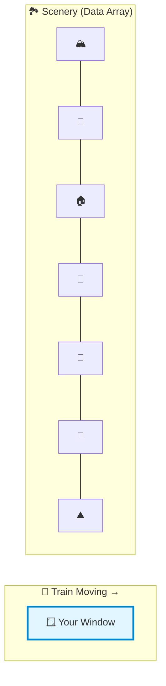
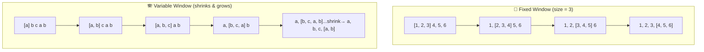
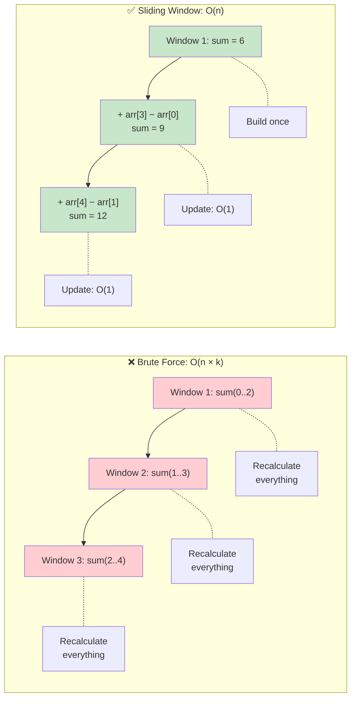
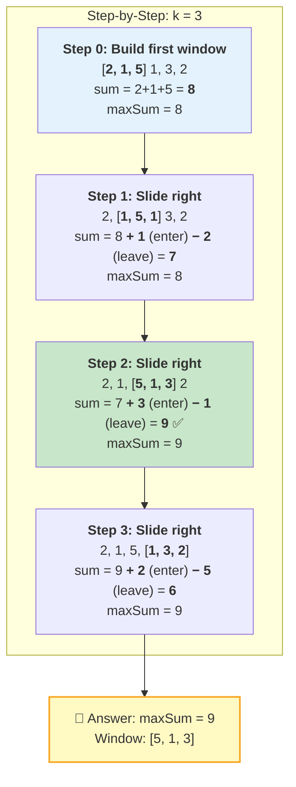
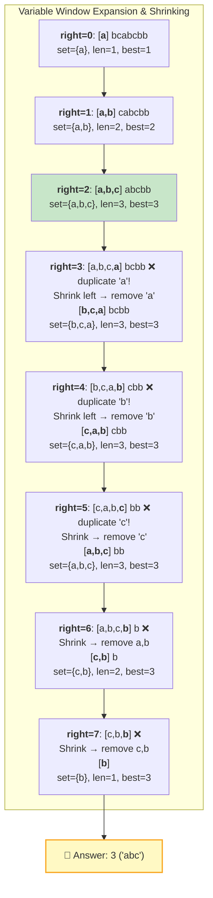
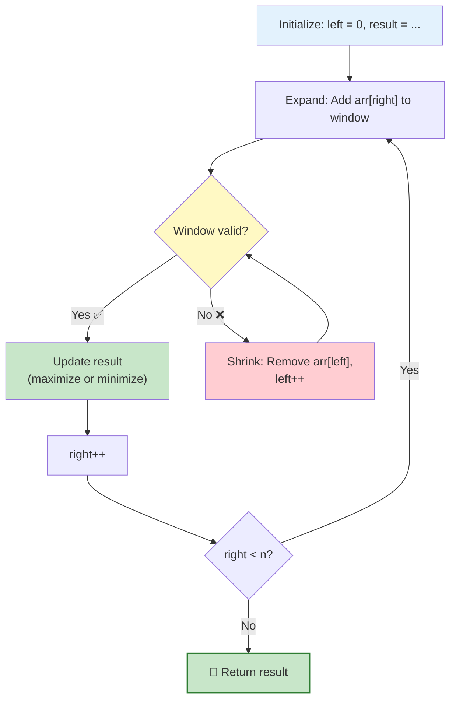
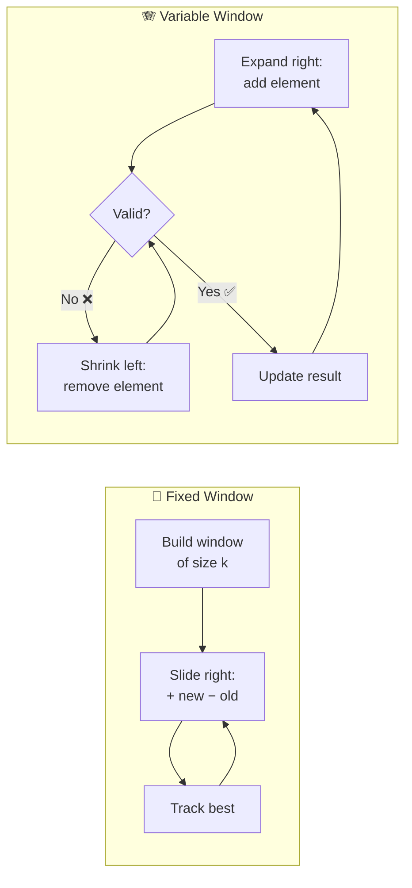
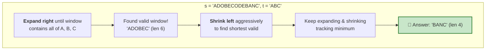
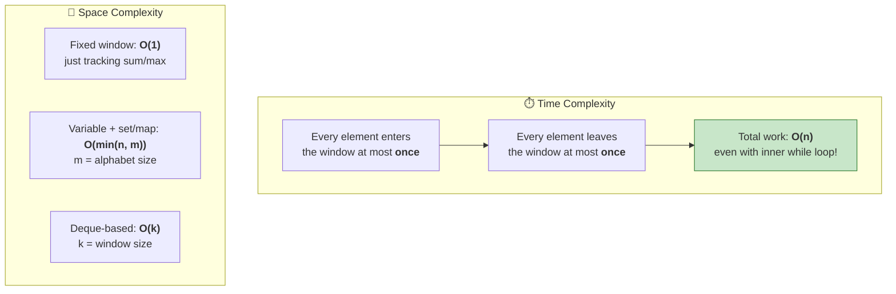
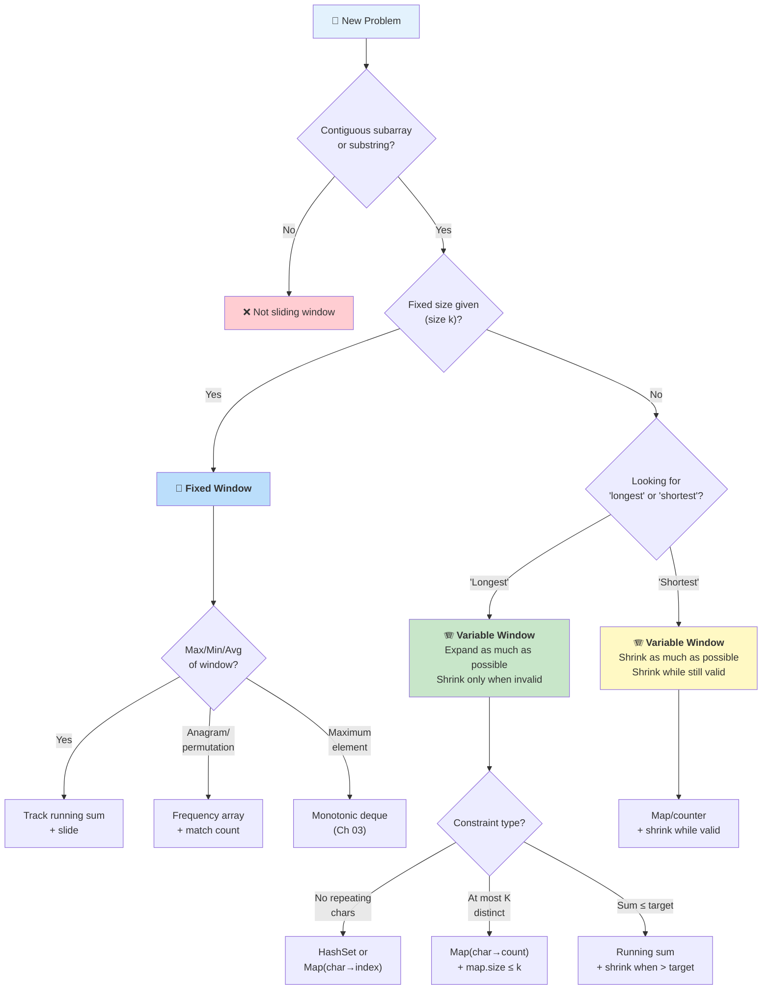

# Chapter 12: Sliding Window 🪟

> *"Don't recount everything — just update what changed."*

---

## 1. 🌍 Real-World Analogy

**Imagine you're on a moving train, looking through a window.**

The scenery outside (your data) is fixed — hills, trees, buildings, rivers — it's all there, laid out in order. But you can only see what's **inside your window** at any given moment. As the train moves, the window **slides** along the scenery: a new piece of landscape enters on one side, and an old piece disappears on the other.



**Two types of windows:**

| Type | Analogy | When to Use |
|------|---------|-------------|
| **Fixed Window** 📏 | The window is always the same size — like a standard train window. It shows exactly `k` elements at a time. | "Find max/min/average of every `k` consecutive elements" |
| **Variable Window** 🪗 | The window is like a **rubber band on a ruler** — you can stretch it wider or squeeze it narrower to find the best view that satisfies some condition. | "Find the longest/shortest subarray/substring with some property" |



---

## 2. 📝 What & Why

### What Is Sliding Window?

Sliding window is a technique where you maintain a **contiguous subset** (a "window") of elements from an array or string and **slide** it across the input, updating your computation **incrementally** instead of recalculating from scratch.

### Why Is It Powerful?

The key insight is beautifully simple:



> **Instead of recalculating from scratch for each position, we update incrementally:**
> - ➕ **Add** the new element entering the window on the right
> - ➖ **Remove** the element leaving the window on the left
> - 📊 **Update** the result

### The Two Types

| | Fixed-Size Window 📏 | Variable-Size Window 🪗 |
|---|---|---|
| **Window size** | Always exactly `k` | Grows and shrinks dynamically |
| **Movement** | Slide one step right each time | Expand right, shrink left as needed |
| **Trigger to slide** | Every step | Condition-based (valid/invalid) |
| **Goal** | Compute something for every window of size `k` | Find the optimal (longest/shortest) window satisfying a constraint |
| **Example** | Max sum of `k` consecutive elements | Longest substring without repeating chars |

---

## 3. ⚙️ How It Works

### 📏 Fixed-Size Window: Max Sum of K Consecutive Elements

**Problem:** Given `arr = [2, 1, 5, 1, 3, 2]` and `k = 3`, find the maximum sum of any 3 consecutive elements.



**The pattern:**
1. **Build** the first window (sum the first `k` elements)
2. **Slide**: For each new position, `sum += arr[right] - arr[right - k]`
3. **Track** the best result

### 🪗 Variable-Size Window: Longest Substring Without Repeating Characters

**Problem:** Given `s = "abcabcbb"`, find the length of the longest substring without repeating characters.



**The general variable-window template:**



---

## 4. 💻 TypeScript Implementation

### 📏 Fixed-Size Window Template

```typescript
function fixedWindowTemplate(arr: number[], k: number): number {
  const n = arr.length;
  if (n < k) return -1;

  // 1️⃣ Build the first window
  let windowSum = 0;
  for (let i = 0; i < k; i++) {
    windowSum += arr[i];
  }

  let maxSum = windowSum;

  // 2️⃣ Slide: add right element, remove left element
  for (let right = k; right < n; right++) {
    windowSum += arr[right];       // ➕ element entering window
    windowSum -= arr[right - k];   // ➖ element leaving window
    maxSum = Math.max(maxSum, windowSum);
  }

  return maxSum;
}
```

**Visual of one slide step:**

```
Before:  ... [a, b, c] d ...     sum = a + b + c
                   ↓
After:   ... a, [b, c, d] ...    sum = sum - a + d
              ➖ left    ➕ right
```

### 🪗 Variable-Size Window Template

```typescript
function variableWindowTemplate(arr: number[]): number {
  let left = 0;
  let result = 0; // or Infinity for "shortest" problems

  // Track window state (map, set, count, sum — depends on problem)
  const windowState = new Map<number, number>();

  for (let right = 0; right < arr.length; right++) {
    // 1️⃣ Expand: add arr[right] to window
    // windowState.set(arr[right], (windowState.get(arr[right]) || 0) + 1);

    // 2️⃣ Shrink: while window is INVALID, remove from left
    while (/* window is invalid */) {
      // remove arr[left] from window state
      // windowState.set(arr[left], windowState.get(arr[left])! - 1);
      left++;
    }

    // 3️⃣ Update result (window is now valid)
    result = Math.max(result, right - left + 1); // for "longest"
    // result = Math.min(result, right - left + 1); // for "shortest"
  }

  return result;
}
```

**The two flavors at a glance:**



---

## 5. 🏆 Essential Sliding Window Techniques for LeetCode

### 5.1 Maximum Sum Subarray of Size K 📏

> **Type:** Fixed window | **Difficulty:** Easy | **The gateway problem**

```typescript
function maxSumSubarrayOfSizeK(arr: number[], k: number): number {
  let windowSum = 0;
  let maxSum = -Infinity;

  for (let right = 0; right < arr.length; right++) {
    windowSum += arr[right]; // expand

    if (right >= k - 1) {
      maxSum = Math.max(maxSum, windowSum);
      windowSum -= arr[right - k + 1]; // slide: remove leftmost
    }
  }

  return maxSum;
}
// maxSumSubarrayOfSizeK([2, 1, 5, 1, 3, 2], 3) → 9
```

---

### 5.2 Longest Substring Without Repeating Characters 🪗

> **Type:** Variable window | **LC #3** | **Medium**

```typescript
function lengthOfLongestSubstring(s: string): number {
  const lastSeen = new Map<string, number>(); // char → last index
  let left = 0;
  let maxLen = 0;

  for (let right = 0; right < s.length; right++) {
    const char = s[right];

    // If we've seen this char and it's inside our current window, shrink
    if (lastSeen.has(char) && lastSeen.get(char)! >= left) {
      left = lastSeen.get(char)! + 1; // jump left past the duplicate
    }

    lastSeen.set(char, right);
    maxLen = Math.max(maxLen, right - left + 1);
  }

  return maxLen;
}
// lengthOfLongestSubstring("abcabcbb") → 3
```

**Why `Map<char, index>` instead of `Set`?** Using a map lets us **jump** `left` directly to past the duplicate instead of shrinking one-by-one. This keeps the overall complexity at O(n) with fewer iterations.

---

### 5.3 Minimum Window Substring 🪗🔥

> **Type:** Variable window | **LC #76** | **Hard** — The classic "shrink aggressively" problem

**Problem:** Given strings `s` and `t`, find the smallest substring of `s` that contains all characters of `t`.



**Step-by-step walkthrough:**

```
s = "ADOBECODEBANC", t = "ABC"
need = {A:1, B:1, C:1}, have = 0, required = 3

right=0  'A'  window={A:1}       have=1  (need A✅)
right=1  'D'  window={A:1,D:1}   have=1
right=2  'O'  window={...,O:1}   have=1
right=3  'B'  window={...,B:1}   have=2  (need B✅)
right=4  'E'  window={...,E:1}   have=2
right=5  'C'  window={...,C:1}   have=3  (need C✅) → VALID! "ADOBEC" len=6
  shrink: left=0 remove 'A' → have=2 → INVALID, stop
  best = "ADOBEC" (0,5)

right=6  'O'  have=2
right=7  'D'  have=2
right=8  'E'  have=2
right=9  'B'  window={...,B:1} have=2
right=10 'A'  window={...,A:1} have=3 → VALID! "CODEBA" len=6
  shrink: left=1 remove 'D' → still valid
  shrink: left=2 remove 'O' → still valid
  shrink: left=3 remove 'B' → have=2 → INVALID
  best = "OBA"? No — best = "CODEBA"→shrunk to "DEBA"→"EBA"... 
  Actually: best so far is min(6, 6) = still "ADOBEC"

right=11 'N'  have=2
right=12 'C'  window={...,C:1} have=3 → VALID! "BANC" 
  shrink: left=9 remove 'B' → have=2 → INVALID
  best = min(6, 4) → "BANC" len=4 ✅
```

```typescript
function minWindow(s: string, t: string): string {
  if (t.length > s.length) return "";

  const need = new Map<string, number>();
  for (const c of t) {
    need.set(c, (need.get(c) || 0) + 1);
  }

  let have = 0;
  const required = need.size; // unique chars we need
  const windowCounts = new Map<string, number>();

  let left = 0;
  let minLen = Infinity;
  let minStart = 0;

  for (let right = 0; right < s.length; right++) {
    const char = s[right];
    windowCounts.set(char, (windowCounts.get(char) || 0) + 1);

    // Check if this char's count now meets requirement
    if (need.has(char) && windowCounts.get(char) === need.get(char)) {
      have++;
    }

    // Shrink from left while window is valid
    while (have === required) {
      const windowLen = right - left + 1;
      if (windowLen < minLen) {
        minLen = windowLen;
        minStart = left;
      }

      const leftChar = s[left];
      windowCounts.set(leftChar, windowCounts.get(leftChar)! - 1);
      if (need.has(leftChar) && windowCounts.get(leftChar)! < need.get(leftChar)!) {
        have--;
      }
      left++;
    }
  }

  return minLen === Infinity ? "" : s.slice(minStart, minStart + minLen);
}
// minWindow("ADOBECODEBANC", "ABC") → "BANC"
```

**Key insight for "shortest" problems:** Once valid, **shrink aggressively** from the left. The `while (have === required)` loop keeps shrinking until the window becomes invalid.

---

### 5.4 Sliding Window Maximum (Monotonic Deque) 📏🔗

> **Type:** Fixed window + monotonic deque | **LC #239** | **Hard**
> **Cross-reference:** See [Chapter 03 — Stacks & Queues](../03-stacks-and-queues/README.md) for the deque deep-dive.

```typescript
function maxSlidingWindow(nums: number[], k: number): number[] {
  const result: number[] = [];
  const deque: number[] = []; // stores INDICES, monotonically decreasing values

  for (let right = 0; right < nums.length; right++) {
    // Remove elements smaller than current from back (they'll never be max)
    while (deque.length > 0 && nums[deque[deque.length - 1]] <= nums[right]) {
      deque.pop();
    }
    deque.push(right);

    // Remove front if it's outside the window
    if (deque[0] <= right - k) {
      deque.shift();
    }

    // Window is fully formed when right >= k - 1
    if (right >= k - 1) {
      result.push(nums[deque[0]]); // front of deque is always the max
    }
  }

  return result;
}
// maxSlidingWindow([1,3,-1,-3,5,3,6,7], 3) → [3,3,5,5,6,7]
```

**Why a deque?** A regular max-tracking approach breaks when the max leaves the window. The monotonic deque ensures the front is always the current window's maximum, and elements that can never be a future maximum are eagerly removed.

---

### 5.5 Longest Substring with At Most K Distinct Characters 🪗

> **Type:** Variable window | **LC #340** | **Medium**

```typescript
function longestSubstringKDistinct(s: string, k: number): number {
  const freq = new Map<string, number>();
  let left = 0;
  let maxLen = 0;

  for (let right = 0; right < s.length; right++) {
    const char = s[right];
    freq.set(char, (freq.get(char) || 0) + 1);

    // Shrink if we have more than k distinct characters
    while (freq.size > k) {
      const leftChar = s[left];
      freq.set(leftChar, freq.get(leftChar)! - 1);
      if (freq.get(leftChar) === 0) freq.delete(leftChar);
      left++;
    }

    maxLen = Math.max(maxLen, right - left + 1);
  }

  return maxLen;
}
// longestSubstringKDistinct("eceba", 2) → 3 ("ece")
```

---

### 5.6 Fruit Into Baskets 🪗🍎🍊

> **Type:** Variable window | **LC #904** | **Medium** — Same as "at most 2 distinct"

```typescript
function totalFruit(fruits: number[]): number {
  // Exactly the same pattern as longestSubstringKDistinct with k = 2
  const basket = new Map<number, number>();
  let left = 0;
  let maxFruits = 0;

  for (let right = 0; right < fruits.length; right++) {
    basket.set(fruits[right], (basket.get(fruits[right]) || 0) + 1);

    while (basket.size > 2) {
      const leftFruit = fruits[left];
      basket.set(leftFruit, basket.get(leftFruit)! - 1);
      if (basket.get(leftFruit) === 0) basket.delete(leftFruit);
      left++;
    }

    maxFruits = Math.max(maxFruits, right - left + 1);
  }

  return maxFruits;
}
// totalFruit([1,2,1,2,3]) → 4 ([1,2,1,2])
```

---

### 5.7 Permutation in String / Find All Anagrams 📏🔤

> **Type:** Fixed window + frequency matching | **LC #567 / #438** | **Medium**

The trick: two strings are anagrams if they have the **same character frequency**. Use a fixed window of size `t.length` and track how many character frequencies match.

```typescript
function findAnagrams(s: string, p: string): number[] {
  if (p.length > s.length) return [];

  const result: number[] = [];
  const pCount = new Array(26).fill(0);
  const sCount = new Array(26).fill(0);

  const charIdx = (c: string) => c.charCodeAt(0) - 'a'.charCodeAt(0);

  // Build frequency map for p and first window
  for (let i = 0; i < p.length; i++) {
    pCount[charIdx(p[i])]++;
    sCount[charIdx(s[i])]++;
  }

  // Count matching frequencies
  let matches = 0;
  for (let i = 0; i < 26; i++) {
    if (sCount[i] === pCount[i]) matches++;
  }

  for (let right = p.length; right < s.length; right++) {
    if (matches === 26) result.push(right - p.length);

    // Add right character
    const rIdx = charIdx(s[right]);
    sCount[rIdx]++;
    if (sCount[rIdx] === pCount[rIdx]) matches++;
    else if (sCount[rIdx] === pCount[rIdx] + 1) matches--;

    // Remove left character
    const lIdx = charIdx(s[right - p.length]);
    sCount[lIdx]--;
    if (sCount[lIdx] === pCount[lIdx]) matches++;
    else if (sCount[lIdx] === pCount[lIdx] - 1) matches--;
  }

  if (matches === 26) result.push(s.length - p.length);

  return result;
}
// findAnagrams("cbaebabacd", "abc") → [0, 6]
```

**Why track `matches` instead of comparing arrays?** Comparing 26 frequencies each step = O(26) per step. Tracking `matches` incrementally = O(1) per step. Both are technically O(n), but the constant factor matters.

---

## 6. ⏱️ Complexity Analysis



| Problem Type | Time | Space |
|---|---|---|
| Fixed window (sum/max) | O(n) | O(1) |
| Variable window + Set | O(n) | O(min(n, charset)) |
| Variable window + Map | O(n) | O(min(n, charset)) |
| Fixed window + deque | O(n) | O(k) |
| Anagram / permutation matching | O(n) | O(1) — fixed 26-char array |

> 🧠 **Why is variable window O(n) even with the inner while loop?** Because `left` only moves forward. Each element is added once (when `right` passes it) and removed at most once (when `left` passes it). The inner loop's **total** iterations across all outer iterations is at most `n`.

---

## 7. 🎯 LeetCode Pattern Recognition

Use this decision flowchart when you see a sliding window problem:



### 🔑 Quick Pattern-Matching Cheat Sheet

| Signal in Problem | Pattern | Example |
|---|---|---|
| "Maximum/minimum sum of k consecutive" | Fixed window | Max Sum Subarray of Size K |
| "Average of subarrays of size k" | Fixed window | Max Average Subarray I |
| "Longest substring/subarray with ..." | Variable window (expand-heavy) | Longest Substring Without Repeating |
| "Shortest/minimum substring containing ..." | Variable window (shrink-heavy) | Minimum Window Substring |
| "Anagram / permutation in string" | Fixed window + frequency match | Find All Anagrams, Permutation in String |
| "At most K distinct characters/elements" | Variable window + frequency map | Fruits Into Baskets, K Distinct Chars |
| "Maximum of all subarrays of size k" | Fixed window + monotonic deque | Sliding Window Maximum |
| "Longest with at most K replacements" | Variable window + count tracking | Longest Repeating Char Replacement |

### 🧠 Key Insights

- **"Longest"** = expand as much as possible, only shrink when forced (window invalid)
- **"Shortest"** = once valid, shrink as aggressively as possible to find minimum
- **Fixed size** = the window size is given to you; just slide it
- **Variable size** = you decide the window boundaries based on a condition
- If you see "contiguous" + "optimal" → think sliding window

---

## 8. ⚠️ Common Pitfalls

### ❌ Pitfall 1: Not knowing when to use fixed vs variable

```
Fixed:  "... of size k"  or  "every k consecutive"  → size is GIVEN
Variable:  "longest/shortest ... with condition"  → size is UNKNOWN
```

### ❌ Pitfall 2: Forgetting to remove elements when shrinking

```typescript
// ❌ WRONG — forgot to update window state when shrinking
while (windowInvalid) {
  left++; // moved left but didn't remove arr[left-1] from state!
}

// ✅ CORRECT — always clean up before moving left
while (windowInvalid) {
  removeFromState(arr[left]);
  left++;
}
```

### ❌ Pitfall 3: Off-by-one errors in window size

```typescript
// ❌ Common mistake: window size is right - left, not right - left + 1
const windowSize = right - left;     // WRONG! Off by one

// ✅ Correct: window [left, right] inclusive has right - left + 1 elements
const windowSize = right - left + 1; // CORRECT
```

### ❌ Pitfall 4: Using "if" instead of "while" for shrinking

```typescript
// ❌ WRONG — only shrinks once, might still be invalid
if (freq.size > k) {
  removeFromLeft();
  left++;
}

// ✅ CORRECT — keep shrinking until valid
while (freq.size > k) {
  removeFromLeft();
  left++;
}
```

### ❌ Pitfall 5: Confusing "shrink when invalid" vs "shrink while valid"

```typescript
// For "LONGEST" problems:
while (windowIsINVALID) { shrink(); }  // shrink to RESTORE validity

// For "SHORTEST" problems:
while (windowIsVALID) { updateBest(); shrink(); }  // shrink to FIND minimum
```

### ❌ Pitfall 6: Not deleting zero-count entries from the map

```typescript
// ❌ map.size will be wrong if you don't clean up
freq.set(char, freq.get(char)! - 1);
// freq.size still counts this char even if count is 0!

// ✅ Always delete when count reaches 0
freq.set(char, freq.get(char)! - 1);
if (freq.get(char) === 0) freq.delete(char);
```

---

## 9. 🔑 Key Takeaways

1. **Sliding window = incremental update.** Instead of recalculating for every position, add the new element and remove the old one. This turns O(n×k) into O(n).

2. **Two types, two templates.** Fixed window: build first window, then slide. Variable window: expand right, shrink left when invalid.

3. **Every element enters and leaves exactly once.** Even with the inner `while` loop, variable window is O(n) total — each element is processed at most twice.

4. **"Longest" vs "Shortest" changes the shrink strategy:**
   - Longest → shrink only when forced (invalid window)
   - Shortest → shrink aggressively (while still valid)

5. **Window state matters.** Use the right data structure: running sum for numeric problems, Set for uniqueness, Map for frequency counting, deque for max/min tracking.

6. **Always clean up when shrinking.** Forgetting to update window state when moving `left` is the #1 bug source.

7. **The frequency-match pattern** (anagram/permutation problems) is its own sub-type — fixed window with character counting and a `matches` counter for O(1) validity checks.

---

## 10. 📋 Practice Problems

### 🟢 Easy
| # | Problem | Type | Key Technique |
|---|---------|------|---------------|
| 643 | [Maximum Average Subarray I](https://leetcode.com/problems/maximum-average-subarray-i/) | Fixed | Running sum / k |
| 121 | [Best Time to Buy and Sell Stock](https://leetcode.com/problems/best-time-to-buy-and-sell-stock/) | Variable | Track min price, max profit |

### 🟡 Medium
| # | Problem | Type | Key Technique |
|---|---------|------|---------------|
| 3 | [Longest Substring Without Repeating Characters](https://leetcode.com/problems/longest-substring-without-repeating-characters/) | Variable | Map(char → index) |
| 567 | [Permutation in String](https://leetcode.com/problems/permutation-in-string/) | Fixed | Frequency match + `matches` counter |
| 438 | [Find All Anagrams in a String](https://leetcode.com/problems/find-all-anagrams-in-a-string/) | Fixed | Same as #567, collect all positions |
| 424 | [Longest Repeating Character Replacement](https://leetcode.com/problems/longest-repeating-character-replacement/) | Variable | Freq map + `maxFreq` |
| 904 | [Fruit Into Baskets](https://leetcode.com/problems/fruit-into-baskets/) | Variable | At most 2 distinct (Map.size ≤ 2) |
| 1004 | [Max Consecutive Ones III](https://leetcode.com/problems/max-consecutive-ones-iii/) | Variable | Count zeros in window ≤ k |
| 209 | [Minimum Size Subarray Sum](https://leetcode.com/problems/minimum-size-subarray-sum/) | Variable | Shrink while sum ≥ target |
| 340 | [Longest Substring with At Most K Distinct Characters](https://leetcode.com/problems/longest-substring-with-at-most-k-distinct-characters/) | Variable | Map.size ≤ k |

### 🔴 Hard
| # | Problem | Type | Key Technique |
|---|---------|------|---------------|
| 76 | [Minimum Window Substring](https://leetcode.com/problems/minimum-window-substring/) | Variable | Freq map + `have/required` + shrink while valid |
| 239 | [Sliding Window Maximum](https://leetcode.com/problems/sliding-window-maximum/) | Fixed + Deque | Monotonic deque (Ch 03) |
| 30 | [Substring with Concatenation of All Words](https://leetcode.com/problems/substring-with-concatenation-of-all-words/) | Fixed | Word-level sliding window + frequency match |

---

> **Next up:** [Chapter 13 →](../13-recursion-and-backtracking/README.md)
>
> **Previously:** [Chapter 11 ←](../11-two-pointers/README.md)
