# Chapter 13: Recursion & Backtracking 🔄🔙

> **"To understand recursion, you must first understand recursion."**

Recursion and backtracking are not just techniques — they're a *way of thinking* about problems. Master these and you unlock the ability to solve an enormous category of LeetCode problems: generating subsets, permutations, combinations, constraint satisfaction, and more.

---

## 📑 Table of Contents

1. [🌍 Real-World Analogy](#-real-world-analogy)
2. [📝 What & Why](#-what--why)
3. [⚙️ How It Works](#️-how-it-works)
4. [💻 TypeScript Implementation](#-typescript-implementation)
5. [🧩 Essential Techniques for LeetCode](#-essential-techniques-for-leetcode)
6. [🚫 How to Handle Duplicates](#-how-to-handle-duplicates)
7. [⏱️ Complexity Analysis](#️-complexity-analysis)
8. [🎯 LeetCode Patterns](#-leetcode-patterns)
9. [⚠️ Common Pitfalls](#️-common-pitfalls)
10. [🔑 Key Takeaways](#-key-takeaways)
11. [📋 Practice Problems](#-practice-problems)

---

## 🌍 Real-World Analogy

### Recursion — Russian Nesting Dolls 🪆

Imagine a **matryoshka** (Russian nesting doll). You open the largest doll, and inside is a *smaller but identical* doll. You open that one — another smaller doll inside. You keep opening until you reach the **tiniest doll that doesn't open** (the **base case**). Then you close them all back up, reassembling the result from the inside out.

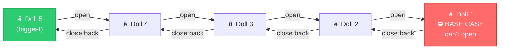

**Another analogy**: You look up a word in the dictionary. The definition uses *another* word you don't know. So you look *that* word up. Its definition uses yet *another* unknown word. You keep going until you hit a word you **already understand** (base case), then you work your way back, understanding each definition in reverse order.

### Backtracking — Exploring a Maze 🏰

You're trapped in a maze. At every fork, you pick a direction and walk forward. If you hit a **dead end**, you **back up** to the last fork and try a **different path**. You're *making choices*, and **undoing them** when they don't work out.

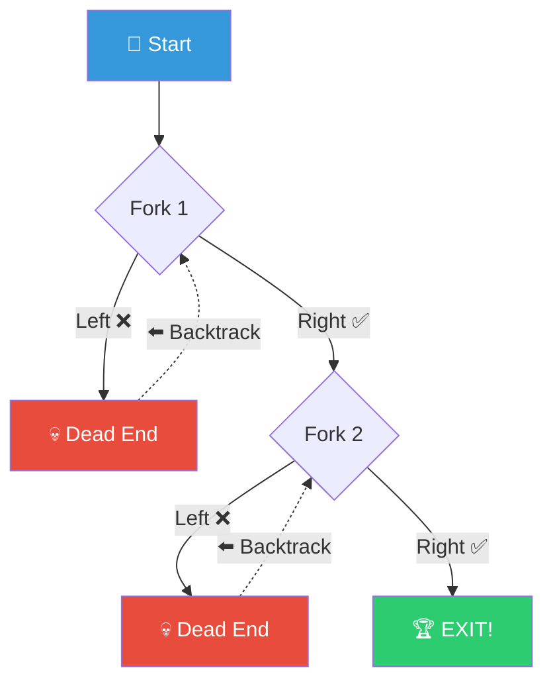

**Key distinction**: Recursion is a technique (function calling itself). Backtracking is recursion **+ undo** — try a choice, recurse, then *undo* the choice and try the next one.

---

## 📝 What & Why

### Recursion

A **recursive function** calls itself with a **smaller or simpler input**, repeating until it hits a **base case** where it returns directly.

Every recursion has exactly two parts:

| Part | What It Does | What Happens Without It |
|------|-------------|------------------------|
| **Base Case** 🛑 | Stops the recursion | Infinite recursion → stack overflow 💥 |
| **Recursive Case** 🔄 | Breaks problem into smaller subproblem(s) | Never makes progress toward the base case |

**Why recursion matters**:
- Many data structures are **naturally recursive**: trees (a node + subtrees), linked lists (a node + rest of list), graphs
- **Divide & conquer** algorithms (merge sort, quick sort) rely on recursion
- Recursive code often mirrors the **mathematical definition** of a problem
- It's the foundation for **backtracking** and **dynamic programming** (Chapter 15)

**How it works under the hood — The Call Stack**:

When a function calls itself, each call gets its own **stack frame** — its own copy of local variables, parameters, and a return address. These frames stack up. When the base case returns, frames pop off one by one, each using the result from the frame above.

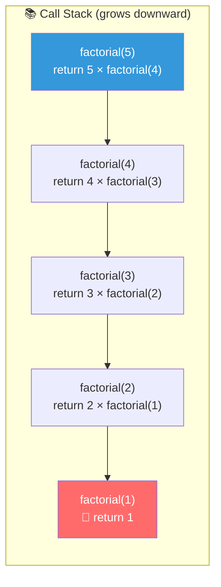

```
Building up (pushing frames):    Unwinding (popping frames):
factorial(5) called              factorial(1) returns 1
  factorial(4) called            factorial(2) returns 2 × 1 = 2
    factorial(3) called          factorial(3) returns 3 × 2 = 6
      factorial(2) called        factorial(4) returns 4 × 6 = 24
        factorial(1) called      factorial(5) returns 5 × 24 = 120
        ← BASE CASE: return 1
```

### Backtracking

Backtracking = **recursion + undo**. It systematically explores all possibilities by:

1. **Making a choice** (place a queen, add a number, take a path)
2. **Recursing** (explore what happens with that choice)
3. **Undoing the choice** (remove the queen, remove the number, go back)
4. **Trying the next option**

**Why backtracking matters**:
- Generates **all** combinations, permutations, subsets
- Solves **constraint satisfaction** problems (N-Queens, Sudoku)
- **Pruning** (skipping invalid choices early) makes it far more efficient than brute force

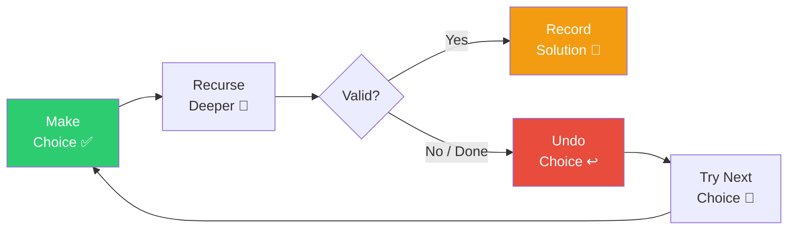

---

## ⚙️ How It Works

### 1. The Call Stack — Factorial

`factorial(5) = 5 × 4 × 3 × 2 × 1 = 120`

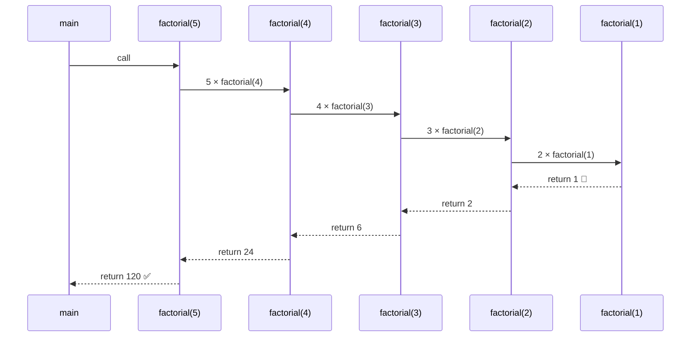

### 2. Recursion Tree — Fibonacci

`fib(5)` creates a **tree** of calls. Notice the **repeated subproblems** — `fib(3)` is computed twice, `fib(2)` three times. This redundancy is what makes naive recursion O(2ⁿ) and motivates **dynamic programming** (see [Chapter 15](../15-dynamic-programming/README.md)).

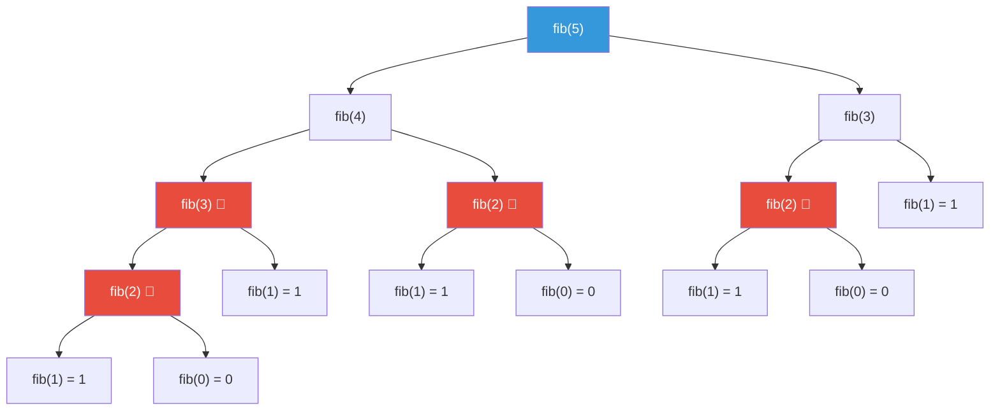

> 🔴 = **Repeated computation**. With memoization (DP), each subproblem is solved only once → O(n).

### 3. Backtracking Decision Tree — Subsets of [1, 2, 3]

At each element, you make a **binary decision**: include it or exclude it.

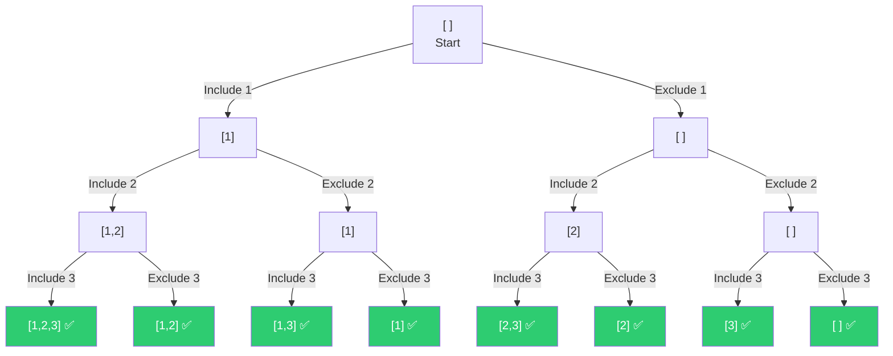

**Result**: `[], [1], [2], [3], [1,2], [1,3], [2,3], [1,2,3]` — that's **2³ = 8** subsets.

### 4. Pruning — Cutting Branches Early ✂️

Pruning means **skipping entire branches** of the decision tree when you can prove they won't lead to a valid solution. This is what makes backtracking practical.

**Example**: Combination Sum — find combinations that sum to `target = 7` from `[2, 3, 6, 7]`:

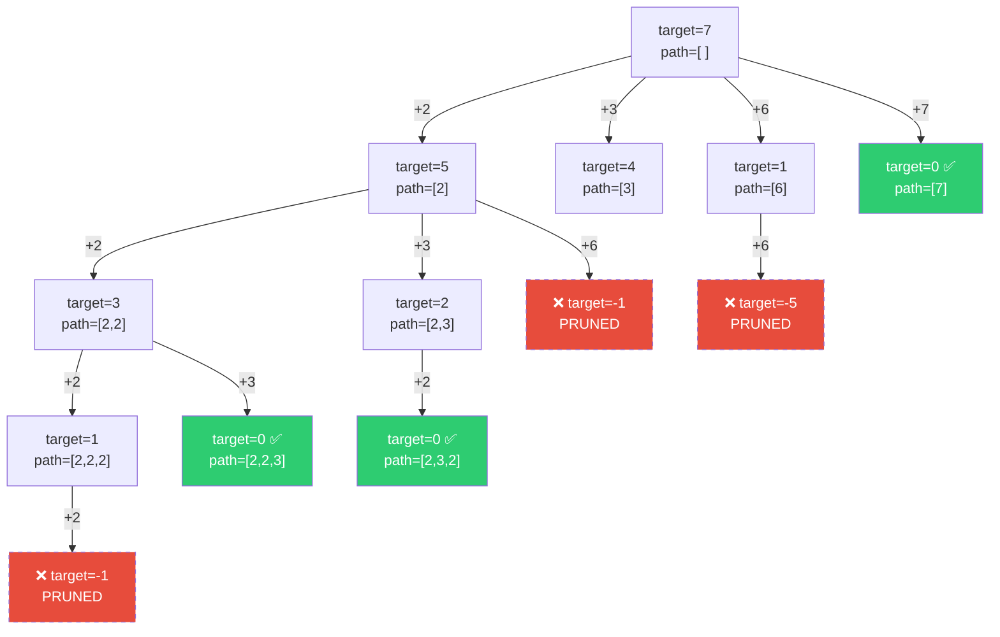

> ✂️ **Dashed red nodes** = pruned. We don't explore them because `target` went negative. Without pruning, the tree would be much larger.

---

## 💻 TypeScript Implementation

### Factorial — The Hello World of Recursion

```typescript
function factorial(n: number): number {
  if (n <= 1) return 1;           // 🛑 Base case
  return n * factorial(n - 1);    // 🔄 Recursive case: make problem smaller
}

// factorial(5) → 5 * factorial(4) → 5 * 4 * factorial(3) → ... → 5 * 4 * 3 * 2 * 1 = 120
```

### Fibonacci — Naive (Exposes Why DP Matters)

```typescript
function fib(n: number): number {
  if (n <= 1) return n;                  // 🛑 Base cases: fib(0)=0, fib(1)=1
  return fib(n - 1) + fib(n - 2);       // 🔄 Two recursive calls → exponential!
}

// fib(5) makes 15 calls. fib(40) makes ~300 million calls. fib(50)? Don't even try.
// Time: O(2ⁿ) 💀  |  With memoization (Ch 15): O(n) ✅
```

### 📐 The Recursion Template

Every recursive solution follows this skeleton:

```typescript
function solve(input: SomeType): ResultType {
  // 🛑 BASE CASE — when to stop
  if (/* smallest subproblem */) {
    return /* direct answer */;
  }

  // 🔄 RECURSIVE CASE — break into smaller subproblem(s)
  // Optionally: do some work before/after the recursive call
  return solve(/* smaller input */);
}
```

### 📐 The Backtracking Template

This is the **single most important pattern** in this chapter. Memorize it.

```typescript
function backtrack(
  choices: SomeType[],      // what options are available
  path: SomeType[],         // current partial solution
  result: SomeType[][],     // all valid solutions collected here
  start: number             // where to start choosing from (avoids duplicates)
): void {
  // 🎯 GOAL — found a valid complete solution
  if (/* goal condition */) {
    result.push([...path]);  // ⚠️ MUST copy! (explained in pitfalls)
    return;
  }

  for (let i = start; i < choices.length; i++) {
    // ✂️ PRUNE — skip invalid choices
    if (/* choice is invalid */) continue;

    // ✅ CHOOSE
    path.push(choices[i]);

    // 🔽 EXPLORE — recurse with this choice made
    backtrack(choices, path, result, i + 1);  // i+1 for combinations, i for reuse

    // ↩️ UN-CHOOSE (BACKTRACK!) — undo the choice
    path.pop();
  }
}
```

The three steps — **choose, explore, un-choose** — are the heartbeat of every backtracking solution.

---

## 🧩 Essential Techniques for LeetCode

### 1. Subsets (LC 78) 📦

> Generate all subsets (the power set) of an array of unique integers.

**Approach 1 — Include/Exclude (Binary Decision)**:

At each index, decide: include this element or skip it.

```typescript
function subsets(nums: number[]): number[][] {
  const result: number[][] = [];

  function dfs(index: number, path: number[]): void {
    if (index === nums.length) {
      result.push([...path]);
      return;
    }
    // Exclude nums[index]
    dfs(index + 1, path);
    // Include nums[index]
    path.push(nums[index]);
    dfs(index + 1, path);
    path.pop();
  }

  dfs(0, []);
  return result;
}
```

**Approach 2 — Iterative Backtracking (Loop-based)**:

Use a for-loop starting from `start` to pick elements.

```typescript
function subsetsIterative(nums: number[]): number[][] {
  const result: number[][] = [];

  function backtrack(start: number, path: number[]): void {
    result.push([...path]);  // every partial path is a valid subset

    for (let i = start; i < nums.length; i++) {
      path.push(nums[i]);
      backtrack(i + 1, path);
      path.pop();
    }
  }

  backtrack(0, []);
  return result;
}
```

Both produce the same 2ⁿ subsets. The loop-based approach generalizes better to combinations and combination sums.

---

### 2. Permutations (LC 46) 🔀

> Generate all orderings of an array of unique integers.

**Approach 1 — Used-Set**:

Track which elements have been used via a boolean array.

```typescript
function permutations(nums: number[]): number[][] {
  const result: number[][] = [];
  const used: boolean[] = new Array(nums.length).fill(false);

  function backtrack(path: number[]): void {
    if (path.length === nums.length) {
      result.push([...path]);
      return;
    }

    for (let i = 0; i < nums.length; i++) {
      if (used[i]) continue;
      used[i] = true;
      path.push(nums[i]);
      backtrack(path);
      path.pop();
      used[i] = false;
    }
  }

  backtrack([]);
  return result;
}
```

**Approach 2 — Swap-Based**:

Fix one element at each position by swapping.

```typescript
function permutationsSwap(nums: number[]): number[][] {
  const result: number[][] = [];

  function backtrack(start: number): void {
    if (start === nums.length) {
      result.push([...nums]);
      return;
    }

    for (let i = start; i < nums.length; i++) {
      [nums[start], nums[i]] = [nums[i], nums[start]];   // choose (swap)
      backtrack(start + 1);                                // explore
      [nums[start], nums[i]] = [nums[i], nums[start]];   // un-choose (swap back)
    }
  }

  backtrack(0);
  return result;
}
```

---

### 3. Combinations (LC 77) 🎯

> Choose k elements from [1..n]. Order doesn't matter.

```typescript
function combine(n: number, k: number): number[][] {
  const result: number[][] = [];

  function backtrack(start: number, path: number[]): void {
    if (path.length === k) {
      result.push([...path]);
      return;
    }

    // Pruning: need (k - path.length) more elements, 
    // so don't start beyond n - (k - path.length) + 1
    for (let i = start; i <= n - (k - path.length) + 1; i++) {
      path.push(i);
      backtrack(i + 1, path);
      path.pop();
    }
  }

  backtrack(1, []);
  return result;
}
```

The pruning condition `i <= n - (k - path.length) + 1` is crucial — it cuts branches where there aren't enough remaining elements to fill the combination.

---

### 4. Combination Sum (LC 39) ➕

> Find all combinations where elements sum to `target`. Each element can be reused.

```typescript
function combinationSum(candidates: number[], target: number): number[][] {
  const result: number[][] = [];
  candidates.sort((a, b) => a - b);

  function backtrack(start: number, remaining: number, path: number[]): void {
    if (remaining === 0) {
      result.push([...path]);
      return;
    }

    for (let i = start; i < candidates.length; i++) {
      if (candidates[i] > remaining) break;  // ✂️ prune: sorted, so all after are too big

      path.push(candidates[i]);
      backtrack(i, remaining - candidates[i], path);  // i (not i+1) — can reuse!
      path.pop();
    }
  }

  backtrack(0, target, []);
  return result;
}
```

**Key detail**: `backtrack(i, ...)` not `backtrack(i + 1, ...)` — passing `i` allows reusing the same element.

---

### 5. N-Queens (LC 51) 👑

> Place N queens on an N×N board so no two queens attack each other.

Queens attack along rows, columns, and diagonals. We place **one queen per row** and check column/diagonal conflicts.

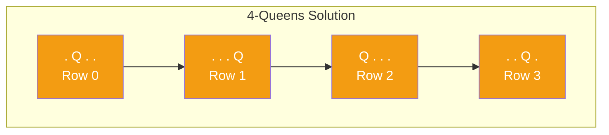

```typescript
function solveNQueens(n: number): string[][] {
  const result: string[][] = [];
  const cols = new Set<number>();
  const diag1 = new Set<number>();  // row - col (↘ diagonal)
  const diag2 = new Set<number>();  // row + col (↗ diagonal)
  const board: string[][] = Array.from({ length: n }, () => Array(n).fill('.'));

  function backtrack(row: number): void {
    if (row === n) {
      result.push(board.map(r => r.join('')));
      return;
    }

    for (let col = 0; col < n; col++) {
      if (cols.has(col) || diag1.has(row - col) || diag2.has(row + col)) continue;

      board[row][col] = 'Q';
      cols.add(col);
      diag1.add(row - col);
      diag2.add(row + col);

      backtrack(row + 1);

      board[row][col] = '.';
      cols.delete(col);
      diag1.delete(row - col);
      diag2.delete(row + col);
    }
  }

  backtrack(0);
  return result;
}
```

**Diagonal trick**: Two cells share a `↘` diagonal when `row - col` is equal. Two cells share a `↗` diagonal when `row + col` is equal. Using sets for O(1) lookup beats checking all placed queens.

---

### 6. Word Search (LC 79) 🔤

> Given a 2D grid of letters, find if a word exists by following adjacent cells (no reuse).

```typescript
function exist(board: string[][], word: string): boolean {
  const rows = board.length;
  const cols = board[0].length;
  const dirs = [[0, 1], [0, -1], [1, 0], [-1, 0]];

  function backtrack(r: number, c: number, idx: number): boolean {
    if (idx === word.length) return true;
    if (r < 0 || r >= rows || c < 0 || c >= cols) return false;
    if (board[r][c] !== word[idx]) return false;

    const temp = board[r][c];
    board[r][c] = '#';  // mark visited

    for (const [dr, dc] of dirs) {
      if (backtrack(r + dr, c + dc, idx + 1)) return true;
    }

    board[r][c] = temp;  // un-mark (backtrack)
    return false;
  }

  for (let r = 0; r < rows; r++) {
    for (let c = 0; c < cols; c++) {
      if (backtrack(r, c, 0)) return true;
    }
  }
  return false;
}
```

**Pattern**: Temporarily modify the grid (`'#'`), recurse, then restore. Classic choose/explore/un-choose on a grid.

---

### 7. Generate Parentheses (LC 22) 🏗️

> Generate all valid combinations of `n` pairs of parentheses.

```typescript
function generateParenthesis(n: number): string[] {
  const result: string[] = [];

  function backtrack(current: string, open: number, close: number): void {
    if (current.length === 2 * n) {
      result.push(current);
      return;
    }

    if (open < n) {
      backtrack(current + '(', open + 1, close);
    }
    if (close < open) {
      backtrack(current + ')', open, close + 1);
    }
  }

  backtrack('', 0, 0);
  return result;
}
```

**Two rules enforce validity**:
1. Can add `(` if `open < n`
2. Can add `)` only if `close < open` (never more closing than opening)

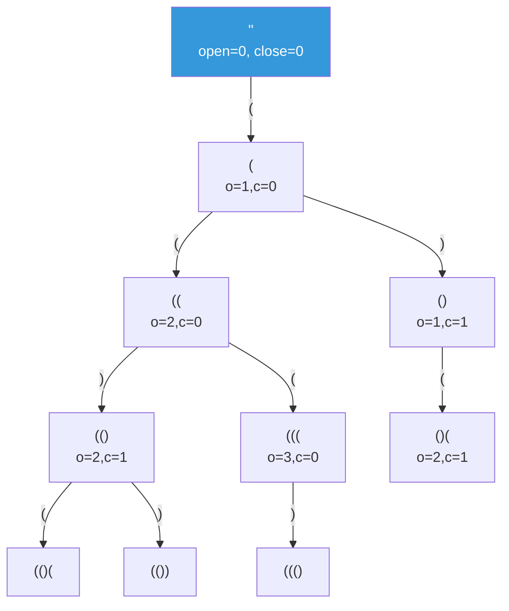

> For n=3, generates: `((()))`, `(()())`, `(())()`, `()(())`, `()()()`

---

### 8. Letter Combinations of Phone Number (LC 17) 📱

> Map digits to letters (like a phone keypad), generate all combinations.

```typescript
function letterCombinations(digits: string): string[] {
  if (!digits.length) return [];

  const map: Record<string, string> = {
    '2': 'abc', '3': 'def', '4': 'ghi', '5': 'jkl',
    '6': 'mno', '7': 'pqrs', '8': 'tuv', '9': 'wxyz'
  };
  const result: string[] = [];

  function backtrack(index: number, current: string): void {
    if (index === digits.length) {
      result.push(current);
      return;
    }

    for (const char of map[digits[index]]) {
      backtrack(index + 1, current + char);
    }
  }

  backtrack(0, '');
  return result;
}
```

---

## 🚫 How to Handle Duplicates

This is the **#1 most confusing aspect** of backtracking. When the input has duplicate elements (e.g., `[1, 2, 2]`), you need to avoid generating duplicate results.

### The Recipe 📋

1. **Sort the input** first
2. **Skip** an element if it equals the previous one AND the previous one was **not used** in the current recursive branch

### Subsets II (LC 90) — Subsets with Duplicates

```typescript
function subsetsWithDup(nums: number[]): number[][] {
  const result: number[][] = [];
  nums.sort((a, b) => a - b);  // Step 1: SORT

  function backtrack(start: number, path: number[]): void {
    result.push([...path]);

    for (let i = start; i < nums.length; i++) {
      // Step 2: Skip duplicates at the same decision level
      if (i > start && nums[i] === nums[i - 1]) continue;

      path.push(nums[i]);
      backtrack(i + 1, path);
      path.pop();
    }
  }

  backtrack(0, []);
  return result;
}
```

**Why `i > start`?** At any recursion level, `start` is the first index we're considering. If `i > start` and the current element equals the previous, we've already explored a branch with that value at this position — doing it again would produce duplicates.

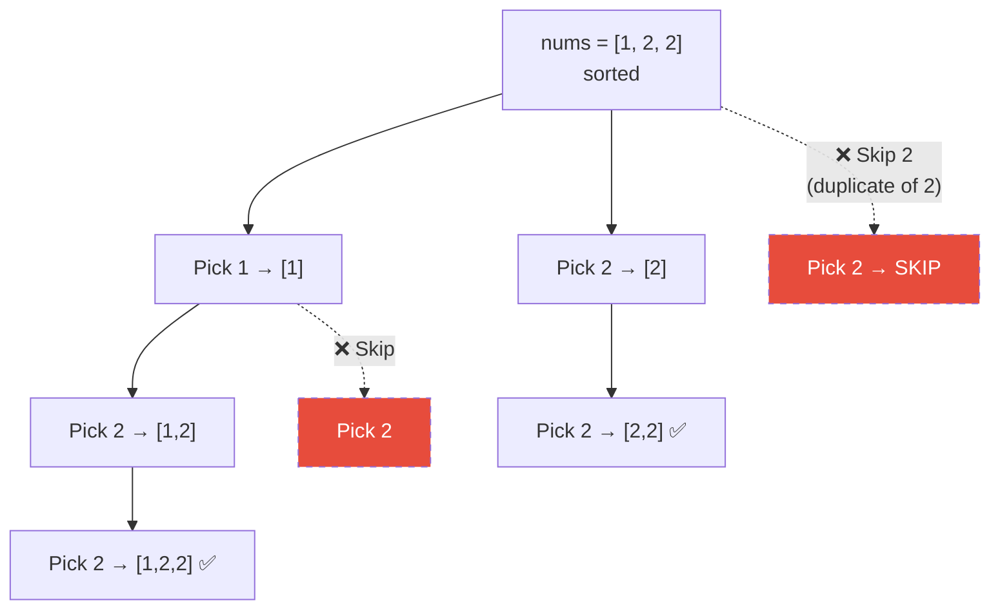

### Permutations II (LC 47) — Permutations with Duplicates

```typescript
function permuteUnique(nums: number[]): number[][] {
  const result: number[][] = [];
  nums.sort((a, b) => a - b);
  const used: boolean[] = new Array(nums.length).fill(false);

  function backtrack(path: number[]): void {
    if (path.length === nums.length) {
      result.push([...path]);
      return;
    }

    for (let i = 0; i < nums.length; i++) {
      if (used[i]) continue;
      // Skip if same as previous AND previous was NOT used (same level duplicate)
      if (i > 0 && nums[i] === nums[i - 1] && !used[i - 1]) continue;

      used[i] = true;
      path.push(nums[i]);
      backtrack(path);
      path.pop();
      used[i] = false;
    }
  }

  backtrack([]);
  return result;
}
```

**The `!used[i - 1]` condition**: If the previous duplicate was **not used** in the current branch, then we're at the same decision level and should skip. If it **was used**, it's in our current path and we're in a deeper level — that's fine.

---

## ⏱️ Complexity Analysis

| Problem | Time Complexity | Space Complexity | Why |
|---------|----------------|------------------|-----|
| **Factorial** | O(n) | O(n) stack | n recursive calls |
| **Fibonacci (naive)** | O(2ⁿ) 💀 | O(n) stack | Binary tree of calls |
| **Subsets** | O(n × 2ⁿ) | O(n) stack | 2ⁿ subsets, each copied in O(n) |
| **Permutations** | O(n × n!) | O(n) stack | n! permutations, each copied in O(n) |
| **Combinations C(n,k)** | O(k × C(n,k)) | O(k) stack | C(n,k) results, each length k |
| **N-Queens** | O(n!) | O(n²) board | Pruning reduces from nⁿ toward n! |
| **Word Search** | O(m × n × 4ᴸ) | O(L) stack | L = word length, 4 directions |
| **Generate Parens** | O(4ⁿ/√n) | O(n) stack | Catalan number |

### Space Complexity Note 📏

Recursion depth = stack space. Each recursive call adds a frame to the call stack. If recursion goes `d` levels deep, you use O(d) space just for the stack. This matters for problems with large inputs — you can hit a stack overflow.

```
Max recursion depth:
  Subsets:      O(n)     — one decision per element
  Permutations: O(n)     — one slot per element
  N-Queens:     O(n)     — one row per queen
  Fibonacci:    O(n)     — linear chain of calls
```

---

## 🎯 LeetCode Patterns — Decision Flowchart

When you see a new problem, use this flowchart to decide your approach:

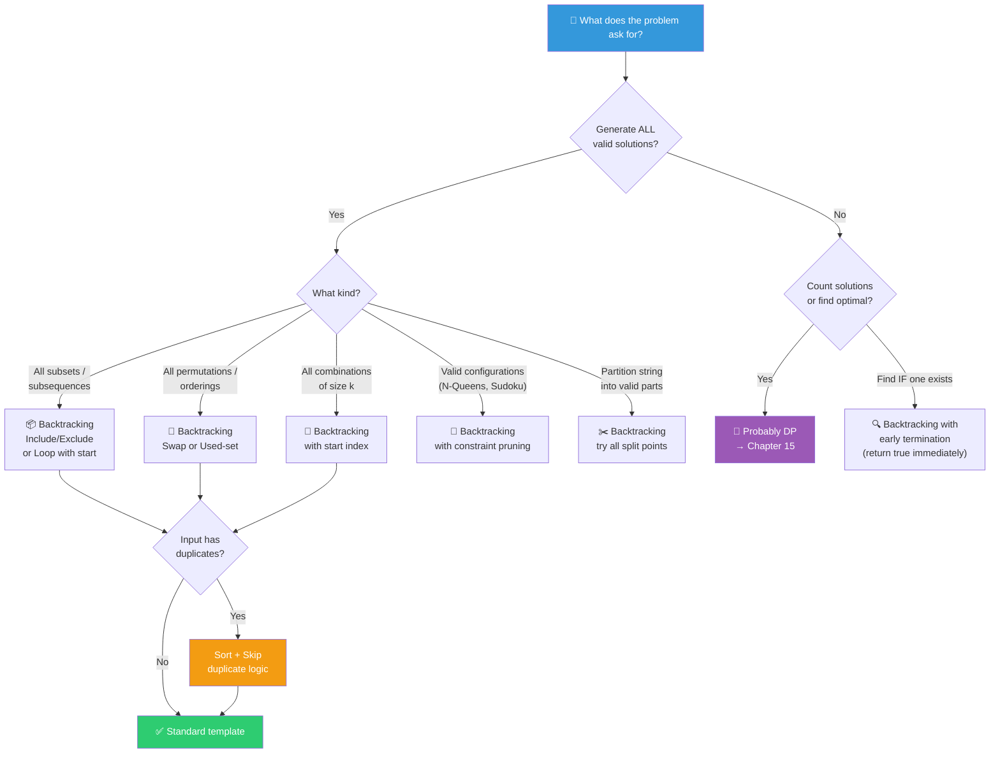

### Quick Reference Table 🗺️

| Pattern | Key Signal | Template Variation |
|---------|-----------|-------------------|
| Subsets | "all subsets", "power set", "all subsequences" | Loop from `start`, push at every node |
| Permutations | "all orderings", "all arrangements", "rearrange" | Loop from `0`, use `used[]` array |
| Combinations | "choose k from n", "all groups of size k" | Loop from `start`, stop when `path.length === k` |
| Combination Sum | "sum to target", "elements can repeat" | Loop from `start` (or `i` for reuse), track `remaining` |
| Partitioning | "partition string", "split into valid parts" | Loop from `start`, check each substring |
| Grid Search | "find word in grid", "path in matrix" | 4-directional DFS, mark/unmark visited |
| Constraint | "place items", "valid arrangement" | Row/col/diagonal constraints, sets for O(1) checks |

### ⚡ The Golden Rule

> **Need ALL possibilities? → Backtracking.**
> **Need COUNT or OPTIMAL? → Probably DP (Chapter 15).**
>
> Sometimes you start with backtracking to understand the problem, then optimize with DP.

---

## ⚠️ Common Pitfalls

### 1. Forgetting the Base Case 💥

```typescript
// ❌ INFINITE RECURSION → Stack Overflow
function bad(n: number): number {
  return n * bad(n - 1);  // when does this stop? NEVER.
}

// ✅ CORRECT
function good(n: number): number {
  if (n <= 1) return 1;   // 🛑 BASE CASE
  return n * good(n - 1);
}
```

### 2. Not Copying the Path 📋

```typescript
// ❌ BUG: all entries in result point to the SAME array
result.push(path);  // pushes a reference, not a copy!

// ✅ CORRECT: create a snapshot
result.push([...path]);       // spread into new array
result.push(path.slice());    // also works
result.push(Array.from(path)); // also works
```

**Why?** `path` is mutated during backtracking. If you push the reference, every entry in `result` will reflect `path`'s final state (empty array). You MUST snapshot it at the moment it's valid.

### 3. Not Undoing State Changes ↩️

```typescript
// ❌ BUG: state leaks between branches
path.push(choice);
backtrack(next);
// forgot path.pop()!  ← choice sticks around for the next iteration

// ✅ CORRECT
path.push(choice);
backtrack(next);
path.pop();  // ← UNDO!
```

Every `push` needs a matching `pop`. Every `set` needs a matching `delete`. Every grid mark needs an unmark. **Symmetry is key.**

### 4. Not Sorting for Duplicate Handling 🔢

```typescript
// ❌ WRONG: skipping duplicates without sorting first
if (i > start && nums[i] === nums[i - 1]) continue;
// This only works if duplicates are ADJACENT, which requires sorting!

// ✅ CORRECT: sort first
nums.sort((a, b) => a - b);
// NOW the skip logic works
```

### 5. Not Understanding Time Complexity ⏱️

Recursive solutions can be **deceptively slow**. A function that makes 2 recursive calls at each level with `n` levels produces 2ⁿ total calls. Always think about:
- How many branches at each level?
- How deep does the recursion go?
- Total work = branching factor^depth (roughly)

### 6. Confusing `i` vs `i + 1` vs `start` 🔢

```typescript
backtrack(i, ...);     // can REUSE current element (Combination Sum)
backtrack(i + 1, ...); // move to NEXT element (Subsets, Combinations)
backtrack(0, ...);     // consider ALL elements (Permutations — uses `used[]` instead)
```

This single parameter controls whether elements can repeat and in what way.

---

## 🔑 Key Takeaways

1. **Recursion = function calling itself** with a smaller input. Always needs a base case and a recursive case.

2. **Backtracking = recursion + undo**. The three-step dance: **choose → explore → un-choose**.

3. **The backtracking template** covers ~90% of LeetCode backtracking problems. Master it:
   - Loop through choices
   - Prune invalid ones
   - Choose, explore, un-choose

4. **Subsets → 2ⁿ**, **Permutations → n!**, **Combinations → C(n,k)**. These aren't just formulas — they come from the structure of the decision tree.

5. **Duplicates handling**: Sort first, then skip `nums[i] === nums[i-1]` at the same decision level.

6. **Always copy `path`** before storing: `result.push([...path])`.

7. **Pruning** is what makes backtracking practical. Without it, you're doing brute force.

8. **Need ALL results? → Backtracking**. Need count or optimal? → Probably **DP** (Chapter 15).

9. **Call stack = memory**. Recursion depth of `d` uses O(d) stack space. JavaScript has a finite stack (~10,000–25,000 frames typically).

10. **Recursion is a stepping stone** to DP. Many DP problems start as recursive solutions with overlapping subproblems that you then optimize with memoization.

---

## 📋 Practice Problems

### 🟡 Medium

| # | Problem | Key Technique | Notes |
|---|---------|--------------|-------|
| 78 | [Subsets](https://leetcode.com/problems/subsets/) | Include/exclude or loop | Foundation problem |
| 46 | [Permutations](https://leetcode.com/problems/permutations/) | Used-set or swap | Foundation problem |
| 77 | [Combinations](https://leetcode.com/problems/combinations/) | Loop with start + pruning | Foundation problem |
| 39 | [Combination Sum](https://leetcode.com/problems/combination-sum/) | Reuse allowed (pass `i` not `i+1`) | Sort + prune when > target |
| 40 | [Combination Sum II](https://leetcode.com/problems/combination-sum-ii/) | No reuse + duplicate skip | Sort + skip `nums[i] === nums[i-1]` |
| 17 | [Letter Combinations of Phone Number](https://leetcode.com/problems/letter-combinations-of-a-phone-number/) | Map + combination generation | Straightforward template |
| 22 | [Generate Parentheses](https://leetcode.com/problems/generate-parentheses/) | Open/close count tracking | Implicit pruning |
| 79 | [Word Search](https://leetcode.com/problems/word-search/) | Grid DFS + backtrack visited | Mark/unmark pattern |
| 90 | [Subsets II](https://leetcode.com/problems/subsets-ii/) | Subsets + duplicate handling | Sort + skip |
| 47 | [Permutations II](https://leetcode.com/problems/permutations-ii/) | Perms + duplicate handling | Sort + `!used[i-1]` |
| 131 | [Palindrome Partitioning](https://leetcode.com/problems/palindrome-partitioning/) | Partition + palindrome check | Try all split points |

### 🔴 Hard

| # | Problem | Key Technique | Notes |
|---|---------|--------------|-------|
| 51 | [N-Queens](https://leetcode.com/problems/n-queens/) | Constraint backtracking | Column + diagonal sets |
| 37 | [Sudoku Solver](https://leetcode.com/problems/sudoku-solver/) | Constraint backtracking | Row/col/box sets |
| 212 | [Word Search II](https://leetcode.com/problems/word-search-ii/) | Backtracking + Trie | See [Chapter 08](../08-hash-maps-and-sets/README.md) for Trie |

### 🗺️ Suggested Order

```
Subsets → Subsets II → Permutations → Permutations II
  → Combinations → Combination Sum → Combination Sum II
    → Generate Parentheses → Letter Combinations
      → Word Search → Palindrome Partitioning
        → N-Queens → Sudoku Solver → Word Search II
```

Start with Subsets (simplest template application), then build up to harder constraint problems. Each problem adds one twist to the template you already know.

---

> **Next up**: [Chapter 14 — Sorting & Searching](../14-sorting-and-searching/README.md) 📊
> **Coming later**: [Chapter 15 — Dynamic Programming](../15-dynamic-programming/README.md) — where recursive solutions get *fast* 🚀
