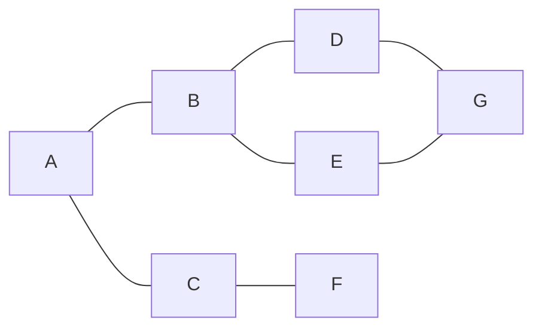
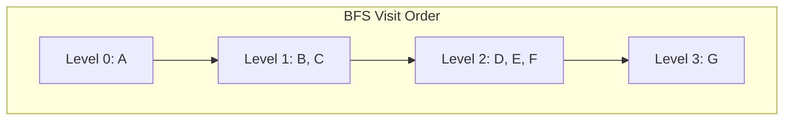
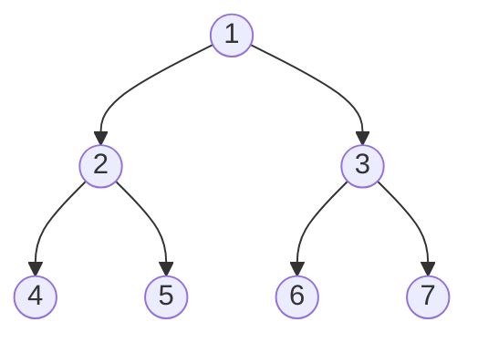
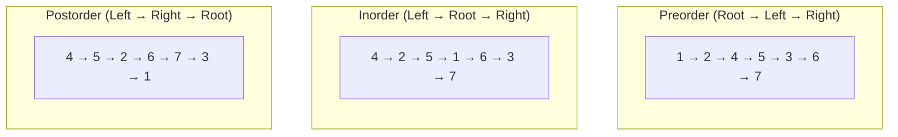
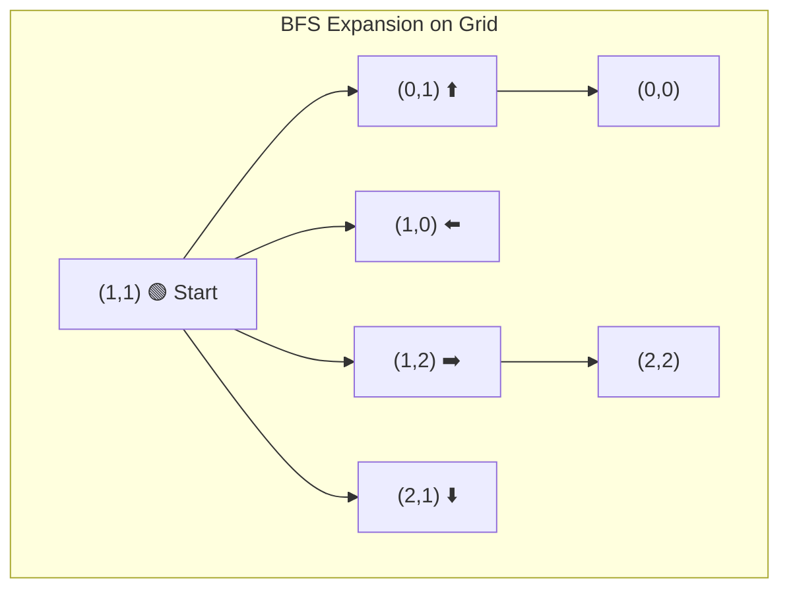
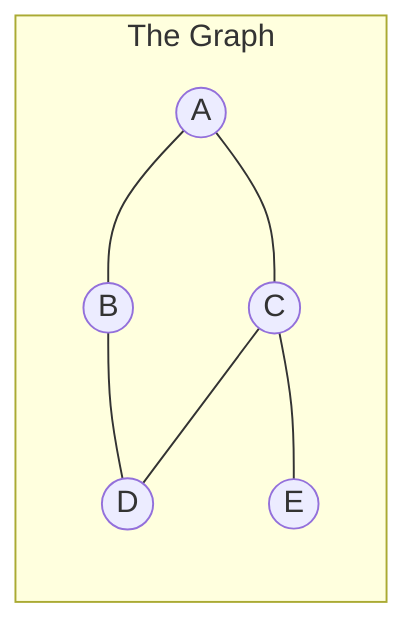
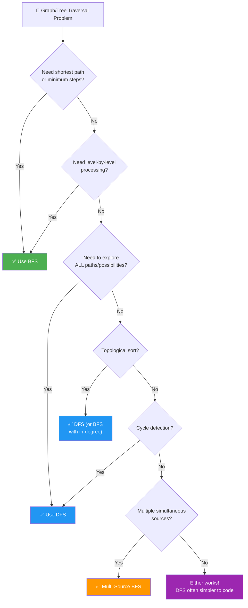
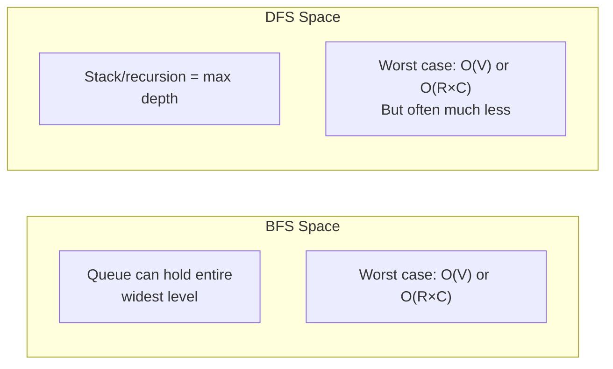

# Chapter 14: BFS and DFS 🔍🌊

> **The two fundamental traversal strategies that unlock nearly every graph and tree problem on LeetCode.**

---

## 1. 🌍 Real-World Analogy

### BFS — Breadth-First Search: Ripples in a Pond 🌊

Drop a stone into a still pond. Waves expand outward in **concentric circles** — everything at distance 1 is reached first, then distance 2, then distance 3. Nothing at distance 3 is reached before everything at distance 2 is done.

**Another way to think about it:** A rumor spreading through a social network.

```
You tell your 3 friends (distance 1)
  → Each of them tells THEIR friends (distance 2)
    → Those friends tell THEIR friends (distance 3)
```

BFS explores **layer by layer**. It guarantees that the first time you reach a node, you've taken the **shortest path** to it.

### DFS — Depth-First Search: Exploring a Maze 🏰

You enter a maze and follow one path as **deep as possible**. Hit a dead end? **Backtrack** to the last fork and try the next unexplored path. Repeat until you've explored everything.

**Another way to think about it:** Reading a book with footnotes. You follow footnote 1 to its source, and that source has its own footnote, so you follow that too — going deeper and deeper. Only when you hit a page with no footnotes do you come back up to where you left off.

```
Start → go left → go left → DEAD END
  ↩ backtrack → go right → go right → DEAD END
    ↩ backtrack → backtrack → go right → ...
```

DFS explores **branch by branch**. It dives deep before going wide.

---

## 2. 📝 What & Why

Both BFS and DFS are **graph/tree traversal strategies** — systematic ways to visit every reachable node exactly once.

| | BFS | DFS |
|---|---|---|
| **Data structure** | Queue (FIFO) | Stack (LIFO) / Recursion |
| **Exploration order** | Level by level (shallow → deep) | Branch by branch (deep → shallow) |
| **Shortest path?** | ✅ Yes (unweighted graphs) | ❌ No guarantee |
| **Memory** | Can be high (wide graphs/trees) | Can be high (deep graphs/trees) |

### When to Use Which

| Scenario | Use |
|---|---|
| Shortest path (unweighted) / minimum steps | **BFS** ✅ |
| Level-order traversal | **BFS** ✅ |
| Minimum moves / transformations | **BFS** ✅ |
| Exhaustive search / all paths | **DFS** ✅ |
| Topological sort | **DFS** ✅ (or BFS with in-degree) |
| Cycle detection | **DFS** ✅ |
| Connected components | Either works |
| Path exists from A to B? | Either works (DFS often simpler) |

> 📖 **Cross-references:**
> - Trees (Chapter 05) — BFS = level-order, DFS = preorder/inorder/postorder
> - Graphs (Chapter 07) — adjacency list representation, graph types
> - This chapter focuses on the **traversal technique itself**, applicable to trees, graphs, and grids.

---

## 3. ⚙️ How It Works

### 3.1 BFS on a Graph — Step by Step

Consider this graph, starting BFS from node **A**:



**BFS Traversal (from A):**

| Step | Visit | Queue (after visit) | Visited Set |
|------|-------|---------------------|-------------|
| 0 | — | `[A]` | `{A}` |
| 1 | **A** | `[B, C]` | `{A, B, C}` |
| 2 | **B** | `[C, D, E]` | `{A, B, C, D, E}` |
| 3 | **C** | `[D, E, F]` | `{A, B, C, D, E, F}` |
| 4 | **D** | `[E, F, G]` | `{A, B, C, D, E, F, G}` |
| 5 | **E** | `[F, G]` | (G already visited) |
| 6 | **F** | `[G]` | — |
| 7 | **G** | `[]` | — |

**Visit order: A → B → C → D → E → F → G**



### 3.2 DFS on a Graph — Step by Step

Same graph, starting DFS from node **A**:


**DFS Traversal (from A, recursive, choosing left neighbor first):**

| Step | Visit | Recursion Stack | Visited Set |
|------|-------|-----------------|-------------|
| 1 | **A** | `[A]` | `{A}` |
| 2 | **B** | `[A, B]` | `{A, B}` |
| 3 | **D** | `[A, B, D]` | `{A, B, D}` |
| 4 | **G** | `[A, B, D, G]` | `{A, B, D, G}` |
| 5 | **E** | `[A, B, E]` ← backtrack | `{A, B, D, G, E}` |
| 6 | ← backtrack to A | `[A]` | — |
| 7 | **C** | `[A, C]` | `{A, B, D, G, E, C}` |
| 8 | **F** | `[A, C, F]` | `{A, B, D, G, E, C, F}` |

**Visit order: A → B → D → G → E → C → F**

Notice: DFS goes **deep** first (A→B→D→G) before backtracking.

### 3.3 BFS on a Tree — Level-Order Traversal



**BFS visit order: 1 → 2 → 3 → 4 → 5 → 6 → 7** (level by level)

Output by levels: `[[1], [2, 3], [4, 5, 6, 7]]`

### 3.4 DFS on a Tree — Three Flavors

Using the same tree above:



> 📖 For full details on tree DFS traversals, see **Chapter 05: Trees**.

### 3.5 BFS on a Grid — Flood Fill / Islands

Grids are implicit graphs: each cell connects to its 4 (or 8) neighbors.

```
Grid:          Start BFS at (1,1):
1 1 0 0        Step 1: visit (1,1), enqueue neighbors
0 1 1 0        Step 2: visit (0,1), (1,2), (2,1)
0 0 1 0        Step 3: visit (0,0), (1,2's neighbors)...
0 0 0 0        Expand outward like ripples!
```



### 3.6 Side-by-Side Comparison

Same graph, two different orders:



| | BFS (from A) | DFS (from A) |
|---|---|---|
| Order | A → B → C → D → E | A → B → D → C → E |
| Strategy | All neighbors first | Go deep, then backtrack |
| Data Structure | Queue | Stack / Recursion |
| Shortest path? | ✅ Yes | ❌ Not guaranteed |

---

## 4. 💻 TypeScript Implementation

### 4.1 BFS Template — Graph (Adjacency List)

```typescript
function bfsGraph(graph: Map<string, string[]>, start: string): string[] {
  const visited = new Set<string>([start]);
  const queue: string[] = [start];
  const order: string[] = [];

  while (queue.length > 0) {
    const node = queue.shift()!;
    order.push(node);

    for (const neighbor of graph.get(node) || []) {
      if (!visited.has(neighbor)) {
        visited.add(neighbor);       // ⚠️ Mark visited WHEN enqueueing, not when dequeuing
        queue.push(neighbor);
      }
    }
  }

  return order;
}
```

> ⚠️ **Critical:** Mark nodes as visited **when you add them to the queue**, not when you remove them. Otherwise you'll add duplicates to the queue and waste time (or get wrong answers in shortest-path problems).

### 4.2 BFS Template — Grid (4-Directional)

```typescript
function bfsGrid(
  grid: number[][],
  startRow: number,
  startCol: number
): void {
  const rows = grid.length;
  const cols = grid[0].length;
  const directions = [[-1, 0], [1, 0], [0, -1], [0, 1]]; // up, down, left, right

  const visited = Array.from({ length: rows }, () => Array(cols).fill(false));
  const queue: [number, number][] = [[startRow, startCol]];
  visited[startRow][startCol] = true;

  while (queue.length > 0) {
    const [row, col] = queue.shift()!;

    for (const [dr, dc] of directions) {
      const nr = row + dr;
      const nc = col + dc;

      if (
        nr >= 0 && nr < rows &&     // bounds check FIRST
        nc >= 0 && nc < cols &&
        !visited[nr][nc] &&          // not visited
        grid[nr][nc] === 1           // valid cell (problem-specific)
      ) {
        visited[nr][nc] = true;
        queue.push([nr, nc]);
      }
    }
  }
}
```

### 4.3 DFS Template — Graph (Recursive)

```typescript
function dfsGraphRecursive(graph: Map<string, string[]>, start: string): string[] {
  const visited = new Set<string>();
  const order: string[] = [];

  function dfs(node: string): void {
    visited.add(node);
    order.push(node);

    for (const neighbor of graph.get(node) || []) {
      if (!visited.has(neighbor)) {
        dfs(neighbor);
      }
    }
  }

  dfs(start);
  return order;
}
```

### 4.4 DFS Template — Graph (Iterative with Stack)

```typescript
function dfsGraphIterative(graph: Map<string, string[]>, start: string): string[] {
  const visited = new Set<string>();
  const stack: string[] = [start];
  const order: string[] = [];

  while (stack.length > 0) {
    const node = stack.pop()!;

    if (visited.has(node)) continue;
    visited.add(node);
    order.push(node);

    // Push neighbors in reverse order so leftmost is processed first
    const neighbors = graph.get(node) || [];
    for (let i = neighbors.length - 1; i >= 0; i--) {
      if (!visited.has(neighbors[i])) {
        stack.push(neighbors[i]);
      }
    }
  }

  return order;
}
```

> 💡 **Note:** Iterative DFS marks visited **on pop** (not push) because the stack can hold duplicates. This differs from BFS where we mark on enqueue.

### 4.5 DFS Template — Grid (4-Directional Recursive)

```typescript
function dfsGrid(
  grid: number[][],
  row: number,
  col: number,
  visited: boolean[][]
): void {
  const rows = grid.length;
  const cols = grid[0].length;

  if (
    row < 0 || row >= rows ||
    col < 0 || col >= cols ||
    visited[row][col] ||
    grid[row][col] === 0
  ) {
    return;
  }

  visited[row][col] = true;

  dfsGrid(grid, row - 1, col, visited); // up
  dfsGrid(grid, row + 1, col, visited); // down
  dfsGrid(grid, row, col - 1, visited); // left
  dfsGrid(grid, row, col + 1, visited); // right
}
```

### 4.6 Multi-Source BFS Template

Used when BFS starts from **multiple sources simultaneously** (e.g., Rotting Oranges, Walls and Gates).

```typescript
function multiSourceBFS(grid: number[][], sources: [number, number][]): number[][] {
  const rows = grid.length;
  const cols = grid[0].length;
  const directions = [[-1, 0], [1, 0], [0, -1], [0, 1]];

  const dist = Array.from({ length: rows }, () => Array(cols).fill(Infinity));
  const queue: [number, number][] = [];

  // Enqueue ALL sources at once — they form "level 0"
  for (const [r, c] of sources) {
    dist[r][c] = 0;
    queue.push([r, c]);
  }

  while (queue.length > 0) {
    const [row, col] = queue.shift()!;

    for (const [dr, dc] of directions) {
      const nr = row + dr;
      const nc = col + dc;

      if (
        nr >= 0 && nr < rows &&
        nc >= 0 && nc < cols &&
        dist[nr][nc] === Infinity &&
        grid[nr][nc] !== -1            // not a wall (problem-specific)
      ) {
        dist[nr][nc] = dist[row][col] + 1;
        queue.push([nr, nc]);
      }
    }
  }

  return dist;
}
```

The key insight: all sources start in the queue at distance 0. BFS then expands outward from **all of them simultaneously**, computing minimum distance to the nearest source for every cell.

---

## 5. 🧩 Essential BFS/DFS Techniques for LeetCode

### 5.1 Shortest Path in Unweighted Graph (BFS)

**Why BFS guarantees shortest path:** BFS explores layer by layer. The first time it reaches a node, it has taken the minimum number of edges to get there. No shorter path exists because all shorter paths were already explored in earlier layers.

```typescript
function shortestPath(
  graph: Map<string, string[]>,
  start: string,
  end: string
): number {
  if (start === end) return 0;

  const visited = new Set<string>([start]);
  const queue: [string, number][] = [[start, 0]]; // [node, distance]

  while (queue.length > 0) {
    const [node, dist] = queue.shift()!;

    for (const neighbor of graph.get(node) || []) {
      if (neighbor === end) return dist + 1;

      if (!visited.has(neighbor)) {
        visited.add(neighbor);
        queue.push([neighbor, dist + 1]);
      }
    }
  }

  return -1; // unreachable
}
```

### 5.2 Level-Order Traversal (BFS with Level Tracking)

Track the number of nodes at each level using `queue.length` at the start of each level.

```typescript
interface TreeNode {
  val: number;
  left: TreeNode | null;
  right: TreeNode | null;
}

function levelOrder(root: TreeNode | null): number[][] {
  if (!root) return [];

  const result: number[][] = [];
  const queue: TreeNode[] = [root];

  while (queue.length > 0) {
    const levelSize = queue.length;  // 🔑 Snapshot current level size
    const currentLevel: number[] = [];

    for (let i = 0; i < levelSize; i++) {
      const node = queue.shift()!;
      currentLevel.push(node.val);

      if (node.left) queue.push(node.left);
      if (node.right) queue.push(node.right);
    }

    result.push(currentLevel);
  }

  return result;
}
```

### 5.3 Number of Islands (DFS/BFS Grid Traversal)

**Pattern:** Scan every cell. When you find a `'1'` (land), trigger DFS/BFS to "sink" the entire island by marking all connected land as visited. Increment count.

```typescript
function numIslands(grid: string[][]): number {
  const rows = grid.length;
  const cols = grid[0].length;
  let count = 0;

  function dfs(r: number, c: number): void {
    if (r < 0 || r >= rows || c < 0 || c >= cols || grid[r][c] === '0') return;

    grid[r][c] = '0'; // mark visited by "sinking" the land

    dfs(r - 1, c);
    dfs(r + 1, c);
    dfs(r, c - 1);
    dfs(r, c + 1);
  }

  for (let r = 0; r < rows; r++) {
    for (let c = 0; c < cols; c++) {
      if (grid[r][c] === '1') {
        count++;
        dfs(r, c);
      }
    }
  }

  return count;
}
```

### 5.4 Rotting Oranges — Multi-Source BFS

All rotten oranges spread simultaneously. This is **multi-source BFS** — all rotten oranges are initial sources at time 0.

```typescript
function orangesRotting(grid: number[][]): number {
  const rows = grid.length;
  const cols = grid[0].length;
  const directions = [[-1, 0], [1, 0], [0, -1], [0, 1]];
  const queue: [number, number][] = [];
  let fresh = 0;

  for (let r = 0; r < rows; r++) {
    for (let c = 0; c < cols; c++) {
      if (grid[r][c] === 2) queue.push([r, c]);     // all rotten → queue
      else if (grid[r][c] === 1) fresh++;            // count fresh
    }
  }

  if (fresh === 0) return 0;
  let minutes = 0;

  while (queue.length > 0 && fresh > 0) {
    const size = queue.length;
    minutes++;

    for (let i = 0; i < size; i++) {
      const [row, col] = queue.shift()!;

      for (const [dr, dc] of directions) {
        const nr = row + dr;
        const nc = col + dc;

        if (nr >= 0 && nr < rows && nc >= 0 && nc < cols && grid[nr][nc] === 1) {
          grid[nr][nc] = 2;
          fresh--;
          queue.push([nr, nc]);
        }
      }
    }
  }

  return fresh === 0 ? minutes : -1;
}
```

### 5.5 Clone Graph (DFS + HashMap)

**Pattern:** DFS through the graph. Use a hash map to track old node → cloned node. If a neighbor is already cloned, reuse the clone; otherwise clone it recursively.

```typescript
class GraphNode {
  val: number;
  neighbors: GraphNode[];
  constructor(val: number, neighbors: GraphNode[] = []) {
    this.val = val;
    this.neighbors = neighbors;
  }
}

function cloneGraph(node: GraphNode | null): GraphNode | null {
  if (!node) return null;

  const cloned = new Map<GraphNode, GraphNode>();

  function dfs(original: GraphNode): GraphNode {
    if (cloned.has(original)) return cloned.get(original)!;

    const copy = new GraphNode(original.val);
    cloned.set(original, copy);

    for (const neighbor of original.neighbors) {
      copy.neighbors.push(dfs(neighbor));
    }

    return copy;
  }

  return dfs(node);
}
```

### 5.6 Word Ladder (BFS Shortest Transformation)

**Pattern:** Each word is a node. Two words are connected if they differ by exactly one letter. BFS from `beginWord` to find the shortest path to `endWord`.

```typescript
function ladderLength(beginWord: string, endWord: string, wordList: string[]): number {
  const wordSet = new Set(wordList);
  if (!wordSet.has(endWord)) return 0;

  const queue: [string, number][] = [[beginWord, 1]];
  const visited = new Set<string>([beginWord]);

  while (queue.length > 0) {
    const [word, steps] = queue.shift()!;

    for (let i = 0; i < word.length; i++) {
      const chars = word.split('');
      for (let c = 97; c <= 122; c++) { // 'a' to 'z'
        chars[i] = String.fromCharCode(c);
        const newWord = chars.join('');

        if (newWord === endWord) return steps + 1;

        if (wordSet.has(newWord) && !visited.has(newWord)) {
          visited.add(newWord);
          queue.push([newWord, steps + 1]);
        }
      }
    }
  }

  return 0;
}
```

### 5.7 Pacific Atlantic Water Flow (DFS from Borders)

**Pattern:** Instead of checking if each cell can reach both oceans (expensive), reverse the problem: start DFS from each ocean's border and mark which cells can flow TO that ocean.

```typescript
function pacificAtlantic(heights: number[][]): number[][] {
  const rows = heights.length;
  const cols = heights[0].length;
  const pacific = Array.from({ length: rows }, () => Array(cols).fill(false));
  const atlantic = Array.from({ length: rows }, () => Array(cols).fill(false));

  function dfs(r: number, c: number, reachable: boolean[][], prevHeight: number): void {
    if (
      r < 0 || r >= rows || c < 0 || c >= cols ||
      reachable[r][c] ||
      heights[r][c] < prevHeight  // water flows downhill, we're going uphill from ocean
    ) return;

    reachable[r][c] = true;
    dfs(r - 1, c, reachable, heights[r][c]);
    dfs(r + 1, c, reachable, heights[r][c]);
    dfs(r, c - 1, reachable, heights[r][c]);
    dfs(r, c + 1, reachable, heights[r][c]);
  }

  for (let r = 0; r < rows; r++) {
    dfs(r, 0, pacific, heights[r][0]);           // left border → Pacific
    dfs(r, cols - 1, atlantic, heights[r][cols - 1]); // right border → Atlantic
  }
  for (let c = 0; c < cols; c++) {
    dfs(0, c, pacific, heights[0][c]);           // top border → Pacific
    dfs(rows - 1, c, atlantic, heights[rows - 1][c]); // bottom border → Atlantic
  }

  const result: number[][] = [];
  for (let r = 0; r < rows; r++) {
    for (let c = 0; c < cols; c++) {
      if (pacific[r][c] && atlantic[r][c]) result.push([r, c]);
    }
  }
  return result;
}
```

### 5.8 Flood Fill (Basic DFS/BFS on Grid)

```typescript
function floodFill(image: number[][], sr: number, sc: number, color: number): number[][] {
  const originalColor = image[sr][sc];
  if (originalColor === color) return image; // no-op, prevents infinite loop!

  function dfs(r: number, c: number): void {
    if (
      r < 0 || r >= image.length ||
      c < 0 || c >= image[0].length ||
      image[r][c] !== originalColor
    ) return;

    image[r][c] = color;
    dfs(r - 1, c);
    dfs(r + 1, c);
    dfs(r, c - 1);
    dfs(r, c + 1);
  }

  dfs(sr, sc);
  return image;
}
```

### 5.9 01 BFS (Deque for Weights 0 and 1)

When edge weights are only 0 or 1, use a **deque** instead of a priority queue. Push weight-0 edges to the **front** and weight-1 edges to the **back**. This gives O(V + E) — much faster than Dijkstra's O((V + E) log V).

```typescript
function zeroOneBFS(graph: Map<number, [number, number][]>, start: number, n: number): number[] {
  // graph: node → [[neighbor, weight(0 or 1)], ...]
  const dist = Array(n).fill(Infinity);
  dist[start] = 0;
  const deque: number[] = [start];

  while (deque.length > 0) {
    const node = deque.shift()!;

    for (const [neighbor, weight] of graph.get(node) || []) {
      const newDist = dist[node] + weight;
      if (newDist < dist[neighbor]) {
        dist[neighbor] = newDist;
        if (weight === 0) {
          deque.unshift(neighbor); // front of deque
        } else {
          deque.push(neighbor);    // back of deque
        }
      }
    }
  }

  return dist;
}
```

---

## 6. 🧭 BFS vs DFS Decision Guide



### Quick Reference Table

| Problem Type | Recommended | Why |
|---|---|---|
| Shortest path (unweighted) | **BFS** | Layer-by-layer = minimum edges |
| Minimum moves/transformations | **BFS** | Each move = 1 edge |
| Level-order traversal | **BFS** | Natural level processing |
| Multi-source spread (rotting oranges) | **Multi-source BFS** | All sources expand simultaneously |
| Topological sort | **DFS** | Post-order gives reverse topo order |
| Cycle detection (directed graph) | **DFS** | Track in-progress nodes |
| Connected components | **Either** | Just need to visit all nodes |
| Path existence | **Either** | DFS slightly simpler to write |
| All paths from A to B | **DFS + backtracking** | Need to explore every possibility |

---

## 7. ⏱️ Complexity Analysis

### Graphs (Adjacency List)

| | Time | Space |
|---|---|---|
| **BFS** | O(V + E) | O(V) — queue + visited set |
| **DFS** | O(V + E) | O(V) — stack/recursion + visited set |

- V = number of vertices, E = number of edges
- Every vertex is enqueued/pushed once, every edge is examined once

### Grids

| | Time | Space |
|---|---|---|
| **BFS** | O(R × C) | O(R × C) — queue can hold all cells |
| **DFS** | O(R × C) | O(R × C) — recursion depth in worst case |

- R = rows, C = columns
- Each cell is visited at most once

### Space Comparison



- **BFS** is memory-heavy on **wide** graphs/trees (queue stores entire level)
- **DFS** is memory-heavy on **deep** graphs/trees (stack stores entire path)
- For balanced binary trees: BFS uses O(n/2) = O(n), DFS uses O(log n)

---

## 8. 🎯 LeetCode Patterns — Quick Pattern Matching

When you see these keywords in a problem, reach for the corresponding technique:

| 🔍 Problem Signal | 🛠️ Technique |
|---|---|
| "Shortest path" / "minimum moves" / "fewest steps" | **BFS** |
| "Number of islands" / "connected regions" / "components" | **DFS or BFS** (scan + flood) |
| "Level order" / "zigzag traversal" / "right side view" | **BFS with level tracking** |
| "Rotting oranges" / "walls and gates" / "fire spreading" | **Multi-source BFS** |
| "Word ladder" / "gene mutation" / "transformation sequence" | **BFS** (shortest transformation) |
| "Path exists from A to B" / "can reach" | **DFS or BFS** |
| "Flood fill" / "paint bucket" / "surrounded regions" | **DFS** (grid traversal) |
| "Course schedule" / "prerequisites" | **DFS** (topological sort / cycle detection) |
| "Clone graph" / "deep copy graph" | **DFS + HashMap** |
| "Bipartite check" / "2-coloring" | **BFS or DFS** (alternate colors) |
| "Shortest path with 0/1 weights" | **01 BFS** (deque) |
| "Open the lock" / "sliding puzzle" | **BFS** (state-space search) |

---

## 9. ⚠️ Common Pitfalls

### ❌ Pitfall 1: Forgetting the Visited Set → Infinite Loop

```typescript
// 🚫 BAD — no visited check, infinite loop on cycles!
function bfsBroken(graph: Map<string, string[]>, start: string): void {
  const queue = [start];
  while (queue.length > 0) {
    const node = queue.shift()!;
    for (const neighbor of graph.get(node) || []) {
      queue.push(neighbor); // keeps adding the same nodes forever!
    }
  }
}
```

### ❌ Pitfall 2: Marking Visited Too Late (BFS Duplicates)

```typescript
// 🚫 BAD — marking visited on DEQUEUE
while (queue.length > 0) {
  const node = queue.shift()!;
  visited.add(node);          // TOO LATE! Node may be in queue multiple times
  for (const neighbor of graph.get(node) || []) {
    if (!visited.has(neighbor)) {
      queue.push(neighbor);   // Same neighbor added by multiple parents
    }
  }
}

// ✅ GOOD — marking visited on ENQUEUE
while (queue.length > 0) {
  const node = queue.shift()!;
  for (const neighbor of graph.get(node) || []) {
    if (!visited.has(neighbor)) {
      visited.add(neighbor);  // Mark immediately when adding to queue
      queue.push(neighbor);
    }
  }
}
```

### ❌ Pitfall 3: Bounds Check Order in Grid Problems

```typescript
// 🚫 BAD — accessing grid before bounds check → runtime error!
if (grid[nr][nc] === 1 && nr >= 0 && nr < rows) { ... }

// ✅ GOOD — bounds check FIRST (short-circuit evaluation)
if (nr >= 0 && nr < rows && nc >= 0 && nc < cols && grid[nr][nc] === 1) { ... }
```

### ❌ Pitfall 4: Forgetting Disconnected Components

```typescript
// 🚫 BAD — only traverses from node 0, misses disconnected parts
bfs(graph, 0);

// ✅ GOOD — try starting from every unvisited node
const visited = new Set<number>();
for (let i = 0; i < n; i++) {
  if (!visited.has(i)) {
    bfs(graph, i, visited); // handles disconnected components
  }
}
```

### ❌ Pitfall 5: DFS Stack Overflow on Large Inputs

Recursive DFS can hit the call stack limit on large grids (e.g., 1000×1000 grid that's all land).

**Solution:** Use iterative DFS with an explicit stack, or use BFS instead.

### ❌ Pitfall 6: Flood Fill Infinite Loop When New Color = Original Color

```typescript
// 🚫 BAD — if color === originalColor, this recurses forever!
function floodFillBroken(image: number[][], sr: number, sc: number, color: number): void {
  if (image[sr][sc] !== color) { /* wrong check */ }
  image[sr][sc] = color;
  // recursing into neighbors that now match originalColor... infinite loop
}

// ✅ GOOD — early return if new color equals original color
if (originalColor === color) return image;
```

---

## 10. 🔑 Key Takeaways

1. **BFS = Queue + Level-by-level.** Guarantees shortest path in unweighted graphs. Think ripples.

2. **DFS = Stack/Recursion + Branch-by-branch.** Great for exhaustive exploration, backtracking, topological sort. Think maze.

3. **Both are O(V + E).** Same time complexity. The choice is about **which property you need**, not performance.

4. **Mark visited at the right time.** BFS: mark on enqueue. DFS (iterative): mark on pop. DFS (recursive): mark at start of call.

5. **Grids are graphs.** Each cell is a node with 4 (or 8) neighbors. Same BFS/DFS templates apply.

6. **Multi-source BFS** starts from all sources simultaneously. Essential for "spreading" problems.

7. **When in doubt, ask:** "Do I need the shortest path?" → BFS. "Do I need to explore everything?" → DFS.

8. **Don't forget disconnected components.** Loop through all nodes, not just one start.

9. **Watch for stack overflow** with recursive DFS on large inputs. Switch to iterative.

10. **01 BFS** is an O(V + E) alternative to Dijkstra when edge weights are only 0 and 1.

---

## 11. 📋 Practice Problems

### 🟢 Easy

| # | Problem | Technique | Key Insight |
|---|---|---|---|
| 733 | Flood Fill | DFS/BFS on grid | Change color, recurse to neighbors |
| 695 | Max Area of Island | DFS on grid | DFS returns area count |
| 100 | Same Tree | DFS (recursive) | Compare nodes simultaneously |

### 🟡 Medium

| # | Problem | Technique | Key Insight |
|---|---|---|---|
| 200 | Number of Islands | DFS/BFS grid scan | Sink visited land, count triggers |
| 994 | Rotting Oranges | Multi-source BFS | All rotten start simultaneously |
| 133 | Clone Graph | DFS + HashMap | Map old nodes to clones |
| 417 | Pacific Atlantic Water Flow | DFS from borders | Reverse: flow uphill from oceans |
| 207 | Course Schedule | DFS cycle detection | Detect back edges in directed graph |
| 102 | Binary Tree Level Order | BFS with level size | Snapshot `queue.length` per level |
| 547 | Number of Provinces | DFS/BFS on adj matrix | Connected components count |
| 286 | Walls and Gates | Multi-source BFS | Start from all gates |
| 752 | Open the Lock | BFS (state space) | Each state = 4-digit string, BFS for shortest |

### 🔴 Hard

| # | Problem | Technique | Key Insight |
|---|---|---|---|
| 127 | Word Ladder | BFS | Shortest transformation = BFS levels |
| 1091 | Shortest Path in Binary Matrix | BFS (8-directional) | Standard BFS on grid with 8 directions |
| 815 | Bus Routes | BFS (route-level) | BFS on routes (not stops) for efficiency |

### Suggested Practice Order 📈

```
Flood Fill (733) → Number of Islands (200) → Max Area of Island (695)
  → Rotting Oranges (994) → Level Order (102)
    → Clone Graph (133) → Course Schedule (207)
      → Pacific Atlantic (417) → Word Ladder (127)
        → Open the Lock (752) → Shortest Path in Binary Matrix (1091)
```

---

> **Next up:** Chapter 15 — Continue building on these traversal techniques with more advanced graph algorithms!
