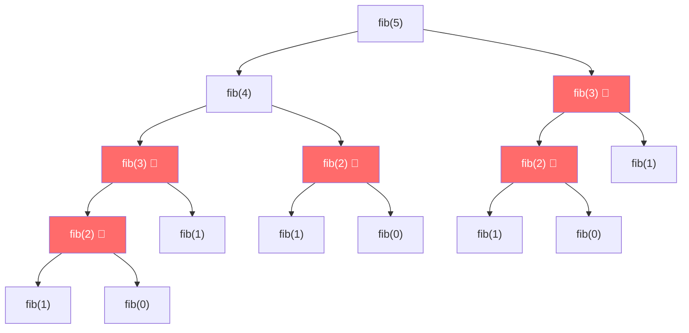
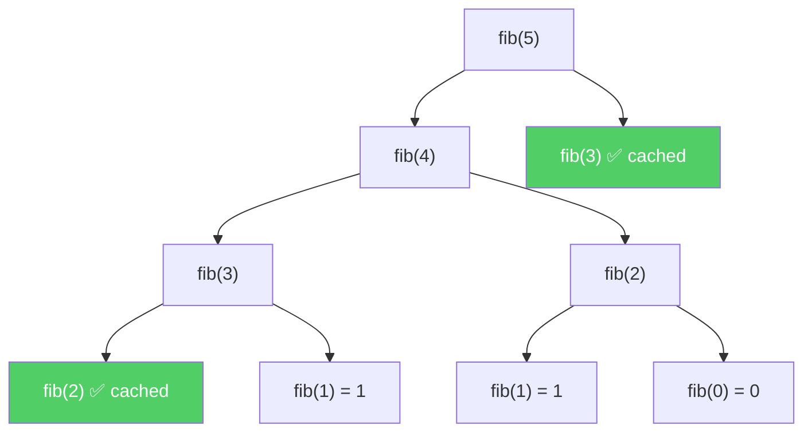
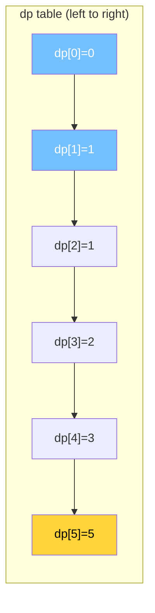
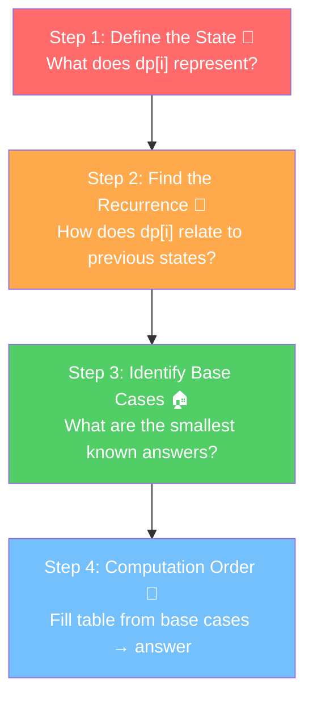
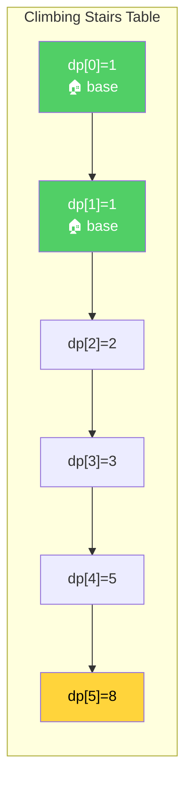
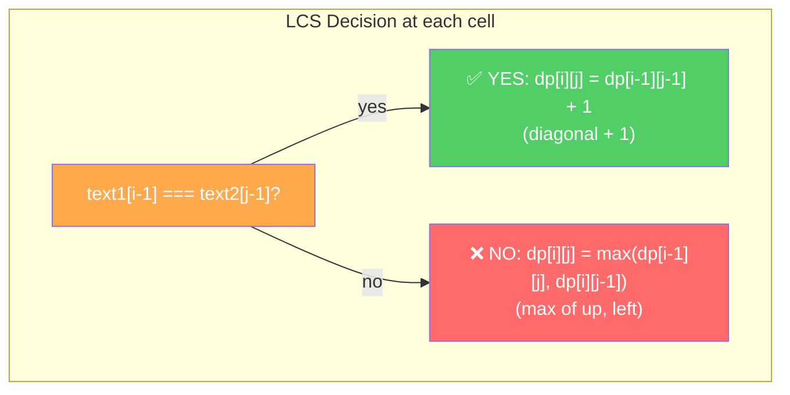
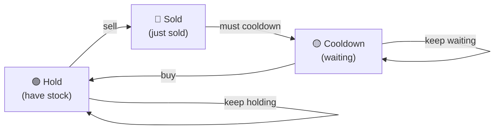
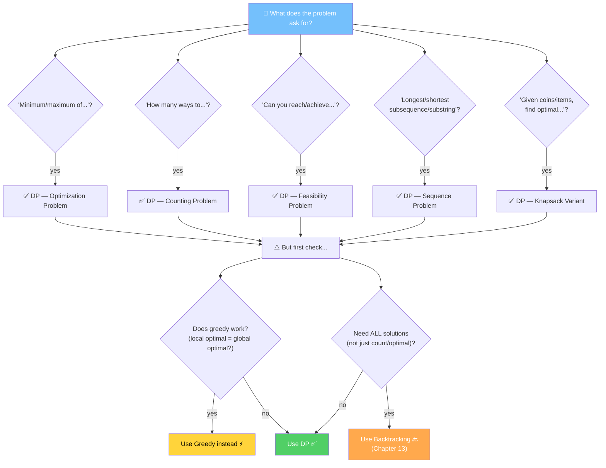
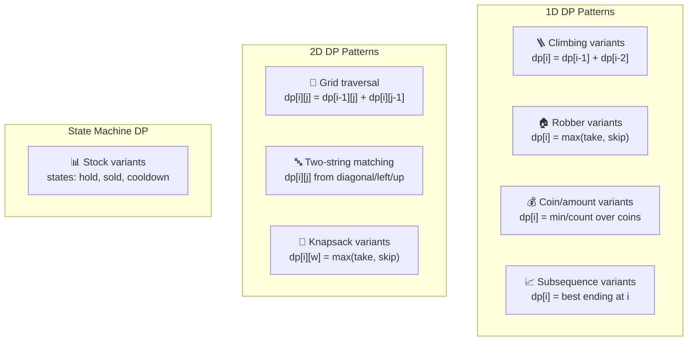

# Chapter 15: Dynamic Programming 🧠

> _"Those who cannot remember the past are condemned to repeat it."_ — George Santayana
>
> Dynamic Programming is literally that quote turned into an algorithm.

---

## 🌍 Real-World Analogy

### The Cheat Sheet Analogy 📋

Imagine you're taking a math exam. Problem 10 requires the answer from Problem 7, which requires the answer from Problem 3.

**Without DP (naive recursion):**
You solve Problem 3. Then you solve Problem 7 (which re-solves Problem 3 from scratch). Then you solve Problem 10 (which re-solves Problem 7, which re-solves Problem 3 AGAIN). You're solving the same sub-problems over and over.

**With DP (memoization):**
You have a cheat sheet. Every time you solve a problem, you **write the answer down**. When Problem 7 needs Problem 3's answer — you just look it up. When Problem 10 needs Problem 7 — look it up. **No re-solving. Ever.**

### The Staircase Analogy 🪜

You want to know how many ways to climb to **step 10**. You can take 1 or 2 steps at a time.

To reach step 10, you either:
- Came from **step 9** (took 1 step) → so you need: ways to reach step 9
- Came from **step 8** (took 2 steps) → so you need: ways to reach step 8

So: `ways(10) = ways(9) + ways(8)`

And `ways(9) = ways(8) + ways(7)`, and so on...

You **don't** need to re-think how to reach step 1 every time. You already wrote that answer down on your cheat sheet. That's DP.

---

## 📝 What Is Dynamic Programming & Why Does It Matter?

**Dynamic Programming (DP)** is an optimization technique for solving problems that have two key properties:

### 1. Overlapping Subproblems 🔄

The same subproblem is solved **multiple times**. Example — Fibonacci:

```
fib(5) calls fib(4) and fib(3)
fib(4) calls fib(3) and fib(2)    ← fib(3) is called TWICE already!
fib(3) calls fib(2) and fib(1)    ← fib(2) is called MULTIPLE times!
```

Without DP, we wastefully recompute the same values over and over.

### 2. Optimal Substructure 🏗️

The optimal solution to the whole problem can be built from optimal solutions of its subproblems.

- **Shortest path**: shortest path from A to C through B = shortest(A→B) + shortest(B→C)
- **Coin change**: min coins for amount 11 = 1 + min coins for amount (11 - coin_value)

> 🔑 **DP = Recursion + Memoization** (avoid re-solving subproblems)
>
> It's NOT about "memorizing solutions." It's about **recognizing** that a problem has overlapping subproblems and optimal substructure, then exploiting those properties.

### Two Approaches to DP

| | Top-Down (Memoization) 🔽 | Bottom-Up (Tabulation) 🔼 |
|---|---|---|
| **Style** | Recursive | Iterative |
| **Idea** | Solve recursively, cache results in a map/array | Fill a table iteratively from base cases |
| **Intuition** | More natural — "What do I need?" | Less intuitive — "Build up from smallest" |
| **Performance** | Recursion overhead, possible stack overflow | Faster, no call stack risk |
| **Subproblems** | Only solves needed ones | Solves ALL subproblems |

### Fibonacci: The Canonical Example

**Naive Recursion — O(2ⁿ) time, O(n) space (call stack)**

```typescript
function fibNaive(n: number): number {
  if (n <= 1) return n;
  return fibNaive(n - 1) + fibNaive(n - 2); // 💀 exponential!
}
```

**Memoized (Top-Down) — O(n) time, O(n) space**

```typescript
function fibMemo(n: number, memo: Map<number, number> = new Map()): number {
  if (n <= 1) return n;
  if (memo.has(n)) return memo.get(n)!; // ✅ already solved!

  const result = fibMemo(n - 1, memo) + fibMemo(n - 2, memo);
  memo.set(n, result);
  return result;
}
```

**Tabulated (Bottom-Up) — O(n) time, O(n) space**

```typescript
function fibTab(n: number): number {
  if (n <= 1) return n;
  const dp = new Array(n + 1);
  dp[0] = 0;
  dp[1] = 1;
  for (let i = 2; i <= n; i++) {
    dp[i] = dp[i - 1] + dp[i - 2]; // ✅ no recursion, just a loop
  }
  return dp[n];
}
```

**Space-Optimized — O(n) time, O(1) space** 🏆

```typescript
function fibOptimal(n: number): number {
  if (n <= 1) return n;
  let prev2 = 0, prev1 = 1;
  for (let i = 2; i <= n; i++) {
    const curr = prev1 + prev2;
    prev2 = prev1;
    prev1 = curr;
  }
  return prev1;
}
```

> ⚡ **From O(2ⁿ) → O(n) → O(n) with O(1) space.** That's the power of DP.

---

## ⚙️ How It Works — Visualized

### Fibonacci Recursion Tree (Naive) — See the Waste!



> 🔴 Red nodes = **redundant computation**. `fib(3)` is solved **2 times**. `fib(2)` is solved **3 times**. It gets exponentially worse for larger n.

### With Memoization — Pruned Tree ✂️



> ✅ Green nodes = **cache hits** — looked up instantly, no recomputation. The tree is now **linear**, not exponential.

### Bottom-Up Table Filling for Fibonacci



> 💛 Yellow = **our answer**. We fill left-to-right, each cell only needs the previous two.

---

## 🔑 The 4-Step DP Framework

This is **THE** systematic approach to solving ANY DP problem. Master this and you can solve them all.



### Step 1: Define the State 🎯

> **This is the HARDEST part.** Get this right and the rest follows.

`dp[i]` (or `dp[i][j]`) should represent the **answer to a subproblem** parameterized by `i` (and `j`).

Ask yourself: _"What is the minimum information I need to describe a subproblem?"_

### Step 2: Find the Recurrence Relation 🔗

> How is `dp[i]` computed from **smaller** subproblems?

This is the **transition formula**. It tells you how to combine previous answers to get the current answer.

### Step 3: Identify Base Cases 🏠

> What are the **smallest** subproblems whose answers you know directly?

These are the starting values for your table. Without them, you have no foundation.

### Step 4: Determine Computation Order 📐

> Fill the table so that when you compute `dp[i]`, all values it depends on are **already computed**.

Usually left-to-right for 1D, top-left-to-bottom-right for 2D.

---

### 🔍 Framework Walkthrough #1: Climbing Stairs

> **Problem**: You can climb 1 or 2 steps. How many distinct ways to reach step `n`?

| Step | Answer |
|------|--------|
| **1. State** | `dp[i]` = number of distinct ways to reach step `i` |
| **2. Recurrence** | `dp[i] = dp[i-1] + dp[i-2]` (come from 1 step back OR 2 steps back) |
| **3. Base Cases** | `dp[0] = 1` (1 way to stay at ground), `dp[1] = 1` (1 way to reach step 1) |
| **4. Order** | Fill `dp[2], dp[3], ..., dp[n]` left to right |



**Step-by-step table filling:**

```
i=0: dp[0] = 1                          (base case)
i=1: dp[1] = 1                          (base case)
i=2: dp[2] = dp[1] + dp[0] = 1 + 1 = 2 (take 1 step from 1, or 2 steps from 0)
i=3: dp[3] = dp[2] + dp[1] = 2 + 1 = 3
i=4: dp[4] = dp[3] + dp[2] = 3 + 2 = 5
i=5: dp[5] = dp[4] + dp[3] = 5 + 3 = 8
```

```typescript
function climbStairs(n: number): number {
  if (n <= 1) return 1;
  const dp = new Array(n + 1);
  dp[0] = 1;
  dp[1] = 1;
  for (let i = 2; i <= n; i++) {
    dp[i] = dp[i - 1] + dp[i - 2];
  }
  return dp[n];
}
```

---

### 🔍 Framework Walkthrough #2: Coin Change

> **Problem**: Given coins of different denominations and a target amount, find the **minimum number of coins** to make that amount. Return -1 if not possible.

| Step | Answer |
|------|--------|
| **1. State** | `dp[i]` = minimum number of coins to make amount `i` |
| **2. Recurrence** | `dp[i] = min(dp[i - coin] + 1)` for each coin where `i - coin >= 0` |
| **3. Base Cases** | `dp[0] = 0` (0 coins needed for amount 0), all others = Infinity |
| **4. Order** | Fill `dp[1], dp[2], ..., dp[amount]` left to right |

**Example**: coins = [1, 3, 4], amount = 6

```
dp[0] = 0                                         (base case)
dp[1] = min(dp[1-1]+1) = min(dp[0]+1) = 1         → use coin 1
dp[2] = min(dp[2-1]+1) = min(dp[1]+1) = 2         → use coin 1
dp[3] = min(dp[3-1]+1, dp[3-3]+1) = min(3, 1) = 1 → use coin 3 ✨
dp[4] = min(dp[3]+1, dp[1]+1, dp[0]+1) = min(2, 2, 1) = 1  → use coin 4 ✨
dp[5] = min(dp[4]+1, dp[2]+1, dp[1]+1) = min(2, 3, 2) = 2
dp[6] = min(dp[5]+1, dp[3]+1, dp[2]+1) = min(3, 2, 3) = 2  → coins 3+3 ✨
```

```typescript
function coinChange(coins: number[], amount: number): number {
  const dp = new Array(amount + 1).fill(Infinity);
  dp[0] = 0;

  for (let i = 1; i <= amount; i++) {
    for (const coin of coins) {
      if (i - coin >= 0 && dp[i - coin] !== Infinity) {
        dp[i] = Math.min(dp[i], dp[i - coin] + 1);
      }
    }
  }

  return dp[amount] === Infinity ? -1 : dp[amount];
}
```

---

### 🔍 Framework Walkthrough #3: Longest Common Subsequence (LCS)

> **Problem**: Given two strings, find the length of their longest common subsequence.
> Example: `"abcde"` and `"ace"` → LCS = `"ace"`, length = 3

| Step | Answer |
|------|--------|
| **1. State** | `dp[i][j]` = length of LCS of `text1[0..i-1]` and `text2[0..j-1]` |
| **2. Recurrence** | If `text1[i-1] === text2[j-1]`: `dp[i][j] = dp[i-1][j-1] + 1` (match! extend LCS) |
| | Else: `dp[i][j] = max(dp[i-1][j], dp[i][j-1])` (skip one char from either string) |
| **3. Base Cases** | `dp[0][j] = 0` and `dp[i][0] = 0` (empty string has LCS of 0) |
| **4. Order** | Fill row by row, left to right |

**2D Table for `"abcde"` vs `"ace"`:**

```
      ""  a  c  e
  ""   0  0  0  0
  a    0  1  1  1
  b    0  1  1  1
  c    0  1  2  2
  d    0  1  2  2
  e    0  1  2  3  ← answer!
```

When characters match → take diagonal + 1. Otherwise → max(up, left).



```typescript
function longestCommonSubsequence(text1: string, text2: string): number {
  const m = text1.length, n = text2.length;
  const dp: number[][] = Array.from({ length: m + 1 }, () => new Array(n + 1).fill(0));

  for (let i = 1; i <= m; i++) {
    for (let j = 1; j <= n; j++) {
      if (text1[i - 1] === text2[j - 1]) {
        dp[i][j] = dp[i - 1][j - 1] + 1;
      } else {
        dp[i][j] = Math.max(dp[i - 1][j], dp[i][j - 1]);
      }
    }
  }

  return dp[m][n];
}
```

---

## 📚 Categories of DP Problems (with Full Solutions)

### Category 1: 1D DP (Linear) 📏

These problems have a single parameter — usually an index or an amount.

---

#### 🧗 Climbing Stairs (LeetCode #70) — Easy

> How many distinct ways to climb `n` stairs, taking 1 or 2 steps at a time?

```typescript
function climbStairs(n: number): number {
  if (n <= 2) return n;
  let prev2 = 1, prev1 = 2;
  for (let i = 3; i <= n; i++) {
    const curr = prev1 + prev2;
    prev2 = prev1;
    prev1 = curr;
  }
  return prev1;
}
```

| State | Recurrence | Base Cases |
|-------|-----------|------------|
| `dp[i]` = ways to reach step `i` | `dp[i] = dp[i-1] + dp[i-2]` | `dp[1] = 1, dp[2] = 2` |

**Time: O(n) · Space: O(1) space-optimized**

---

#### 🏠 House Robber (LeetCode #198) — Medium

> Rob houses along a street, can't rob two adjacent houses. Maximize total money.

**Key insight**: At each house, you choose: rob it (skip previous) or skip it (keep previous best).

```typescript
function rob(nums: number[]): number {
  if (nums.length === 0) return 0;
  if (nums.length === 1) return nums[0];

  let prev2 = 0, prev1 = nums[0];
  for (let i = 1; i < nums.length; i++) {
    const curr = Math.max(prev1, prev2 + nums[i]);
    prev2 = prev1;
    prev1 = curr;
  }
  return prev1;
}
```

| State | Recurrence | Base Cases |
|-------|-----------|------------|
| `dp[i]` = max money robbing houses `0..i` | `dp[i] = max(dp[i-1], dp[i-2] + nums[i])` | `dp[0] = nums[0], dp[1] = max(nums[0], nums[1])` |

**Time: O(n) · Space: O(1)**

---

#### 💰 Coin Change (LeetCode #322) — Medium

> Given coin denominations, find minimum coins to make `amount`. Return -1 if impossible.

```typescript
function coinChange(coins: number[], amount: number): number {
  const dp = new Array(amount + 1).fill(Infinity);
  dp[0] = 0;

  for (let i = 1; i <= amount; i++) {
    for (const coin of coins) {
      if (i - coin >= 0 && dp[i - coin] !== Infinity) {
        dp[i] = Math.min(dp[i], dp[i - coin] + 1);
      }
    }
  }

  return dp[amount] === Infinity ? -1 : dp[amount];
}
```

| State | Recurrence | Base Cases |
|-------|-----------|------------|
| `dp[i]` = min coins for amount `i` | `dp[i] = min(dp[i - coin] + 1)` for each coin | `dp[0] = 0`, rest = `Infinity` |

**Time: O(amount × coins.length) · Space: O(amount)**

---

#### 📈 Longest Increasing Subsequence (LeetCode #300) — Medium

> Find the length of the longest strictly increasing subsequence.

```typescript
function lengthOfLIS(nums: number[]): number {
  const n = nums.length;
  const dp = new Array(n).fill(1); // each element is an LIS of length 1 by itself

  for (let i = 1; i < n; i++) {
    for (let j = 0; j < i; j++) {
      if (nums[j] < nums[i]) {
        dp[i] = Math.max(dp[i], dp[j] + 1);
      }
    }
  }

  return Math.max(...dp);
}
```

| State | Recurrence | Base Cases |
|-------|-----------|------------|
| `dp[i]` = length of LIS ending at index `i` | `dp[i] = max(dp[j] + 1)` for all `j < i` where `nums[j] < nums[i]` | `dp[i] = 1` for all `i` |

**Time: O(n²) · Space: O(n)**

> 💡 There's an O(n log n) solution using binary search + patience sorting, but the O(n²) DP is the standard DP approach.

---

#### 📝 Word Break (LeetCode #139) — Medium

> Can the string be segmented into words from the dictionary?

```typescript
function wordBreak(s: string, wordDict: string[]): boolean {
  const wordSet = new Set(wordDict);
  const n = s.length;
  const dp = new Array(n + 1).fill(false);
  dp[0] = true; // empty string can always be segmented

  for (let i = 1; i <= n; i++) {
    for (let j = 0; j < i; j++) {
      if (dp[j] && wordSet.has(s.substring(j, i))) {
        dp[i] = true;
        break;
      }
    }
  }

  return dp[n];
}
```

| State | Recurrence | Base Cases |
|-------|-----------|------------|
| `dp[i]` = can `s[0..i-1]` be segmented? | `dp[i] = true` if any `dp[j] && s[j..i] ∈ dict` | `dp[0] = true` |

**Time: O(n² × k) where k = avg word length · Space: O(n)**

---

### Category 2: 2D DP (Grid / Two Sequences) 📐

These problems have two parameters — grid coordinates, or indices into two sequences.

---

#### 🤖 Unique Paths (LeetCode #62) — Medium

> Robot at top-left of `m×n` grid, can only move right or down. Count paths to bottom-right.

```typescript
function uniquePaths(m: number, n: number): number {
  const dp: number[][] = Array.from({ length: m }, () => new Array(n).fill(1));

  for (let i = 1; i < m; i++) {
    for (let j = 1; j < n; j++) {
      dp[i][j] = dp[i - 1][j] + dp[i][j - 1];
    }
  }

  return dp[m - 1][n - 1];
}
```

**The 2D table for a 3×4 grid:**

```
  1  1  1  1
  1  2  3  4
  1  3  6  10  ← answer = 10
```

| State | Recurrence | Base Cases |
|-------|-----------|------------|
| `dp[i][j]` = paths to reach cell `(i, j)` | `dp[i][j] = dp[i-1][j] + dp[i][j-1]` | First row & first column = 1 |

**Time: O(m × n) · Space: O(m × n), optimizable to O(n)**

---

#### 🔤 Longest Common Subsequence (LeetCode #1143) — Medium

> Find the length of the longest common subsequence of two strings.

```typescript
function longestCommonSubsequence(text1: string, text2: string): number {
  const m = text1.length, n = text2.length;
  const dp: number[][] = Array.from({ length: m + 1 }, () => new Array(n + 1).fill(0));

  for (let i = 1; i <= m; i++) {
    for (let j = 1; j <= n; j++) {
      if (text1[i - 1] === text2[j - 1]) {
        dp[i][j] = dp[i - 1][j - 1] + 1;
      } else {
        dp[i][j] = Math.max(dp[i - 1][j], dp[i][j - 1]);
      }
    }
  }

  return dp[m][n];
}
```

| State | Recurrence | Base Cases |
|-------|-----------|------------|
| `dp[i][j]` = LCS of `text1[0..i-1]` and `text2[0..j-1]` | Match: `dp[i-1][j-1] + 1`. No match: `max(dp[i-1][j], dp[i][j-1])` | `dp[0][j] = dp[i][0] = 0` |

**Time: O(m × n) · Space: O(m × n)**

---

#### ✏️ Edit Distance (LeetCode #72) — Hard

> Minimum operations (insert, delete, replace) to transform `word1` into `word2`.

```typescript
function minDistance(word1: string, word2: string): number {
  const m = word1.length, n = word2.length;
  const dp: number[][] = Array.from({ length: m + 1 }, () => new Array(n + 1).fill(0));

  for (let i = 0; i <= m; i++) dp[i][0] = i; // delete all chars
  for (let j = 0; j <= n; j++) dp[0][j] = j; // insert all chars

  for (let i = 1; i <= m; i++) {
    for (let j = 1; j <= n; j++) {
      if (word1[i - 1] === word2[j - 1]) {
        dp[i][j] = dp[i - 1][j - 1]; // no operation needed
      } else {
        dp[i][j] = 1 + Math.min(
          dp[i - 1][j],     // delete
          dp[i][j - 1],     // insert
          dp[i - 1][j - 1]  // replace
        );
      }
    }
  }

  return dp[m][n];
}
```

| State | Recurrence | Base Cases |
|-------|-----------|------------|
| `dp[i][j]` = min edits for `word1[0..i-1]` → `word2[0..j-1]` | Match: `dp[i-1][j-1]`. Else: `1 + min(del, ins, rep)` | `dp[i][0] = i`, `dp[0][j] = j` |

**Time: O(m × n) · Space: O(m × n)**

---

#### 🎒 0/1 Knapsack — Classic

> Given items with weights and values, maximize value within weight capacity. Each item can be taken at most once.

```typescript
function knapsack(weights: number[], values: number[], capacity: number): number {
  const n = weights.length;
  const dp: number[][] = Array.from(
    { length: n + 1 },
    () => new Array(capacity + 1).fill(0)
  );

  for (let i = 1; i <= n; i++) {
    for (let w = 0; w <= capacity; w++) {
      dp[i][w] = dp[i - 1][w]; // don't take item i
      if (weights[i - 1] <= w) {
        dp[i][w] = Math.max(dp[i][w], dp[i - 1][w - weights[i - 1]] + values[i - 1]);
      }
    }
  }

  return dp[n][capacity];
}
```

| State | Recurrence | Base Cases |
|-------|-----------|------------|
| `dp[i][w]` = max value using items `1..i` with capacity `w` | `dp[i][w] = max(skip, take)` where take = `dp[i-1][w-weight[i]] + value[i]` | `dp[0][w] = 0`, `dp[i][0] = 0` |

**Time: O(n × capacity) · Space: O(n × capacity), optimizable to O(capacity)**

---

### Category 3: State Machine DP 🤖

Some problems model states and transitions explicitly.

---

#### 📊 Best Time to Buy and Sell Stock with Cooldown (LeetCode #309) — Medium

> Buy/sell stocks, but after selling you must wait 1 day (cooldown). Maximize profit.

**Three states**: hold (have stock), sold (just sold), cooldown (waiting)



```typescript
function maxProfit(prices: number[]): number {
  const n = prices.length;
  if (n < 2) return 0;

  let hold = -prices[0];   // max profit in hold state
  let sold = 0;            // max profit in sold state
  let cooldown = 0;        // max profit in cooldown state

  for (let i = 1; i < n; i++) {
    const prevHold = hold;
    const prevSold = sold;
    const prevCool = cooldown;

    hold = Math.max(prevHold, prevCool - prices[i]);    // keep holding, or buy from cooldown
    sold = prevHold + prices[i];                         // sell
    cooldown = Math.max(prevCool, prevSold);             // keep cooling, or transition from sold
  }

  return Math.max(sold, cooldown);
}
```

**Time: O(n) · Space: O(1)**

---

## 🔄 Space Optimization

Many DP problems have a key insight: **you only need the previous row** (not the entire table).

### Example: Unique Paths — O(m×n) → O(n)

**Before** (full 2D table):

```typescript
// Uses O(m × n) space
const dp: number[][] = Array.from({ length: m }, () => new Array(n).fill(1));
for (let i = 1; i < m; i++) {
  for (let j = 1; j < n; j++) {
    dp[i][j] = dp[i - 1][j] + dp[i][j - 1];
  }
}
```

**After** (single row, updating in-place):

```typescript
// Uses O(n) space — only keep one row!
function uniquePathsOptimized(m: number, n: number): number {
  const dp = new Array(n).fill(1);

  for (let i = 1; i < m; i++) {
    for (let j = 1; j < n; j++) {
      dp[j] = dp[j] + dp[j - 1];
      // dp[j] on the right is "dp[i-1][j]" (from previous row, not yet updated)
      // dp[j-1] is "dp[i][j-1]" (current row, already updated)
    }
  }

  return dp[n - 1];
}
```

> 🧠 **When can you optimize space?**
> - When `dp[i]` only depends on `dp[i-1]` (the previous row) — use 1D array
> - When `dp[i]` only depends on `dp[i-1]` and `dp[i-2]` — use 2 variables
> - When `dp[i][j]` only depends on `dp[i-1][j]` and `dp[i][j-1]` — use 1D array updated in-place

---

## 🔽🔼 Top-Down vs Bottom-Up — Same Problem, Two Ways

### Coin Change: Top-Down (Memoization)

```typescript
function coinChangeTopDown(coins: number[], amount: number): number {
  const memo = new Map<number, number>();

  function dp(remaining: number): number {
    if (remaining === 0) return 0;
    if (remaining < 0) return Infinity;
    if (memo.has(remaining)) return memo.get(remaining)!;

    let minCoins = Infinity;
    for (const coin of coins) {
      const result = dp(remaining - coin);
      minCoins = Math.min(minCoins, result + 1);
    }

    memo.set(remaining, minCoins);
    return minCoins;
  }

  const result = dp(amount);
  return result === Infinity ? -1 : result;
}
```

### Coin Change: Bottom-Up (Tabulation)

```typescript
function coinChangeBottomUp(coins: number[], amount: number): number {
  const dp = new Array(amount + 1).fill(Infinity);
  dp[0] = 0;

  for (let i = 1; i <= amount; i++) {
    for (const coin of coins) {
      if (i - coin >= 0 && dp[i - coin] !== Infinity) {
        dp[i] = Math.min(dp[i], dp[i - coin] + 1);
      }
    }
  }

  return dp[amount] === Infinity ? -1 : dp[amount];
}
```

### Comparison Table

| Aspect | Top-Down (Memoization) 🔽 | Bottom-Up (Tabulation) 🔼 |
|--------|--------------------------|--------------------------|
| **Implementation** | Recursive + cache | Iterative + table |
| **Ease of writing** | ✅ More intuitive, follows natural recursion | ❌ Need to figure out iteration order |
| **Performance** | ❌ Function call overhead, stack frames | ✅ Simple loop, no stack overhead |
| **Stack overflow risk** | ❌ Yes, for deep recursion | ✅ No |
| **Subproblems solved** | ✅ Only the ones needed | ❌ Solves ALL subproblems |
| **Space optimization** | ❌ Hard to optimize (need full cache) | ✅ Can often reduce to O(1) or O(n) |
| **Debugging** | ❌ Harder to trace | ✅ Can print table at each step |

> 💡 **Pro tip**: Start with top-down (easier to think about), then convert to bottom-up if you need better performance or space optimization.

---

## ⏱️ Complexity Analysis

DP complexity follows a simple formula:

```
Time  = O(number of states × work per state)
Space = O(number of states)   ← often optimizable
```

| Problem | States | Work per State | Time | Space |
|---------|--------|---------------|------|-------|
| Fibonacci | `n` | O(1) | O(n) | O(1) optimized |
| Climbing Stairs | `n` | O(1) | O(n) | O(1) optimized |
| House Robber | `n` | O(1) | O(n) | O(1) optimized |
| Coin Change | `amount` | O(coins) | O(amount × coins) | O(amount) |
| LIS | `n` | O(n) | O(n²) | O(n) |
| Word Break | `n` | O(n) | O(n²) | O(n) |
| Unique Paths | `m × n` | O(1) | O(m × n) | O(n) optimized |
| LCS | `m × n` | O(1) | O(m × n) | O(n) optimized |
| Edit Distance | `m × n` | O(1) | O(m × n) | O(n) optimized |
| 0/1 Knapsack | `n × capacity` | O(1) | O(n × capacity) | O(capacity) optimized |

---

## 🎯 LeetCode Patterns — When to Use DP



### Key Distinctions

| If you need... | Use... |
|----------------|--------|
| The **count** of solutions | DP |
| The **optimal** (min/max) solution | DP |
| **All** solutions enumerated | Backtracking |
| A quick solution where **local = global** | Greedy |
| To try **all subsets/permutations** | Backtracking (Chapter 13) |

### Common DP Problem Patterns



---

## ⚠️ Common Pitfalls

### 1. ❌ Wrong State Definition
> "What does `dp[i]` actually mean?"

If your state is wrong, **everything else breaks**. Spend the most time here. Write it down in English before coding.

### 2. ❌ Wrong Base Cases
```typescript
// WRONG: forgot that dp[0] can be a valid case
dp[0] = undefined; // 💀

// RIGHT: think about what the "empty" or "zero" case means
dp[0] = 0; // or 1, depending on the problem
```

### 3. ❌ Off-by-One in Recurrence
```typescript
// WRONG: text1[i] when dp is 1-indexed
if (text1[i] === text2[j]) // 💀 index mismatch

// RIGHT: text1[i-1] when dp has an extra row/col for empty string
if (text1[i - 1] === text2[j - 1]) // ✅
```

### 4. ❌ Not Initializing the Table Correctly
```typescript
// WRONG: default 0 when you need Infinity for "min" problems
const dp = new Array(n).fill(0); // 💀 min of anything with 0 is always 0

// RIGHT:
const dp = new Array(n).fill(Infinity); // ✅ for minimization
dp[0] = 0; // base case
```

### 5. ❌ Using DP When Greedy Works
Some problems look like DP but have a greedy solution (e.g., Jump Game, Assign Cookies). Always ask: "Can a greedy approach work?" before jumping to DP.

### 6. ❌ Not Recognizing DP When It's Needed
If your brute force has **repeated work** — overlapping subproblems — that's the signal. Draw the recursion tree. Do you see repeated nodes? DP.

### 7. ❌ Forgetting Space Optimization
After getting the solution working, always ask: "Does `dp[i]` only depend on `dp[i-1]` (and maybe `dp[i-2]`)?" If yes, optimize to O(1) space.

---

## 🔑 Key Takeaways

1. **DP = Recursion + Memoization**. It's about avoiding redundant work by caching subproblem results.

2. **Two properties**: Overlapping subproblems + Optimal substructure. If your problem has both, DP applies.

3. **The 4-step framework** is your best friend:
   - Define state → Find recurrence → Base cases → Computation order

4. **Start top-down** (easier to think about), then **convert to bottom-up** (better performance).

5. **Space optimize** when possible — most DP only needs the previous row or two variables.

6. **Pattern recognition** matters: most DP problems are variations of ~10 classic patterns (climbing, robber, coin change, knapsack, LCS, LIS, grid paths, edit distance, stock trading, string partitioning).

7. **DP vs Greedy vs Backtracking**: DP for optimal/count, greedy for simpler optimization, backtracking for enumerating all solutions.

8. **Practice is everything**. DP is the hardest topic, but every problem follows the same framework. The more you practice, the faster you recognize the pattern.

---

## 📋 Practice Problems

### 1D DP — Easy 🟢

| # | Problem | Key Insight |
|---|---------|-------------|
| 70 | [Climbing Stairs](https://leetcode.com/problems/climbing-stairs/) | `dp[i] = dp[i-1] + dp[i-2]` — basically Fibonacci |
| 746 | [Min Cost Climbing Stairs](https://leetcode.com/problems/min-cost-climbing-stairs/) | `dp[i] = min(dp[i-1] + cost[i-1], dp[i-2] + cost[i-2])` |
| 198 | [House Robber](https://leetcode.com/problems/house-robber/) | `dp[i] = max(dp[i-1], dp[i-2] + nums[i])` — rob or skip |

### 1D DP — Medium 🟡

| # | Problem | Key Insight |
|---|---------|-------------|
| 322 | [Coin Change](https://leetcode.com/problems/coin-change/) | `dp[i] = min(dp[i-coin] + 1)` — try each coin |
| 139 | [Word Break](https://leetcode.com/problems/word-break/) | `dp[i]` = can `s[0..i]` be segmented? Check all splits |
| 300 | [Longest Increasing Subsequence](https://leetcode.com/problems/longest-increasing-subsequence/) | `dp[i]` = LIS ending at `i`, check all `j < i` |
| 91 | [Decode Ways](https://leetcode.com/problems/decode-ways/) | Like climbing stairs but with constraints on valid 1/2-digit codes |
| 213 | [House Robber II](https://leetcode.com/problems/house-robber-ii/) | Circular! Run House Robber twice: `nums[0..n-2]` and `nums[1..n-1]` |

### 2D DP — Medium 🟡

| # | Problem | Key Insight |
|---|---------|-------------|
| 62 | [Unique Paths](https://leetcode.com/problems/unique-paths/) | `dp[i][j] = dp[i-1][j] + dp[i][j-1]` — grid paths |
| 1143 | [Longest Common Subsequence](https://leetcode.com/problems/longest-common-subsequence/) | Match → diagonal+1, no match → max(up, left) |
| 309 | [Best Time to Buy and Sell Stock with Cooldown](https://leetcode.com/problems/best-time-to-buy-and-sell-stock-with-cooldown/) | State machine: hold, sold, cooldown |
| 494 | [Target Sum](https://leetcode.com/problems/target-sum/) | Transform to subset sum: find subset with sum `(total + target) / 2` |

### 2D DP — Hard 🔴

| # | Problem | Key Insight |
|---|---------|-------------|
| 72 | [Edit Distance](https://leetcode.com/problems/edit-distance/) | 3 operations: insert, delete, replace → min of 3 adjacent cells |
| 10 | [Regular Expression Matching](https://leetcode.com/problems/regular-expression-matching/) | `*` can match 0 or more of preceding element. Track with `dp[i][j]` |
| 32 | [Longest Valid Parentheses](https://leetcode.com/problems/longest-valid-parentheses/) | `dp[i]` = length of longest valid ending at `i`. Use stack-based approach too |
| 312 | [Burst Balloons](https://leetcode.com/problems/burst-balloons/) | Interval DP: `dp[i][j]` = max coins bursting balloons in range `[i, j]` |

---

> 🧠 **Final word**: DP is hard because it requires you to think backwards — define the answer before you know how to compute it. But once you internalize the 4-step framework and practice 20-30 problems, it clicks. Every DP problem is just: **"What's my state? What's my transition? What are my base cases?"** Answer those three questions and you've solved it.
