# Chapter 16: Greedy Algorithms 🏃‍♂️💨

> **"Take the best you can get RIGHT NOW, and never look back."**

Greedy algorithms make the locally optimal choice at every step, betting that local wins add up to a global win. When the bet pays off, you get blazing-fast, elegant solutions. When it doesn't — you get wrong answers. Knowing *when* greedy works is the real skill.

---

## 🌍 Real-World Analogy

### 💰 Making Change with Coins

You're a cashier and need to give **$0.63** in change. You instinctively grab the **biggest coin first**:

```
Amount remaining: 63¢
  → Grab 25¢ (quarter)  → remaining: 38¢
  → Grab 25¢ (quarter)  → remaining: 13¢
  → Grab 10¢ (dime)     → remaining: 3¢
  → Grab 1¢ (penny)     → remaining: 2¢
  → Grab 1¢ (penny)     → remaining: 1¢
  → Grab 1¢ (penny)     → remaining: 0¢
  
Total: 6 coins ✅ (This IS optimal for US coins)
```

This works because **US coin denominations are designed for greedy** — each denomination is a multiple or near-multiple of the smaller ones.

### ⚠️ But Greedy Doesn't ALWAYS Work!

Coins = `[1, 3, 4]`, Amount = `6`:

```
❌ GREEDY approach:
   → Grab 4  → remaining: 2
   → Grab 1  → remaining: 1
   → Grab 1  → remaining: 0
   Total: 3 coins (4 + 1 + 1)

✅ OPTIMAL approach (DP):
   → Grab 3  → remaining: 3
   → Grab 3  → remaining: 0
   Total: 2 coins (3 + 3)  ← BETTER!
```

**Greedy failed** because `[1, 3, 4]` doesn't have the greedy choice property. You need DP here.

### 🛒 Picking the Shortest Line at the Grocery Store

You walk into a store and pick the **shortest checkout line**. You don't analyze:
- How many items each person has
- Whether someone might pay with a check (slow!)
- Whether the cashier is new

You just pick the shortest line — the **locally optimal choice** — and hope for the best. Sometimes it works, sometimes it doesn't. That's greedy in a nutshell.

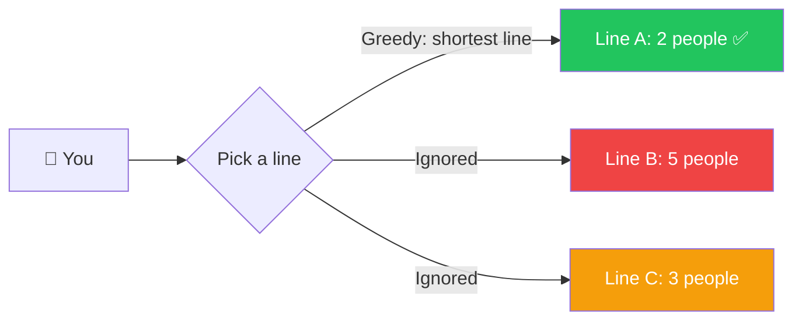

---

## 📝 What & Why

### What Is Greedy?

A **greedy algorithm** builds a solution **piece by piece**, always choosing the next piece that offers the **most immediate benefit**, without reconsidering past choices.

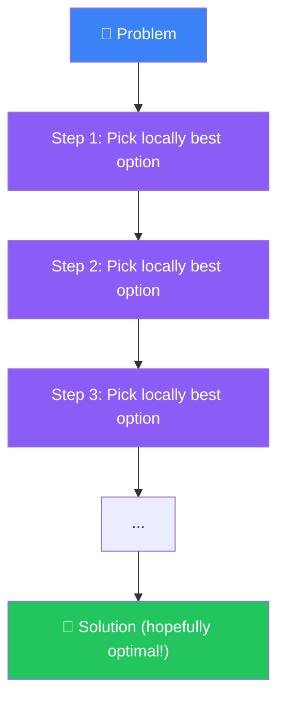

### Why Is It Powerful? ⚡

| Aspect | Greedy | DP |
|--------|--------|----|
| **Time** | Often O(n log n) or O(n) | Often O(n²) or O(n × W) |
| **Space** | Usually O(1) extra | Often O(n) or O(n × W) |
| **Code** | Short, clean | Longer, more complex |
| **Correctness** | Only when provable | Always correct |

### The Catch: Greedy Choice Property 🎯

Greedy ONLY works when the problem has:

1. **Greedy Choice Property** — A locally optimal choice is part of some globally optimal solution
2. **Optimal Substructure** — An optimal solution to the problem contains optimal solutions to sub-problems

### How to Know If Greedy Works 🤔

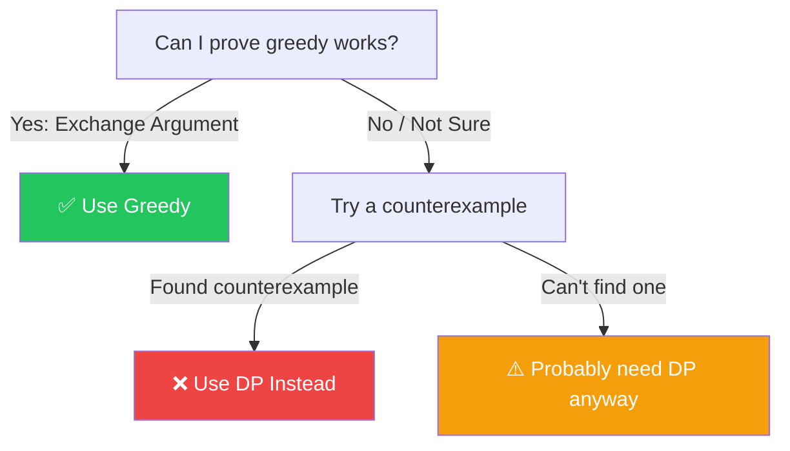

**The Exchange Argument** (proof technique):
1. Assume there's an optimal solution that differs from greedy
2. Show you can "exchange" a choice in the optimal solution for the greedy choice without making it worse
3. Therefore, greedy is at least as good → greedy is optimal

---

## 🔄 Greedy vs Dynamic Programming — The Critical Comparison

This is the **#1 most important distinction** for LeetCode:


| | Greedy 🏃 | DP 🧠 |
|---|---|---|
| **Approach** | One choice at each step, move forward | Explore all choices, pick best |
| **Revisits?** | Never looks back | Builds on all subproblem results |
| **Speed** | Fast (O(n) or O(n log n)) | Slower (O(n²), O(n×W), etc.) |
| **Correctness** | Only if provable | Always correct (for optimization) |
| **When to use** | Problem has greedy choice property | When greedy fails or can't be proven |

### 🎯 Example: Coin Change with `[1, 3, 4]`, Amount = `6`

**Greedy Decision Tree** (picks largest first, gets stuck with suboptimal):

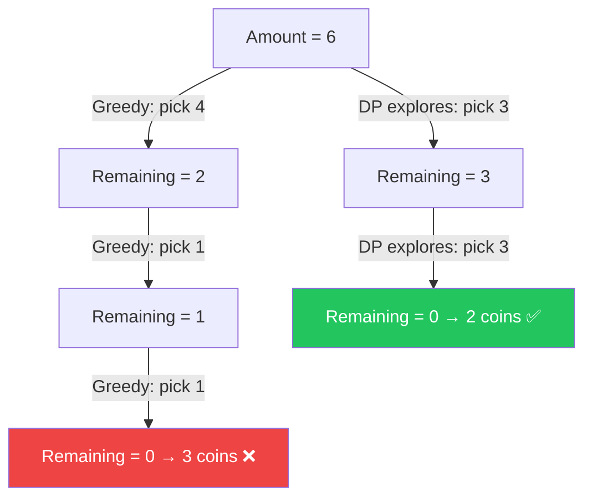

**Decision Rule**:

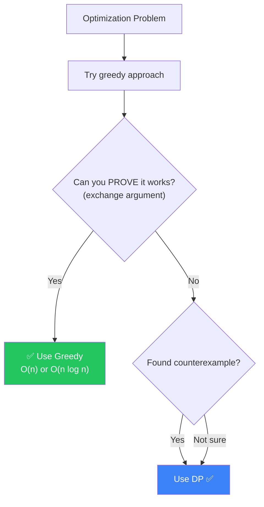

---

## ⚙️ How It Works — Core Greedy Patterns

### Pattern 1: Activity / Interval Scheduling 📅

**Problem**: Given intervals, find the maximum number of non-overlapping intervals.

**Greedy Strategy**: Sort by **end time**, always pick the interval that finishes earliest.

**Why it works**: By finishing earliest, you leave the most room for future intervals. (Exchange argument: swapping any interval for one that ends earlier can only help.)

```mermaid
gantt
    title Interval Scheduling — Sort by End Time
    dateFormat X
    axisFormat %s
    
    section All Intervals
    A (1-3)     :a, 1, 3
    B (2-5)     :b, 2, 5
    C (4-7)     :c, 4, 7
    D (6-8)     :d, 6, 8
    E (5-9)     :e, 5, 9
    
    section Greedy Picks ✅
    Pick A (1-3) :crit, pa, 1, 3
    Pick C (4-7) :crit, pc, 4, 7
    Pick D (6-8) :done, pd, 6, 8
```

Step-by-step:

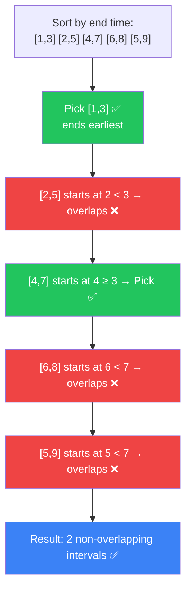

```typescript
function maxNonOverlapping(intervals: number[][]): number {
  intervals.sort((a, b) => a[1] - b[1]); // sort by end time
  let count = 0;
  let lastEnd = -Infinity;

  for (const [start, end] of intervals) {
    if (start >= lastEnd) {
      count++;
      lastEnd = end;
    }
  }
  return count;
}
```

### Pattern 2: Fractional Knapsack 🎒

**Problem**: Given items with weight and value, fill a knapsack of capacity W. You CAN take fractions of items.

**Greedy Strategy**: Sort by **value/weight ratio** (descending), take as much of each item as possible.

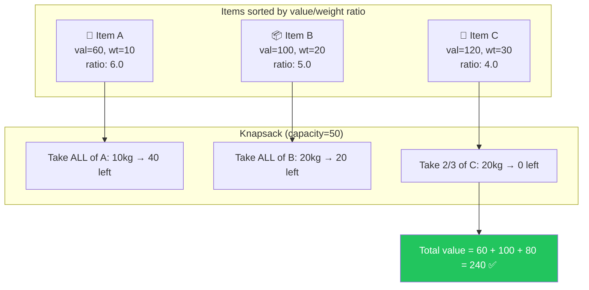

### ⚠️ Why Greedy Works for Fractional but NOT 0/1 Knapsack

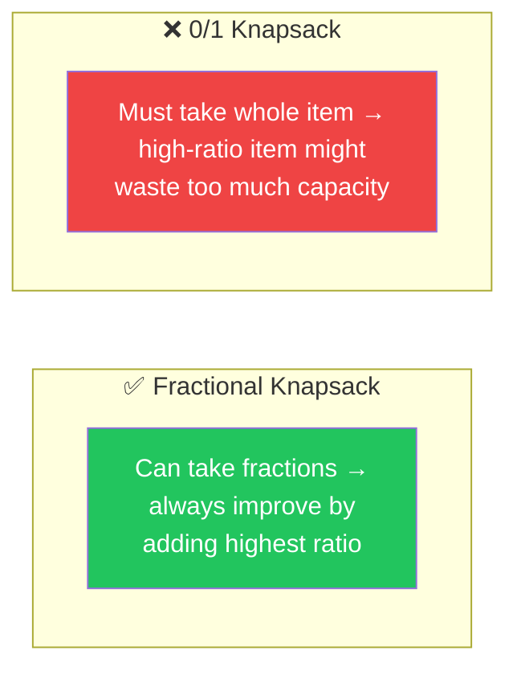

**0/1 example**: capacity=7, items=[(val=6,wt=5), (val=4,wt=3), (val=4,wt=3)]
- Greedy by ratio: takes (6,5) → 2 left, nothing else fits → value=6
- Optimal: takes (4,3)+(4,3) → value=8 🏆

### The Exchange Argument (Interval Scheduling Proof) 📜

For interval scheduling:
1. Let `G` = greedy solution, `O` = any optimal solution
2. If `G ≠ O`, find the first interval where they differ
3. Greedy picked an interval that **ends earlier** (by design)
4. We can **swap** the optimal's choice for greedy's choice — it only frees up more room
5. So `O` is no better than `G` → Greedy IS optimal ✅

---

## 💻 Essential Greedy Problems for LeetCode

### Problem 1: Non-overlapping Intervals (LC 435) 📅

> Given intervals, find the **minimum number to remove** so the rest don't overlap.

Equivalent: find **maximum non-overlapping** → remove the rest.

```typescript
function eraseOverlapIntervals(intervals: number[][]): number {
  if (intervals.length === 0) return 0;
  
  intervals.sort((a, b) => a[1] - b[1]);
  let kept = 1;
  let lastEnd = intervals[0][1];

  for (let i = 1; i < intervals.length; i++) {
    if (intervals[i][0] >= lastEnd) {
      kept++;
      lastEnd = intervals[i][1];
    }
  }
  return intervals.length - kept;
}
```

**Why sort by end time?** Ending earlier = more room for future intervals = maximize what we keep.

---

### Problem 2: Meeting Rooms II (LC 253) 🏢

> Given meeting intervals, find the **minimum number of rooms** needed.

```typescript
function minMeetingRooms(intervals: number[][]): number {
  const starts = intervals.map(i => i[0]).sort((a, b) => a - b);
  const ends = intervals.map(i => i[1]).sort((a, b) => a - b);
  
  let rooms = 0;
  let maxRooms = 0;
  let s = 0, e = 0;

  while (s < starts.length) {
    if (starts[s] < ends[e]) {
      rooms++;        // a meeting starts before one ends → need another room
      s++;
    } else {
      rooms--;        // a meeting ended → free up a room
      e++;
    }
    maxRooms = Math.max(maxRooms, rooms);
  }
  return maxRooms;
}
```

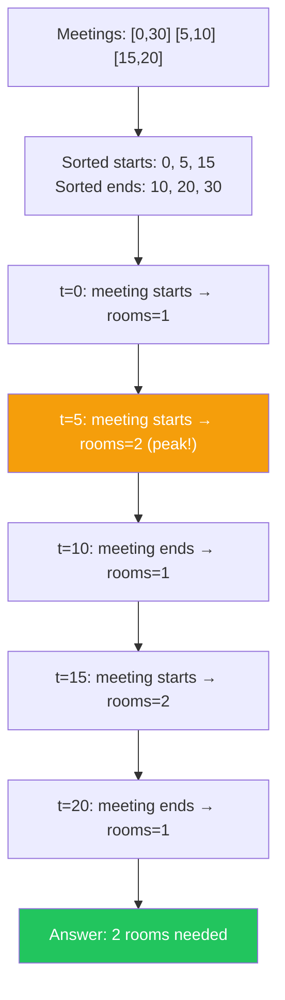

---

### Problem 3: Merge Intervals (LC 56) 🔗

> Merge all overlapping intervals.
> 📌 *Cross-ref: [Chapter 09 — Sorting](../09-sorting-algorithms/README.md) for sort-first patterns*

```typescript
function merge(intervals: number[][]): number[][] {
  intervals.sort((a, b) => a[0] - b[0]);
  const merged: number[][] = [intervals[0]];

  for (let i = 1; i < intervals.length; i++) {
    const last = merged[merged.length - 1];
    if (intervals[i][0] <= last[1]) {
      last[1] = Math.max(last[1], intervals[i][1]); // extend
    } else {
      merged.push(intervals[i]);                     // new interval
    }
  }
  return merged;
}
```

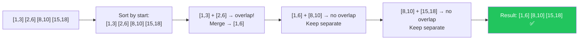

---

### Problem 4: Jump Game I (LC 55) 🦘

> Can you reach the last index? `nums[i]` = max jump length from position `i`.

```typescript
function canJump(nums: number[]): boolean {
  let farthest = 0;

  for (let i = 0; i < nums.length; i++) {
    if (i > farthest) return false;  // can't reach this position
    farthest = Math.max(farthest, i + nums[i]);
    if (farthest >= nums.length - 1) return true;
  }
  return true;
}
```

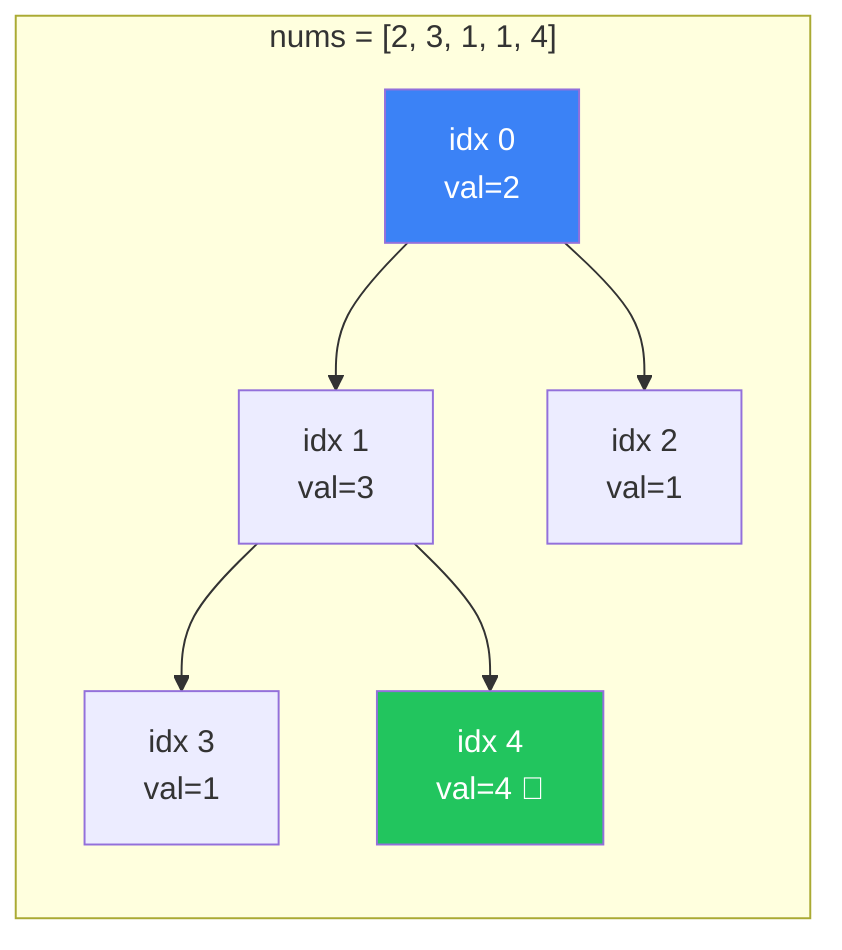

```
i=0: farthest = max(0, 0+2) = 2
i=1: farthest = max(2, 1+3) = 4 → 4 >= 4 → return true ✅
```

---

### Problem 5: Jump Game II (LC 45) 🏃‍♂️

> Find the **minimum number of jumps** to reach the last index.

This is a BFS-like greedy — each "level" of BFS is one jump.

```typescript
function jump(nums: number[]): number {
  let jumps = 0;
  let currentEnd = 0;   // farthest we can reach with current jumps
  let farthest = 0;     // farthest we've seen so far

  for (let i = 0; i < nums.length - 1; i++) {
    farthest = Math.max(farthest, i + nums[i]);
    
    if (i === currentEnd) {   // must jump now
      jumps++;
      currentEnd = farthest;
      if (currentEnd >= nums.length - 1) break;
    }
  }
  return jumps;
}
```

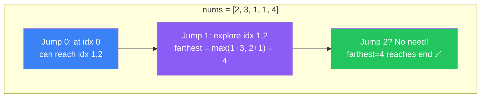

---

### Problem 6: Best Time to Buy and Sell Stock II (LC 122) 📈

> You can buy and sell multiple times. Maximize profit.

**Greedy insight**: Collect **every uphill**. If tomorrow's price > today's → that's profit.

```typescript
function maxProfit(prices: number[]): number {
  let profit = 0;
  for (let i = 1; i < prices.length; i++) {
    if (prices[i] > prices[i - 1]) {
      profit += prices[i] - prices[i - 1];
    }
  }
  return profit;
}
```

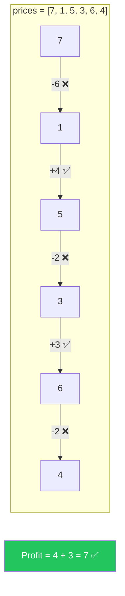

**Why this works**: Any profitable transaction `buy at A, sell at B` can be decomposed into consecutive day-to-day gains. So collecting all positive differences = maximum total profit.

---

### Problem 7: Gas Station (LC 134) ⛽

> Circular route with `gas[i]` fuel at station `i` and `cost[i]` to reach next. Find starting station index (or -1).

```typescript
function canCompleteCircuit(gas: number[], cost: number[]): number {
  let totalSurplus = 0;
  let currentSurplus = 0;
  let startStation = 0;

  for (let i = 0; i < gas.length; i++) {
    const diff = gas[i] - cost[i];
    totalSurplus += diff;
    currentSurplus += diff;

    if (currentSurplus < 0) {
      startStation = i + 1;   // can't start at or before i
      currentSurplus = 0;     // reset
    }
  }
  return totalSurplus >= 0 ? startStation : -1;
}
```

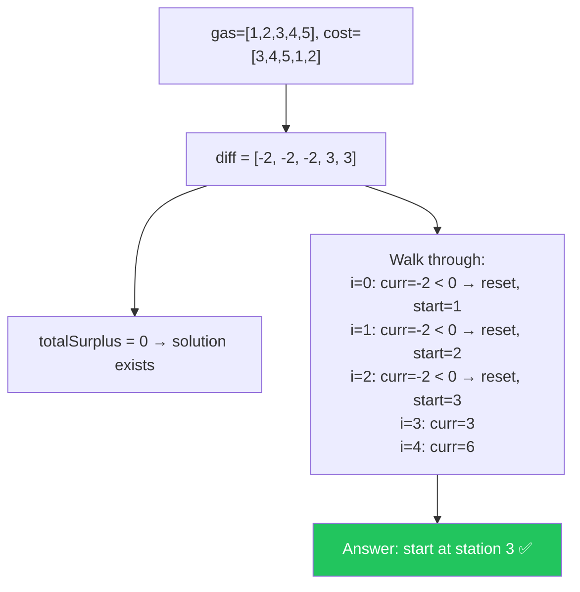

**Key insight**: If `totalSurplus >= 0`, a solution MUST exist. If you run out of gas at station `i`, you can't start from anywhere `[start..i]` — so jump to `i+1`.

---

### Problem 8: Task Scheduler (LC 621) 🗓️

> Tasks with cooldown `n`. Find minimum time to execute all tasks.

```typescript
function leastInterval(tasks: string[], n: number): number {
  const freq = new Array(26).fill(0);
  for (const task of tasks) {
    freq[task.charCodeAt(0) - 65]++;
  }
  freq.sort((a, b) => b - a);

  const maxFreq = freq[0];
  let maxFreqCount = 0;
  for (const f of freq) {
    if (f === maxFreq) maxFreqCount++;
    else break;
  }

  // Frame: (maxFreq - 1) chunks of size (n + 1), plus final chunk
  const minTime = (maxFreq - 1) * (n + 1) + maxFreqCount;
  return Math.max(minTime, tasks.length);
}
```

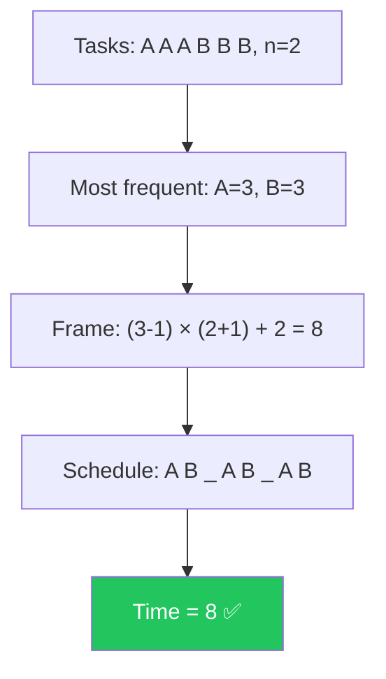

**Intuition**: The most frequent task dictates the minimum time. Between each occurrence, you need `n` slots filled with other tasks or idle time.

---

### Problem 9: Partition Labels (LC 763) ✂️

> Partition string so each letter appears in at most one part. Return partition sizes.

```typescript
function partitionLabels(s: string): number[] {
  const lastIndex = new Map<string, number>();
  for (let i = 0; i < s.length; i++) {
    lastIndex.set(s[i], i);
  }

  const result: number[] = [];
  let start = 0;
  let end = 0;

  for (let i = 0; i < s.length; i++) {
    end = Math.max(end, lastIndex.get(s[i])!);
    if (i === end) {
      result.push(end - start + 1);
      start = i + 1;
    }
  }
  return result;
}
```

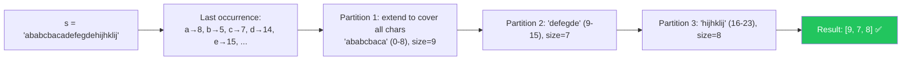

**Greedy insight**: For each character in the current partition, the partition must extend to that character's **last occurrence**. When `i` catches up to `end`, the partition is complete.

---

### Problem 10: Hand of Straights (LC 846) 🃏

> Divide cards into groups of `k` consecutive numbers.

```typescript
function isNStraightHand(hand: number[], groupSize: number): boolean {
  if (hand.length % groupSize !== 0) return false;
  
  const freq = new Map<number, number>();
  for (const card of hand) {
    freq.set(card, (freq.get(card) || 0) + 1);
  }
  
  const sorted = [...freq.keys()].sort((a, b) => a - b);
  
  for (const start of sorted) {
    const count = freq.get(start) || 0;
    if (count === 0) continue;
    
    for (let i = 0; i < groupSize; i++) {
      const card = start + i;
      const cardCount = freq.get(card) || 0;
      if (cardCount < count) return false;
      freq.set(card, cardCount - count);
    }
  }
  return true;
}
```

**Greedy**: Start from the smallest card. Each group starting from that card consumes `count` copies of the next `k-1` cards.

---

## 📖 Common Greedy Strategies

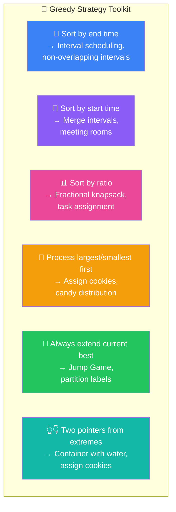

| Strategy | When to Use | Example Problems |
|----------|-------------|------------------|
| Sort by end time | Maximize non-overlapping | Interval Scheduling, LC 435 |
| Sort by start time | Merge overlapping | Merge Intervals, LC 56 |
| Sort by ratio/value | Maximize value per cost | Fractional Knapsack |
| Process largest first | Distribute optimally | Assign Cookies, Candy |
| Extend current best | Reachability problems | Jump Game I & II |
| Two pointers | Match/pair optimally | Assign Cookies, Two City Scheduling |

---

## ⏱️ Complexity Analysis

| Problem | Time | Space | Bottleneck |
|---------|------|-------|------------|
| Non-overlapping Intervals | O(n log n) | O(1) | Sorting |
| Meeting Rooms II | O(n log n) | O(n) | Sorting two arrays |
| Merge Intervals | O(n log n) | O(n) | Sorting + output |
| Jump Game I | O(n) | O(1) | Single pass |
| Jump Game II | O(n) | O(1) | Single pass |
| Stock Buy/Sell II | O(n) | O(1) | Single pass |
| Gas Station | O(n) | O(1) | Single pass |
| Task Scheduler | O(n) | O(1) | Count frequencies (26 chars) |
| Partition Labels | O(n) | O(1) | Two passes (26 chars) |
| Hand of Straights | O(n log n) | O(n) | Sorting + freq map |

**General rule**: If the input needs sorting → O(n log n). If already ordered or no sort needed → O(n).

---

## 🎯 LeetCode Pattern Recognition Flowchart

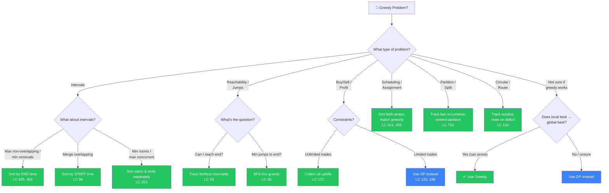

---

## ⚠️ Common Pitfalls

### 1. 🚨 Assuming Greedy Works Without Proof

```
❌ "It feels like greedy should work here"
✅ "I can prove greedy works via exchange argument" 
   OR "I tested edge cases and it passes"
```

Coin change `[1, 3, 4]` for amount `6` is the classic trap. Always ask: *"Can I construct a counterexample?"*

### 2. 🚨 Wrong Sorting Criteria

| Problem | ❌ Wrong Sort | ✅ Correct Sort |
|---------|-------------|----------------|
| Max non-overlapping | Sort by start | Sort by **end** time |
| Merge intervals | Sort by end | Sort by **start** time |
| Min arrows (balloons) | Sort by start | Sort by **end** time |

### 3. 🚨 Not Handling Tie-Breaking

When two intervals end at the same time, ensure your comparison is stable. When values are equal, consider secondary sort criteria.

### 4. 🚨 Using Greedy When DP Is Needed

| Problem | Greedy? | Why |
|---------|---------|-----|
| Coin Change (min coins) | ❌ | Denominations may not have greedy property |
| 0/1 Knapsack | ❌ | Can't take fractions → greedy fails |
| Longest Increasing Subsequence | ❌ | Must consider all subsequences |
| Stock Buy/Sell with cooldown | ❌ | State-dependent decisions |
| Stock Buy/Sell unlimited | ✅ | Collect all uphills = optimal |
| Fractional Knapsack | ✅ | Can take fractions → ratio sort works |

### 5. 🚨 Forgetting Edge Cases

- Empty input → return 0 or empty array
- Single element → usually trivially correct
- All elements same → check if your sort/logic handles this
- Already sorted input → make sure you don't assume unsorted

---

## 🔑 Key Takeaways

1. **Greedy = local optimum at each step** — fast, simple, but only correct when provable
2. **The greedy choice property** is what separates "greedy works" from "greedy fails" — learn the exchange argument
3. **Sorting is the backbone** of most greedy solutions — know WHAT to sort by (end time vs. start time vs. ratio)
4. **Try greedy first, fall back to DP** — if you can't prove greedy works or find a counterexample → use DP
5. **Interval problems** are the bread and butter — sort by end for selection, sort by start for merging
6. **Jump Game pattern** is reachability — track the farthest you can go, O(n) with no sorting
7. **Always validate**: ask "does choosing the local best NOW prevent me from doing better LATER?" If yes → greedy fails
8. **Practice the 3 proofs**: activity selection (exchange), fractional knapsack (ratio dominance), Huffman coding (merge cheapest)

```mermaid
graph LR
    GREEDY["🏃 Greedy"] --> FAST["⚡ Fast O(n log n)"]
    GREEDY --> SIMPLE["📝 Simple code"]
    GREEDY --> RISKY["⚠️ Only works with proof"]
    
    RISKY -->|"Can prove?"| YES["✅ Ship it!"]
    RISKY -->|"Can't prove?"| NO["🧠 Use DP"]
    
    style YES fill:#22c55e,color:#fff
    style NO fill:#3b82f6,color:#fff
    style FAST fill:#22c55e,color:#fff
    style SIMPLE fill:#22c55e,color:#fff
    style RISKY fill:#f59e0b,color:#fff
```

---

## 📋 Practice Problems

### 🟢 Easy

| # | Problem | Key Insight |
|---|---------|-------------|
| 122 | [Best Time to Buy and Sell Stock II](https://leetcode.com/problems/best-time-to-buy-and-sell-stock-ii/) | Collect every uphill |
| 455 | [Assign Cookies](https://leetcode.com/problems/assign-cookies/) | Sort both, match smallest first |
| 860 | [Lemonade Change](https://leetcode.com/problems/lemonade-change/) | Greedily use largest bills first for change |

### 🟡 Medium

| # | Problem | Key Insight |
|---|---------|-------------|
| 55 | [Jump Game](https://leetcode.com/problems/jump-game/) | Track farthest reachable |
| 45 | [Jump Game II](https://leetcode.com/problems/jump-game-ii/) | BFS-like level expansion |
| 134 | [Gas Station](https://leetcode.com/problems/gas-station/) | Total surplus + reset on deficit |
| 763 | [Partition Labels](https://leetcode.com/problems/partition-labels/) | Extend to last occurrence of each char |
| 621 | [Task Scheduler](https://leetcode.com/problems/task-scheduler/) | Most frequent task creates the frame |
| 56 | [Merge Intervals](https://leetcode.com/problems/merge-intervals/) | Sort by start, extend end |
| 435 | [Non-overlapping Intervals](https://leetcode.com/problems/non-overlapping-intervals/) | Sort by end, count kept |
| 406 | [Queue Reconstruction by Height](https://leetcode.com/problems/queue-reconstruction-by-height/) | Sort desc by height, insert by k |
| 846 | [Hand of Straights](https://leetcode.com/problems/hand-of-straights/) | Freq map + greedy grouping |

### 🔴 Hard

| # | Problem | Key Insight |
|---|---------|-------------|
| 452 | [Minimum Number of Arrows to Burst Balloons](https://leetcode.com/problems/minimum-number-of-arrows-to-burst-balloons/) | Sort by end, same as interval scheduling |
| 135 | [Candy](https://leetcode.com/problems/candy/) | Two passes: left-to-right, right-to-left |
| 502 | [IPO](https://leetcode.com/problems/ipo/) | Two heaps: min-heap for capital, max-heap for profit |

---

> **Next Chapter**: *(End of track — more chapters may be added later)*
> **Previous Chapter**: [← Chapter 15](../15-dynamic-programming/README.md)
