# 🚀 TypeScript Fundamentals — Everything You Need for DSA

> **Prerequisite chapter for the DSA course.**
> After this, you'll read and write TypeScript DSA code with confidence.

---

## 📖 Table of Contents

| # | Topic | Why It Matters for DSA |
|---|-------|----------------------|
| 1 | 🌍 [What is TypeScript?](#-1-what-is-typescript) | Foundation — how to run code |
| 2 | 📝 [Variables & Types](#-2-variables--types) | Every line of code uses variables |
| 3 | 🔢 [Numbers & Math](#-3-numbers--math) | Arithmetic in algorithms |
| 4 | 📦 [Arrays](#-4-arrays--the-most-important-for-dsa) | ~40% of all DSA problems |
| 5 | 🔤 [Strings](#-5-strings) | ~20% of DSA problems |
| 6 | 🗺️ [Map & Set](#️-6-map--set--critical-for-dsa) | O(1) lookups everywhere |
| 7 | 🔧 [Functions](#-7-functions) | Recursion, helpers, callbacks |
| 8 | 🔀 [Control Flow](#-8-control-flow) | Loops drive every algorithm |
| 9 | 🏗️ [Classes & OOP](#️-9-classes--oop--for-data-structures) | Build linked lists, trees, graphs |
| 10 | 🧬 [Generics](#-10-generics--reusable-data-structures) | Write once, use for any type |
| 11 | 🔗 [Interfaces & Type Aliases](#-11-interfaces--type-aliases) | Shape your data |
| 12 | ❓ [Null Handling](#-12-null-handling--critical-for-treeslinked-lists) | Trees & linked lists are full of nulls |
| 13 | 🧰 [Destructuring & Spread](#-13-destructuring--spread) | Clean, concise code |
| 14 | 📋 [Common DSA Patterns](#-14-common-patterns-in-dsa-code) | Tricks you'll use daily |
| 15 | ⚡ [Quick Reference](#-15-quick-reference--cheat-sheet) | Everything at a glance |

---

## 🌍 1. What is TypeScript?

TypeScript = **JavaScript + Types**. That's it. Every valid JavaScript file is also valid TypeScript, but TypeScript adds a type system on top.

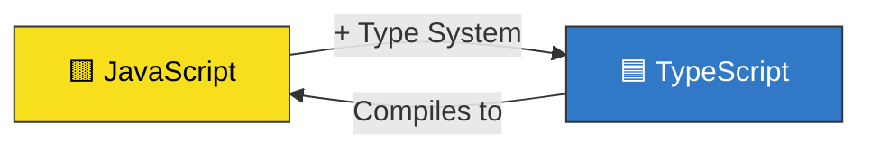

### 🤔 Why TypeScript for DSA?

| Benefit | Example |
|---------|---------|
| 🐛 **Catches bugs early** | `node.valu` → ❌ error before running |
| 🧠 **Autocomplete** | Type `node.` and see all available methods |
| 📖 **Self-documenting** | `function bfs(root: TreeNode | null): number[]` — you instantly know what it takes and returns |
| 🔒 **Safer refactoring** | Rename a property → TypeScript finds every usage |

### ▶️ How to Run TypeScript

We use **Bun** — it runs TypeScript directly with zero config:

```bash
# Run a TypeScript file
bun run file.ts

# That's it. No tsconfig, no compilation step.
```

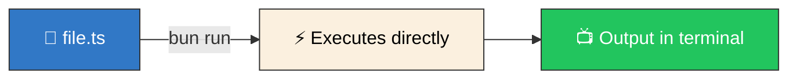

---

## 📝 2. Variables & Types

### 📌 Declaring Variables

```typescript
// ✅ Use const for values that don't change
const name: string = "Prasanna";

// ✅ Use let for values that DO change
let count: number = 0;
count = count + 1;

// ❌ NEVER use var — it has confusing scoping rules
// var old = "don't do this";
```

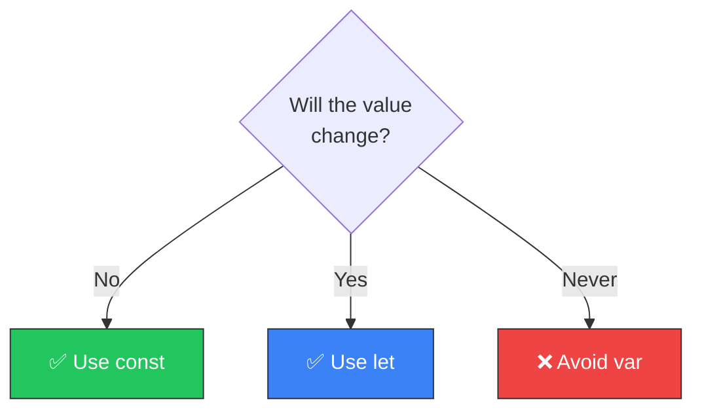

### 🎨 Primitive Types

| Type | Example | Description |
|------|---------|-------------|
| `string` | `"hello"`, `'world'` | Text |
| `number` | `42`, `3.14`, `-1` | All numbers (no int vs float) |
| `boolean` | `true`, `false` | True/false |
| `null` | `null` | Intentionally empty |
| `undefined` | `undefined` | Not yet assigned |

```typescript
const message: string = "Hello, DSA!";
const count: number = 42;
const isValid: boolean = true;
const nothing: null = null;
const notSet: undefined = undefined;
```

### 🔍 Type Annotations vs Type Inference

TypeScript is smart — it can **infer** types automatically:

```typescript
// 🏷️ Explicit annotation — YOU tell TypeScript the type
const age: number = 25;

// 🧠 Type inference — TypeScript FIGURES OUT the type
const name = "Prasanna";  // TypeScript knows this is a string

// Both are equally valid! Use inference when it's obvious.
```

### 🚨 `any`, `unknown`, and `never`

```typescript
// ❌ any — disables ALL type checking. Avoid!
let dangerous: any = "hello";
dangerous = 42;        // No error — TypeScript gave up
dangerous.foo.bar;     // No error — but will crash at runtime!

// ✅ unknown — safer version of any. Forces you to check types first.
let safe: unknown = "hello";
// safe.toUpperCase();          // ❌ Error! Must check type first
if (typeof safe === "string") {
  safe.toUpperCase();           // ✅ Now TypeScript knows it's a string
}

// 🚫 never — represents something that should NEVER happen
function throwError(msg: string): never {
  throw new Error(msg);  // Function never returns normally
}
```

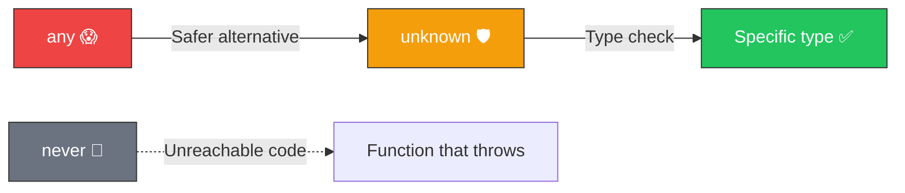

### 📜 Template Literals

```typescript
const name = "Prasanna";
const score = 95;

// Old way (concatenation) — ugly
const msg1 = "Hello " + name + ", you scored " + score;

// ✅ Template literals — clean and readable
const msg2 = `Hello ${name}, you scored ${score}`;
// Uses backticks ` and ${expression} for interpolation
```

---

## 🔢 3. Numbers & Math

TypeScript has **one number type** — no separate int/float distinction.

### 📐 Essential Math Methods

| Method | What It Does | Example | Result |
|--------|-------------|---------|--------|
| `Math.floor(x)` | Round DOWN | `Math.floor(3.7)` | `3` |
| `Math.ceil(x)` | Round UP | `Math.ceil(3.2)` | `4` |
| `Math.round(x)` | Round to nearest | `Math.round(3.5)` | `4` |
| `Math.max(...n)` | Largest value | `Math.max(1, 5, 3)` | `5` |
| `Math.min(...n)` | Smallest value | `Math.min(1, 5, 3)` | `1` |
| `Math.abs(x)` | Absolute value | `Math.abs(-7)` | `7` |
| `Math.pow(b, e)` | Power | `Math.pow(2, 3)` | `8` |
| `Math.sqrt(x)` | Square root | `Math.sqrt(16)` | `4` |

### ♾️ Special Values

```typescript
const posInf = Infinity;              // Larger than any number
const negInf = -Infinity;             // Smaller than any number
const maxSafe = Number.MAX_SAFE_INTEGER;  // 9007199254740991 (2^53 - 1)

// 🎯 Common DSA pattern: initialize min/max
let minVal = Infinity;     // Any number will be smaller
let maxVal = -Infinity;    // Any number will be larger
```

### ➗ Integer Division & Modulo

```typescript
// TypeScript has NO integer division operator!
// You MUST use Math.floor() to get integer division
const a = 7;
const b = 2;

console.log(a / b);             // 3.5 — regular division
console.log(Math.floor(a / b)); // 3   — integer division (floors the result)

// Modulo (remainder) — used in cycling, hash functions, etc.
console.log(7 % 3);   // 1  (7 = 2*3 + 1)
console.log(10 % 2);  // 0  (even number check!)
```

### 🔧 Bitwise Operators (Brief)

Used in some advanced LeetCode problems:

| Operator | Name | Example | Result | Use Case |
|----------|------|---------|--------|----------|
| `&` | AND | `5 & 3` | `1` | Check if bit is set |
| `\|` | OR | `5 \| 3` | `7` | Set a bit |
| `^` | XOR | `5 ^ 3` | `6` | Toggle / find unique |
| `<<` | Left shift | `1 << 3` | `8` | Multiply by 2^n |
| `>>` | Right shift | `8 >> 2` | `2` | Divide by 2^n |

```typescript
// 🎯 Classic LeetCode trick: find the single number using XOR
// XOR of a number with itself = 0, XOR with 0 = itself
const nums = [2, 1, 4, 1, 2];
let single = 0;
for (const n of nums) single ^= n;
console.log(single);  // 4 — the only number that appears once!
```

---

## 📦 4. Arrays — The Most Important for DSA

> You'll use arrays in **~40% of all LeetCode problems**. Master this section.

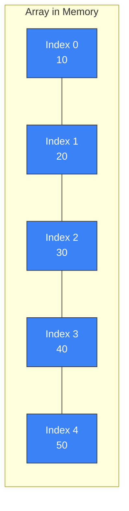

### 🏗️ Creating Arrays

```typescript
// Most common way — type inferred
const fruits = ["apple", "banana", "cherry"];

// With explicit type annotation
const numbers: number[] = [1, 2, 3, 4, 5];

// Alternative syntax (same thing)
const values: Array<number> = [1, 2, 3];

// Pre-filled array — you'll use this ALL THE TIME in dynamic programming
const zeros = new Array(10).fill(0);    // [0, 0, 0, 0, 0, 0, 0, 0, 0, 0]

// Array.from — create arrays with custom initialization
const indices = Array.from({ length: 5 }, (_, i) => i);  // [0, 1, 2, 3, 4]
```

### ⚠️ 2D Arrays — The RIGHT Way vs WRONG Way

```typescript
// ❌ WRONG — All rows share the SAME reference!
const wrong = new Array(3).fill(new Array(3).fill(0));
wrong[0][0] = 1;  // Changes ALL rows!

// ✅ RIGHT — Each row is independent
const right = Array.from({ length: 3 }, () => new Array(3).fill(0));
right[0][0] = 1;  // Only changes row 0
```

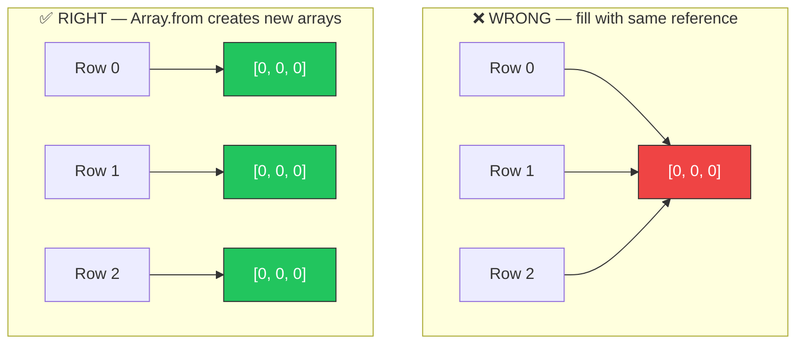

### 📊 Array Methods & Their Big O

| Method | What It Does | Big O | Notes |
|--------|-------------|-------|-------|
| `push(x)` | Add to END | **O(1)** | ✅ Fast — use this |
| `pop()` | Remove from END | **O(1)** | ✅ Fast — use this |
| `shift()` | Remove from START | **O(n)** | ⚠️ Slow — shifts all elements |
| `unshift(x)` | Add to START | **O(n)** | ⚠️ Slow — shifts all elements |
| `splice(i, n)` | Remove/insert at index | **O(n)** | ⚠️ Shifts elements after index |
| `slice(i, j)` | Copy sub-array | **O(n)** | Creates new array |
| `indexOf(x)` | Find index | **O(n)** | Linear search |
| `includes(x)` | Check existence | **O(n)** | Linear search |
| `concat(arr)` | Merge arrays | **O(n)** | Creates new array |
| `reverse()` | Reverse in-place | **O(n)** | Mutates original |

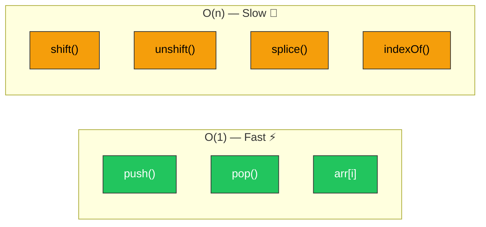

### 🔄 Iteration Patterns

```typescript
const arr = [10, 20, 30, 40, 50];

// 1️⃣ Classic for loop — when you NEED the index
for (let i = 0; i < arr.length; i++) {
  console.log(`Index ${i}: ${arr[i]}`);
}

// 2️⃣ for...of — when you just need values (cleanest)
for (const val of arr) {
  console.log(val);
}

// 3️⃣ forEach — functional style with index
arr.forEach((val, i) => {
  console.log(`Index ${i}: ${val}`);
});

// 4️⃣ Reverse iteration — useful in many algorithms
for (let i = arr.length - 1; i >= 0; i--) {
  console.log(arr[i]);
}
```

### 🧮 Functional Array Methods

```typescript
const nums = [1, 2, 3, 4, 5, 6, 7, 8, 9, 10];

// map — transform every element
const doubled = nums.map(n => n * 2);          // [2, 4, 6, 8, ...]

// filter — keep elements that pass a test
const evens = nums.filter(n => n % 2 === 0);   // [2, 4, 6, 8, 10]

// reduce — accumulate into a single value
const sum = nums.reduce((acc, n) => acc + n, 0); // 55

// find — first element that matches
const firstBig = nums.find(n => n > 5);         // 6

// findIndex — index of first match
const idx = nums.findIndex(n => n > 5);         // 5

// some — does ANY element match?
const hasEven = nums.some(n => n % 2 === 0);    // true

// every — do ALL elements match?
const allPositive = nums.every(n => n > 0);     // true

// includes — is this value in the array?
const has5 = nums.includes(5);                   // true
```

### 🔀 Sorting

```typescript
// ⚠️ CRITICAL GOTCHA: .sort() converts to strings by default!
const nums = [10, 9, 2, 30, 100];
nums.sort();            // [10, 100, 2, 30, 9] — WRONG! Lexicographic!

// ✅ Always use a comparator for numbers
nums.sort((a, b) => a - b);  // [2, 9, 10, 30, 100] — ascending
nums.sort((a, b) => b - a);  // [100, 30, 10, 9, 2] — descending
```

### ✂️ Destructuring & Spread

```typescript
// Destructuring — pull values out of arrays
const [first, second, ...rest] = [10, 20, 30, 40, 50];
// first = 10, second = 20, rest = [30, 40, 50]

// Spread — copy or merge arrays
const arr1 = [1, 2, 3];
const arr2 = [4, 5, 6];
const merged = [...arr1, ...arr2];   // [1, 2, 3, 4, 5, 6]
const copy = [...arr1];              // Shallow copy
```

---

## 🔤 5. Strings

Strings are **immutable** in TypeScript — you cannot change a character in place. Every string method returns a **new string**.

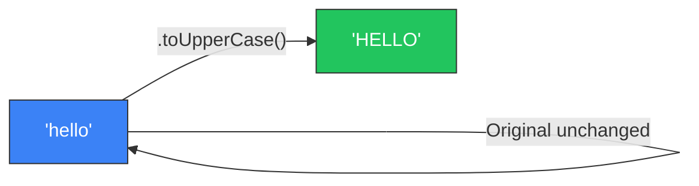

### 🔧 Essential String Methods

| Method | What It Does | Example | Result |
|--------|-------------|---------|--------|
| `split(sep)` | String → Array | `"a,b,c".split(",")` | `["a","b","c"]` |
| `join(sep)` | Array → String | `["a","b"].join("-")` | `"a-b"` |
| `slice(i, j)` | Substring | `"hello".slice(1, 3)` | `"el"` |
| `substring(i, j)` | Substring | `"hello".substring(1, 3)` | `"el"` |
| `charAt(i)` | Char at index | `"hello".charAt(0)` | `"h"` |
| `charCodeAt(i)` | ASCII code | `"a".charCodeAt(0)` | `97` |
| `indexOf(s)` | Find position | `"hello".indexOf("ll")` | `2` |
| `includes(s)` | Contains? | `"hello".includes("ell")` | `true` |
| `startsWith(s)` | Starts with? | `"hello".startsWith("he")` | `true` |
| `endsWith(s)` | Ends with? | `"hello".endsWith("lo")` | `true` |
| `trim()` | Remove whitespace | `" hi ".trim()` | `"hi"` |
| `toLowerCase()` | To lowercase | `"Hello".toLowerCase()` | `"hello"` |
| `toUpperCase()` | To uppercase | `"Hello".toUpperCase()` | `"HELLO"` |
| `repeat(n)` | Repeat n times | `"ab".repeat(3)` | `"ababab"` |
| `replace(a, b)` | Replace first | `"aab".replace("a", "x")` | `"xab"` |
| `replaceAll(a, b)` | Replace all | `"aab".replaceAll("a", "x")` | `"xxb"` |

### 🔄 String ↔ Array Conversions

```typescript
// String to Array of characters
const chars1 = "hello".split("");         // ["h", "e", "l", "l", "o"]
const chars2 = Array.from("hello");       // ["h", "e", "l", "l", "o"]

// Array back to String
const str = ["h", "e", "l", "l", "o"].join("");  // "hello"
```

### 🔤 Character Codes (ASCII)

```typescript
// Character → Code
"a".charCodeAt(0);  // 97
"z".charCodeAt(0);  // 122
"A".charCodeAt(0);  // 65
"0".charCodeAt(0);  // 48

// Code → Character
String.fromCharCode(97);   // "a"
String.fromCharCode(65);   // "A"

// 🎯 DSA Pattern: map letter to index (0-25)
const letterIndex = "c".charCodeAt(0) - "a".charCodeAt(0);  // 2
```

### ⚖️ String Comparison

```typescript
// Strings compare lexicographically (dictionary order)
"apple" < "banana";   // true
"abc" < "abd";         // true
"a" === "a";           // true (use === not ==)
```

---

## 🗺️ 6. Map & Set — Critical for DSA

### 📍 Map — Key-Value Store with O(1) Lookups

A `Map` stores key-value pairs. Unlike plain objects, Maps can use **any type** as keys.

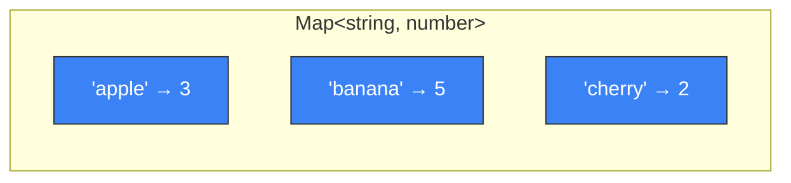

```typescript
// Create a Map
const freq = new Map<string, number>();

// Set values
freq.set("apple", 3);
freq.set("banana", 5);

// Get values
freq.get("apple");     // 3
freq.get("missing");   // undefined

// Check existence
freq.has("apple");     // true

// Delete
freq.delete("apple");  // true

// Size
freq.size;             // 1

// 🎯 Common DSA pattern: frequency counter
const word = "abracadabra";
const charFreq = new Map<string, number>();
for (const ch of word) {
  charFreq.set(ch, (charFreq.get(ch) ?? 0) + 1);
}
// Map { 'a' => 5, 'b' => 2, 'r' => 2, 'c' => 1, 'd' => 1 }
```

### 🔄 Map Iteration

```typescript
const map = new Map<string, number>([["a", 1], ["b", 2], ["c", 3]]);

// Iterate entries
for (const [key, value] of map) {
  console.log(`${key} = ${value}`);
}

// Get keys or values
const keys = [...map.keys()];       // ["a", "b", "c"]
const values = [...map.values()];   // [1, 2, 3]
const entries = [...map.entries()];  // [["a",1], ["b",2], ["c",3]]
```

### 🎯 Set — Unique Values with O(1) Lookups

A `Set` stores unique values. No duplicates allowed.

```typescript
// Create a Set
const seen = new Set<number>();

// Add values (duplicates are ignored)
seen.add(1);
seen.add(2);
seen.add(1);  // Ignored — already exists
console.log(seen.size);  // 2

// Check existence — O(1)!
seen.has(1);  // true
seen.has(99); // false

// Delete
seen.delete(1);

// 🎯 Common DSA pattern: find duplicates
const nums = [1, 3, 5, 3, 7, 5];
const unique = new Set(nums);        // Set { 1, 3, 5, 7 }
const uniqueArr = [...unique];       // [1, 3, 5, 7]
```

### 🤔 Map vs Object — When to Use Which

| Feature | `Map` | Object `{}` |
|---------|-------|-------------|
| Key types | **Any type** (numbers, objects, etc.) | Strings/Symbols only |
| Order | ✅ Insertion order guaranteed | ⚠️ Mostly ordered |
| Size | `.size` property | `Object.keys(obj).length` |
| Performance | ✅ Better for frequent add/delete | ✅ Better for static data |
| **DSA Recommendation** | ✅ **Use for frequency counts, caches** | Use for config/options |

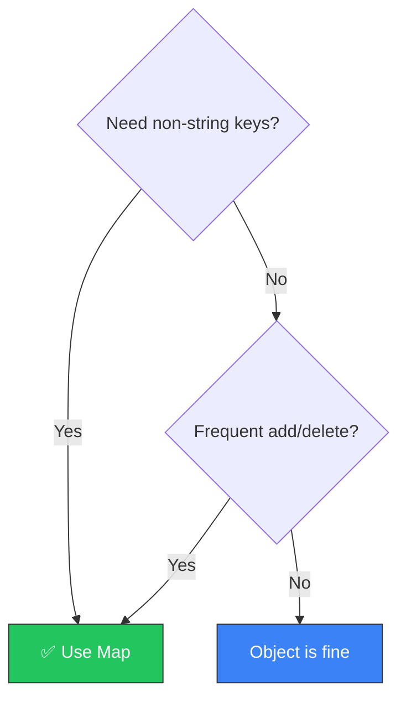

---

## 🔧 7. Functions

### 📋 Three Ways to Write Functions

```typescript
// 1️⃣ Function Declaration — hoisted (can be called before definition)
function add(a: number, b: number): number {
  return a + b;
}

// 2️⃣ Function Expression — assigned to a variable
const subtract = function(a: number, b: number): number {
  return a - b;
};

// 3️⃣ Arrow Function — concise, most common in modern TS
const multiply = (a: number, b: number): number => a * b;

// Arrow with body (when you need multiple statements)
const divide = (a: number, b: number): number => {
  if (b === 0) throw new Error("Division by zero");
  return a / b;
};
```

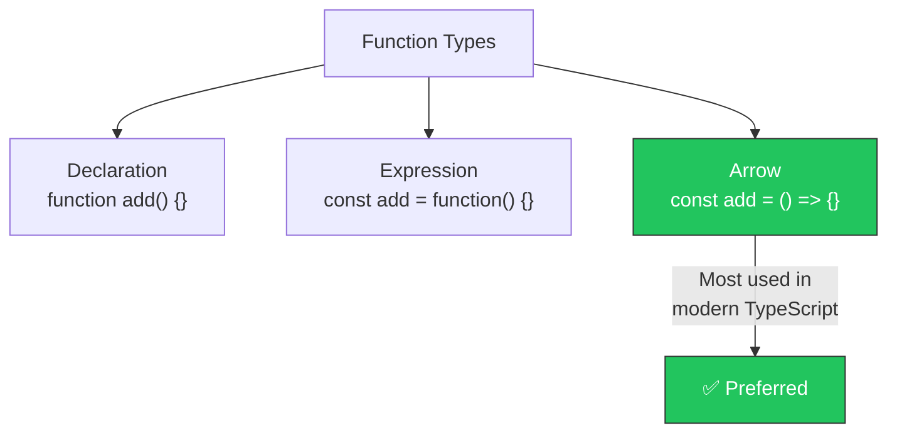

### ⚙️ Parameter Variations

```typescript
// Optional parameter — may or may not be passed
function greet(name: string, greeting?: string): string {
  return `${greeting ?? "Hello"}, ${name}!`;
}
greet("Prasanna");            // "Hello, Prasanna!"
greet("Prasanna", "Hey");     // "Hey, Prasanna!"

// Default parameter — has a fallback value
function createArray(size: number, fill: number = 0): number[] {
  return new Array(size).fill(fill);
}
createArray(5);      // [0, 0, 0, 0, 0]
createArray(3, 1);   // [1, 1, 1]

// Rest parameters — variable number of arguments
function sum(...nums: number[]): number {
  return nums.reduce((acc, n) => acc + n, 0);
}
sum(1, 2, 3);       // 6
sum(1, 2, 3, 4, 5); // 15
```

### 🔄 Callbacks — Functions as Arguments

```typescript
// Callbacks are functions passed to other functions
// You already use them with .sort(), .map(), .filter(), etc.

const nums = [3, 1, 4, 1, 5, 9];

// The comparator is a callback
nums.sort((a, b) => a - b);

// Custom function that takes a callback
function processArray(arr: number[], transform: (n: number) => number): number[] {
  return arr.map(transform);
}

processArray([1, 2, 3], n => n * 2);   // [2, 4, 6]
processArray([1, 2, 3], n => n ** 2);  // [1, 4, 9]
```

---

## 🔀 8. Control Flow

### 🔀 Conditionals

```typescript
// if / else if / else
const score = 85;
if (score >= 90) {
  console.log("A");
} else if (score >= 80) {
  console.log("B");
} else {
  console.log("C");
}

// Ternary — one-line conditional
const grade = score >= 90 ? "A" : score >= 80 ? "B" : "C";
```

### 🔄 Loops

```typescript
// Classic for — use when you need the index
for (let i = 0; i < 10; i++) {
  console.log(i);
}

// while — use when condition-based (not count-based)
let n = 128;
while (n > 1) {
  n = Math.floor(n / 2);
}

// do...while — runs at LEAST once
let input: string;
do {
  input = getInput();
} while (input === "");

// for...of — iterate VALUES of arrays, strings, sets, maps
for (const char of "hello") {
  console.log(char);  // h, e, l, l, o
}

// ⚠️ for...in — iterates KEYS (indices for arrays). AVOID for arrays!
// Use for...of instead.
```

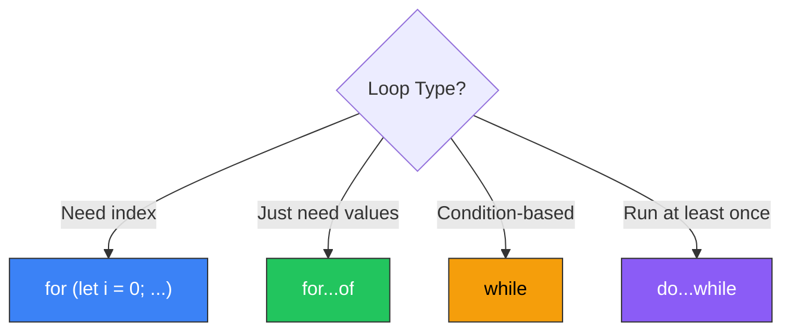

### 🛑 Break, Continue & Labels

```typescript
// break — exit the loop entirely
for (let i = 0; i < 100; i++) {
  if (i === 5) break;  // Stops at 5
  console.log(i);       // 0, 1, 2, 3, 4
}

// continue — skip to the next iteration
for (let i = 0; i < 10; i++) {
  if (i % 2 === 0) continue;  // Skip even numbers
  console.log(i);              // 1, 3, 5, 7, 9
}

// Labeled break — exit a SPECIFIC outer loop (used in 2D problems)
outer: for (let i = 0; i < 3; i++) {
  for (let j = 0; j < 3; j++) {
    if (i === 1 && j === 1) break outer;  // Breaks out of BOTH loops
    console.log(i, j);
  }
}
```

### 🔀 Switch/Case

```typescript
const direction = "north";
switch (direction) {
  case "north": y--; break;
  case "south": y++; break;
  case "east":  x++; break;
  case "west":  x--; break;
  default: throw new Error(`Unknown direction: ${direction}`);
}
```

---

## 🏗️ 9. Classes & OOP — For Data Structures

Classes are how we build **custom data structures** in TypeScript: linked lists, trees, graphs, stacks, queues.

### 📐 Basic Class

```typescript
class ListNode {
  val: number;
  next: ListNode | null;

  constructor(val: number = 0, next: ListNode | null = null) {
    this.val = val;
    this.next = next;
  }
}

// Create nodes
const node3 = new ListNode(3);
const node2 = new ListNode(2, node3);
const node1 = new ListNode(1, node2);
// Linked list: 1 → 2 → 3 → null
```

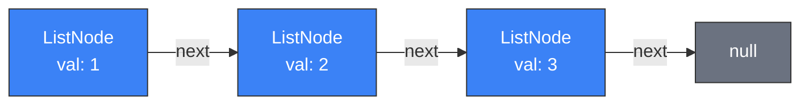

### 🔐 Access Modifiers

```typescript
class Stack {
  private items: number[] = [];  // Only accessible inside the class

  push(val: number): void {
    this.items.push(val);
  }

  pop(): number | undefined {
    return this.items.pop();
  }

  peek(): number | undefined {
    return this.items[this.items.length - 1];
  }

  get size(): number {           // Getter — access like a property
    return this.items.length;
  }

  get isEmpty(): boolean {
    return this.items.length === 0;
  }
}

const stack = new Stack();
stack.push(10);
stack.push(20);
console.log(stack.peek());  // 20
console.log(stack.size);    // 2  (accessed like property, not method)
stack.pop();                // 20
```

| Modifier | Accessible From |
|----------|----------------|
| `public` | Everywhere (default) |
| `private` | Only inside the class |
| `protected` | Inside class + subclasses |

### 🧬 Inheritance

```typescript
class TreeNode {
  val: number;
  left: TreeNode | null;
  right: TreeNode | null;

  constructor(val: number = 0, left: TreeNode | null = null, right: TreeNode | null = null) {
    this.val = val;
    this.left = left;
    this.right = right;
  }
}

// Shorthand constructor — TypeScript shortcut!
class TreeNodeShort {
  constructor(
    public val: number = 0,
    public left: TreeNodeShort | null = null,
    public right: TreeNodeShort | null = null
  ) {}
}
// The "public" in the constructor auto-creates and assigns properties
```

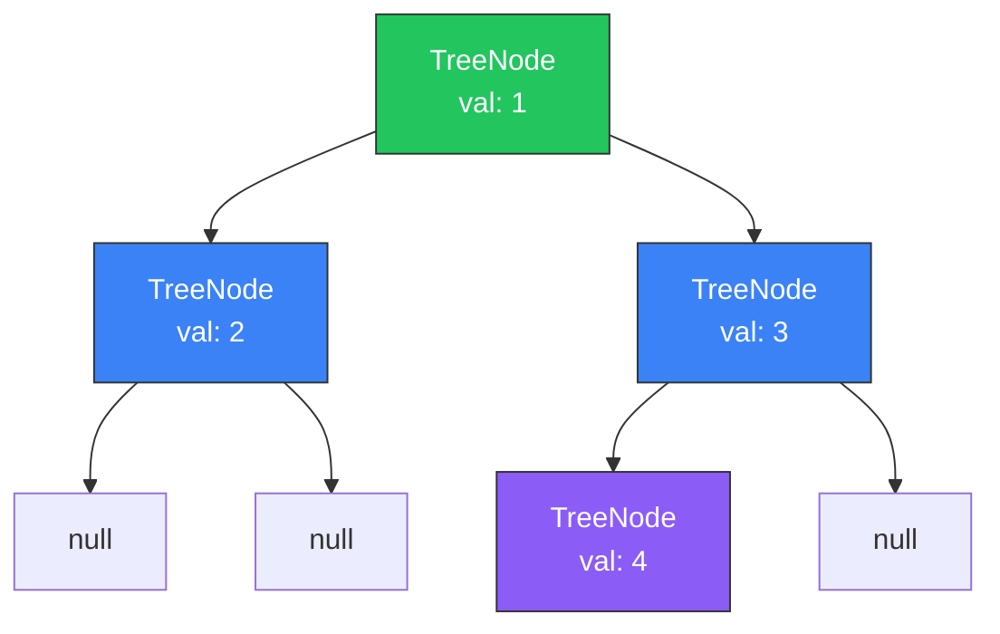

---

## 🧬 10. Generics — Reusable Data Structures

Generics let you write code that works with **any type** while still being type-safe.

### 🎯 Why Generics?

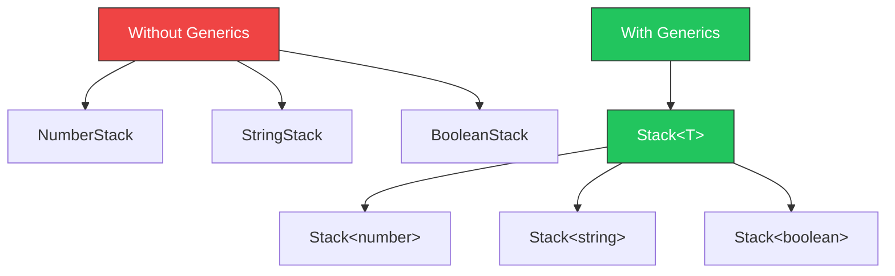

### 🔧 Generic Functions

```typescript
// Without generics — you'd need separate functions for each type
function firstNumber(arr: number[]): number { return arr[0]; }
function firstString(arr: string[]): string { return arr[0]; }

// With generics — ONE function for ALL types
function first<T>(arr: T[]): T {
  return arr[0];
}

first<number>([1, 2, 3]);     // 1 (type: number)
first<string>(["a", "b"]);    // "a" (type: string)
first([true, false]);          // true (type inferred as boolean)
```

### 🏗️ Generic Classes

```typescript
class Stack<T> {
  private items: T[] = [];

  push(val: T): void {
    this.items.push(val);
  }

  pop(): T | undefined {
    return this.items.pop();
  }

  peek(): T | undefined {
    return this.items[this.items.length - 1];
  }

  get size(): number {
    return this.items.length;
  }
}

// Same class, different types!
const numStack = new Stack<number>();
numStack.push(42);

const strStack = new Stack<string>();
strStack.push("hello");
```

### 🔒 Generic Constraints

```typescript
// Constrain T to types that have a .length property
function longest<T extends { length: number }>(a: T, b: T): T {
  return a.length >= b.length ? a : b;
}

longest("hello", "hi");          // "hello"
longest([1, 2, 3], [1]);         // [1, 2, 3]
// longest(10, 20);              // ❌ Error — numbers don't have .length
```

---

## 🔗 11. Interfaces & Type Aliases

### 📐 Interface — Define the Shape of an Object

```typescript
interface TreeNode {
  val: number;
  left: TreeNode | null;
  right: TreeNode | null;
}

interface GraphNode {
  id: number;
  neighbors: GraphNode[];
}

// Optional properties
interface Config {
  width: number;
  height: number;
  color?: string;      // Optional — may or may not exist
}
```

### 🏷️ Type Alias — Name Any Type

```typescript
// Type aliases can do everything interfaces do, plus more
type Point = { x: number; y: number };
type Direction = "north" | "south" | "east" | "west";   // Union of literals
type Matrix = number[][];
type Comparator = (a: number, b: number) => number;
type Nullable<T> = T | null;
```

### 🤔 Interface vs Type — When to Use Which

| Feature | `interface` | `type` |
|---------|------------|--------|
| Object shapes | ✅ | ✅ |
| Extends/implements | ✅ | ✅ (with `&`) |
| Union types | ❌ | ✅ `"a" \| "b"` |
| Primitive aliases | ❌ | ✅ `type ID = number` |
| Declaration merging | ✅ | ❌ |
| **DSA Recommendation** | Use for node types | Use for unions, aliases |

### 🔑 Index Signatures

```typescript
// When you don't know the keys ahead of time
interface FrequencyMap {
  [key: string]: number;
}

const freq: FrequencyMap = {};
freq["apple"] = 3;
freq["banana"] = 5;
```

---

## ❓ 12. Null Handling — Critical for Trees/Linked Lists

In DSA, you deal with `null` constantly — every tree node's children can be `null`, every linked list ends with `null`.

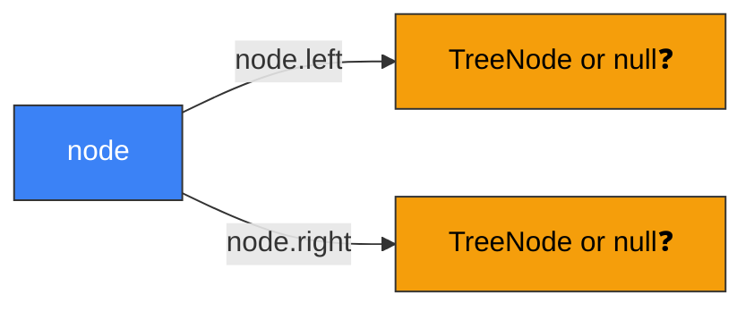

### 🔀 Union Types with Null

```typescript
// A tree node's children are either a TreeNode or null
class TreeNode {
  val: number;
  left: TreeNode | null;    // Union type: TreeNode OR null
  right: TreeNode | null;
  constructor(val: number) {
    this.val = val;
    this.left = null;
    this.right = null;
  }
}

// A function that might return null
function find(arr: number[], target: number): number | null {
  const idx = arr.indexOf(target);
  return idx === -1 ? null : idx;
}
```

### 🔗 Optional Chaining (`?.`)

```typescript
// Without optional chaining — verbose
let val: number | undefined;
if (node !== null && node.left !== null) {
  val = node.left.val;
}

// With optional chaining — concise!
val = node?.left?.val;  // Returns undefined if any part is null/undefined
```

### 🛡️ Nullish Coalescing (`??`)

```typescript
// ?? returns the right side ONLY if the left is null or undefined
const value = map.get("key") ?? 0;     // 0 if key doesn't exist
const name = user?.name ?? "Anonymous";

// ⚠️ Different from || which also triggers on 0, "", false
const count = 0;
count || 10;    // 10 — because 0 is falsy! 😱
count ?? 10;    // 0  — because 0 is NOT null/undefined ✅
```

### ⚡ Non-null Assertion (`!`)

```typescript
// The ! tells TypeScript "trust me, this is NOT null"
// Use with EXTREME caution — if you're wrong, it crashes at runtime!
const node: TreeNode | null = getNode();
const val = node!.val;  // ⚠️ Crashes if node IS null!

// Better: use type narrowing
if (node !== null) {
  const val = node.val;  // ✅ TypeScript knows it's not null here
}
```

### 🎯 Type Narrowing

```typescript
function processNode(node: TreeNode | null): void {
  // Before the check: node is TreeNode | null
  if (node === null) {
    return;  // Early return pattern
  }
  // After the check: TypeScript KNOWS node is TreeNode
  console.log(node.val);     // ✅ No error
  console.log(node.left);    // ✅ No error
}
```

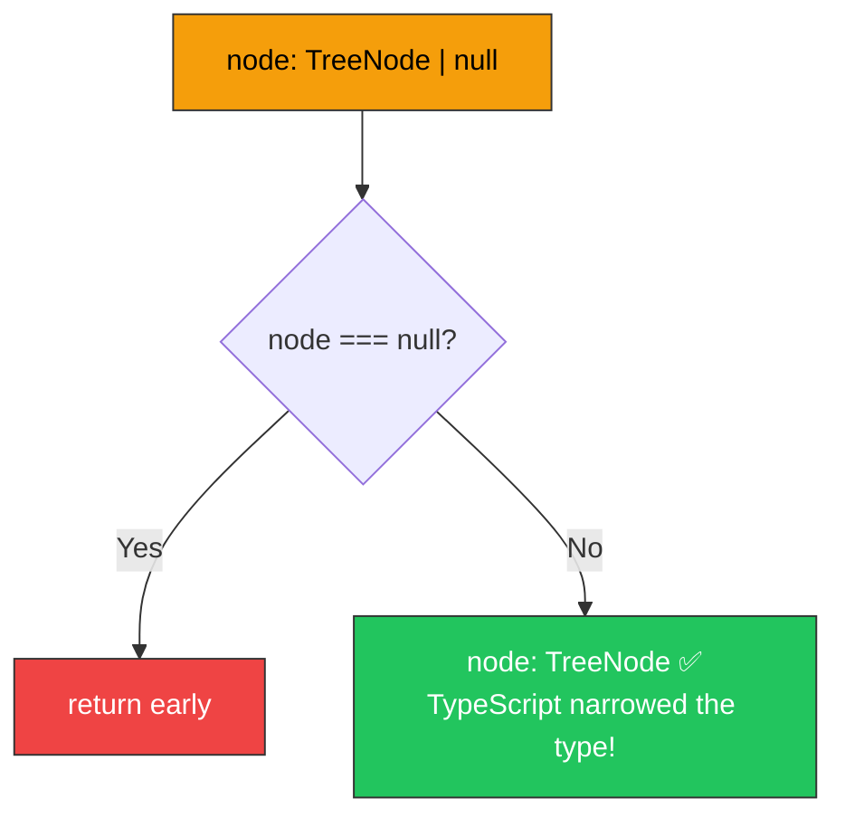

---

## 🧰 13. Destructuring & Spread

### 📦 Array Destructuring

```typescript
// Basic destructuring
const [a, b, c] = [1, 2, 3];
// a = 1, b = 2, c = 3

// Skip elements
const [first, , third] = [1, 2, 3];
// first = 1, third = 3

// Rest pattern
const [head, ...tail] = [1, 2, 3, 4, 5];
// head = 1, tail = [2, 3, 4, 5]

// 🎯 Swap trick — no temp variable needed!
let x = 1, y = 2;
[x, y] = [y, x];
// x = 2, y = 1

// 🎯 Swap in arrays — essential for sorting algorithms
const arr = [10, 20, 30];
[arr[0], arr[2]] = [arr[2], arr[0]];
// arr = [30, 20, 10]
```

### 📋 Object Destructuring

```typescript
const person = { name: "Prasanna", age: 25, city: "Chennai" };

// Pull out specific properties
const { name, age } = person;

// Rename while destructuring
const { name: userName, age: userAge } = person;

// Default values
const { name: n, country = "India" } = person;
```

### 🔄 Spread Operator

```typescript
// Copy arrays (shallow)
const original = [1, 2, 3];
const copy = [...original];

// Merge arrays
const merged = [...[1, 2], ...[3, 4]];  // [1, 2, 3, 4]

// Copy objects (shallow)
const obj = { a: 1, b: 2 };
const objCopy = { ...obj, c: 3 };  // { a: 1, b: 2, c: 3 }
```

---

## 📋 14. Common Patterns in DSA Code

### 🏗️ Type-Safe Array Initialization

```typescript
// Empty typed array
const result: number[] = [];

// Pre-filled with zeros (for DP)
const dp = new Array(n).fill(0);

// Pre-filled with false (for visited arrays)
const visited = new Array(n).fill(false);

// Pre-filled with Infinity (for distance arrays)
const dist = new Array(n).fill(Infinity);

// 2D array (for DP tables, grids)
const grid = Array.from({ length: m }, () => new Array(n).fill(0));
```

### ♾️ Using Infinity as Initial Value

```typescript
// Finding minimum — start with the largest possible value
let min = Infinity;
for (const num of arr) {
  min = Math.min(min, num);
}

// Finding maximum — start with the smallest possible value
let max = -Infinity;
for (const num of arr) {
  max = Math.max(max, num);
}
```

### 🔄 Type Conversions

```typescript
// String ↔ Number
Number("123");       // 123
parseInt("123");     // 123
parseFloat("3.14"); // 3.14
String(123);         // "123"
(123).toString();    // "123"

// ⚠️ parseInt quirks
parseInt("123abc");  // 123 (stops at first non-digit)
Number("123abc");    // NaN (stricter)
```

### 🔀 Array Swapping

```typescript
// Swap two elements in an array — used in sorting, partitioning
const arr = [10, 20, 30, 40, 50];
[arr[1], arr[3]] = [arr[3], arr[1]];
// arr = [10, 40, 30, 20, 50]
```

### 🐛 Debugging with Console

```typescript
// Basic output
console.log("Value:", x);

// Multiple values
console.log("i:", i, "j:", j, "sum:", sum);

// Array/Object visualization
console.log("Array:", JSON.stringify(arr));
console.log("Matrix:", JSON.stringify(matrix));

// Table format (for arrays of objects)
console.table([{ name: "a", val: 1 }, { name: "b", val: 2 }]);
```

---

## ⚡ 15. Quick Reference — Cheat Sheet

### 📋 Type Declarations

| Pattern | Example |
|---------|---------|
| Variable | `const x: number = 5` |
| Array | `const arr: number[] = []` |
| 2D Array | `const grid: number[][] = []` |
| Map | `const map = new Map<string, number>()` |
| Set | `const set = new Set<number>()` |
| Function | `function fn(x: number): number` |
| Union | `let node: TreeNode \| null` |
| Optional | `function fn(x?: number)` |
| Generic | `function fn<T>(x: T): T` |

### 📋 Array Operations

| Operation | Code | Big O |
|-----------|------|-------|
| Access | `arr[i]` | O(1) |
| Set | `arr[i] = val` | O(1) |
| Push | `arr.push(val)` | O(1) |
| Pop | `arr.pop()` | O(1) |
| Shift | `arr.shift()` | O(n) |
| Unshift | `arr.unshift(val)` | O(n) |
| Length | `arr.length` | O(1) |
| Sort | `arr.sort((a,b) => a-b)` | O(n log n) |
| Includes | `arr.includes(val)` | O(n) |
| Slice | `arr.slice(i, j)` | O(n) |

### 📋 Map Operations

| Operation | Code | Big O |
|-----------|------|-------|
| Create | `new Map<K, V>()` | O(1) |
| Set | `map.set(key, val)` | O(1) |
| Get | `map.get(key)` | O(1) |
| Has | `map.has(key)` | O(1) |
| Delete | `map.delete(key)` | O(1) |
| Size | `map.size` | O(1) |

### 📋 Set Operations

| Operation | Code | Big O |
|-----------|------|-------|
| Create | `new Set<T>()` | O(1) |
| Add | `set.add(val)` | O(1) |
| Has | `set.has(val)` | O(1) |
| Delete | `set.delete(val)` | O(1) |
| Size | `set.size` | O(1) |

### 📋 String Operations

| Operation | Code | Mutable? |
|-----------|------|----------|
| Length | `str.length` | - |
| Char at | `str[i]` or `str.charAt(i)` | - |
| Substring | `str.slice(i, j)` | Returns new |
| Split | `str.split(sep)` | Returns array |
| Join | `arr.join(sep)` | Returns string |
| Includes | `str.includes(sub)` | - |
| To lower | `str.toLowerCase()` | Returns new |
| Trim | `str.trim()` | Returns new |

### 📋 Common DSA Snippets

```typescript
// Swap two variables
[a, b] = [b, a];

// Swap array elements
[arr[i], arr[j]] = [arr[j], arr[i]];

// Frequency counter
const freq = new Map<string, number>();
for (const ch of str) freq.set(ch, (freq.get(ch) ?? 0) + 1);

// Initialize DP array
const dp = new Array(n + 1).fill(0);

// Initialize 2D DP
const dp2d = Array.from({ length: m }, () => new Array(n).fill(0));

// Initialize min/max trackers
let min = Infinity, max = -Infinity;

// Check bounds in grid
const inBounds = (r: number, c: number) => r >= 0 && r < rows && c >= 0 && c < cols;

// 4-directional movement
const dirs = [[0,1],[0,-1],[1,0],[-1,0]];
```

### 📋 TypeScript-Specific Patterns for DSA

```typescript
// ListNode for linked list problems
class ListNode {
  constructor(public val: number = 0, public next: ListNode | null = null) {}
}

// TreeNode for tree problems
class TreeNode {
  constructor(
    public val: number = 0,
    public left: TreeNode | null = null,
    public right: TreeNode | null = null
  ) {}
}

// Type narrowing for null checks
if (node !== null) { /* node is TreeNode here */ }

// Optional chaining for safe access
const val = node?.left?.val ?? -1;
```

---

## 🎯 What's Next?

Now that you know TypeScript, you're ready to start DSA! Here's the path:

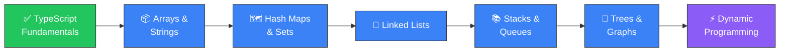

> 📂 **Practice file:** Open `typescript-basics.ts` and run each section with `bun run typescript-basics.ts` to see everything in action!
